# 2026-W18 (2026-04-27 ~ 2026-05-03) · 周报

> **总计 223 次提交 | 538 个文件变更 | +65,944 行 / -26,859 行 | 23 个 PR 合并（详见附录）**
>
> **贡献者**：Claude (130 commits)、inernoro (69 commits)、InerNoro (21 commits)、RuXiuWEi (3 commits)
>
> **统计口径**：仅统计 `origin/main` 主干分支，按提交日期文本（`%cd --date=short`）过滤 `2026-04-27 ~ 2026-05-03`，PR 边界以 merge commit 在本周内为准（不使用 `--since/--until` 做最终统计，避免时区偏差）。

**本周趋势**：W18 是一个 **CDS 控制台 React 化 + MySQL 接入鲁棒性** 双线推进的"打地基"周。一线是 **CDS 前端从 vanilla 整体迁移到 React + AppShell 架构**（Week 4.6 一周九刀重构 + Week 4.7/4.8 接力），把"老 web/ 改名 web-legacy/、新 web/ 全 React"的大重命名一次性落地，URL 永远干净；同时项目卡 / 分支卡 / Drawer / Cmd+K 命令面板 / Surface tokens 全套 Railway 风格视觉语言铺开。另一条线是 **CDS MySQL 接入鲁棒性 9 个 Phase 全量推完**（env 三色契约 + ${VAR} 嵌套展开 + ORM 自动识别 migration 注入 + 多分支 DB 隔离 + Twenty CRM 实战验证），15 轮 Bugbot 收尾扫平 30+ 个真盲区，把 cdscli 推到能"零摩擦扫描任意 docker-compose 项目"的水平。第三条线是 **prd-admin 浅色模式 P0+P1+P2 像素级精修** + 模型池/选择器全栈重构 + 导航 SSOT 化 + 周报 Agent 体验补齐。23 个 PR 合并是 W19（15 个）的 1.5 倍，但代码净增 +39k 行 vs W19 的 +24k —— 大重构周的典型形状。

---

## 关键更新脉络

```mermaid
timeline
    title 关键更新脉络 W18 (04-27 ~ 05-03)
    section 04-27 周日（121 commits）
      CDS web-v2 起步 : 新建 React 工程 + Express /v2 挂载
      env 隔离根治 : 系统级 vs 项目级边界 + Dashboard 一键迁移
      模型池重构 : 全站统一弹窗 + master-detail 选择器
      浅色模式攻坚 : Dialog 黑底真凶 + 按钮系统统一
      导航 SSOT : Cmd+K 与导航栏共用目录
    section 04-28 周一
      CDS 大重命名 : web/ 改 React 工程，老前端归 web-legacy/
      浅色 P0+P1+P2 : 像素级精修 + 三级背景层级
      env 隔离 + 视频微服务 : 周日成果合并落地
    section 04-29 周二
      CDS Week 4.6 九刀 : AppShell + Surface tokens + Railway 视觉
      stack-detector 修复 : 详情改抽屉 + 失败诊断 CTA
      Cmd+K 命令面板 : Surface 对比度 + 大气化
    section 04-30 周三
      CDS Week 4.7 第一刀 : 部署阶段树 + Active/History 分流
      Week 4.8 Round 4 : 卡片极简化 + Drawer URL chip
      远程分支 lazy load : 5 分钟 git fetch cache
    section 05-01 周四（38 commits）
      MySQL 接入 Phase 1-9 : env 三色契约 + ORM migration + 多分支 DB
      Bugbot 1-9 轮 : scope 漏 / dead-branch / case 一致性
      容器网络隔离 : 项目级 docker network
      cdscli 12 模板 : Railway-style 基础设施扫描
      多项目切换器 : TopBar 1 步切换
    section 05-02 周五
      Bugbot 10-15 轮 : build-only / wait-for spam / GET /env
      onboarding UAT : 27% → 100% 闭环
      cdscli onboard : project/branch CRUD + 一键命令
      F6 envMeta auto-derive : 兜底无声明场景
    section 05-03 周六
      分支详情抽屉 Phase A/B/C : 变量 + 指标 + 设置三 tab 落地
      自更新可见性 : GitHub 领先 + 上次更新 + 历史流水
      /healthz 深度探针 : 杜绝"进程在跑但全站 404"
      文档大整合 : 41 篇散乱 CDS 文档收口为 status 看板
```

---

## 一、本周完成

### 1. CDS 控制台 React 化大重命名 — web/ 永远干净

> **价值**：CDS 控制台过去是手写 vanilla JS + 拼接式 HTML，每次加功能都要在两个版本之间拷贝同步。本周一刀切下去，老前端归到 `web-legacy/`、新 React 工程直接占位 `web/`，URL 永远不带 `/v2/` 这种过渡前缀，未来三个月不再有"新旧并存"的心智负担。

- 第一阶段：#515 新建 `web-v2` React 工程 + Express `/v2` 挂载（兼容老前端）。
- 第二阶段：#516 大重命名 —— `web/` 改成 React 工程，`web-legacy/` 收纳老前端，URL 直挂根路径。
- 配套文档：`guide.cds.web-migration-runbook.md` + `guide.cds-web-migration-handoff.md`（已在 05-03 整合到 `plan.cds.status.md` 看板）。
- 相关 PR：#515、#516。

### 2. CDS Week 4.6 视觉重构九刀 — Railway 风格全量铺开

> **价值**：CDS 控制台从"功能能用但布局散乱"升级到"打开就有数据中台味道"。AppShell + Surface tokens + Cmd+K 命令面板让重度使用者可以键盘流操作，BranchDetailPage 6 个 panels 折叠成 4 二级 tabs 让信息密度回到能扫读的水平。

- 第一刀：AppShell + Surface tokens + ProjectListPage 切片化。
- 第二刀：5 个页面全部套用 AppShell + TopBar。
- 第三刀：BranchListPage Railway service-canvas 重组。
- 第四刀：BranchDetailPage 6 panels 折叠成 4 二级 tabs。
- 第五刀：设置页三大类扁平化 + 全局视觉残留清理。
- 第六刀：BranchCard 内部精修 + 全局微动 + 按钮权重。
- 第七刀：Cmd+K 命令面板 + Surface 对比度调优。
- 第八刀：大气化（Railway-grand 风格）。
- 第九刀：全屏化 —— TopBar 内联输入 + 卡片网格。
- 相关 PR：#517（Week 4.6 九刀全量 + Week 4.7 第一刀 + Week 4.8 Round 4，27 commits）。

### 3. CDS MySQL 接入鲁棒性 — 9 Phase + 15 轮 Bugbot 收口

> **价值**：CDS 过去能跑 Node/Python 简单项目，遇到带 MySQL/Postgres 的真实业务（Twenty CRM、myTapd 等）就断在 env 解析、ORM migration、多分支 DB 隔离三个坎上。本周连推 9 个 Phase 把这条链路彻底打通，并以 Twenty CRM 端到端跑通作为收官验证 —— 从"演示 demo 项目"晋级为"能接真实业务的灰度环境"。

- Phase 1：env `${VAR}` 嵌套展开修复（MySQL 接入基建）。
- Phase 2：deploy 自动启动项目所有未运行的 infra。
- Phase 2.5：cds-compose 契约 SSOT + cdscli verify 子命令 + 7 类漏洞自检清单 + 24 个单测。
- Phase 3：cdscli scan 输出全字段 carry-over + wait-for + 端口推断。
- Phase 4：ORM 自动识别 + migration 注入 + dev/prod 模式（cdscli scan 升级为四级优先识别）。
- Phase 5：多分支 DB 隔离机制 MVP + 配套指南 `guide.cds.multi-branch-db.md`。
- Phase 6：契约测试 + 修 mysql init.sql 误分类 + 实战 runbook（`guide.cds.mysql-validation-runbook.md`）。
- Phase 7：Twenty CRM 端到端实战，9 个真盲区全修。
- Phase 8 + 8.8：env 三色契约（CDS_* 前缀）+ 强制配置弹窗 + 行云流水部署。
- Phase 9：env UX 打磨（Generate Secret / .env 上传 / 脱敏 / 审计 / 缺 env banner）。
- 1-9 轮 Bugbot 修复：scope 误剥 / defaultEnv 振荡 / branch scope 污染 / case 一致性 / per-branch DB 隔离漏 CDS_* 键 / dead-branch 卡 deploy / TODO bypass / postgres 误标。
- 相关 PR：#521（Phase 5-9 + Bugbot 1-15 轮，27 commits）、#520（Phase 1-2 + 综合交接 + 容器网络隔离 + cdscli 12 模板，9 commits）。

### 4. CDS 多项目隔离 + GitHub 事件 policy

> **价值**：从"全局态 4 个字段散落各处"升级到"projectId 必填 + 孤儿引用自动回收 + per-project GitHub 事件 policy"。CDS 真正具备多项目并行运行能力，跨项目的容器网络也被强制隔离，杜绝 Mongo 副作用串项目。

- 全局态 4 个字段迁移到 Project model（PR_A）。
- projectId 必填化 + 孤儿引用自动回收（PR_B.1）+ getLegacyProject 多级 fallback。
- mongo-split 存储模式（opt-in，PR_B.4-B.6）。
- per-project 项目运营计数 + 活动日志（PR_C.1-C.3）+ 分支卡运营计数 chips（PR_C.4）。
- per-project GitHub 事件 policy（PR_D.1-D.4）。
- 容器服务用项目级 docker network，跨项目隔离。
- TopBar 项目切换器：1 步切换多项目（Round 4d）。
- 部署"假阴性"失败修复 —— zombie service 拉黑 hasError + post-layer 错误日志写入 opLog.events。
- 相关 PR：#509（16 commits）、#511、#520（9 commits）、#517 部分。

### 5. CDS env 系统级 vs 项目级边界根治

> **价值**：CDS 自身 env 和被托管项目 env 长期混在一份 `.env` 里，新人配置一次环境就要踩三次"改了 CDS 自己的密钥导致服务起不来"或"项目 env 漏配 CDS 起不来 nginx"。本周把两者物理分开 —— 独立 cds-settings 页 + RESTful per-project API + 双方都需要的变量复制成两份独立副本。

- 独立 cds-settings 页 + 入口大整理 + RESTful per-project API。
- 隔离 CDS 内置环境变量与项目环境变量。
- `/env/categorize` 改为「双方都需要就复制成两份独立副本」。
- Dashboard 环境变量「一键整理 → 此项目」按钮。
- migrate-env 默认只扫 `.cds.env` + 精简输出 + 末尾询问 restart。
- 配套文档：`scope-naming` 规范（防止 settings.html 404 类错误）。
- 相关 PR：#513（7 commits）。

### 6. CDS Week 4.7/4.8 体验细节 + 远程分支性能

> **价值**：分支卡极简化 + 远程分支 lazy load 后，CDS Dashboard 在大仓库下打开速度从十几秒降到秒开。Drawer 集中收纳每个分支的 reset/retry/URL 操作，从此不用在六七个面板之间反复跳。

- Week 4.7 第一刀：部署阶段树 + Active/History 分流。
- Week 4.8 Round 4a：分支卡极简化 —— footer 单按钮 + 整张卡可点。
- Round 4b：Drawer 状态卡区加 production URL chip。
- Round 4c：ActiveDeployment 的 reset/retry CTA 接到 Drawer。
- Round 4d：TopBar 项目切换器。
- 性能：BranchListPage refresh 拆分 + 远程分支独立 lazy load。
- 性能：`/api/remote-branches` 加 5 分钟 git fetch cache。
- stack-detector 三大修复 + 详情改抽屉 + 失败诊断 CTA。
- 取消预览自动跳转 + 去掉蒙版模糊 + 环境变量 TODO 横幅。
- 相关 PR：#517（含 Round 4a-d + 性能优化）、#519（refactor: unify admin surfaces and skill editing，3 commits）。

### 7. CDS 收口 — 分支详情抽屉 Phase A/B/C + 自更新可见性 + /healthz 深度探针

> **价值**：W18 最后一天把 CDS 提到"运维级别可见性"档位 —— `/healthz` 深度探针杜绝了"进程在跑但全站 404"再发，自更新可见性把"GitHub 领先 / 上次更新时间 / 历史流水"摆到系统设置首屏，分支详情抽屉 A/B/C 三 tab（变量 / 指标 / 设置）让运维不用 SSH 进容器就能完成日常。

- Phase A：变量 tab + 多项目隔离审计。
- Phase B：指标 tab（docker stats 批量 + SVG sparkline）。
- Phase C：设置 tab（整合 per-branch 操作收口）。
- 自更新可见性：GitHub 领先 + 上次更新 + 历史流水。
- `/healthz` 深度探针 + 启动后强制自检。
- 分支卡 + 项目设置 5 处 UX 反馈批量修复。
- 文档大整合：41 篇散乱 CDS 文档收口为 `plan.cds.status.md` 看板 + 合并 UAT 5 件套 + 删 13 过期件。
- 相关 PR：#522（Phase A/B/C + UAT 闭环 + healthz + 文档整合，约 14 commits）。

### 8. CDS Onboarding UAT — 27% → 100% 闭环

> **价值**：把"新人 30 分钟跑通 hello-world 项目"这条路彻底拉通。UAT 完成度从 27%（散落 4 个 friction 半修不修）拉到 100%，cdscli 一键 onboard 命令把 project/branch CRUD + scan + deploy + healthz 串成一条命令。

- onboarding UAT 完成度补齐计划：27% → 100%。
- F9/F10/F15/F17 4 个后端 friction 修复。
- F12/F11 沙盒文件 + 3 处 UI bug 修复。
- F18/F13/F14 三 friction 闭环（收尾第三波）。
- F6：envMeta auto-derive 当 yml 没声明 `x-cds-env-meta` 时兜底。
- cdscli 补 project/branch CRUD + onboard 一键命令（Phase 16）。
- 新增 `cds-mysql-demo` 验证 mysql 4 步契约。
- 子智能体 B 三份验证报告：隔离 / SSE 双开 / UI 真验。
- 相关 PR：#522（含 UAT 收尾全套）。

### 9. prd-admin 浅色模式 P0+P1+P2 像素级精修

> **价值**：浅色模式过去一直是"凑合能用但有几处死角"—— Dialog 黑底、卡片阴影过重、按钮 hover 不响应、白上加白扁平。本周从底层 CSS 类规则到顶层 Tailwind utility 一刀切修完三级背景层级，浅色模式从"能切"升级为"能日常用"。

- P0 + P1 像素级精修（方案 A）。
- P2 三级背景层级 —— 消除"白上加白"视觉扁平。
- 修复浅色模式下系统确认对话框背景仍是黑色（真凶：`!important` CSS 类规则覆盖）。
- 浅色卡片阴影减弱 + 周报详情页 tab 与章节徽章简化。
- 浅色模式按钮系统改造 + segment 切换器统一。
- 周报 Agent 浅色模式阴影与对比度打磨。
- 配套规划文档：`plan.frontend.prd-admin-surface-style-migration.md` + `report.frontend.prd-admin-surface-style-migration.md`。
- 相关 PR：#514（8 commits）、#519（3 commits）。

### 10. 模型选择器 + 模型池全栈重构

> **价值**：全站模型/池操作过去散在五六个老式编辑表单里，本周统一为 master-detail picker 弹窗 + 一键升级为模型池 + 应用搜索 + 中文名补全 + 池过滤。配置一个新应用从"翻 8 个 tab"降到"3 次点击"。

- 全站统一模型/池操作弹窗，删除老式编辑表单。
- 合并升级为模型池 + 选择已有池 → picker 内嵌 Tab。
- 模型选择器 master-detail 布局 + 缓存 + 「平台/大模型」双视角 + 标签 chip 过滤。
- 一键配置模型 + 一键升级 LegacySingle 为模型池。
- 撤回 appCallerKey 历史漂移，统一为 appCallerCode。
- 模型池卡片复用降级警示条的视觉语言。
- 文本输入框焦点环改为 inset 杜绝被遮挡。
- 相关 PR：#510（14 commits）。

### 11. 导航 SSOT 化 + Cmd+K 与导航栏目录共用

> **价值**：W17 反复反馈的"网页托管/知识库/智识殿堂找不到"在 W18 直接根治 —— 路由 + 导航全改造为单一数据源 `NAV_REGISTRY`，导航栏与 Cmd+K 共用统一目录，CI 跑 `navCoverage.test.ts` 强制护栏，从此"加路由忘了登记"会被测试拦下。

- 路由 + 导航全改造为单一数据源 `NAV_REGISTRY`。
- 路由审计 + 自动化护栏 `navCoverage.test.ts`（ALLOW_LIST 显式豁免 + phantom 路由检测）。
- Cmd+K 智能体/百宝箱去重 + 同步「其他菜单」+ 执行→统计。
- 导航栏与 Cmd+K 共用统一目录 + 一键加入导航。
- 「恢复默认」对齐 AppShell sidebar 实际默认布局。
- 修复「可添加」分组错位 + 恢复默认按钮置灰。
- 配套规则：`.claude/rules/navigation-registry.md`（SSOT 模型 + 测试护栏）。
- 相关 PR：#508（8 commits）。

### 12. 周报 Agent 体验补齐 + 视频 Agent 列表-详情重做

> **价值**：周报 Agent 把 W17 累积的几个体验小坑（默认 Tab 落地竞态 / 我的记录过滤 Tags / 截止时间团队级配置 / 待提交 chip 悬停头像 / 团队人数统计漏负责人）一次性扫清。视频 Agent 砍掉 Remotion 拆分镜架构、抽出独立 prd-video-renderer 微服务，主链路从"端到端 30 分钟超时"降到"OpenRouter 视频大模型直出 5 分钟"。

- 周报 Agent：日常记录新增「我的记录」子菜单 + Tags 过滤系统分类键。
- 日期选择器改用 `showPicker()` 显式触发。
- 周报新增免提交/逾期/截止时间（实时）+ 截止时间 chip 改为「超时 N」+ 悬停展示超时成员。
- 周报截止时间团队级可配置。
- 待提交 chip 悬停展示成员头像与姓名。
- 团队人数统计包含负责人与免提交成员。
- 默认 Tab 落地竞态修复（用 `teamsLoaded` 替代 `loading`）。
- 周报详情页侧栏审阅后状态实时同步。
- 视频 Agent：砍掉 Remotion 拆分镜，只保留 OpenRouter 视频大模型直出。
- 抽出独立 `prd-video-renderer` 微服务，api 容器恢复纯 dotnet。
- 引入 storyboard 模式：拆分镜 + 逐镜 OpenRouter。
- 列表-详情两层结构 T1+T2（WIP）。
- OpenRouter 视频下载到 COS 解决浏览器无法播放。
- 引入 `debt.*` 技术债务台账（doc/ 第 7 类前缀）+ 录入视频 Agent 4 条债务。
- 相关 PR：#506（17 commits）、#507（4 commits）、#502（24 commits）。

### 13. CDS 预览 URL v3 公式 + 自动部署稳定化

> **价值**：W17 反复反馈"项目名遮住关键信息"——本周把预览 URL 公式升级到 v3（`tail-prefix-project`，重要的靠前），后端 `previewSlug` 字段统一发出，前端归一消费，从此 PR 评论 + Settings 预览 + check-run 摘要全部用同一份算法。"刷新即重建"400 死循环也被 canonical id 兜底根治。

- 预览 URL 公式升级到 v3：`tail-prefix-project`，全栈唯一来源（`cds/src/services/preview-slug.ts`）。
- dashboard 预览按钮跳 v3 URL —— 后端发 `previewSlug` 字段，前端归一消费。
- 预览子域名 canonical id 兜底 + 过渡页改按钮态，根治"刷新即重建" 400 死循环。
- 分支名真撑满 row1 —— `flex:1` + `quick-actions width:0` 默认不占位。
- 分支卡 toolbar 改 hover-only —— 让分支名能用全宽显示。
- 加载页极简化 —— 只剩 CDS + 一条线。
- 收藏星标移到分支卡右上角工具栏 + 整合到统一 toolbar。
- nginx ACME 续签：cert 子命令处理缺 crontab 的系统 + nginx 失败可见。
- 相关 PR：#505（5 commits）、#511、#500（1 commit）、#503（3 commits）。

### 14. 海鲜市场幂等覆盖 + 知识库 / AI 竞技场修复

> **价值**：海鲜市场过去重复上传同名技能会无声覆盖或冲突，本周加 `(owner, title)` fallback + 幂等覆盖上传 + 删除接口闭环。知识库卡片"暂无内容"但 documentCount 非 0 的不一致也被修掉。

- 海鲜市场幂等覆盖上传 + 删除 + cds 技能 emoji 清理。
- 上传 upsert 加 (owner, title) fallback 命中老条目。
- 知识库：修复卡片"暂无内容"但 documentCount 非 0 的不一致。
- 文档预览 helper 对重复 storeId 的 ToDictionary 崩溃修复（Bugbot #504）。
- AI 竞技场 UI 文案对齐 v1 单轮设计，避免暗示多轮上下文。
- 周报模板编辑保存返回 500 修复（含 revert + reapply 三轮验证）。
- ListReports 加诊断日志与错误细节透传。
- 相关 PR：#517 部分、#504（2 commits）、#501（1 commit）、#506 部分。

### 15. 周报海报工坊 inline 设计

> **价值**：周报海报工坊从"独立工作区 + 预览割裂"重构为 inline 设计（合并预览与编辑器 + 统一首页预览版式 + 简化工具栏），用户在同一页面即可看到所见即所得效果。本 PR 同时奠定了 W19 周报海报全自动调度的基础。

- 合并预览与编辑器（`fix(poster): merge preview and editor`）。
- 工作区与首页预览统一版式。
- 简化右侧栏与工具栏布局。
- 引入 PosterDesignerPage：内容管理 + AI 集成 + WebGL 画布预览。
- NavigationLayoutEditor：自定义侧边菜单顺序与可见性（首次落地）。
- 实现 CDS web 接口 + proxy 服务 + 周报海报工作区预集成。
- 相关 PR：#492（15 commits，weekly-poster-designer-inline）。

---

## 二、提交量与节奏

### 每日提交分布

| 日期         | 提交数 | 主线方向 |
| ---------- | --- | --- |
| 2026-04-27 | 121 | CDS web-v2 起步 + env 隔离根治 + 模型池全栈重构 + 浅色 Dialog 攻坚 + 导航 SSOT |
| 2026-04-28 | 10  | CDS 大重命名（web/ 改 React）+ 浅色 P0+P1+P2 像素级精修合并 |
| 2026-04-29 | 14  | CDS Week 4.6 视觉重构九刀（AppShell + Surface + Cmd+K + Railway-grand） |
| 2026-04-30 | 14  | CDS Week 4.7/4.8 Round 4 + 远程分支 lazy load + stack-detector 修复 |
| 2026-05-01 | 38  | MySQL 接入 Phase 1-9 + Bugbot 1-9 轮 + 容器网络隔离 + cdscli 12 模板 |
| 2026-05-02 | 14  | Bugbot 10-15 轮 + onboarding UAT 27%→100% + cdscli onboard 一键命令 |
| 2026-05-03 | 11  | 分支详情抽屉 Phase A/B/C + 自更新可见性 + /healthz + 41 篇文档大整合 |

### 提交类型分布

| 类型             | 数量 | 占比     |
| -------------- | -- | ------ |
| fix（Bug 修复）    | 84 | 37.8%  |
| feat（新功能）      | 64 | 28.8%  |
| Merge / 其他无前缀  | 27 | 12.2%  |
| refactor（重构）   | 25 | 11.3%  |
| docs（文档）       | 11 | 5.0%   |
| revert + reapply | 4 | 1.8%   |
| report / plan   | 3  | 1.4%   |
| perf（性能）       | 2  | 0.9%   |
| chore           | 1  | 0.5%   |
| test            | 1  | 0.5%   |

> refactor 占比 11.3% 是本周节奏最强信号 —— 大重构周特征。fix 仍居首位（37.8%），但比 W19（56.1%）明显回落，说明本周以"开新口子 + 立刻收口"为主，而非纯压实。

---

## 三、与上周（W17）对比

| 指标       | W17     | W18      | 变化     |
| -------- | ------- | -------- | ------ |
| 提交数      | 363     | 223      | -38.6% |
| 合并 PR 数  | 43      | 23       | -46.5% |
| 文件变更     | 827     | 538      | -34.9% |
| 净增行数     | +50,707 | +39,085  | -22.9% |

> W17 是开闸+多线并行周（43 PR / 363 commits / 7 条平行高速），W18 收敛到 23 PR / 223 commits 但单 PR 触及面更宽（平均 9.7 commits/PR vs W17 的 8.4 commits/PR）。本周走的是"少而广"的节奏 —— CDS React 大重命名 + Week 4.6 九刀视觉重构 + MySQL 9 Phase 都是横跨数十文件的结构性改动。

### W17 → W18 方向落地情况

| W17 P 级建议方向                                    | W18 实际进展 |
| -------------------------------------------- | --- |
| P0 LLM Gateway 完成 compute-then-send 全量推广      | 部分落地。本周未做其他 Adapter 的全量审计，但 #520-#522 等 PR 都遵循新规范没引入新违规。建议下周做完整审计。 |
| P0 Mongo 单后端 runbook 收口（W16 遗留两周）              | 部分落地。#509 PR_B.4-B.6 引入 mongo-split 存储模式（opt-in）+ projectId 必填化 + 孤儿引用自动回收，backup/restore runbook 仍欠。 |
| P1 Daily Tips 真实运营回归 + 接力交接落地                  | 未在本周 PR 显式推进，沿用 W17 已落地的引导链路；指标接入推迟到下周。 |
| P1 周报 Agent UAT 真人验收                           | 部分落地。#506/#507/#535 把周报 Agent 进一步产品化（默认 Tab 落地 / 截止时间 / 海报自动发布），但真人 UAT 清单未走完。 |
| P1 Skill Marketplace P3 — AgentOpenEndpoint 落地 | 暂未推进。本周资源全部投入到 CDS React 化 + MySQL 接入。 |
| P1 CDS 项目隔离形成 lint 规则                          | 部分落地。#509/#511 PR_C.1-C.4 把项目隔离运营计数化，但 ESLint custom rule 未上。 |
| P2 涌现探索器 + 文档空间联动                              | 暂未推进。 |
| P2 移动端持续审计基础设施利用                              | 暂未推进。MobileAuditPage 仍为人工触发，未接 CI。 |
| 额外承接 W16 遗留方向                                   | 显著落地：(1) GitHub 自动部署用 Twenty CRM 做端到端 MySQL 接入验证（#521，9 Phase + 15 轮 Bugbot）；(2) 周报 / 视频 / 百宝箱 / 公开页大幅产品化（#506/#507/#502/#492/#508）；(3) 多项目 + GitHub + 技能同步文档化新增 14 篇文档（`plan.cds-mysql-readiness`、`plan.cds.web-migration`、`spec.cds.compose-contract`、`guide.cds.multi-branch-db`、`guide.cds.orm-support`、`guide.cds.mysql-validation-runbook` 等），05-03 进一步整合 41 篇散乱文档为 `plan.cds.status.md` 看板；(4) 海鲜市场 #517 幂等覆盖上传 + 删除接口闭环（公开页 / 更新中心仍待后续）。 |

---

## 四、下周（W19）优先级建议

| 优先级 | 方向 | 建议动作 |
| --- | --- | --- |
| P0  | CDS 自更新链路在 Forwarder 蓝绿之前必须先稳 | W18 cds-onboarding UAT 100% + healthz 深度探针只是冷启动可见性，自更新过程的卡死/失联/unknown 三件套仍未根治。建议 W19 优先把"事件驱动 self-status"上线。 |
| P0  | Twenty CRM 之外再接 1-2 个真实业务做回归 | MySQL 接入 9 Phase 走通了 demo + Twenty 一条线，但 Postgres 系（如 Supabase 类）和带消息队列的（如 Twenty CRM 之外的 myTapd）还没真验证。 |
| P0  | env 三色契约 + cdscli verify 推到所有现存项目 | 9 Phase 体系建好，但只有新接入项目走 verify。需要批量回扫所有已存在的 cds-compose.yml，把不合规项一次性发现。 |
| P1  | prd-admin 浅色模式真人 UAT 回归 | P0+P1+P2 三轮像素级精修后需要真人在 6+ 个核心页面（视觉 / 文学 / 缺陷 / 周报 / 视觉创作 / 模型管理）跑一遍切换确认。 |
| P1  | 视频 Agent 列表-详情重做 T2 收尾 | #502 引入 T1+T2 两层结构但详情页 WIP，需要 W19 闭环。 |
| P1  | 导航 SSOT 测试在 CI 跑通 | `navCoverage.test.ts` 已加，但需要在 GitHub Actions / CDS deploy gate 真正阻塞合并。 |
| P2  | CDS Week 4.6/4.7/4.8 视觉重构沉淀为设计规范 | 九刀 + Round 4 改了大量 token / Surface / 微动，需要文档化为 `rule.cds-design-tokens.md` 防止后续偏移。 |

---

## 附录：本周已合并 Pull Requests（按 mergedAt 倒序）

| PR    | 标题 | 主要影响模块 | 分类 |
| ----- | --- | --- | --- |
| #522  | CDS 分支详情抽屉 Phase A/B/C + 自更新可见性 + healthz 深度探针 + 41 篇文档整合 + UAT 100% 闭环 | cds | UX 细节 |
| #521  | CDS MySQL 接入鲁棒性 Phase 5-9 + Bugbot 1-15 轮（Twenty CRM 端到端） | cds、cds-skill | Bug 修复 |
| #520  | CDS MySQL 接入鲁棒性 Phase 1-2 + 容器网络隔离 + cdscli 12 模板 | cds、cds-skill | 新功能 |
| #517  | CDS Week 4.6 视觉重构九刀 + Week 4.7/4.8 Round 4 + 海鲜市场幂等覆盖上传 | cds、prd-api、cds-skill | 重构 |
| #519  | refactor: 统一 admin surfaces 与 skill editing | prd-admin | UX 细节 |
| #516  | CDS 大重命名 — web/ 改 React 工程，老前端归 web-legacy/ | cds | 重构 |
| #515  | CDS 新建 web-v2 React 工程 + Express /v2 路径挂载 | cds | 新功能 |
| #514  | prd-admin 浅色模式 P0+P1+P2 像素级精修 + 周报 Agent 浅色打磨 | prd-admin | UX 细节 |
| #513  | CDS 系统级 vs 项目级 env 边界根治 + 独立 cds-settings 页 | cds | 重构 |
| #512  | CDS 清理残留 entries 列表截断修复 + totalEntries 字段 | cds | Bug 修复 |
| #502  | 视频 Agent 微服务化（prd-video-renderer 抽出 + Remotion 砍除 + storyboard 模式） | prd-api、prd-video、prd-admin、cds | 架构 |
| #511  | CDS PR #509 review fix batch 2（5 issues） | cds | Bug 修复 |
| #510  | prd-admin 模型选择器 + 模型池全栈重构（master-detail + 一键升级） | prd-admin | 重构 |
| #509  | CDS 全局态迁移到 Project model + per-project GitHub 事件 policy + mongo-split | cds | 架构 |
| #508  | prd-admin 路由 + 导航 SSOT 化 + navCoverage 测试护栏 + Cmd+K 共用目录 | prd-admin | 架构 |
| #507  | 周报 Agent 日常记录「我的记录」子菜单 + 日期选择器 showPicker + Tags 过滤 | prd-admin | 新功能 |
| #506  | 周报 Agent 待提交 chip 悬停头像 + 截止时间团队级配置 + 默认 Tab 落地竞态 | prd-admin、prd-api | 新功能 |
| #505  | CDS 预览 URL v3 公式（tail-prefix-project）+ canonical id 兜底 + 分支名撑满 row1 | cds | UX 细节 |
| #504  | 知识库卡片"暂无内容"不一致 + 文档预览 ToDictionary 崩溃修复 | prd-api | Bug 修复 |
| #492  | 周报海报工坊 inline 设计 + NavigationLayoutEditor + WebGL 画布预集成 | prd-admin、cds | 新功能 |
| #501  | AI 竞技场 UI 文案对齐 v1 单轮设计 | prd-admin | UX 细节 |
| #503  | 预览 URL 公式 v2 修复 + 规则 #11 强制 push 后预览地址 + DailyTips 重构 | doc、prd-admin | 文档 |
| #500  | CDS nginx ACME 续签 — cert 子命令处理缺 crontab 的系统 + nginx 失败可见 | cds | Bug 修复 |
