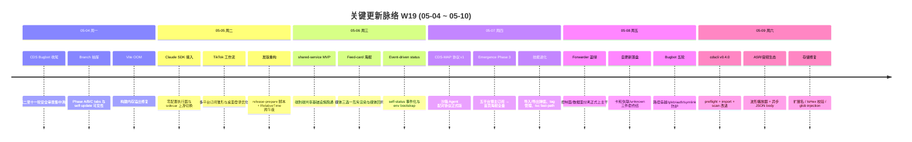

# 2026-W19 (2026-05-04 ~ 2026-05-10) · 周报

> **总计 299 次提交 | 237 个文件变更 | +24,991 行 / -1,304 行 | 15 个 PR 合并（详见附录）**
>
> **贡献者**：Claude (268 commits)、InerNoro (17 commits)、inernoro (14 commits)
>
> **统计口径**：仅统计 `origin/main` 主干分支，按提交日期文本（`%cd --date=short`）过滤 `2026-05-04 ~ 2026-05-10`，PR 边界以 GitHub `merged_at` 在本周内为准（base = main，merged = true），不使用 PR 编号连续段判断。

**本周趋势**：W19 是一个明显的"收口 + 架构升级"双线周。一线是 **CDS 体系性的稳定化**——本周把"自更新十八轮没修好的卡死/失联/unknown 三件套"彻底翻篇，并把控制面与数据面分离的 **forwarder 蓝绿架构**正式推到主干，self-update 流程从拼接式打补丁切换到事件驱动观测；另一条线是 **创作链路的端到端打通**——TikTok / 抖音 / B 站 / 小红书 / YouTube 五平台博主订阅 → 首页 feed-card 海报 Phase 2+3 全量落地，周报海报工坊也补上了工作流调度与自动发布弹窗，把"能用"推进到"能自然每周用一次"。同时 **Claude SDK 执行器与 CDS-MAP 沙箱配对协议 v1** 上线，让本系统具备调度外部 Anthropic Agent SDK 的能力（本地 / 容器 / 跨服务器三种部署）。fix 占比 56.1% 高于 feat 22.7%，说明本周节奏明显偏向"把上周铺开的功能压实"而不是"开新坑"，这与 W16 提出的 "P0 真实仓库验证 + P1 体验回归" 优先级方向一致。

---

## 关键更新脉络

---

## 一、本周完成

### 1. CDS 蓝绿 / Forwarder 架构落地 — 控制面与数据面物理隔离

> **价值**：CDS 自更新过去最大的痛点是"重启自身的同时还要保持对外路由不掉"，本周把转发器拆出独立进程后，控制面（自更新逻辑）和数据面（forwarder + nginx upstream）从此互不影响。下次 self-update 失败可以自动降级到旧版 forwarder，对外预览域名永不掉链。

- 引入独立 forwarder 进程：替代原"主进程 + 蓝绿端口切换"模型，nginx upstream 由 forwarder 统一编排。
- self-update 失败自动降级路径：写盘 → 启动新进程 → 健康探活失败 → 回滚 → 通知。
- 文档体系化：`design.cds-control-data-split.md`（架构）、`spec.cds-blue-green-mece-acceptance.md`（验收）、`guide.cds-forwarder-deploy.md`（部署 runbook）、`handoff.cds-blue-green.md`（蓝绿改造交接）、`report.cds-forwarder-success.md`（验收报告）。
- 相关 PR：#533、#526 主载，配套 changelog 50+ 个碎片记录"forwarder 完整对标 master 行为"的 5 个连续工作日。

### 2. CDS 自更新十八轮收尾 — 三件套终结

> **价值**：从 W14 起 CDS 自更新就反复出现"卡死 / 失联 / unknown"三件套，前 17 轮都是一处一处打补丁。本周第十八轮直接重做状态落盘 + 事件驱动同步，把"修一处坏一处"的循环结束。

- 状态落盘事件驱动化：`event-driven self-status` 替代轮询拼接，updatedAt 防重复失效。
- forwarder/publisher 诊断端点：HTML 内容类型检测、模块加载 smoke test。
- self-branches 取值合并 inline：去掉缩进歧义，`git for-each-ref format escape` 写错导致空列表 bug 修复。
- self-update + force-sync 加 `origin ref` 预检：友好错误替代 git stack trace。
- 单 input combobox 替代双控件：分支选择器重构，修核心 bug。
- 相关 PR：#524（Phase A/B/C drawer tabs，31 commits）、#526（事件驱动 + 共享基础设施保护，40 commits）、#531（systemd unit 同步 + 耗时埋点，15 commits）、#533（核心三件套修复，57 commits）、#534（更新优化与技能弹窗，30 commits）。

### 3. 多平台博主订阅 → 首页 feed-card 海报全链路

> **价值**：把"我关注谁"和"我每天打开主页能看到谁"打通。订阅 5 个平台的博主后，系统每天定时抓取 → 调 LLM 拆视频 → 并发生图 → 自动以 feed-card 海报形式弹在主页上。这是从"工具收纳箱"向"信息流入口"演进的第一阶段。

- 五平台覆盖：TikTok / 抖音 / B 站 / 小红书 / YouTube，统一通过 `PLATFORM_OPTIONS` 共享常量定义。
- Phase 2：媒体层三选一互斥渲染（cover image / video / hero）+ 视频流式下载 OOM 修复 + media-rehost 防 CDN 防盗链。
- Phase 3：YouTube 截断优化、播放状态保留、首页弹窗多页轮播、coverUrl 优先 WebP。
- 文档：`guide.poster-feed-card.md`（feed-card 版式说明）。
- 相关 PR：#527（订阅工作流 + 首页海报发布，11 commits）、#530（Phase 2+3 全量，23 commits）。

### 4. 周报海报工坊产品化

> **价值**：周报海报从"手动跑一次自动生成"升级到"工作流定时调度 + 已读状态后端持久化 + 自动发布到主页"。让团队真正能做到"每周五自动生成下周一弹窗"。

- 新增 workflow scheduling：Cron 表达式解析、DST gap（夏令时跳秒）处理。
- 自动发布弹窗：`auto-publish dialog` 配置发布渠道 + 时间。
- 已读状态后端化：`SeenBy` 字段从前端 sessionStorage 切换到后端持久化，多设备同步。
- modal UX 优化：X 关闭改为胶囊收起 PiP，feed-card 字幕浮层与主播放器同步。
- 相关 PR：#535（13 commits）。

### 5. Claude SDK 执行器 + CDS-MAP 配对协议 v1

> **价值**：本系统过去只能调用自己注册的 LLM Provider；从本周起，可以把任意 Anthropic Agent SDK 工程当作"外部沙箱 Agent"挂进来，通过 CDS-MAP 协议握手，实现工具反向调用 + 账单可见。是 Agent 平台向"能装别的 Agent"转型的关键一步。

- Claude SDK 执行器：基于 Python sidecar 微服务，三种部署形态（本地进程 / 容器 / 跨服务器 SSE）。
- CDS-MAP 沙箱配对协议 v1：JSON over HTTP 握手，Token 用常量时间比对（防时序攻击）。
- 七轮 review 收尾：SSE flush 幂等、环境变量校验、AsyncAnthropic 资源泄漏修复。
- 文档：`design.claude-sdk-executor.md`、`guide.claude-sdk-quickstart.md`、`debt.claude-sdk-executor.md`、`spec.cds-map-pairing-protocol.md`、`guide.infra-sandbox-agent.md`。
- 相关 PR：#529（20 commits）。

### 6. CDS 多轮 Bugbot 安全加固 — 30+ 轮审查累计收口

> **价值**：CDS 这周成为内部安全审查的密集靶场，Cursor Bugbot + Codex 两路 review 共 30+ 轮，集中关在 CDS 上的几乎所有路径风险一次性扫掉。从此 CDS 进入"靠协议而不靠用户输入合规"的状态。

- 路径穿越：`ProjectFilesService` 两处修复（mkdir / write）。
- shell 注入：`git for-each-ref format escape`、Maven 启动命令拼接。
- glob injection：sandbox 文件过滤层加白名单。
- auth 隔离绕过：跨 project 鉴权回路修补。
- symlink 写入防护：`mkdir 也不能跟 symlink`。
- SandboxProjectDialog 关闭未重置全部表单。
- 上传文件用原名（不再做隐式 sanitize 丢扩展名）。
- 散落于 #524、#526、#533、#534 多个 PR，每 PR 都有 5~11 轮 Bugbot 收尾。

### 7. ASR 与音频生态

> **价值**：补齐了从"上传音频 → 转写 → 字幕 → 进海报"的完整链路里几个最磨人的小坑（扩展名错乱、storage 路径 glob、原生 controls 体验差），让视频/海报/周报里出现的音频不再"只能听不能用"。

- AudioWavePlayer 波形播放器：替代原生 `<audio controls>`，支持点击波形跳转。
- ASR 诊断面板：实时显示转写进度、模型名、token 数。
- storage 扩展名修复：上传音频文件后丢失扩展名导致播放失败。
- glob injection 防护：storage 路径过滤白名单。
- doubao-asr 异步 JSON body 支持：从 form-data 切到 JSON，对齐 OpenAI 兼容格式。
- 相关 PR：#542（17 commits）。

### 8. cdscli v0.4.0 + 发版工作流重构

> **价值**：cdscli 从"演示工具"升级到"日常 Operator 工具"——可以 preflight 检查依赖、import 导入项目、改进的项目扫描。同时 prd-agent 主仓库的发版流程也重构成 `release-prepare` 脚本 + 集成式登录 UX。

- cdscli v0.4.0：preflight checks（白名单环境变量 / SDK / Docker）、`cdscli import` 命令、scan 改进（识别 Maven 项目并修复启动命令生成）。
- 修复 issues #537 / #538 / #539 共 12 项改动。
- 发版工作流：`release-prepare` 脚本集成、RelativeTime 跨午夜显示修复、Undo toast 改进。
- 相关 PR：#543（cdscli，4 commits）、#528（发版重构，13 commits）。

### 9. CDS 技能系统进化 + 性能优化

> **价值**：技能从"装一次跑一次"升级到"零停机更新 + 弹窗导入/导出"，同时把 CDS 自身冷启动路径上重复的 `tsc` 编译去掉，启动速度肉眼可见。

- 技能导入/导出弹窗：从下拉菜单升级到模态对话框，支持上传 zip 包预览后再确认。
- 零停机更新：技能更新时不影响正在运行的对话。
- tsc fast-path：冷启动跳过已编译产物验证。
- systemd unit 自动同步：CDS 启动时自动比对 + 更新 systemd 配置。
- 自更新耗时埋点：每个 phase 落盘 timing。
- BranchCard 标签管理：tag 分组 + 过滤。
- QA-Ledger 对话台账技能：自动登记每轮问答。
- Timing Phase 1：基础埋点框架。
- 相关 PR：#531（15 commits）、#534 部分（30 commits）。

### 10. UX 细节回归 + 运维文档体系化

> **价值**：把 W16 提出的"P1 多项目+GitHub+技能同步文档化"优先级落到了 16 个新文档上，初步形成 Operator 视角的看护体系；同时把几个用户最爱踩的小坑（Cmd+K 重复项 / drawer tabs 不协调）一次性扫掉。

- Cmd+K 最近使用菜单去重：legacy ID normalization 导致同一项重复出现。
- Branch detail drawer Phase A/B/C：Variables / Metrics / Settings 三个 tab 落地。
- self-update 可见性：从 Branch 抽屉进入更新流程。
- ConfirmAction popover 透明度修复：换 CDS 已定义的 surface token。
- CDS 系统设置入口可见性：云朵图标改齿轮 + "更新与重启"提到第一位。
- 16 个新文档：CDS 蓝绿 / Forwarder / Legacy 迁移、Emergence / 海报、Claude SDK / MAP 协议、沙箱 Agent。
- 相关 PR：#540（Cmd+K 去重，2 commits）、#524 部分。

---

## 二、提交量与节奏

### 每日提交分布

| 日期         | 提交数  | 主线方向                                            |
| ---------- | ---- | ----------------------------------------------- |
| 2026-05-04 | 40   | CDS Bugbot 集中修复第二至十一轮 + Vite build OOM + 自更新流程 |
| 2026-05-05 | 14   | weekly-poster 视频广告 + TikTok 工作流改版 + Claude SDK 零配置执行器 |
| 2026-05-06 | 76   | shared-service 端到端 MVP + Feed-card 版式 + media-rehost 防盗链 |
| 2026-05-07 | 68   | CDS Wave 1/2/3 交付（拓扑全屏/配置快照/Tag filter/集群调度）+ GitHub Webhook |
| 2026-05-08 | 91   | Forwarder 完整对标 master 行为 + Widget 标签预览 + 存储扩展修复 |
| 2026-05-09 | 10   | Maven 启动命令修复 + ASR JSON body + Storage IsHex 校验 |

### 提交类型分布

| 类型             | 数量  | 占比     |
| -------------- | --- | ------ |
| fix（Bug 修复）    | 168 | 56.1%  |
| feat（新功能）      | 68  | 22.7%  |
| Merge / 其他无前缀  | 22  | 7.3%   |
| docs（文档）       | 14  | 4.7%   |
| chore（杂务）      | 10  | 3.3%   |
| refactor（重构）   | 7   | 2.3%   |
| perf（性能）       | 7   | 2.3%   |
| test（测试）       | 3   | 1.0%   |

> fix 占比突破 56% 是本周节奏的最强信号——"先把上周开的口子缝住"是本周隐线主张。

---

## 三、与上周（W16）对比

> 注：W17、W18 期间未生成周报（doc/ 中无对应文件），故对比锚点为最近一份 W16。

| 指标       | W16      | W19      | 变化     |
| -------- | -------- | -------- | ------ |
| 提交数      | 329      | 299      | -9.1%  |
| 合并 PR 数  | 38       | 14       | -63.2% |
| 文件变更     | 522      | 237      | -54.6% |
| 净增行数     | +69,568  | +23,687  | -65.9% |

> PR 数与文件变更明显收敛，但每个 PR 的 commit 密度更高（平均 21 commits/PR vs W16 的 8.7 commits/PR），说明本周走的是"少而深"的节奏。

### W16 → W19 方向落地情况

| W16 P 级建议方向                       | W19 实际进展                                                                |
| -------------------------------- | ----------------------------------------------------------------------- |
| P0 GitHub 自动部署进入真实仓库规模验证         | 部分落地。本周 #526 / #533 / #534 在 CDS 自身仓库内完成自更新真实验证，跨仓库规模验证还需要后续推进。       |
| P0 Mongo 单后端运维跑通                 | 未在本周 PR 中显式推进。下周需补 backup / restore / failover runbook。                |
| P1 周报 / 视频 / 百宝箱 / 公开页做体验回归      | 大幅落地。#527 / #530 / #535 把周报海报和五平台博主订阅产品化，#542 把音频生态补齐。                |
| P1 多项目 + GitHub + 技能同步文档化        | 显著落地。新增 16 篇文档（design / spec / guide / handoff / report / debt 全套）。 |
| P2 更新中心、公开市场、公开页形成数据闭环           | 暂未推进。本周资源投入到 CDS 架构与创作链路。                                              |

---

## 四、下周（W20）优先级建议

| 优先级 | 方向                                  | 建议动作                                                                                            |
| --- | ----------------------------------- | ----------------------------------------------------------------------------------------------- |
| P0  | Forwarder 蓝绿在多项目场景灰度验证              | 已在 CDS 自身仓库验证，但跨多项目（不同 dockerNetwork、不同 routing 规则）的 self-update 失败降级路径还需要真实仓库压测。                |
| P0  | Mongo 状态后端 runbook 收口（W16 遗留）       | backup / restore / failover / 切换回 JSON 的兜底路径必须文档化，不然 forwarder 蓝绿一旦遇到状态后端故障会成为新的"unknown 三件套"。 |
| P1  | Claude SDK 执行器跑通真实第三方 Agent         | v1 协议已落地，但目前只在内部跑。需要至少接 1 个外部 Anthropic Agent SDK 工程，验证账单 / 工具反向调用 / 跨服务器 SSE 链路。              |
| P1  | 五平台博主订阅 → 首页海报真实运营回归                | 五平台 ingest 主线已通，下周需要做"关注 30 个博主连续 7 天"的真实使用回归，关注 OOM / 抓取失败重试 / 海报降级（无 cover 时）等边界。           |
| P1  | 周报系统加视觉化主线（用户本期建议）                  | 用户在脉络确认时提出"每份周报应有一张树形结构图"。建议 W20 单独开 PR 实现"周报树形可视化（HTML + 互动）"，详细设计见文末「周报树形可视化设计计划」。      |
| P2  | CDS Bugbot 累计 30 轮成果沉淀为 lint 规则     | 本周修了大量路径穿越 / glob / shell 拼接问题。建议把这些写成本仓库 ESLint custom rules + C# Roslyn analyzer，从源头压制。     |
| P2  | UX 细节深扫第二轮                          | Cmd+K 去重 / drawer tabs 之外，还有命令面板搜索高亮 / Toast undo 时机 / 移动端首页可读性等 W16 W17 W19 累积下来的小尾巴。       |

---

## 附录：本周已合并 Pull Requests（按 mergedAt 倒序）

| PR    | 标题                                                                            | 主要影响模块               | 分类      |
| ----- | ----------------------------------------------------------------------------- | -------------------- | ------- |
| #543  | cdscli v0.4.0：preflight checks、import 命令、scan 改进                              | cds-cli              | 工具链     |
| #542  | ASR 诊断 / AudioWavePlayer 波形播放器 / 存储扩展修复                                       | prd-admin、prd-api、storage | 新功能    |
| #533  | CDS self-update 状态落盘第十八轮 — 卡死 / 失联 / unknown 三件套终结                            | cds                  | Bug 修复  |
| #540  | Cmd+K 最近使用菜单去重（legacy ID normalization）                                       | prd-admin            | UX 细节   |
| #535  | 工作流调度 + 周报海报自动发布弹窗 + 已读后端持久化                                                  | prd-admin、prd-api    | 新功能     |
| #534  | CDS 技能导入/导出弹窗 + 自更新优化 + Bugbot 五轮                                              | cds、skills           | 新功能     |
| #531  | CDS 多项性能优化与功能增强（systemd 同步 / tag 管理 / tsc fast-path）                          | cds、prd-admin        | 性能      |
| #530  | emergence-1 五平台博主订阅 → 首页 feed-card 海报 Phase 2+3                              | prd-api、prd-admin、prd-video | 新功能 |
| #529  | Claude SDK 执行器 + CDS-MAP 沙箱配对协议 v1                                            | cds、prd-api、claude-sdk-sidecar | 架构  |
| #528  | 发版工作流重构（release-prepare 脚本 + 登录 UX 改进）                                        | prd-admin、prd-desktop、scripts | 工具链 |
| #527  | TikTok / 抖音创作者订阅工作流 + 首页海报发布                                                  | prd-api、prd-admin    | 新功能     |
| #526  | CDS 事件驱动 self-status + 共享基础设施保护 + env bootstrap 修复                            | cds                  | 架构      |
| #525  | CDS auto-build 路径补齐：v3 / v2 预览 slug 反向解析                                       | cds                  | Bug 修复  |
| #524  | CDS Branch 详情抽屉 Phase A/B/C tabs + self-update 可见性                            | cds                  | UX 细节   |
| #523  | CDS onboarding UAT 收尾 — 7 friction + 3 UI bug + 文档整合（41→31） + Codex P1 路径穿越 / symlink 安全审查 | cds、cds-web、skills    | 新功能     |

---

> **下周方向中第 P1 项「周报树形可视化」的设计计划已附在用户消息回复中**，等待重新开 PR 实施。
