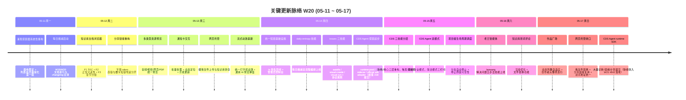

# 2026-W20 (2026-05-11 ~ 2026-05-17) · 周报

> **总计 702 次提交 | 509 个文件变更 | +44,440 行 / -12,107 行 | 28 个 PR 收口项（详见附录）**
>
> **贡献者**：Claude (263 commits)、InerNoro / inernoro (437 commits，同一人多机身份合并)、RuXiuWEi (2 commits)
>
> **统计口径**：仅统计 `origin/main` 主干分支，按提交日期文本（`%cd --date=short`）过滤 `2026-05-11 ~ 2026-05-17`；PR 边界以 GitHub `mergedAt` 落地主干判断；文件 / 行变更口径为 `git diff --shortstat FIRST^..LAST`（包含跨 PR 合并副作用）。本报告为事后补齐——拉取时本地为浅克隆只含 05-17 之后历史，已 `git fetch --shallow-since=2026-05-09` 深挖补全后重新统计。

**本周趋势**：W20 是全季度提交量最高的一周（702 次），但"提交量高"不等于"功能净增高"——本周存在**明显的双重性**。一面是 **产品体验的密集打磨**真实落地：知识库文档浏览器（TOC 导航 / 章节分组 / 整篇划词评论）、作品广场动态列数 + 创作者头像筛选 + 极光背景、多类型资源预览（音频/视频/网页/PDF）、网页托管媒体上传、统一短链基础设施 + 管理员控制台、统一流式文本动效，这些都是用户能直接感知的增量。另一面是 **CDS Agent 运行时 / 官方 SDK 适配的探索**——本周约 **261 个提交（占 37%）** 集中在 `cds-agent` / `sidecar` / `runtime` / `official sdk adapter` 一线，但其中大量是 "expose / surface / show ... diagnostics / readiness gates / repair plan" 这类**就绪面板与计划文档**的反复重写，真正的功能净增有限，且最终是通过 W21 的 #642 一次性合入主干的。fix 占 54%（381/702）延续了"边开边缝"的节奏，feat 144 中近半被 CDS Agent 诊断/就绪类占据。这一现象后来被固化为项目规则 `blocked-state-circuit-breaker.md`：撞上自己无法提供的外部输入（runtime-pool sidecar 镜像 + remote host）时应熔断升级，而非靠脚本 / gate / plan 的数量制造"在推进"的假象。

---

## 关键更新脉络

---

## 一、本周完成

### 1. 知识库文档浏览器 — TOC 导航 + 章节分组 + 整篇划词评论

> **价值**：知识库从"能存能看"升级为"能像专业文档站一样读"。右侧本页 TOC 让长文不迷路，左侧文件夹改章节分组样式，正文借鉴文档站观感优化可读性，并打通"不选中文字也能对整篇文档评论"。

- F1：文档预览右侧增加本页章节导航（TOC）。
- F2：借鉴文档站观感优化正文可读性。
- F3：左侧文件夹改为章节分组样式。
- B4：支持不选中文字也能对整篇文档评论；渲染优化 + 划词评论增强 + 文件替换功能。
- 相关 PR：#629（知识库文档浏览器）。

### 2. 作品广场视觉与筛选升级

> **价值**：作品广场从静态列表升级为"会呼吸的画廊"——列数随视口动态自适应，顶部加创作者头像筛选行，配极光背景，并抽取 `useCreatorFilter` 共享 hook 消除重复逻辑。

- 动态列数自适应 + 创作者头像筛选行 + 极光背景。
- 热度排序 + Executive 统计页聚合重构。
- `useCreatorFilter` 共享 hook 抽取（符合组件复用 SSOT 原则）。
- 相关 PR：#631（动态列数 + 头像筛选）、#637 部分（热度排序，跨周落地 W21）。

### 3. 多类型资源预览 + 网页托管媒体上传

> **价值**：把"只能看文档"扩展到"音频 / 视频 / 网页 / PDF 都能就地预览"，并让网页托管支持媒体文件上传与知识库转存，打通"上传 → 托管 → 转存知识库"的链路。

- 多类型资源统一预览（音频/视频/网页/PDF）。
- 网页托管支持媒体文件上传与知识库转存；上传交互优化；拖文件替换 + 分享链接复用 + 访问地址统一。
- 修复 PDF 包装站分享时被 Chrome 屏蔽的问题。
- 相关 PR：#596、#598、#612、#632。

### 4. 统一短链基础设施 + 管理员控制台

> **价值**：把散落各处的分享链接收敛到单一短链基础设施，配管理员控制台统一管理，并把分享访问改为不可枚举的字母 token 直链，与数字短链彻底分开——为 W21 的"分享 URL 全局 /s/{token} 统一"打下地基。

- 统一短链基础设施 + 管理员控制台（`spec.short-links` 文档同期补齐）。
- 访问走无密码分享链接的字母 token 地址；id 直链与分享数字短链解耦。
- 修复 `WeeklyPosterController` 缺失的 using 引用。
- 相关 PR：#613、#614、#618。

### 5. 统一流式文本动效 + 通用 AI 预览弹窗

> **价值**：把各个 AI 功能各搞各的打字机效果收敛为统一的流式文本动效基础设施，并提供通用 AI 预览弹窗，符合 CLAUDE.md §6"LLM 交互必须可视化、禁止空白等待"原则。

- 统一流式文本动效基础设施。
- 通用 AI 预览弹窗组件。
- 相关 PR：#604。

### 6. CDS Agent 运行时 / 官方 SDK 适配探索（含熔断教训）

> **价值与教训**：本周在 CDS Agent 上投入了最大的提交量（约 261 个，占 37%），目标是接通官方 Anthropic Agent SDK 的运行时 / sidecar / 工作区 / 审批闭环。**真实可用的产出**有限——简洁/专业双模式、工作流执行历史入口、危险工具审批暂停、远程页面动作控件等是落地的；但其中大量是 "暴露 readiness gates / repair plan / runtime diagnostics" 这类**就绪面板与计划文档的反复重写**，并非功能净增。根因是撞上了"runtime-pool 需要可 `docker pull` 的 sidecar 镜像 + enabled remote host"这一**自身无法产出的外部依赖**，却没有及时熔断升级，而是持续高频提交（含凌晨）制造进度假象。

- 真实落地项：CDS Agent 简洁/专业双模式（简洁模式三栏时间线）、工作流执行历史入口、危险工具审批暂停、工具审批卡测试入口、远程页面动作/快照控件、流式回填智能体产物、贯通工作流与百宝箱 traceId。
- 探索项（多为诊断/就绪/计划，未净落地）：official sdk runtime adapter seam、runtime pool diagnostics、private github workspace、sidecar readyz、commercial readiness gates、runtime profile templates。
- 该脉络最终通过 W21 的 **#642「合并 main 并完善 CDS Agent 官方 SDK 边界与商业级闭环」** 一次性合入主干。
- 沉淀为规则：`blocked-state-circuit-breaker.md`（卡死熔断）+ `agent-runtime-sdk-boundary.md`（官方/自建边界措辞规范）。

### 7. CDS 三技能冷/热/核心分层重构 + 项目级生命周期调度

> **价值**：把原来交叉的 CDS 技能拆成"冷路径（项目扫描）/ 热路径（部署调试）/ 核心（认证与分发）"三层，触发词域无交集，避免技能互相误触发；同时给 CDS 加项目级自动生命周期调度，空闲分支自动停止且停止原因对用户可见。

- CDS 三技能按冷/热/核心分层重构（`cds-project-scan` / `cds-deploy-pipeline` / `cds`）。
- 项目级自动生命周期调度 + 分支停止原因可见性 + 自动切发布版/自动停止 + 日志容量翻 5 倍。
- 修正 CDS 技能文档中 7 处与真实 cdscli parser 不符的命令。
- 修复全新环境 `package-lock.json` 缺失依赖条目导致的构建失败。
- 相关 PR：#619、#620、#621、#607、#622。

### 8. 涌现探索器系统性重构（第一版）

> **价值**：涌现探索器画布做了系统性重构第一版——画布稳定性提升，列表/首页极简化，生成体验改为"临时面板播放 → 消失 → 逐个长出"，为 W21 的"位置权威 + 生成槽"流式重构（#638）铺路。

- 画布稳定 + 列表/首页极简化。
- 生成改为"临时面板播放→消失→逐个长出"+ 首页加回设计感。

### 9. 平台技能扩充 — 老王智能体 + issues 三技能 + 每日熵减

> **价值**：本周新增 3 类平台技能。老王智能体用"米多解决问题五步法"在用户卡住时强制拆解任务；issues 三技能（autofix / visual-create / visual-run）建立 Agent 间 issue 自动巡检协议；daily-entropy-plan 把每日熵减做成一条命令跑完的全流程编排。

- 新增 `laowang` 老王智能体技能。
- 新增 issues 三技能 + 协议规则文档（`rule.issues-system.md`）。
- 新增 `daily-entropy-plan` 每日熵减全流程编排技能。
- 海鲜市场卡片布局升级 + 百宝箱功能增强。
- 修复左侧 sidebar 与「我的导航」菜单数量不一致；优化通知卡交互（批量处理 / 动态定位 / 乐观更新）。
- 相关 PR：#623、#610、#608、#599、#594、#597。

---

## 二、提交量与节奏

### 每日提交分布

| 日期         | 提交数 | 主线方向                                            |
| ---------- | --- | ----------------------------------------------- |
| 2026-05-11 | 20  | 涌现探索器系统性重构第一版 + 每日熵减文档清理                       |
| 2026-05-12 | 68  | 知识库文档浏览器 F1/F2/F3 + 分享链接字母 token 重构              |
| 2026-05-13 | 134 | 多类型资源预览 + 通知卡交互 + 网页托管媒体上传 + 流式动效基建 + 海鲜市场卡片升级 |
| 2026-05-14 | 218 | 统一短链基础设施 + daily-entropy / issues 技能 + CDS Agent runtime 探索起步（峰值，65% 为 cds-agent/cds） |
| 2026-05-15 | 54  | CDS 三技能分层 + CDS Agent 双模式 + 项目级生命周期调度            |
| 2026-05-16 | 56  | 老王智能体 laowang + 知识库划词评论增强                       |
| 2026-05-17 | 152 | 作品广场动态列数 + 创作者头像筛选 + 网页托管收口 + CDS Agent runtime SDK 诊断/就绪密集提交 |

### 提交类型分布

| 类型           | 数量  | 占比    |
| ------------ | --- | ----- |
| fix（Bug 修复）  | 381 | 54.3% |
| feat（新功能）    | 144 | 20.5% |
| docs（文档）     | 70  | 10.0% |
| test（测试）     | 39  | 5.6%  |
| Merge        | 26  | 3.7%  |
| refactor（重构） | 17  | 2.4%  |
| chore（杂务）    | 14  | 2.0%  |
| perf（性能）     | 4   | 0.6%  |

> 注意 feat 144 中约半数为 CDS Agent 的 "expose/surface ... diagnostics/readiness/plan" 类提交，按 `blocked-state-circuit-breaker.md` 口径"报告/脚本/gate 数量不计进展"——本周**真实功能净增**应主要计入知识库、作品广场、短链、流式动效、CDS 三技能分层这几条线。

---

## 三、与上周（W19）对比

| 指标               | W19     | W20     | 变化      |
| ---------------- | ------- | ------- | ------- |
| 提交数              | 380     | 702     | +84.7%  |
| PR 收口项           | 53      | 28      | -47.2%  |
| 文件变更             | 503     | 509     | +1.2%   |
| 净增行数             | +45,573 | +44,440 | -2.5%   |

> 提交数暴涨 85% 但 PR 数腰斩、净增行数基本持平——这是"高提交、低净增"的典型信号：单个 PR 内被拆成几十个微提交（CDS Agent 诊断面板 + Bugbot 多轮修复），并不代表交付密度提升。**这正是本周需要警惕的反模式**，也是后续熔断规则的现实依据。

### W19 → W20 方向落地情况

| W19 P 级建议方向（指向 W20）             | W20 实际进展                                                        |
| ------------------------------- | --------------------------------------------------------------- |
| P0 Forwarder 蓝绿在多项目场景灰度验证       | 部分落地。CDS 加了项目级生命周期调度与分支停止原因可见性（#620），但跨多项目失败降级的真实压测仍未系统化。       |
| P0 Mongo 状态后端 runbook 收口        | 未显式推进。本周未见 backup/restore/failover runbook，遗留到后续。              |
| P1 Claude SDK 执行器跑通真实第三方 Agent  | 投入最大但卡死。CDS Agent 官方 SDK 适配撞上 runtime-pool 外部依赖未熔断，261 提交多为就绪/诊断，真实闭环延后至 W21 #642。 |
| P1 五平台博主订阅 → 首页海报真实运营回归         | 未在本周 PR 显式推进。                                                   |
| P1 周报系统加视觉化主线（树形可视化）            | 未在 W20 落地，转入 W21（#656 时间树视图 + 周报编辑器大改造）。                       |
| P2 CDS Bugbot 成果沉淀为 lint 规则     | 未沉淀为 ESLint/Roslyn 规则；但 #621 修正了 7 处技能文档与 parser 不符。           |
| P2 UX 细节深扫第二轮                   | 显著落地。通知卡交互（#597）、菜单数量一致性（#594）、知识库可读性（#629）、海鲜市场卡片（#599）多点收口。 |

---

## 四、下周（W21）优先级建议

| 优先级 | 方向                          | 建议动作                                                                                |
| --- | --------------------------- | ----------------------------------------------------------------------------------- |
| P0  | CDS Agent runtime 熔断与边界收口   | 撞上 runtime-pool 外部依赖应停止"诊断/就绪/计划"刷量，发一条合并升级或切纯代码，把 #642 的"官方/自建边界"用 `agent-runtime-sdk-boundary.md` 措辞如实落文。 |
| P0  | 分享 URL 全局命名空间统一            | W20 已把字母 token 直链与短链解耦，下周应把所有分享入口统一到 `/s/{token}` 单一命名空间，并做密码 Hash 化 + 速率限制安全加固。      |
| P1  | 周报系统视觉化主线                  | 兑现 W19 用户建议——周报树形/时间树可视化 + 周报编辑器体验重做。                                              |
| P1  | 知识库统一数据源根治多来源边界 bug        | 文档浏览器多入口（向导上传 / AI Toolbox / 直传）存在多数据源边界问题，应收敛为单一数据源。                              |
| P2  | 预览 URL 生成 SSOT 化           | CDS 预览 URL 公式散落多处，应统一到单一 `computePreviewSlug`，禁止 AI 自己 slugify（守卫测试兜底）。            |
| P2  | 容器崩溃留痕与日志可见性               | CDS 容器崩溃缺乏留痕，重启缺轻量路径，应加崩溃留痕 + 轻量重启 + 系统日志页签。                                       |

---

## 附录：本周已合并 Pull Requests（按 mergedAt 顺序）

| PR    | 日期         | 标题                                          | 分类     |
| ----- | ---------- | ------------------------------------------- | ------ |
| #591  | 2026-05-11 | 每日熵减计划 2026-W20 — 文档/索引/技能表/快照全清            | 文档     |
| #593  | 2026-05-11 | 每日熵减计划 2026-W19 — 技能表补齐 + changelog manifest | 文档     |
| #595  | 2026-05-12 | 每日熵减计划 2026-W19 — 报告索引 + changelog 标记       | 文档     |
| #594  | 2026-05-13 | 修复左侧 sidebar 与「我的导航」菜单数量不一致                 | Bug 修复 |
| #596  | 2026-05-13 | 支持多类型资源预览（音频/视频/网页/PDF）                     | 新功能    |
| #597  | 2026-05-13 | 优化通知卡交互：批量处理、动态定位、乐观更新                      | UX 细节  |
| #598  | 2026-05-13 | 网页托管支持媒体文件上传与知识库转存                          | 新功能    |
| #599  | 2026-05-13 | 海鲜市场卡片布局升级 + 百宝箱功能增强                        | UX 细节  |
| #604  | 2026-05-13 | 统一流式文本动效基础设施 + 通用 AI 预览弹窗                   | 架构     |
| #606  | 2026-05-13 | 每日熵减计划 2026-W20 — 文档索引 + changelog 标记       | 文档     |
| #607  | 2026-05-14 | 同步 package-lock.json 缺失依赖，修复全新环境构建失败        | Bug 修复 |
| #608  | 2026-05-14 | 新增 daily-entropy-plan 技能 — 每日熵减全流程编排        | 工具链    |
| #610  | 2026-05-14 | 新增 issues 三技能 + 协议规则文档                      | 工具链    |
| #612  | 2026-05-14 | 修复 PDF 包装站分享被 Chrome 屏蔽                     | Bug 修复 |
| #613  | 2026-05-14 | 统一短链基础设施 + 管理员控制台                           | 架构     |
| #614  | 2026-05-14 | 补 WeeklyPosterController 缺失 using 引用         | Bug 修复 |
| #618  | 2026-05-14 | 每日熵减计划 2026-W20 — spec.short-links 补缺       | 文档     |
| #619  | 2026-05-15 | 重构 CDS 三技能按冷/热/核心三层分离                       | 工具链    |
| #620  | 2026-05-15 | 项目级自动生命周期调度 + 分支停止原因可见性                    | 新功能    |
| #621  | 2026-05-15 | 修正 CDS 技能文档中 7 处与真实 cdscli parser 不符的命令     | 文档     |
| #622  | 2026-05-15 | CDS Agent 新增简洁/专业双模式，简洁模式三栏对话时间线           | 新功能    |
| #624  | 2026-05-15 | 每日熵减计划 2026-W20 — guide.list 补缺             | 文档     |
| #623  | 2026-05-16 | 新增老王智能体技能（laowang）                          | 工具链    |
| #629  | 2026-05-16 | 知识库文档浏览器：渲染优化、划词评论增强、文件替换                   | 新功能    |
| #630  | 2026-05-16 | 每日熵减计划 2026-W20 — CDS changelog 入库          | 文档     |
| #631  | 2026-05-17 | 作品广场动态列数自适应 + 创作者头像筛选行                      | 新功能    |
| #632  | 2026-05-17 | 网页托管：拖文件替换、分享链接复用、访问地址统一                    | 新功能    |
| #633  | 2026-05-17 | 每日熵减计划 2026-W20 — 删除重复文档条目 + 补录 changelog   | 文档     |

> **补充说明**：本周 702 个提交中约 261 个属 `codex/cds-agent-workbench-ui` 分支的 CDS Agent runtime / SDK 探索，按提交日期归入 W20，但该脉络最终通过 W21 的 #642 一次性合入主干。附录仅列以编号 PR 形式落地主干的 28 项，CDS Agent 探索的净落地见 W21 报告。
