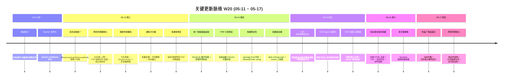

# 2026-W20 (2026-05-11 ~ 2026-05-17) · 周报

> **总计 305 次提交 | 529 个文件变更 | +46,451 行 / -11,372 行 | 28 个 PR 收口（详见附录）**
>
> **贡献者**：Claude (150 commits)、inernoro / InerNoro (153 commits)、RuXiuWEi (2 commits)
>
> **统计口径**：仅统计 `origin/main` 主干分支，按提交日期文本（`%cd --date=short`）过滤 `2026-05-11 ~ 2026-05-17`；PR 身份以 GitHub `base=main & merged=true` 元数据为准，周归属以落地主干日期判定（不依赖编号连续段）；文件 / 行变更口径为 `git diff --shortstat FIRST^..LAST`（含跨 PR 合并副作用）。

**本周趋势**：W20 是一个"产品化收口 + 基础设施统一"主导的周。最重的一条线是**网页托管从页面宿主升级为媒体平台 + 统一短链体系**——单文件上限 50MB→500MB，PDF/视频/Markdown 自动包装成可访问站点，新增数字短链基础设施（原子计数 + 唯一索引兜底 + 管理员控制台 + 访问/分享地址隔离），并修掉了 PDF 包装站被 Chrome 拦截、分享链接可枚举、重传损坏等多个真实回归。第二条线是 **CDS 体系继续往"自动化生命周期"演进**——项目级自动发布/自动停机调度、停机原因可见性、CDS Agent 工作台前后端（运行状态机、人工接管、远程 PR 工具、审计总结 + 简洁/专业双模式时间线）。第三条线是**前端基础设施统一**——单一 `StreamingText` / `AiPreviewModal` 原语替换十余处各写各的打字动效，净删约 3000 行；导航 SSOT 抽取修掉侧边栏与「我的导航」数量不一致并加回归测试。fix 占比约 61% 显著高于 feat 约 18%，延续 W19「把铺开的功能压实」的节奏，与 W19 P2「UX 细节深扫第二轮」方向一致。

---

## 关键更新脉络

---

## 一、本周完成

### 1. 网页托管媒体化 + 统一短链基础设施

> **价值**：网页托管从"只能传静态页"升级成"传 PDF/视频/Markdown 自动变成可访问站点 + 可一键转存知识库"；同时把全站零散的分享链接收敛成一套带管理员治理能力的数字短链。用户拿到的链接更短、可吊销、可统计，且不再能被顺序枚举猜出别人的分享。

- 短链基础设施：新增 `ShortLink` / `ShortLinkCounter` Mongo 模型，原子 `$inc` 计数 + 唯一索引竞态兜底，公共解析 `GET /api/short-links/{seq}`，管理员列表 / 吊销 / 修复控制台（`short-links.manage` 权限），网页托管分享统一映射到 `/s/{seq}`。
- 媒体上传：单文件上限 50MB→500MB，PDF/视频/Markdown 自动包装成带 `index.html`（Markdig 渲染）的托管 ZIP，支持「转存到知识库」生成引用条目，ShareDock 支持操作系统文件拖拽，条目重命名。
- 收口修复：拖文件到卡片直接替换（带确认弹窗）、分享链接复用（命中同类型未吊销链接不重复生成）、访问地址 `/s/wp/{token}` 与分享地址 `/s/{seq}` 拆分、`Purpose` 字段服务端隔离、写盘前校验 ZIP 完整性杜绝产生孤儿/损坏站点。
- PDF 包装站修复：定位"嵌套 iframe + sandbox 被 Chrome 拦截"，后端给 `pdfAssetUrl` 直链 + `isPdfWrapper` 标记，前端 iframe 直接渲染真实 PDF（去掉 sandbox），新增 `PdfThumbnail` 占位。
- 相关 PR：#613（短链基础设施 + 管理员控制台，~1253 行）、#598（媒体上传 + 知识库转存）、#632（拖替换 + 链接复用 + 地址统一）、#612（PDF 包装站 Chrome 拦截修复）、#596（多类型资源预览面板）。

### 2. CDS 生命周期自动化与可观测性

> **价值**：CDS 从"分支建好要人记得手动切发布、用完要人记得手动停"演进到"项目级自动调度"。预览分支闲置自动停机、就绪满 N 分钟自动切发布，并把"为什么停了"显式暴露出来，运维不再靠猜。

- 项目级 `AutoLifecycleService`（30s tick）：就绪 N 分钟后自动切发布、闲置 N 分钟后自动停机，`lastReadyAt` 作为计时锚点。
- 停机原因可见性：新增 `lastStopReason` / `lastStopSource`，部署模式与运行时状态对齐。
- 可观测性：webhook 日志环形缓冲 200→1000 + 分页，多容器内联日志 tab 切换。约 2235 行，仅 coordinator 生效。
- 相关 PR：#620（项目级自动生命周期调度 + 分支停止原因可见性）。

### 3. CDS Agent 工作台（前后端）

> **价值**：CDS Agent 从"能跑命令"补齐成"有状态机、能人工接管、能远程开 PR、能自动出审计总结"的工作台，并配上简洁/专业双模式——日常用简洁三栏时间线，排障切专业模式看全过程。

- 后端（随 #612 / #623 分支捆绑落地）：运行状态机、运行配置 BSON、人工接管、资源边界、流式产物回填、工作流节点事件、对话视图、审计总结、远程 PR 工具、事件回放。
- 前端：CDS Agent 简洁/专业双模式，简洁模式三栏对话时间线 + 过程可折叠。
- 备注：本周 CDS Agent 后端特性大量"搭车"在与其无关的分支（#612 PDF 修复、#623 老王技能）里落地，PR 标题严重低估实际范围——真实的 CDS Agent 建设分散在这几个 merge 分支中（见纪律 4 复核结论）。
- 相关 PR：#622（双模式前端）、#623（cds-agent 后端部分）、#612（cds-agent 后端部分）。

### 4. 前端流式 AI 渲染基础设施统一

> **价值**：过去十几个页面各写各的"打字效果"，风格不一、维护分散。本周抽出单一原语统一全站 AI 流式渲染，顺手净删约 3000 行重复代码，呼应 CLAUDE.md 规则 #6「LLM 交互过程可视化」。

- 新增 `StreamingText`（4 种动效模式）、`MapCursor`、`AiPreviewModal`、`useAiPreviewStream` hook + 后端 `AiStreamingHelpers`。
- 迁移约 15 个页面，删除 4 个 legacy 页面（AiChatPage 等）。净 +1735 / −4746。
- 相关 PR：#604（统一流式文本动效基础设施 + 通用 AI 预览弹窗）。

### 5. 知识库文档浏览器升级

> **价值**：知识库从"只能看纯 Markdown"升级到"内嵌 HTML 也能渲染、有目录树、能划词评论也能整篇评论、能替换文件"，把它从只读归档推向可协作的文档空间。

- 内嵌 HTML 渲染（rehype-raw + sanitize）、frontmatter 剥离、右侧目录 `DocToc`、左侧树按章节分组。
- 健壮划词（selectionchange + 双击兜底）、整篇文档评论、文件替换流程、30 分钟浏览去重（`$facet`）。约 1557 行。
- 相关 PR：#629（渲染优化、划词评论增强、文件替换）。

### 6. 海鲜市场 / 百宝箱体验重构

> **价值**：海鲜市场卡片全面改版（全幅封面 + 毛玻璃面板 + 光标聚光 + 卡内收藏），新增排行行与一键接入面板，让"发现技能 → 接入 AI"从多步降到一步。

- 卡片改版 + `MarketplaceListRow` 排行 + `QuickConnectPanel`（一键 API key + agent prompt）。
- 百宝箱：最近使用条、kind 过滤、可点击 tag chips。净 +1797 / −257。
- 相关 PR：#599（海鲜市场卡片布局升级 + 百宝箱功能增强）。

### 7. 导航一致性 SSOT 修复

> **价值**：彻底修掉"侧边栏菜单数 ≠『我的导航』菜单数"这个反复出现的体验 bug，并加回归测试从源头锁死，呼应 navigation-registry 规则。

- 抽取 `getSidebarMenuItems` / `SIDEBAR_HIDDEN_APPKEYS` SSOT，AppShell 与 NavLayoutEditor 共用；支持 OR 权限；新增 `navMenuSync` 回归测试。
- 相关 PR：#594（修复左侧 sidebar 与「我的导航」菜单数量不一致）。

### 8. 构建稳定性与回归修复

> **价值**：清掉一批"全新环境跑不起来"的地雷（Docker 软链 ENOENT、lockfile 缺条目、缺 using 编译断），保证 clone 即可构建。

- cds `package-lock.json` 同步缺失依赖、删除死软链修 Docker ENOENT、周报海报列表/详情拆分（响应 5MB→3KB）、autopilot SSE camelCase + `Connection: close`、版本查询端点。
- `WeeklyPosterController` 补缺 `using PrdAgent.Core.Attributes` 修复编译断。
- 相关 PR：#607（package-lock 同步 + 构建失败修复批次）、#614（WeeklyPoster using 修复）。

### 9. 作品广场 / 资源预览体验 + 通知打磨

> **价值**：作品广场列数随屏幕自适应、加创作者头像筛选行、首屏只懒挂封面省流量；通知卡支持批量处理 + 乐观更新 + 动态避让教程抽屉。

- 作品广场：动态响应式列数、创作者头像筛选行、极光背景、首屏封面懒挂、共享 `useCreatorFilter` hook、竞态 token 守卫。
- 资源详情面板：音频/视频播放器、网页/PDF iframe 预览、网格卡音视频图标。
- 通知卡：批量处理/忽略全部、乐观计数 −1、`999+` 角标、随教程抽屉 `ResizeObserver` 动态重定位。
- 相关 PR：#631（作品广场动态列数 + 创作者筛选）、#596（多类型资源预览）、#597（通知卡交互优化）。

### 10. 技能链治理（CDS / issues / 熵减 / 老王）

> **价值**：把技能体系本身做了一轮治理——CDS 三技能按冷/热/核心三层重构并修正 7 处与真实 cdscli 不符的命令，新增 issues 三技能 + 协议规则、daily-entropy-plan 全流程编排、老王困境拆解智能体。

- #619 CDS 三技能按冷/热/核心三层分离、触发域互斥、移除 ✓ emoji（CLAUDE.md §0）。
- #621 修正 7 处 CDS 技能文档命令与真实 `cdscli` parser 不符。
- #610 新增 issues 三技能 + 协议规则文档，修 reviewing/blocked label 必须回 pending、SSOT 工作流排序。
- #608 新增 `daily-entropy-plan` 技能：手动触发 `/daily-entropy` 全流程编排（合并 PR→切分支→六维扫描→修复→push→PR→squash）。
- #623 新增 `laowang` 智能体技能（米多五步法困境拆解）。

### 11. 路由级文档 / 索引常态维护（低信号）

- 8 个「每日熵减计划」PR（#591 #592 #593 #595 #606 #618 #624 #630）：文档命名/index.yml/guide.list/技能表/快照/changelog 碎片的常态对齐与登记，单条信息量低，合并为一类记录。

---

## 二、上周（W19）方向落地情况

| W19 优先级 | 方向 | 本周落地情况 |
|-----------|------|-------------|
| P0 | Mongo 状态后端 runbook 收口（W16 遗留） | **未直接收口**。本周 CDS 投入转向项目级生命周期自动化（#620）与 CDS Agent 工作台，状态后端 backup/restore/failover runbook 仍是悬空项，需顺延 W21。 |
| P1 | Claude SDK 执行器跑通真实第三方 Agent | **未推进**。本周无外部 Anthropic Agent SDK 接入回归记录，仍只在内部跑，顺延。 |
| P1 | 五平台博主订阅 → 首页海报真实运营回归 | **未做连续 7 天回归**。本周创作链路侧重作品广场展示（#631）与资源预览（#596），订阅抓取的 OOM/重试/降级边界回归未见提交，顺延。 |
| P1 | 周报系统加视觉化主线（周报树形可视化） | **未实施**。W19 文末附了设计计划但本周未开 PR，建议 W21 单独立项。 |
| P2 | CDS Bugbot 成果沉淀为 lint 规则 | **部分对齐**。#621 把"技能文档与真实 parser 不符"批量校正、#619 三层重构降低误用面，属于"沉淀为可维护结构"的近似动作，但尚未落地 ESLint/Roslyn 自定义规则。 |
| P2 | UX 细节深扫第二轮 | **大幅推进**。#594 导航 SSOT、#597 通知卡、#599 海鲜市场/百宝箱、#604 流式动效统一、#631 作品广场、#596 资源预览，UX 第二轮深扫是本周最密集的方向。 |

**小结**：W19 的 P0/P1 重运维与外部联调方向本周整体被"产品化收口 + 前端基础设施统一"挤压，几乎全部顺延；P2 UX 深扫则远超预期，是本周真正的主线。需要警惕 P0「Mongo 状态后端 runbook」已连续多周悬空（W16→W20），是当前最大的纪律性欠债。

---

## 三、风险与关注

1. **P0 状态后端 runbook 连续 5 周悬空**（W16→W20）：forwarder 蓝绿一旦遇状态后端故障仍无文档化兜底，属高危纪律欠债，W21 必须强制收口。
2. **CDS Agent 后端特性"搭车"分散落地**：核心建设分散在 #612 / #623 等无关分支，PR 标题与实际范围严重不符，给后续追溯/回滚带来风险，建议补一份 `design.cds-agent.md` 把分散落地的运行状态机/远程 PR 工具/审计总结收敛成单一权威设计。
3. **跨 PR 合并副作用偏大**：本周 −11,372 行删除中含 #604 大重构（−4746）与多处 legacy 清理，`FIRST^..LAST` diff 含合并副作用，单 PR 行数不可线性归因。
4. **创作链路真实运营回归仍缺失**：五平台订阅主线已通但连续多周未做"30 博主 7 天"压测，OOM/重试/降级边界仍是未知数。

---

## 四、下周（W21）优先级建议

| 优先级 | 方向 | 说明 |
|-------|------|------|
| P0 | Mongo 状态后端 runbook 强制收口 | 已悬空 5 周（W16→W20）。backup / restore / failover / 切回 JSON 兜底必须文档化 + 演练，禁止再顺延。 |
| P0 | CDS Agent 设计权威化 | 后端特性分散搭车落地，补 `design.cds-agent.md` 收敛运行状态机/人工接管/远程 PR 工具/审计总结，标注每个能力的真实落地 PR，消除追溯黑洞。 |
| P1 | 短链 / 网页托管真实使用回归 | 本周新基础设施大量落地，需做"枚举攻击 / 重传损坏 / 分享复用密码轮换 / 500MB 大文件"边界回归，确认安全修复真实生效。 |
| P1 | 五平台订阅连续 7 天运营回归 | W19 顺延项，继续顺延会变成"看起来有根的虚幻之木"。需真实关注 30 博主跑满一周，盯 OOM / 抓取重试 / 海报降级。 |
| P1 | 周报树形可视化立项 | W19 已附设计计划、W20 未动，建议 W21 单独开 PR 实现"周报树形结构图（HTML + 互动）"。 |
| P2 | Bugbot 成果落地为 lint 规则 | #619/#621 已做结构性沉淀，下一步把高频路径穿越/glob/shell 拼接/parser 不符写成 ESLint custom rules + Roslyn analyzer。 |
| P2 | Claude SDK 执行器外部联调 | 连续两周顺延，至少接 1 个外部 Anthropic Agent SDK 工程验证账单/工具反向调用/跨服务器 SSE。 |

---

## 附录：本周已合并 Pull Requests（按 mergedAt 倒序）

| PR | 标题 | 主要影响模块 | 分类 |
| --- | --- | --- | --- |
| #632 | 网页托管：拖文件替换、分享链接复用、访问地址统一 | prd-admin、prd-api | 功能增强 |
| #631 | 作品广场动态列数自适应 + 创作者头像筛选行 | prd-admin | 功能增强 |
| #630 | 每日熵减计划 2026-W20 — CDS changelog 入库（5 条） | doc、changelogs | 文档 |
| #629 | 知识库文档浏览器：渲染优化、划词评论增强、文件替换 | 知识库、prd-admin、prd-api | 功能增强 |
| #624 | 每日熵减计划 2026-W20 — guide.list 补 debt + changelog 入库 | doc、changelogs | 文档 |
| #623 | 新增老王智能体技能（laowang）+ CDS Agent 后端 | skills、cds-agent | 新功能 |
| #622 | CDS Agent 新增简洁/专业双模式，简洁模式三栏对话时间线 | cds-agent (prd-admin) | 新功能 |
| #621 | 修正 CDS 技能文档中 7 处与真实 cdscli parser 不符的命令 | skills | 文档 |
| #620 | CDS 项目级自动生命周期调度 + 分支停止原因可见性 | cds | 新功能 |
| #619 | 重构 CDS 三技能按冷/热/核心三层分离 | skills | 重构 |
| #618 | 每日熵减计划 2026-W20 — spec.short-links 补缺 + changelog | doc、changelogs | 文档 |
| #614 | 补 WeeklyPosterController 缺失的 using（编译断修复） | prd-api | Bug 修复 |
| #613 | 统一短链基础设施 + 管理员控制台 | prd-api、prd-admin | 新功能 |
| #612 | 修复 PDF 包装站被 Chrome 屏蔽 + CDS Agent 后端 | prd-api、prd-admin、cds-agent | Bug 修复 |
| #610 | 新增 issues 三技能 + 协议规则文档 | skills、doc | 文档 |
| #608 | 新增 daily-entropy-plan 技能 — 每日熵减全流程编排 | skills、doc | 工具链 |
| #607 | 同步 package-lock.json 缺失依赖，修复全新环境构建失败 | cds、prd-api、prd-admin | Bug 修复 |
| #606 | 每日熵减计划 2026-W20 — 补录文档索引 + changelog | doc、changelogs | 文档 |
| #604 | 统一流式文本动效基础设施 + 通用 AI 预览弹窗 | prd-admin、prd-api | 重构 |
| #599 | 海鲜市场卡片布局升级 + 百宝箱功能增强 | prd-admin | 重构 |
| #598 | 网页托管支持媒体文件上传与知识库转存 | prd-api、prd-admin、知识库 | 新功能 |
| #597 | 优化通知卡交互：批量处理、动态定位、乐观更新 | prd-admin | UX 细节 |
| #596 | 支持多类型资源预览（音频/视频/网页/PDF） | prd-admin | 功能增强 |
| #595 | 每日熵减计划 2026-W19 — 补充报告索引 + changelog | doc、changelogs | 文档 |
| #594 | 修复左侧 sidebar 与「我的导航」菜单数量不一致 | prd-admin | Bug 修复 |
| #593 | 每日熵减计划 2026-W19 — 技能表补齐 + manifest 登记 | doc、changelogs | 文档 |
| #592 | 每日熵减计划 2026-W20 — 修复 entropy-cleanup 重复内容 | doc、skills | 文档 |
| #591 | 每日熵减计划 2026-W20 — 文档/索引/技能表/快照全清 | doc | 文档 |

> **W19 顺延的 P0「Mongo 状态后端 runbook」已连续 5 周悬空，W21 列为最高强制收口项。**
