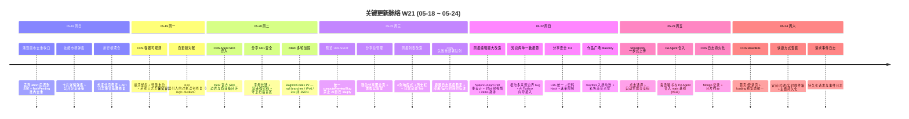

# 2026-W21 (2026-05-18 ~ 2026-05-24) · 周报

> **总计 160 次提交 | 490 个文件变更 | +69,908 行 / -6,939 行 | 20 个 PR 收口项（详见附录）**
>
> **贡献者**：Claude (84 commits)、inernoro / InerNoro (74 commits)、hy736797616-beep (1 commit)、Yu Ruipeng (1 commit)
>
> **统计口径**：仅统计 `origin/main` 主干分支，按提交日期文本（`%cd --date=short`）过滤 `2026-05-18 ~ 2026-05-24`；PR 边界以 GitHub `mergedAt` 落地主干判断；文件 / 行变更口径为 `git diff --shortstat FIRST^..LAST`（包含跨 PR 合并副作用）。

**本周趋势**：W21 是一个清晰的"收口 + 安全加固"周，节奏从 W20 的 702 提交回落到 160，但单 PR 含金量更高（净增 +69,908 行，含 #642 把 W20 的 CDS Agent 探索一次性合入主干）。三条主线贯穿全周：其一是 **分享链接安全加固**，从 W20 的"字母 token 直链"推进到 **全局 `/s/{token}` 命名空间统一 + 密码 Hash 化 + 滑动窗口速率限制 + 我的分享总管理 + 分享链接体检实验室**，并配合 Cursor Bugbot / Codex 连续四到六轮审查把 URL 枚举、ShortLink 未注册暴露等问题逐个缝住。其二是 **周报系统大改造**，编辑器参考 Notion/Linear/Craft 重设计（sticky 章节大纲、同章节 items 拖动排序、borderless 输入），周次显示统一为日期范围（5.18~5.24，回应用户"不知道是哪周"），新增时间树视图与日常记录独立 Tab——兑现了 W19 用户提出的"周报视觉化"建议。其三是 **CDS 体验与可观测性收口**，容器日志持久化为 Mongo 记录、崩溃留痕 + 轻量重启 + 系统日志页签、分支错误归类（区分运行时/应用代码/部署配置）、ReactBits 首页与登录页、预览 URL 生成统一为单一 SSOT 禁止 AI 自己 slugify。fix 占 60%（96/160）是本周最强信号——这是把 W20 铺开的功能与 CDS Agent 探索全面"压实"的一周，而非开新坑。

---

## 关键更新脉络

---

## 一、本周完成

### 1. 分享链接安全加固 — 全局 /s/{token} 命名空间统一

> **价值**：把散落各处、可被枚举的分享 URL 收敛到单一 `/s/{token}` 全局命名空间，并做密码 Hash 化 + 滑动窗口速率限制（非 IP 绑定），同时提供"我的分享总管理"聚合页和"分享链接体检实验室"人工验收工具。彻底解决"分享地址可被猜到 / 各模块各搞各的短链"的安全与一致性隐患。

- P1：分享 URL 统一到 `/s/{token}` 全局命名空间；默认改用不可枚举的字母长链 + 短链强密码加固。
- C3：URL 统一 + 我的分享总管理（聚合页）；分享密码 Hash 化 + 滑动窗口速率限制。
- 方向调整：默认 URL 经反复权衡后恢复带分类前缀的字母长链（反 P1 的一次校正）。
- 分享链接体检实验室页（P1 URL 统一的人工验收工具）。
- Bugbot/Codex 多轮收口：字母统一长链未注册 ShortLink 时不暴露、历史兼容修正、集成分享到「我的资产」tab。
- 相关 PR：#650（安全加固 C3）。

### 2. 周报系统大改造 — 编辑器重设计 + 时间树视图

> **价值**：兑现 W19 用户提出的"周报视觉化"建议。编辑器参考 Notion/Linear/Craft 做了激进重设计（去色块、字号层级重建、borderless 输入、sticky 章节大纲），支持同章节 items 拖动排序；"我的周报"新增时间树视图（年/月/周折叠 + 内容展开预览）；周次显示统一改为日期范围 `5.18~5.24`，回应用户"不知道是哪周"的反馈。

- 编辑器视觉激进改造：去色块、字号层级重建、borderless 输入；左侧 sticky 章节大纲 + 内容放宽 920px；恢复章节 surface 层次 + bullet 对齐。
- 同章节内 items 支持拖动排序；删多余「章节」标题，修添加 item 横向跳跃。
- "我的周报"时间树视图（年/月/周折叠 + 周报内容展开预览）；周报列表改 4 列响应式 grid / 左右滑动历史栏。
- 周次显示统一为日期范围；日常记录独立顶部 Tab + 自定义登录页面偏好；管理标签改为原地编辑模式。
- 修复团队成员抽屉背景穿透（漏 createPortal）。
- 相关 PR：#656（日常记录标签管理、待办计划跨日操作、周报编辑器大改造）。

### 3. CDS Agent 官方 SDK 边界与商业级闭环合入

> **价值**：把 W20 在 `codex/cds-agent-workbench-ui` 分支上探索的 CDS Agent 运行时 / 官方 SDK 适配一次性合入主干，并按 `agent-runtime-sdk-boundary.md` 规范如实标注"官方 / 自建"边界——避免把历史运行时名号包装成比实际更强的厂商集成。

- #642 合并 main 并完善 CDS Agent 官方 SDK 边界与商业级闭环。
- 配套收口：close request lifecycle + workflow run-once（修复请求生命周期与工作流重复执行）。
- 远程验收留痕：p4-29 workflow evidence + remote acceptance 记录。
- 相关 PR：#642。

### 4. CDS 容器可观测性与可靠性收口

> **价值**：CDS 容器从"崩了不知道为什么"升级为"崩溃有留痕、重启有轻量路径、日志可持久查"。容器日志改为持久化 Mongo 记录，新增系统日志页签、失败容器重部署队列、分支错误归类（区分 CDS 运行时 / 应用代码 / 部署配置错误，不再冤枉应用方）。

- 容器崩溃留痕 + 轻量重启 + 系统日志页签（#640）。
- 容器日志持久化为 Mongo 记录 + 分片约束 + 跨生命周期归档；suppress 重复 CDS discovery 心跳。
- 失败容器重部署队列 + 部署/运行时耗时标注 + 容器日志高度稳定。
- 分支错误归类重构：区分运行时/应用代码/部署配置三类错误 + 卡片配色对齐 category（#649）。
- self-update 对账误判修复：stop 保留容器引入的两处 crash 误判竞态（Bugbot High+Medium）+ remove() 幂等测试锁死。
- 相关 PR：#640、#649。

### 5. 预览 URL 生成统一为单一 SSOT

> **价值**：CDS 预览 URL 公式过去散落在后端、PR 评论模板、check-run 摘要、Settings 预览等多处，改一次公式要改多地。本周收敛到单一 `computePreviewSlug`，并加守卫测试禁止 AI / 任何脚本自己写 `slugify()` 或拼 `${x}.miduo.org`。

- 统一预览 URL 生成为单一 SSOT（`cds/src/services/preview-slug.ts`）。
- 守卫测试 `preview-url-skill-drift.test.ts` 扫描禁止绕开 cdscli 的手写 slugify。
- cdscli 多轮加固：null branches TypeError、IPv6 字面量 host 被端口拆分、2xx 非 JSON 守护、预览域 root 精确后缀匹配、legacy 兜底不跨多项目泄漏。
- 相关 PR：#646。

### 6. 知识库统一为单一数据源 + AI Toolbox 向导打通

> **价值**：知识库文档浏览器此前存在"向导上传 / AI Toolbox / 直传"多数据源导致的边界 bug。本周根治为单一数据源，并打通 AI Toolbox 快速创建向导的知识库上传，修复两处静默丢弃与上传竞态；目录新增显示设置（相对更新时间）。

- 知识库统一为单一数据源，根治多来源边界 bug。
- 打通 AI Toolbox 快速创建向导的知识库上传（#652）；向导测试对话接入知识库 + 修复上传竞态。
- 修复 AI Toolbox 知识库上传的两处静默丢弃。
- 知识库左侧目录新增「显示更新时间」开关 + 相对时间显示（#651）；分栏拖拽不跟手/跳动修复。
- 文档阅读器顶部更新时间改相对时间 + 隐藏未知作者；正文最大宽度自适应宽屏。
- 配套文档：补充智能体知识库操作说明与设计落地记录（#655）。
- 相关 PR：#651、#652、#655。

### 7. 作品广场 Masonry 动效 + 涌现画布流式重构

> **价值**：作品广场加入 reactbits Masonry 风格入场动效，卡片占位从纯黑改为彩色渐变消除闪黑。涌现画布做流式生成重构——位置权威 + 生成槽，修复 abort 后迟到 SSE 事件、批内重复 node 落位、陈旧 anchorRef 等去重不一致问题。

- 作品广场 Masonry 入场动效 + 彩色渐变占位（#654）；排行榜聚合性能优化 + 缺陷口径修正 + 热度排序（#637）。
- 涌现画布流式生成重构：位置权威 + 生成槽（#638）；丢弃 abort 后迟到 SSE node 事件 + flushPending 批内去重 + 末次渐显刷新节点态。
- 相关 PR：#637、#638、#654。

### 8. 网页托管分享 + ShareDock 一步式上传

> **价值**：网页托管分享改为"二选一 + 已分享标记 + 投放槽读心"，新增按时间/按文件夹分组方式；ShareDock 升级为一步式上传——点击选择文件、自动生成分享码，上传区改方形并在面板内水平居中。

- 网页托管分享二选一 + 已分享标记 + 投放槽读心；新增「按时间/按文件夹」分组。
- ShareDock 一步式上传分享：点击选择 + 自动生成分享码（#659）；移除液态玻璃，上传区改方形；收窄 + 限高 + 底色加实。
- 技能市场卡片支持详情弹窗与公开分享链接（#639）；补 `marketplace_skill_share_links` Token 索引。
- 相关 PR：#639、#659。

### 9. CDS ReactBits 视觉 + 快捷方式安装 + 请求事件日志

> **价值**：CDS 前端引入 ReactBits 首页与登录页、统一 loading 预览态，并新增快捷方式安装（安装/过期/实时收件箱）、主题持久化、请求与事件日志持久化等基础能力。

- CDS 新增 reactbits 首页/登录页 + 统一 loading 预览态 + 终端态路由到失败页。
- 快捷方式安装 + 过期 + 实时收件箱支持；主题偏好持久化；公开主页登录前可见。
- 持久化请求与事件日志；CDS logo loader 复用；docker 生命周期事件记录 + 端口冲突重试。
- PA Agent 合入 main 基线（#611，毒舌秘书）。

---

## 二、提交量与节奏

### 每日提交分布

| 日期         | 提交数 | 主线方向                                          |
| ---------- | --- | --------------------------------------------- |
| 2026-05-18 | 9   | 涌现画布去重收口 + 技能市场弹窗 + 排行榜聚合修复                  |
| 2026-05-19 | 10  | CDS 容器崩溃留痕 + 轻量重启 + 自更新对账误判修复                |
| 2026-05-20 | 34  | CDS Agent SDK 合入（#642）+ 分享 URL 安全 + cdscli 多轮加固 |
| 2026-05-21 | 34  | 预览 URL SSOT + 分享总管理 + 周报列表改造 + 失败重部署队列        |
| 2026-05-22 | 49  | 周报编辑器大改造 + 知识库单一数据源 + 分享安全 C3 + 作品广场 Masonry  |
| 2026-05-23 | 11  | ShareDock 一步式上传 + PA Agent 合入 + CDS 日志持久化      |
| 2026-05-24 | 13  | CDS ReactBits 首页/登录 + 快捷方式安装 + 请求事件日志          |

### 提交类型分布

| 类型           | 数量 | 占比    |
| ------------ | -- | ----- |
| fix（Bug 修复）  | 96 | 60.0% |
| feat（新功能）    | 26 | 16.3% |
| Merge        | 14 | 8.8%  |
| refactor（重构） | 10 | 6.3%  |
| chore（杂务）    | 9  | 5.6%  |
| test（测试）     | 2  | 1.3%  |
| docs（文档）     | 2  | 1.3%  |

> fix 占 60% 创近月新高——本周是把 W20 铺开的分享链接、知识库、CDS Agent、作品广场全面压实的"缝合周"。feat 集中在周报编辑器与 CDS 容器可观测两条用户可感知的主线。

---

## 三、与上周（W20）对比

| 指标     | W20     | W21     | 变化     |
| ------ | ------- | ------- | ------ |
| 提交数    | 702     | 160     | -77.2% |
| PR 收口项 | 28      | 20      | -28.6% |
| 文件变更   | 509     | 490     | -3.7%  |
| 净增行数   | +44,440 | +69,908 | +57.3% |

> 提交数骤降 77% 但净增行数反升 57%——这正是健康的回调：W20 是"高提交、低净增"的诊断刷量周，W21 单 PR 含金量回升（#642 把 CDS Agent 探索一次性合入，#656 周报编辑器大改造、#650 分享安全加固都是实打实的大块代码）。这与 W20 提出的"撞外部依赖应熔断、停止刷诊断量"的方向一致。

### W20 → W21 方向落地情况

| W20 P 级建议方向（指向 W21）             | W21 实际进展                                                         |
| ------------------------------- | ---------------------------------------------------------------- |
| P0 CDS Agent runtime 熔断与边界收口    | 落地。#642 把探索合入主干并按 `agent-runtime-sdk-boundary.md` 标注官方/自建边界，停止诊断刷量。 |
| P0 分享 URL 全局命名空间统一             | 显著落地。#650 把分享统一到 `/s/{token}` + 密码 Hash + 速率限制 + 我的分享总管理 + 体检实验室。 |
| P1 周报系统视觉化主线                   | 显著落地。#656 周报编辑器 Notion/Linear/Craft 重设计 + 时间树视图 + 日期范围显示。       |
| P1 知识库统一数据源根治多来源边界 bug         | 落地。知识库收敛为单一数据源，AI Toolbox 向导上传打通（#652），修复多处静默丢弃与竞态。           |
| P2 预览 URL 生成 SSOT 化            | 落地。#646 统一 `computePreviewSlug` + 守卫测试禁止手写 slugify。             |
| P2 容器崩溃留痕与日志可见性                | 落地。#640 崩溃留痕 + 轻量重启 + 系统日志页签；日志持久化为 Mongo 记录。                  |

> W20 的 6 项优先级在 W21 几乎全部落地——这是少见的"上周方向 100% 兑现"周，说明从"刷诊断量"切回"按优先级收口"后交付效率明显提升。

---

## 四、下周（W22）优先级建议

| 优先级 | 方向                          | 建议动作                                                                                 |
| --- | --------------------------- | ------------------------------------------------------------------------------------ |
| P0  | 分享链接安全加固真人 UAT 回归          | `/s/{token}` 统一、密码 Hash、速率限制已落地，下周需用"分享链接体检实验室"做真人逐项验收：枚举攻击、过期、密码错误、限流触发等边界。          |
| P0  | CDS Agent 官方 SDK 接 1 个真实外部工程 | #642 合入主干后仍只在内部跑，需接至少 1 个外部 Anthropic Agent SDK 工程，验证账单 / 工具反向调用 / 跨服务器 SSE，避免再陷诊断刷量。 |
| P1  | 周报编辑器大改造真人验收 + 移动端适配       | Notion 式编辑器与时间树视图需真人在预览域名验收（拖排 / sticky 大纲 / 920px 宽屏），并补移动端窄屏布局。                    |
| P1  | 知识库单一数据源回归测试               | 多来源收敛为单一数据源后，需对"向导 / AI Toolbox / 直传"三入口做回归，确认无静默丢弃复发。                              |
| P2  | CDS 日志 Mongo 后端容量与清理策略     | 日志持久化为 Mongo 后，需补日志保留期 / 分片上限 / 自动清理策略，避免 log 集合无限膨胀。                               |
| P2  | 五平台博主订阅运营回归（W19 起遗留）       | 连续两周未推进的"关注 30 博主连续 7 天"真实运营回归仍待排期，关注抓取重试 / OOM / 海报降级边界。                          |

---

## 附录：本周已合并 Pull Requests（按 mergedAt 顺序）

| PR    | 日期         | 标题                                       | 分类     |
| ----- | ---------- | ---------------------------------------- | ------ |
| #637  | 2026-05-18 | 优化排行榜聚合性能 + 修正缺陷口径 + 作品热度排序             | 性能     |
| #638  | 2026-05-18 | 涌现画布流式生成重构 — 位置权威 + 生成槽                 | 架构     |
| #639  | 2026-05-18 | 技能市场卡片支持详情弹窗与公开分享链接                     | 新功能    |
| #641  | 2026-05-18 | 每日熵减计划 2026-W21 — CDS changelog 入库       | 文档     |
| #640  | 2026-05-19 | 容器崩溃留痕 + 轻量重启 + 系统日志页签                  | 新功能    |
| #644  | 2026-05-19 | 每日熵减计划 2026-W21 — changelog manifest 补录  | 文档     |
| #642  | 2026-05-20 | 合并 main 并完善 CDS Agent 官方 SDK 边界与商业级闭环   | 架构     |
| #647  | 2026-05-20 | 每日熵减计划 2026-W21 — doc 命名修复 + index/guide | 文档     |
| #646  | 2026-05-21 | 统一预览 URL 生成为单一 SSOT，禁止 AI 自己 slugify     | 架构     |
| #653  | 2026-05-21 | 每日熵减计划 2026-W21 — changelog manifest 补齐  | 文档     |
| #649  | 2026-05-22 | 分支错误归类，区分 CDS 运行时/应用代码/部署配置错误           | 重构     |
| #650  | 2026-05-22 | 分享链接安全加固 C3：URL 统一 + 我的分享总管理            | 安全     |
| #651  | 2026-05-22 | 知识库目录新增显示设置，支持显示相对更新时间                  | UX 细节  |
| #652  | 2026-05-22 | 打通 AI Toolbox 快速创建向导知识库上传               | 新功能    |
| #654  | 2026-05-22 | 作品广场卡片增加 Masonry 入场动效与占位优化              | UX 细节  |
| #655  | 2026-05-22 | 补充智能体知识库的操作说明与设计落地记录                    | 文档     |
| #656  | 2026-05-22 | 日常记录标签管理、待办计划跨日操作、周报编辑器大改造             | 新功能    |
| #660  | 2026-05-22 | 每日熵减计划 2026-W21 — index/guide.list 补缺    | 文档     |
| #659  | 2026-05-23 | ShareDock 一步式上传分享：点击选择、自动生成分享码          | 新功能    |
| #662  | 2026-05-23 | 每日熵减计划 2026-W21 — PA Agent changelog 入库  | 文档     |

> **补充说明**：PR #611（毒舌秘书与 PA Agent 合入 main 基线）以 merge commit 形式于 05-23 落地主干，未出现在 base=main 的 GitHub PR 列表首页，故未计入上表 20 项，但其代码已在本周主干内。W21 净增行数偏高（+69,908）主要来自 #642 把 W20 的 CDS Agent runtime / SDK 探索一次性合入。
