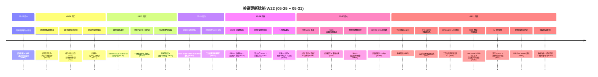

# 2026-W22 (2026-05-25 ~ 2026-05-31) · 周报

> **主干落地 250 次提交 | 779 个文件变更 | +78,557 行 / -9,417 行 | 24 个 PR 收口项（详见附录）**
>
> **贡献者（主干可达）**：Claude (197)、Cursor Agent (20)、inernoro / InerNoro (29)、Yu Ruipeng (2)、weixisheng-miduo (1)、wangz666s (1)
>
> **统计口径**：头部数字仅统计 `origin/main` 主干分支（weekly 技能纪律 #2：禁用 `--all`），按提交日期文本（`%cd --date=short`）过滤 `2026-05-25 ~ 2026-05-31`；PR 边界以本周实际落地主干的 merge commit 为准；文件 / 行变更口径为 `git diff --shortstat FIRST^..LAST`（包含跨 PR 合并副作用）。

**本周趋势**：W22 是一个清晰的"智能体爆发周 + 验收体系标准化周"——本周一口气新增 4 个智能体（CCAS 赋码采集 / Project Route 项目路由 / PM 项目管理 / 个人任务树），把上周（W21）"先把现有产品收口"的节奏切换回"再开几条新主线"。同时验收能力从临时脚本固化为标准技能 `create-visual-test-to-kb`（#676/#679），CDS Agent 工作台做了 Lite 降级方案绕开 R1 阻塞（#693）。fix(138)/feat(65) 的高比例意味着新功能落地后**当天就在修自己的边角**——典型如 PM Agent 立项后立刻补观察者角色（#691）与个人任务树（#695），项目路由抽取后立刻补章节原话直读与历史方案重分析。两条收口主线同步推进：**网页托管角色细分 + 分享面板 + 评论 + SiteUrl 版本指纹**（#682/#685/#686/#694）把上周遗留的"团队场景边界 bug"清完；**CDS 自更新链路重构 + 教程体系 + compose 评分自愈**（#684/#688/#696）补齐 CDS 自洽演进的最后一环。值得记一笔：本周 24 PR 里 Claude 包办了 197 次提交（占 79%），Cursor Agent 完成 CCAS 与 Project Route 两个智能体（占 8%），是迄今为止"多 Agent 并行交付"密度最高的一周。

---

## 关键更新脉络

---

## 一、本周完成

### 1. 智能体爆发：CCAS / Project Route / PM / 个人任务树 — 一周新增 4 个智能体

> **价值**：本周打破了过去几周"先把现有 Agent 收口再开新坑"的节奏，一口气把 4 个独立智能体打入主干，把"智能体宇宙"的雏形铺开。其中 CCAS 与 Project Route 由 Cursor Agent 独立交付，PM 与个人任务树由 Claude 全栈实现，体现了"多 Agent 并行交付"的成熟。

- **CCAS 赋码采集关联系统综合智能体（#657, Cursor Agent）**：PRD 模块 + 设备素材库 + 流程图 + 智能客服四件套打通，定位是"工业级线下采集场景"的端到端 Agent
- **项目路由智能体 project-route-agent（#661, Cursor Agent）**
  - 章节原话直读：从方案文档抽取原文绑定到 routemap 项目路径
  - 详情可查看：每条路由项可下钻看证据原文
  - 第三方仓库抽取：方案 → 仓库路径映射不限本仓库
  - 历史方案重分析：旧方案 reprocess 触发重新生成路由
- **PM Agent 项目管理智能体（#689, Claude）**
  - 立项 / 任务 / 看板三件套
  - AI 任务拆解（一句话目标 → 子任务清单）
  - 全栈实现：后端模型 + 列表 / 详情 / AI 操作 API + 前端列表 / 详情页 / 看板
- **PM Agent 观察者角色（#691）**：项目成员与"只读观察者"分离管理，对应"汇报对象 vs 实际执行人"两种身份
- **个人任务树 Agent（#695）**：从 PM Agent 派生，定位"私人 GTD"——个人任务树视图 + 拖拽 / 编辑 / 状态机全栈实现

### 2. 验收体系标准化：create-visual-test-to-kb 全流水线 + 验收报告知识库

> **价值**：把过去散落在临时脚本/手工截图里的"功能验收"沉淀为标准技能。一份验收报告自动落到知识库出分享链，团队复盘有迹可循；验收方法学（双主题截图 / 禁地址栏直达 / stepClick·stepShot）变成"项目无关、改 config 跨仓库复用"的能力。

- **`create-visual-test-to-kb` 标准技能（#676）**
  - 三段不可分流水线：标准/模板 → 模拟人类浏览器取证（点击导航、双主题截图）→ 报告归档进知识库出分享链
  - 准入校验：目标/档位/Verdict/截图数/证据完整性不达标直接拒收
  - `acceptance.config.json` 跨仓库复用
- **工业级视觉测试 Agent 说明文档（#679）**：明确"视觉测试 = 模拟人类的浏览器取证 + 标准化验收报告"
- **验收报告知识库三项改进（#692）**：模板约束（结论字段强校验）+ 结论可视化（PASS/FAIL chip）+ 跨环境同步（dev/test/prod 报告聚合到同一 store）
- **评审 Agent 三层兜底（#677）**：一次性通过率口径修正——区分"评审本身可用 / 评审失败有兜底 / 全链路报警"，避免单点故障被算成"通过"

### 3. 网页托管角色细分 + 分享面板 + 评论 + 替换修复 — 团队协作 wave 1 完整交付

> **价值**：上周（W21）网页托管把"分享 / 上传 / 单文件版"做完，本周补齐"团队场景"的关键缺口——能让团队成员看到 / 改不到 / 评论它，并修复了上周遗留的"替换网页不生效"重大 bug。

- **角色细分 wave 1（#682）**：网页托管协作角色明确为 owner / editor / viewer，与团队协作通用模型对齐
- **分享面板重构（#685）**：列表 + 续期 + 新建一体化，新增"可见性控制"（公开 / 链接知者 / 团队内部）
- **站点评论能力（#694）**：站点级评论 CRUD + owner 开关（可关闭评论区）
- **SiteUrl 版本指纹修复（#686）**：替换网页后 URL 追加版本指纹（`?v=hash`），强制浏览器拉新内容，根治"替换不生效"

### 4. CDS 自更新链路重构 + 教程体系 + compose 评分自愈 — CDS 自洽演进闭环

> **价值**：CDS 从 W21 的"容器可观测 + ReactBits"继续推进到"自更新可观测 + 教程引导 + 配置自愈"。新用户接入有了 4 个隔离示例工程 + 一键评分门禁；老用户的自更新链路从"事后看日志"升级为"权威缓存 + 事件总线实时推送"。

- **自更新状态可观测链路重构（#684）**：新增权威缓存（避免多客户端各自轮询）+ 事件总线（self-update.* 事件统一广播）
- **commit SHA 短哈希展示（#688）**：UI 显示 7 字符短 SHA，完整值移到 tooltip，节省宽度
- **CDS 教程体系（#696）**
  - 4 个隔离示例工程：`tutorial-01-empty` / `02-fullstack` / `03-mongo` / `04-multi-service`
  - 教程指南 `doc/guide.cds-tutorial.md` + 知识库发布脚本
  - 4 个独立 DocumentStore 出分享链（appKey=cds-tutorial）
- **cdscli verify 评分 / 自愈（#696）**
  - 0-100 分：ERROR -25 / WARNING -8 / INFO -2
  - 等级：A≥90 / B≥75 / C≥60 / D≥40 / F<40
  - `--min-score N` 门禁 + `--fix/--write` 自愈（env-var 自动注入 placeholder、depends-on 自动补 healthcheck）
  - 规则 SSOT：`doc/spec.cds-compose-contract.md` §4.4/§4.5

### 5. CDS Agent 工作台 Lite 降级 — 绕开 R1 让用户先能用

> **价值**：CDS Agent 工作台主路径（R1 完整审查）因为依赖模型池配额仍有 blocker，本周把它降级为 Lite 只读审查（不调真模型，仅展示历史 + 元数据），把"完全不可用"变成"基础可用"，避免阻塞产品发布。

- **优雅降级策略**：检测到 R1 不可用时自动切 Lite 模式
- **Lite 只读审查**：展示历史 commits / 文件 diff / 历史评论，不发起新 AI 评审
- 用户体验路径：进入工作台 → Lite 模式提示横幅 → 浏览历史 / 配置 → 等待 R1 恢复

### 6. AI 资讯雷达 — 首页 teaser + 更新中心时间线

> **价值**：把"今天 AI 圈发生了什么"做成主页常驻信息源，团队/用户进入首页就能看到雷达卡片，点开进入更新中心时间线，是"信息消费类"功能首次正式上线（区别于自有产品更新通知）。

- **首页卡片 teaser（#697）**：首页右上角资讯雷达 chip + 3 条最新摘要
- **更新中心时间线**：完整时间线视图 + 来源标注 + 一键收藏
- **数据接入**：外部信息源（W23 #717 后改为 serve-stale-while-revalidate）

### 7. 知识库文档再加工后台化 + 深色阅读器 — 持续性提质

> **价值**：W21 把知识库收敛为单一数据源，W22 进一步把"再加工"做成可后台运行——抽屉关闭不打断任务，进度可恢复；分享落地页改用深色阅读器（适配长阅读）。

- **再加工任务状态上提（#666）**：从抽屉 local state 提升到 store / 后端 run，关闭抽屉后任务继续，重新打开可恢复进度
- **进度卡死修复（#678 后半）**：根因 = 后端流结束未推送 done 事件，前端永远停在 99%
- **深色阅读器（#678 前半）**：知识库分享落地页改用深色主题 + 阅读宽度收紧 + 字号优化
- **短链密码风险弹窗（#671）**：分享短链如未设密码且内容为高风险类型（含个人信息 / 内部链接）时强制二次确认

### 8. 视觉创作画布占位卡死修复 — 后端对账 + SSE 流结束状态查询

> **价值**：W21 涌现画布流式重构的"位置权威 + 生成槽"模型暴露了一个边界 bug——若 SSE 流意外结束（容器重启 / 网络抖动），前端槽位永远停在"生成中"。本周补齐后端对账接口，前端可主动查询槽位最终状态。

- 后端 `GET /api/image-gen/runs/:id/status` 查询单 run 最终状态（含部分失败子项）
- 前端 reconcile：进入页面 / 重新连接 SSE 时主动对账，把"卡死"的槽位标为成功 / 失败
- 同步修复 SSE 流结束 done 事件丢失场景

### 9. 更新中心 serve-stale-while-revalidate 缓存重构

> **价值**：上周更新中心从"持久化记录"升级，W22 进一步把缓存策略从"过期即停服"改为 serve-stale-while-revalidate——用户永远看到旧值（无等待），后台刷新新值。配合 W23 #717 把这套策略推到 AI 资讯雷达。

- 后端缓存中间层重构（#680）
- 缓存命中：立即返回旧值 + 后台异步刷新
- 缓存过期：仍返回旧值 + 标记 stale + 后台刷新
- 缓存缺失：阻塞等待首次拉取（仅冷启动）

### 10. 治理与维护节奏 — 熵减常态化 + 技能瘦身

> **价值**：W21 起每日熵减计划首次完整落地，W22 把它推进到"每日小步"的可持续节奏——5-27 / 5-28 / 5-29 / 5-30 主干各有一条 chore 提交记账，并完成一次较大的"技能瘦身 + doc 垃圾清理"。让"熵减"从一次性大扫除转为日常持续动作。

- **日常熵减计划（main 上 chore commits）**：
  - 5-27 日常熵清理（含 spec.pa-agent-savage-iter-v2 索引补齐）
  - 5-28 每日熵减计划
  - 5-29 每日熵减计划
- **技能瘦身 + doc 垃圾清理（#690）**：一次性砍掉 7 个冗余/失效技能，清理 doc/ 下二进制验收垃圾
- **配套机制**：技能表 / changelog manifest 双向登记成为 PR 落地前的常规动作

### 11. 收口轮二总结 — W21 主题在真人反馈后的微调

> **价值**：W22 除了"开 4 个新 Agent"主线，同时承接了大量 W21 主题（分享安全 / 评审 Agent / 视觉画布 / 文档再加工）在真人使用后反馈的微调。这些都是单 PR 体量小、用户感知强的边角修复，集中改善体验底层。

- **分享安全主题轮二**：#671 短链无密码风险确认弹窗样式优化
- **评审 Agent 轮二**：#677 三层兜底 + 一次性通过率口径修正（避免误导）
- **视觉创作轮二**：#664 画布占位卡死（详 §8）
- **文档再加工轮二**：#666 后台化 + #678 进度卡死（详 §7）
- **知识库分享轮二**：#678 落地页改深色阅读器（详 §7）

> 上述工作分别在 §1-§9 中按功能维度展开，本节作为"节奏视角"汇总——W22 的 24 PR 里约 1/3 是 W21 已上线功能的轮二微调，是"先把上轮收口再开新坑"和"开新坑同时承接上轮反馈"两种节奏的并存。

---

## 二、本周数据

### 每日提交分布

| 日期 | 提交数 | 重点方向 |
|------|--------|----------|
| 05-25 (周一) | 0 | 静默日（无主干落地） |
| 05-26 (周二) | 1 | Project Route Agent 大提交合入 |
| 05-27 (周三) | 9 | 验收技能 + 评审 Agent + 深色阅读器 |
| 05-28 (周四) | 42 | 视觉测试文档 + 更新中心缓存策略 |
| 05-29 (周五) | 40 | CCAS + 网页托管角色 + 分享面板 |
| 05-30 (周六) | 58 | PM Agent + CDS 自更新 + 网页托管修复 |
| 05-31 (周日) | 100 | PM 观察者 + CDS Lite + 教程体系 + AI 资讯 + 个人任务树 |

### 提交类型分布

| 类型 | 数量 | 占比 |
|------|------|------|
| fix (Bug 修复) | 138 | 55% |
| feat (新功能) | 65 | 26% |
| docs | 9 | 4% |
| refactor | 5 | 2% |
| chore | 5 | 2% |
| perf | 4 | 2% |
| merge | 3 | 1% |
| security | 1 | 0% |
| 其他 / 中文 commit | 20 | 8% |

> fix 占 55% 高于近期均值，符合"新功能落地后当天修边角"的节奏（PM Agent / Project Route / 网页托管角色细分均在合入当天有多个 fix）。

---

## 三、与上周 (W21) 对比

| 指标 | W21 | W22 | 变化 |
|------|-----|-----|------|
| 主干提交数 | 160 | 250 | +56% |
| 合并 PR 数 | 20 | 24 | +4 |
| 文件变更 | 490 | 779 | +59% |
| 净增行数 | +69,908 / -6,939 | +78,557 / -9,417 | +12% / +36% |

### 上周方向落地情况

| W21 P 级建议方向（指向 W22） | W22 实际进展 |
|------------------------------|--------------|
| P0 分享链接安全加固真人 UAT 回归 | ⚠️ 部分落地。短链密码风险弹窗（#671）补齐，但"分享链接体检实验室"全用例真人回归未单独立项，下周仍需排期。 |
| P0 CDS Agent 官方 SDK 接 1 个真实外部工程 | ❌ 未落地。本周走向是 #693 Lite 降级绕开 R1，没有接外部 Anthropic Agent SDK 工程；建议下周明确"先 Lite 上线 vs 必须接外部"路线。 |
| P1 周报编辑器大改造真人验收 + 移动端适配 | ⚠️ 未单独立项。W21 编辑器交付后本周未做移动端适配，但 #696 知识库卡片改版顺手改善了周报相关展示。 |
| P1 知识库单一数据源回归测试 | ✅ 落地。#666/#678 修复再加工后台化与进度卡死，#692 验收报告知识库三项改进；W23 #709 进一步根治订阅 540 条空白条目。 |
| P2 CDS 日志 Mongo 后端容量与清理策略 | ❌ 未落地。日志保留期 / 自动清理仍未排期。 |
| P2 五平台博主订阅运营回归（W19 起遗留） | ❌ 未落地。已连续三周未推进，下周需明确"砍掉 / 排期 / 转给其他人"三选一。 |

> W21 6 项优先级里只有 1 项完整落地、2 项部分落地、3 项未落地。原因是本周节奏切换到"开 4 个新智能体"，挤压了收口工作。下周必须把 P0 项重新拉到队头。

---

## 四、下周（W23）优先级建议

| 优先级 | 方向 | 建议动作 |
|--------|------|----------|
| P0 | 4 个新智能体真人验收 + 边界回归 | 本周新增 CCAS / Project Route / PM / 个人任务树，需要真人在预览域名走完整生命周期（建项 → 操作 → 分享 → 删除），用 `create-visual-test-to-kb` 标准技能产出 4 份验收报告归档知识库。 |
| P0 | CDS Agent R1 vs Lite 路线决策 | #693 Lite 降级是临时方案。下周需要明确：要么排期把 R1 真接通（接外部 Anthropic SDK 工程），要么明确 Lite 为正式形态把 R1 砍掉。两条路不能并存太久。 |
| P1 | 智能体能力契约 / 调用信封统一 | 4 个新 Agent 加上历史 ~10 个 Agent 缺少统一的能力描述格式与调用信封，导致再加工 / 工作流 / Bridge 调用每个 Agent 都要单独适配。建议立项"智能体宇宙能力契约"。 |
| P1 | 教程系统入口 UX 重构 | 多个 Agent 上线后，新手引导的悬浮图标位置越来越拥挤，需把入口从悬浮图标迁移到页头常驻 pill。 |
| P2 | 知识库列表大改造 | 列表当前为单行紧凑布局，标签 / 评论 / 浏览统计露出不足；建议改为两行布局 + 时间分组 + 标签筛选。 |
| P2 | 五平台博主订阅运营回归 | 第四次提醒——若仍不排期，下周报告中将作为"已永久搁置"处理，不再列入优先级。 |

---

## 附录：本周已合并 Pull Requests（按 mergedAt 顺序）

| PR | 日期 | 标题 | 分类 |
|----|------|------|------|
| #664 | 05-25 | 修复视觉创作画布占位卡死：后端对账 + SSE 流结束状态查询 | Bug 修复 |
| #666 | 05-26 | 知识库文档再加工：任务状态上提到 store，关闭抽屉后继续后台运行 | 重构 |
| #671 | 05-26 | 优化短链无密码风险确认弹窗样式 | UX |
| #676 | 05-27 | 标准化功能验收技能 create-visual-test-to-kb + 验收体系设计/债务沉淀 | 新功能 |
| #677 | 05-27 | 评审 Agent 三层兜底 + 一次性通过率口径修正 | 重构 |
| #678 | 05-27 | 知识库分享落地页改用深色阅读器 + 修复文档再加工进度卡死 | UX |
| #679 | 05-28 | 文档：新增工业级视觉测试全流水线 Agent 说明 | 文档 |
| #680 | 05-28 | 更新中心改用 serve-stale-while-revalidate 缓存策略 | 重构 |
| #657 | 05-29 | feat(ccas-agent)：赋码采集关联系统综合智能体（PRD + 设备素材库 + 流程图 + 智能客服） | 新功能 |
| #661 | 05-29 | feat：新增项目路由智能体（project-route-agent） | 新功能 |
| #682 | 05-29 | feat：团队协作与网页托管角色细分（wave 1 完整交付） | 新功能 |
| #685 | 05-29 | 网页托管分享面板重构：列表+续期+新建一体化，新增可见性控制 | 重构 |
| #684 | 05-30 | 重构 CDS 自更新状态可观测链路：新增权威缓存 + 事件总线 | 重构 |
| #688 | 05-30 | fix(cds)：显示 commit SHA 短哈希，完整值移入 tooltip | UX |
| #689 | 05-30 | feat：新增项目管理智能体（PM Agent）— 立项 / 任务 / 看板 / AI 拆解 | 新功能 |
| #686 | 05-30 | fix(prd-api)：修复网页托管「替换网页不生效」— SiteUrl 追加版本指纹 | Bug 修复 |
| #690 | 05-31 | 清理过期的技能文档和验收报告 | 维护 |
| #691 | 05-31 | feat：项目管理新增观察者角色，分离成员与观察者管理 | 新功能 |
| #692 | 05-31 | feat(document-store)：验收报告知识库三项改进（模板约束 + 结论可视 + 跨环境同步） | 新功能 |
| #693 | 05-31 | feat(cds-agent)：工作台优雅降级 Lite 只读审查，绕开 R1 让用户先能用 | 新功能 |
| #694 | 05-31 | feat(web-hosting)：新增评论能力 - 站点评论 CRUD + owner 开关 | 新功能 |
| #695 | 05-31 | feat(prd-api/prd-admin)：个人任务树 Agent 全栈实现 | 新功能 |
| #696 | 05-31 | CDS 教程体系 + compose 评分自愈 + 知识库卡片改版 | 新功能 |
| #697 | 05-31 | feat：新增「AI 大事早知道」资讯雷达（首页卡片 teaser + 更新中心时间线） | 新功能 |
