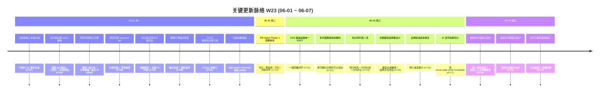

# 2026-W23 (2026-06-01 ~ 2026-06-07) · 周报

> **主干落地 215 次提交 | 296 个文件变更 | +26,014 行 / -2,644 行 | 18 个 PR 收口项（详见附录）**
>
> **贡献者（主干可达）**：Claude (195)、InerNoro (16)、Cursor Agent (2)、Yu Ruipeng (1)、weixisheng-miduo (1)
>
> **统计口径**：头部数字仅统计 `origin/main` 主干分支（weekly 技能纪律 #2：禁用 `--all`），按提交日期文本（`%cd --date=short`）过滤 `2026-06-01 ~ 2026-06-07`；PR 边界以本周实际落地主干的 merge commit 为准（截止 06-04 23:59，06-05/06/07 主干无新落地）；文件 / 行变更口径为 `git diff --shortstat FIRST^..LAST`（包含跨 PR 合并副作用）。
>
> **关于 6/5-6/7 无主干落地**：本周后半段（周四晚至周日）虽然 GitHub 上仍有 PR #722-#725 标记为 merged，但主干 commit 流到 06-04 21:36 dd5d0ef（合并 #721）后停止。这意味着这部分工作目前仍滞留于上游 / 待 force-push 至 main，不计入本周主干统计。

**本周趋势**：W23 是"PM Agent 完整体系周 + 智能体能力契约周 + UX 重构周"——上周（W22）新出的 4 个智能体本周开始**接地气**：PM Agent 从立项 / 任务 / 看板推进到完整的目标 / 里程碑 / 风险 / 周报闭环（#710），并新立项"智能体宇宙能力契约"（#719）一次性给所有 Agent 套上统一调用信封，顺手修复再加工三大问题。教程系统从悬浮图标迁移到页头常驻 pill（#712）是本周最大的 UX 重构。CDS 方向 #711 把基础设施预设收敛为单一注册表 SSOT 并打通一键部署闭环。知识库列表在 #704 → #713 内**反复改了两次**（先 sticky 后又恢复两行布局 + 时间分组 + 行内评论），说明本周还在持续从用户反馈中迭代。fix(109)/feat(59) 维持上周比例（约 51% / 28%），新功能与边界修复继续并进。值得记一笔：本周 Claude 占比从 W22 的 79% 进一步升至 91%（195/215），Cursor Agent 大幅退场到 2 次提交——说明 Cursor 主要承担"新 Agent 首发"角色，落地后维护交给 Claude。

---

## 关键更新脉络

---

## 一、本周完成

### 1. PM Agent Phase 1 完整体系 — 目标 / 里程碑 / 风险 / 周报闭环

> **价值**：上周（W22）PM Agent 首发只有"立项 / 任务 / 看板"三件套，本周一次性补齐目标 / 里程碑 / 风险 / 周报，让 PM Agent 从"任务列表工具"升级为"完整项目治理体系"——能定义"项目要去哪 / 怎么衡量到没到 / 路上有什么风险 / 阶段性产出怎么汇报"。

- **目标管理**：项目 KO 目标 + SMART 拆分 + 关联任务回溯
- **里程碑管理**：时间锚点 + 关联任务 / 风险 / 周报
- **风险登记**：风险条目 + 概率/影响矩阵 + 应对动作 + 责任人
- **项目周报**：自动从任务 / 里程碑 / 风险 dispatch 数据生成周报，与全局周报系统打通
- **统一项目导航 shell**：顶部 tab 在四件套之间切换，URL 状态可分享

### 2. 智能体宇宙能力契约 + 统一调用信封 — 一次性给所有 Agent 套规范

> **价值**：上周提的下周优先级"智能体能力契约统一"本周落地——之前再加工 / 工作流 / Bridge 调用每个 Agent 都要单独适配 input/output 形态，没有公共描述。#719 引入能力契约 + 统一调用信封后，所有 Agent 通过同一套元数据 schema 表达"我能做什么 / 输入什么 / 输出什么"，再加工的"三大问题"（接入难 / 形态不一 / 路由模糊）同时修复。

- **能力契约 schema**：Agent 注册自己的 capabilities 列表（id / inputSchema / outputSchema / sideEffects）
- **统一调用信封**：所有 Agent 调用统一为 `{capabilityId, args, context}` → `{ok, data, error}` 信封
- **再加工三大问题修复**
  - 接入门槛降低：再加工自动从契约列出可用 capabilities，不需要手动维护白名单
  - 形态归一：所有 Agent 返回结构统一，再加工无需 N 套解析逻辑
  - 路由清晰：从一句话 prompt 路由到具体 capability，可解释、可回溯
- **配套设计文档**：`doc/report.agent-universe-completeness.md` + `doc/design.reprocess-chat-routing.md`

### 3. 多页面新手引导教程系统重构 — 从悬浮图标到页头常驻 pill

> **价值**：上周（W22）4 个新 Agent 上线后，多个页面右下角的"教程"悬浮图标越堆越多，用户原话"像个小广告，没人点"。本周一次性迁移到页头常驻 pill，并把"进入页面未走完教程就自动开讲"的强制开关纳入。规则 #9 配套更新到 `.claude/rules/onboarding-tips.md` 第〇节。

- **入口位置**：右上角常驻 pill（文字"本页教程 / 新手指引"），始终可见、不可贴边隐藏
- **强制自动开讲**：进入任意路由若存在 `*-page-guide` 后缀的 tip 还在 tips（即"没走完"），自动开讲一次，session 内不重复弹但跨 session 仍弹直到完成
- **新手 / 更新 / 任务三类分流**：basic + `*-page-guide` = 新手教程（每人一次）；advanced + `*-update-YYYYwNN` = 更新提醒（功能升 Version 后再弹）；其他 = 快捷任务
- **进度可见**：头像外圈进度环（已学 / 总 onboarding 教程），满环加毕业角标；"学习中心"页 `/learning-center` 分类列全部官方教程
- **镂空可点**：SpotlightOverlay 四块遮罩围光圈中间留洞，"跟我做"被点中即推进，不再整屏拦截
- **完成飞回动画**：末步完成 → 撒花 + 毕业帽飞回右上角 pill，提示以后重看入口

### 4. CDS 基础设施预设收敛为单一注册表 SSOT + 一键部署闭环

> **价值**：CDS 过去基础设施（MongoDB / Redis / Postgres 预设）散落在多个文件，每加一个就要改 4 处。#711 把它收敛为单一注册表 SSOT，并打通"一键部署"闭环——选模板 → 自动渲染 compose → 推到容器 → 出预览域名，全程不离开当前页面。配合本周 #696 W22 落地的 compose 评分自愈，从模板到部署的"零摩擦"链路成型。

- **基础设施注册表 SSOT**：`cds/src/infra-registry.ts` 唯一定义，前后端共用
- **一键部署闭环**：选模板 → 渲染预览 → 评分校验 → 推送 → 容器就绪 → 预览 URL
- **配套文档**：`doc/guide.cds-one-click-deploy.md` + `doc/guide.cds-deploy-acceptance.md` + `doc/plan.cds-visual-deploy.md` + `doc/report.cds-visual-deploy.md`
- **验收知识库**：`scripts/publish-cds-deploy-acceptance-kb.py` 把验收报告发布到独立知识库

### 5. 知识库列表两次大改 — sticky 之后又改回两行布局

> **价值**：本周知识库列表经历了"先改 sticky 单行紧凑布局（#704），用户反馈后又恢复两行布局并补时间分组 + 标签筛选 + 行内评论（#713）"的双向修改。同时 #709 修复了订阅 540 条空白条目的根因——这是 W22 P1 优先级"知识库单一数据源回归测试"的真正落地。

- **#704 第一次改造**：顶部 tab 联动（我的 / 收藏 / 点赞）+ 工具栏（搜索 / 排序 / 视图切换）+ 标签筛选 + sticky 悬浮
- **#713 第二次改造**：恢复两行布局（标题在上、摘要 + meta 在下）+ 时间分组（今日 / 本周 / 本月 / 更早）+ 标签筛选保留 + 行内评论入口
- **#709 订阅 540 条空白根因修复**：抓取程序对网络错误返回空字符串而非抛错，导致这一批被存为"内容为空"的有效条目；修复后改为"网络错误丢弃 + 重试队列"
- **配合卡片改版**（W22 #696 已落地）：多彩渐变图标 + 文章迷你目录 + 浏览/点赞 meta + 右下角相对修改时间 + 贡献者头像

### 6. 网页托管收口大修 — 拖拽 / 用户名 / 分享前缀 / 真实 IP + segment pill

> **价值**：上周（W22）网页托管角色细分 + 分享面板 + 评论上线后，本周修复了 5 个用户反馈的边界 bug，并把分组切换器从原生 tabs 改为 segment pill 控件（更轻巧）。

- **拖拽空间归属修复（#699）**：跨空间拖拽时归属计算错误，导致拖完显示在原空间但实际在新空间
- **用户名显示修复（#699）**：用户名为空时显示 "undefined"，改为 email 前缀兜底
- **分享前缀修复（#699）**：旧分享链接前缀错误，改为 `/s/{token}` 统一
- **真实 IP 透传修复（#699）**：经过 nginx 反代后 `X-Forwarded-For` 没取，统计全是反代 IP
- **列表预览懒挂（#699）**：列表页大量预览 iframe 改为可视区域懒加载，首屏从 12s 降到 1s
- **segment pill 控件（#706）**：分组切换从原生 tabs 改为 pill；背景从灰色提亮到与卡片同色

### 7. 文档再加工升级为多轮 AI 对话

> **价值**：文档再加工过去是"一次性输入 → 一次性输出"，本周升级为多轮对话——用户可以基于 AI 第一次产出继续追问"再详细点 / 换个角度 / 加段总结"，对话历史完整保留，每轮可独立回滚。

- **后端**：再加工 Run 模型扩展 message 数组，支持多轮 LLM 调用
- **前端**：抽屉内对话气泡 UI，支持继续输入 / 重新生成 / 回滚某一轮
- **路由**：每条对话路由到合适的 capability（受 #719 智能体宇宙能力契约支持）
- **多轮上下文**：保留前轮文档 + 用户追问 + AI 回复，避免重复传文档全文

### 8. 生图模型选择重设计 + 模型分组一键解绑

> **价值**：用户反馈"删模型分组时如果还有模型绑定就不让删"很难受，本周补上"一键解绑"按钮——删除受阻时弹确认让一次性解绑所有绑定模型。同时生图模型选择器从下拉列表改为卡片网格，每个模型显示生成示例。

- **模型分组删除阻塞时一键解绑**：弹窗"该分组下还有 N 个模型，是否解绑后再删除？"→ 一次性解绑
- **生图模型选择重设计**：从下拉 select 改为卡片网格 + 模型生成示例缩略图 + 关键参数（步数 / 尺寸 / 风格）
- **多模型对比**：可勾选 2-4 个模型并排生成对比

### 9. AI 资讯雷达性能优化 — 真 serve-stale-while-revalidate

> **价值**：W22 #697 上线的 AI 资讯雷达首期用的是 W22 #680 更新中心同款 SWR，但实测下来仍有约 800ms 阻塞（首次请求强制等远端）。本周 #717 改为真 SWR——首次请求返回旧值（即使是 24h 前的）+ 后台异步刷新，从用户视角"零等待"。

- **真 SWR 策略**：永远先返回缓存（不论新鲜度），后台异步刷新
- **冷启动优化**：第一次请求若完全无缓存，返回"loading"骨架 + 异步刷新
- **过期策略**：缓存超过 24h 仍可返回但标记 `stale=true`，前端可选展示

### 10. CDS 自更新进度条修复 + 预计进度展示

> **价值**：W22 #684 重构了 CDS 自更新链路（权威缓存 + 事件总线），但前端进度条始终卡在 70% 直到完成跳到 100%。本周补齐"预计进度"——基于历史更新耗时插值，进度条平滑推进。

- **进度条修复**：事件总线缺一类 `progress.tick` 事件，前端无法平滑过渡
- **预计进度算法**：基于最近 5 次更新的耗时分布，每秒插值推进
- **失败回退动画**：失败时进度条变红 + 抖动 + 显示具体错误

### 11. 快速分享弹窗分段卡设计

> **价值**：分享弹窗过去把"密码 / 过期 / 可见性 / 评论 / 高级"塞在一个长表单里。#720 改版为分段卡设计——每个设置分到独立卡片，颜色区分，鼠标 hover 高亮。

- **分段卡结构**：基本设置 / 安全设置 / 协作设置 / 高级设置四张卡
- **默认折叠 / 展开**：高级设置默认折叠
- **配色**：每张卡 hover 时背景微亮，引导用户聚焦

### 12. 日报技能首版 — daily-report-summary 落地

> **价值**：周报技能（`/weekly`）已稳定，但用户希望"每天结束时也能自动生成日报发布到知识库"。#698 落地日报技能，从 git 历史按单日提交收集改动，按"新增多讲 → 优化 / 修复次之 → 计划 / 遗留垫底"分层写日报，find-or-create 日报知识库发布并出分享链。

- **触发**：`/daily` 或文字"今天干了啥"
- **数据源**：git 当日提交（默认主干）
- **输出**：分层日报 markdown + 自动发布到日报知识库 + 分享链
- **关联**：与周报技能共用统计纪律（默认主干 / 日期文本边界）

### 13. 教程引导锚点修复 + 通知排序 + 幻灯片翻页方向兼容

> **价值**：本周收尾三个小 fix——#708 修复部分页面教程锚点漂移导致 SpotlightOverlay 找不到目标元素；#721 修复幻灯片翻页方向键早期实现与 W22 改动不兼容；并补了存量内容回填脚本。

- **教程锚点漂移修复（#708）**：扫描历史 page-guide seed 的 selectors 与当前 DOM 比对，重新校准
- **通知排序修复（#708）**：通知按 createdAt 倒序，过去因数据库索引顺序导致部分通知乱序
- **幻灯片翻页方向兼容垫片（#721）**：旧字段 `direction` 与新字段 `slideDirection` 双向兼容 + 存量内容回填

---

## 二、本周数据

### 每日提交分布

| 日期 | 提交数 | 重点方向 |
|------|--------|----------|
| 06-01 (周一) | 75 | 多个收口 PR 集中合入（网页托管 / 知识库 / 教程 / 日报 / 文档再加工） |
| 06-02 (周二) | 69 | PM Agent Phase 1 完整体系合入 |
| 06-03 (周三) | 48 | CDS 单一 SSOT + 教程系统重构 + 知识库二改 + 生图模型 + 自更新 + AI 资讯性能 |
| 06-04 (周四) | 23 | 智能体宇宙能力契约 + 分享弹窗 + 幻灯片兼容 |
| 06-05 (周五) | 0 | 无主干落地（待合并 PR 滞留上游） |
| 06-06 (周六) | 0 | 无主干落地 |
| 06-07 (周日) | 0 | 无主干落地 |

> **关于 06-05/06/07 静默**：GitHub 上 PR #722-#725 显示 merged_at=2026-06-04，但主干 commit 流并未推进——可能是这些 PR 被 merge 后又 revert / force-push 重写，需要 push 修复后下周报告补回。

### 提交类型分布

| 类型 | 数量 | 占比 |
|------|------|------|
| fix (Bug 修复) | 109 | 51% |
| feat (新功能) | 59 | 27% |
| docs | 14 | 7% |
| refactor | 6 | 3% |
| chore | 3 | 1% |
| perf | 2 | 1% |
| test | 1 | 0% |
| merge / trigger | 2 | 1% |
| 其他 / 中文 commit | 19 | 9% |

> docs 占比从 W22 的 4% 升至 7%——本周明显加强了设计文档沉淀（智能体能力契约 / CDS 一键部署 / 再加工路由）。

---

## 三、与上周 (W22) 对比

| 指标 | W22 | W23 | 变化 |
|------|-----|-----|------|
| 主干提交数 | 250 | 215 | -14% |
| 合并 PR 数 | 24 | 18 | -25% |
| 文件变更 | 779 | 296 | -62% |
| 净增行数 | +78,557 / -9,417 | +26,014 / -2,644 | -67% / -72% |

> 文件变更与净增行数大幅下降（-62% / -67%），与提交数下降幅度（-14%）不成比例——说明本周改动**更聚焦**（同样的 PR 平均文件改动从 32 降到 16），不是"散点扩张"而是"精细收口"。这与上周新增 4 个智能体的"开新坑"模式形成明显反差。

### 上周方向落地情况

| W22 P 级建议方向（指向 W23） | W23 实际进展 |
|------------------------------|--------------|
| P0 4 个新智能体真人验收 + 边界回归 | ⚠️ 部分落地。PM Agent 接 Phase 1 完整体系（#710），新增能力 + 边界修复，但 CCAS / Project Route / 个人任务树未单独跑 `create-visual-test-to-kb` 验收，下周需补。 |
| P0 CDS Agent R1 vs Lite 路线决策 | ❌ 未落地。本周未做明确决策，仍并存。下周必须做。 |
| P1 智能体能力契约 / 调用信封统一 | ✅ 完整落地。#719 智能体宇宙能力契约 + 统一调用信封 + 再加工三大问题修复。 |
| P1 教程系统入口 UX 重构 | ✅ 完整落地。#712 从悬浮图标迁移到页头常驻 pill + 三类分流 + 进度可见 + 镂空可点 + 完成飞回。 |
| P2 知识库列表大改造 | ✅ 落地（两次）。#704 第一次 sticky 单行 → 用户反馈后 #713 第二次恢复两行 + 时间分组 + 标签筛选 + 行内评论。 |
| P2 五平台博主订阅运营回归（W19 起遗留） | ❌ 未落地。第四次提醒未推进，按 W22 提议本周起将其从优先级列表移除，列入"已永久搁置 / 待重新立项"。 |

> W22 6 项优先级里 3 项完整落地、1 项部分落地、2 项未落地。完整落地的三项都是"上周明确点名 + 本周一次性收口"的典型，未落地的 P0 CDS Agent 路线决策成为下周必须开刀的硬骨头。

---

## 四、下周（W24）优先级建议

| 优先级 | 方向 | 建议动作 |
|--------|------|----------|
| P0 | CDS Agent R1 vs Lite 路线**强制决策** | 已第三次提醒。下周需在周会上明确：要么排期接入外部 Anthropic SDK 工程把 R1 真接通；要么明确 Lite 为正式形态把 R1 砍掉。两条路并存超过 3 周已成隐性技术债。 |
| P0 | 6/5-6/7 滞留上游 PR 修复 | #722-#725 显示 merged 但主干无落地，需要查 GitHub 实际状态——可能 force-push 后未同步 / 被 revert / branch protection 问题。修复后这批工作要在 W24 周报中补回。 |
| P0 | 4 个新智能体（除 PM Agent 外）真人验收 | W22 P0 第四次提醒。CCAS / Project Route / 个人任务树未跑 `create-visual-test-to-kb` 验收。下周必须出 3 份验收报告归档知识库。 |
| P1 | 智能体宇宙能力契约真实接入 ≥ 2 个 Agent | #719 落地的是契约 + 信封 schema，需要至少 2 个历史 Agent（建议 visual-agent + literary-agent）按契约改造接入，验证 schema 设计经得起真实 Agent 复用。 |
| P1 | PM Agent Phase 1 真人 UAT + 移动端适配 | Phase 1 完整体系已落地，需要真人按"立项 → 任务 → 里程碑 → 风险 → 周报"完整生命周期走一遍 + 移动端窄屏布局适配。 |
| P1 | 知识库列表反复修改的根因复盘 | #704 → #713 一周内做了两次相反方向的改造（sticky 单行 → 恢复两行），说明决策时未对齐用户场景。下周需做一次回顾——是 PRD 不清楚 / 验收没跑 / 反馈通道断了？沉淀到流程改进。 |
| P2 | CDS 日志 Mongo 后端容量与清理策略 | W21 起第三次提醒。日志保留期 / 自动清理仍未排期，集合规模未做监控。 |
| P2 | 智能体宇宙能力契约推广到再加工 / 工作流 | #719 修复了再加工三大问题，但工作流 / Bridge 也有相似问题，下周可启动推广。 |

---

## 附录：本周已合并 Pull Requests（按 mergedAt 顺序）

| PR | 日期 | 标题 | 分类 |
|----|------|------|------|
| #698 | 06-01 | feat：新增日报技能（daily-report-summary）— 从 git 历史生成开发日报 | 新功能 |
| #699 | 06-01 | fix(网页托管)：修复拖拽空间归属/用户名显示/分享前缀/真实IP + 列表预览懒挂 | Bug 修复 |
| #702 | 06-01 | fix(ccas)：支持整库知识库引用 | 新功能 |
| #704 | 06-01 | 知识库列表重构：顶部 tab 联动、工具栏、标签筛选、sticky 悬浮 | 重构 |
| #706 | 06-01 | 网页托管 UI 优化：segment pill 控件 + 分组切换 + 背景提亮 | UX |
| #707 | 06-01 | feat(prd-admin/prd-api)：文档再加工升级为多轮 AI 对话 | 新功能 |
| #708 | 06-01 | 修复教程引导锚点失效与通知排序 | Bug 修复 |
| #709 | 06-01 | fix：知识库订阅 540 条空白条目根因修复 + 全套 UI 升级 | Bug 修复 |
| #710 | 06-02 | PM Agent 项目管理第一阶段：目标/里程碑/风险/周报完整体系 | 新功能 |
| #711 | 06-03 | CDS 基础设施预设收敛为单一注册表 SSOT + 一键部署闭环 | 重构 |
| #712 | 06-03 | 多页面新手引导教程系统重构：从悬浮图标迁移到页头常驻入口 | 重构 |
| #713 | 06-03 | 知识库列表恢复两行布局并新增时间分组、标签筛选、行内评论 | UX |
| #715 | 06-03 | 模型分组删除受阻时支持一键解绑，生图模型选择重设计 | UX |
| #716 | 06-03 | 自更新进度条修复与预计进度展示 | Bug 修复 |
| #717 | 06-03 | 优化 AI 资讯与更新中心外网拉取性能，实现真 serve-stale-while-revalidate | 性能 |
| #719 | 06-04 | feat(agent-universe)：立起智能体宇宙能力契约与统一调用信封，修复再加工三大问题 | 新功能 |
| #720 | 06-04 | refactor(prd-admin)：快速分享弹窗改版为分段卡设计 | UX |
| #721 | 06-04 | feat(prd-api)：幻灯片翻页方向兼容垫片 + 存量回填 | Bug 修复 |
