# 2026-W24 (2026-06-08 ~ 2026-06-14) · 周报

> **主干落地 566 次提交 | 1,276 个文件变更 | +132,259 行 / -10,320 行 | 56 个 PR 收口项（详见附录）**
>
> **统计基线**：`origin/main @ 5fe0b2d`（采集时间 2026-06-14 23:50 UTC，技能纪律 #3.5）
>
> **贡献者（主干可达）**：Claude (232)、inernoro/InerNoro (150)、vicky (98)、Cursor Agent (46)、chenyashan (11)、Yu Ruipeng (11)、yu/yurenping-miduo (6)、weixisheng-miduo (1)、chenshuhuai-miduo (1)、chenjiaying-miduo (1)
>
> **统计口径**：头部数字仅统计 `origin/main` 主干分支（weekly 技能纪律 #2：禁用 `--all`），按提交日期文本（`%cd --date=short`）过滤 `2026-06-08 ~ 2026-06-14`；PR 边界以本周实际落地主干的 merge commit 为准（merge-base 校验 56/56 全部可达），不信 GitHub `mergedAt`；文件 / 行变更口径为 `git diff --shortstat FIRST^..LAST`（包含跨 PR 合并副作用）。

**本周趋势**：W24 是"PM Agent / 产品立项双线扩张 + MD 转 PPT 引擎二次升级 + 知识库双链宇宙图 MVP + CDS 资源工作台与跨项目密钥事故修复"——上周 PM Agent 完成 Phase 1 立项/任务/目标/里程碑/风险/周报骨架后，本周 Claude 一口气把它推进到 P0~P3：全屏改版 + AI 工作台 + 跨项目报表一级导航 + AI 项目简报 + 里程碑详情页（OKR/DoD/任务/交付物）。同时 vicky 拉起"产品立项 + 版本上线流程"全栈线，把需求/缺陷/版本/功能编号统一到 TAPD 数字规则，立项向导接入评审进度日志。MD 转 PPT 在 W22 首版基础上重做：流式逐页大纲、锚定 deck 模式（借鉴 open-design 成品模板做版式范本治排版重叠）、模型池直选、生成落库可重连。知识库做出 W24 最有"未来感"的一件事——Obsidian 风的双链 + 反向链接 + 宇宙图 MVP，划词 AI 局部编辑同期上线。CDS 方向出了两件大事：资源工作台协议 + 数据库工作台闭环 + SSH 发布升级为"站点发布作战台"；同时撞上**跨项目密钥隔离穿透事故**（CDS_JWT_SECRET 替换打哑 prd-agent 全部 6 平台 key 密文约 2 小时静默 401），事故复盘催生 `.claude/rules/cross-project-isolation.md` 通用规则、PlatformKeyIntegrityWorker 启动自检和平台密钥自愈端点。统计上：fix(169)/feat(159)/polish(53) 比例与体量倍增，合并 PR 数从 W23 18 个跳到 56 个（+211%），主干提交 +163%，文件 +331% —— **本周是 6 周以来最忙的一周**。

---

## 关键更新脉络

```mermaid
timeline
    title 关键更新脉络 W24 (06-08 ~ 06-14)
    section 06-08 周一
      PM Agent Phase 2 第一波 : 任务详情页/子任务/北极星目标/Xmind 画布 (#745 #748)
      Speech Agent Bugbot 修复 : 三项 Medium 评审 (#745)
      MD转PPT 出图质量重写 : 设计系统提示词重写+空白幻灯修复
      product-agent 缺陷 tab 收紧 : 去掉「关联已有缺陷」(#749)
    section 06-09 周二
      MD转PPT 借鉴 open-design : 5 种主题+模型徽章+Google Fonts
      新增前端搭档智能体 : Cursor 主导首发
      新增技术分析文档校验 Agent : Cursor 主导
      商品溯源智能体启动 : 防窜物流知识/案例/代码对比
      CDS Agent 会话流加 stale 守卫 : 切会话不再混时间线 (#750)
    section 06-10 周三
      MD转PPT 体验升级第二波 : 圈选反馈/页位恢复/模型 chip/下一步条
      CDS 资源工作台启动 : SSH 发布控制面 MVP+数据库初始化引导 (#766)
      前端搭档视觉重做 : 怀旧星夜/粒子宇宙/Ctrl+V 粘贴截图诊断
      shitu-agent 上线 : 识途新人文化与制度问答
    section 06-11 周四
      知识库双链 v1 MVP : 后端账本+前端蓝链+反向链接 (#770)
      宇宙图原型→Obsidian Graph View : 设计文档+债务台账
      团队动态首发 : 全平台工作日志时间线
      网页托管团队空间 P0/P1/P2 : 两级化+免密分享+标签聚合
      模型池直选 : PPT 弹层点选池内模型零手抄
      教程「我已学会」退出口 : 半速飞回+轻微提醒更新子类
      CDS 数据库资源工作台闭环 : 协议+L1 验收+enforce TCP
    section 06-12 周五
      跨项目密钥隔离事故 : CDS_JWT_SECRET 穿透打哑 6 平台 key (~2h)
      平台密钥自检+自愈 : Worker+恢复端点+cross-project-isolation 规则
      MD转PPT 锚定 deck 模式 : open-design 成品模板做版式范本
      行为洞察闭环 : AI 简报+转缺陷/已修复/忽略
      PM Agent P3 里程碑详情 : OKR/DoD/任务/交付物
      AI 项目简报 P1+P2 : 生成+预览+下载+分享+保存到网页托管
      划词 AI 局部编辑 : AI 改写选区+选区配图
      CDS SQL Console 只读堵 EXPLAIN ANALYZE
      发布中心升级 : 站点发布作战台
    section 06-13 周六
      Product Agent 立项+版本上线流程 : vicky P0 全栈 (#776 #813)
      TAPD 纯数字 ID 统一 : 需求/缺陷/版本/功能编号 (#813)
      PM Agent 全局总览看板 : 管理层只读洞察 (#819)
      全局知识库管理员洞察视图 : 多维筛选 (#797)
      Peer-Sync 跨系统同步工作台升级 (#812)
      短视频解析改知识库素材加工 : 后台进度任务
    section 06-14 周日
      TAPD 缺陷自动提报智能体 : 口语→四要素→TAPD (#791)
      短视频解析完整链路收口 : TikHub 接口/教程流水线/降级说明 (#822)
      CDS forwarder 自同步签名链稳定 : 8 轮修复 (#817)
      CDS 与项目密钥边界拆分 : ops 兼容空值
```

---

## 一、本周完成

### 1. PM Agent Phase 2 — 全局总览 / AI 工作台 / 跨项目报表 / AI 项目简报 / 里程碑详情

> **价值**：W23 PM Agent 完成 Phase 1 立项/任务/目标/里程碑/风险/周报骨架。W24 一口气推进 P0~P3 升级：从"单项目工具"升级为"管理层视角的多项目治理中心 + AI 助手主区 70% + 智能体可生成对外简报"。

- **P0 全屏改版 + 两层信息架构（#784）**：项目管理工作台两层共享布局、左上角「返回首页」对齐产品管理智能体
- **P1 首页 AI 工作台**：跨项目 AI 助手 + 我的待办 + 可配置便捷操作
- **P2 跨项目报表页**：一级导航新增「报表」，从单项目跳到全局视角
- **P2 目标三视图统一编辑 + 抽屉信息架构重排**：目标看板/列表/树三视图共用编辑器
- **P3 里程碑详情页（#796）**：OKR/DoD/任务/交付物四个维度 + 项目级自定义交付物类型
- **AI 项目简报 P1+P2**：生成 + 预览 + 下载 + 5 套风格可切 + 分享链接 + 保存到网页托管 + 简报「资料-简报」子 tab（搜索/重命名/批量删/按月分组）+ 自然语言调整内容 + 报告周期可选
- **目标 / 里程碑 / 知识库一组细化**：Xmind 式拖拽改层级、北极星业务目标可设修改、目标一键设为里程碑同步显示、目标更新级联同步联动里程碑、表单草稿同步落库不丢、知识库精简从网页托管导入、HTML 真渲染、双击重命名、类型图标
- **新增全局总览看板（#819）**：管理层只读洞察 + 排序下拉移入顶部筛选区

### 2. Product Agent / 产品立项 v1 — 立项向导 + TAPD 数字编号统一 + 版本工作流

> **价值**：vicky 主导补齐产品管理智能体"立项→上线"的全链路。把原本散落的需求/缺陷/版本/功能编号统一到 TAPD 纯数字规则（5 位数字+前缀），让团队跨系统数据互认。立项向导补上一步回退 + Agent 评审进度日志可视化。

- **P0 新增产品版本立项与上线流程能力（#776）**：版本工作流立项与正式版本三标签页、功能目录导入绑定正式版本、版本总览导入按应用/产品列跨产品路由
- **TAPD 数字编号统一（#813）**：需求/缺陷/版本/功能编号全部走 TAPD 纯数字规则 + xlsx 导入支持 + 五档严重程度映射 V2.6
- **立项向导优化**：支持上一步回退修改、立项 Agent 评审增加进度与过程日志、立项表单产品选择与主页缺陷筛选优化
- **缺陷导入按应用列路由**：识别处理人并匹配系统用户、TAPD 优先级映射为系统严重程度、未匹配应用时跳过移除兜底产品
- **缺陷详情 TAPD 结构重建与字段目录**
- **AI 助手三件套**：AI 助手具备创建需求/功能/缺陷能力、工作台改版为 AI 助手主区 70% + 右栏待办/快捷操作 30%、新建需求智能填充增强与语音输入
- **数据可见性收紧**：单产品需求/缺陷仅展示当前账号相关记录、产品多负责人与版本表产品列合并、设置页调试模式一键清空业务数据（明示边界）
- **工作台助手客户处理**：未建档时先确认再关联、创建需求时识别客户提出方

### 3. MD 转 PPT 引擎升级 v2 — 流式逐页大纲 + 锚定 deck + 模型池直选 + 服务器权威性

> **价值**：W22 MD 转 PPT 首版"会做"但用户连续 10 条反馈复盘登记到 debt 台账（出图变浅色、自由排版重叠、刷新丢历史、空白等待）。W24 做了二次升级：流式逐页大纲让用户边等边看，锚定 deck 模式借鉴 open-design 成品模板做版式范本根治自由排版重叠的架构问题，模型池直选弹层点选零手抄配置，生成落库走 server-authority 刷新不丢。

- **流式逐页大纲 + 页级设计意图贯通**：用户看到逐页大纲文本逐步浮现，每页带"设计意图"说明
- **锚定 deck 模式（#765）**：open-design 成品模板做版式范本（治自由排版重叠的架构解）、补 2 套暗色 deck（Tech 极黑/极光渐变不再惊讶变浅色）、looksLikeDeck 识别 div.slide deck 修 retro-zine 误判
- **借鉴 open-design 第二波**：圈选反馈/页位恢复/编辑升级/模型 chip/下一步条
- **借鉴 open-design 第三波 + 工坊拼贴 + Kami 纸墨**：两套官方模板
- **MD 转 PPT 体验升级**：所见即所得编辑/页码翻页修复/主题快切/下载全屏/快速开始
- **生成落库可重连（server-authority）**：刷新不再丢，大纲生成纳入服务器权威性 + L0 档门禁缩放
- **重写设计系统提示词**：大幅提升出图质量、实色标题、去 emoji
- **修复 P1 iframe 安全漏洞 + 同源沙箱递归**：重构为对话+预览双栏布局
- **模型池直选（#770）**：PPT 弹层点选池内模型即用、凭据预检（选不了的模型不再点了才报错）
- **演示缩略条兼容旧版 reveal deck + 重绘单页不视觉冒充全部重绘**

### 4. 知识库双链 v2 + 反向链接 + Obsidian 风宇宙图 MVP + 划词 AI 局部编辑

> **价值**：知识库从"分散文档库"升级为"互相引用的知识网"。引入 `mentions` 通用 @ 账本作为 SSOT，WikiLinkParser 正则解析 `[[xxx]]`，保存即重算反向链接。前端 MarkdownViewer 把 `[[]]` 渲染为蓝链 + BacklinksPanel 文档底部"被引用"卡片带 anchor 高亮 + WikilinkHoverCard 悬停预览 + 编辑器 `[[`/`@` 自动补全下拉。配套 Obsidian 同款宇宙图（Filters/Groups/Display/Forces 四组设置）和划词 AI 局部编辑（AI 改写选区 + 选区配图）。

- **后端双链账本**：`mentions` 集合 + `MentionService` 保存即重算 + `MentionsController` 三端点（document-links / store-graph / suggest）
- **前端蓝链 + 反向链接面板**：`MarkdownViewer` 渲染 `[[]]`、`BacklinksPanel` 带 anchor 高亮
- **双链 v2**：编辑器 `[[` / `@` 自动补全下拉 + 悬停预览卡片 + 单测
- **宇宙图页面（`UniverseGraphPage`）**：Obsidian 同款力导向 Graph View、Filters/Groups/Display/Forces 四组设置、知识库工具栏新增「关系图谱」按钮
- **划词 AI 局部编辑**：AI 改写选区 + 选区配图、划词选区定位改 DOM 序号指认 + thinking 可见 + 分享页返回知识库常驻
- **划词替换语法安全守卫**：canReplace 实时计算 + 配图浮层裁掉不适用动作
- **wikilink 协议修复**：被 rehype-sanitize 剥光导致蓝链失效 → 改用 `#wikilink/` hash 锚替代自定义协议
- **设计文档 + 债务台账**：`doc/design.knowledge-base-mention-network.md` + `doc/debt.knowledge-base-mention-network.md`（v2 候选：跨实体引用 / AI 自动补链 / 时间轴回放）
- **知识详情页重写**：富文本编辑 + HTML 预览 + 文件夹目录、产品知识库重构 P1（版本调取 + 总览聚合 + 旧库迁移）、知识编辑器双模式 + 目录拖拽移动/排序

### 5. CDS 资源工作台协议 + 数据库工作台闭环 + SSH 站点发布作战台 + Agent 请求观测台

> **价值**：CDS 本周做了三件大事——把"资源（MongoDB/Redis/Postgres/MySQL）面板"从硬编码 4 套分支抽象成「可扩展资源工作台协议」、把 SSH 发布从控制面 MVP 升级成「站点发布作战台」、新增「Agent 请求观测台」让每一条 LLM 调用可见可筛可回放。同时撞上多次资源工作台数据库环境解析 bug，集中收口到 L1 验收。

- **可扩展资源工作台协议**：`feat(cds): add extensible resource workbench protocol`（#766），数据库资源工作台闭环、enforce resource TCP external access、role-aware resource controls、metrics logs panels、database controls expand
- **数据库初始化引导自动化**：`feat(cds): automate database initialization guidance`、新增 SSH 发布控制面 MVP → 升级为「站点发布作战台」、简化发布中心默认入口
- **Agent 请求观测台（#770 同 PR）**：`feat(cds,prd-api): Agent 请求观测台——一条条真实请求可见可筛可回放`
- **资源工作台数据库环境解析修复**：数据库环境解析、初始化数据库范围、数据库访问可用性、共享 preview URL builder
- **L1 验收报告**：归档数据库工作台 L1 验收报告 / 撤回数据库工作台误验收报告（执行前后强制对照）
- **forwarder 自同步签名链稳定**：8 轮迭代（兼容旧版 → 收窄重启条件 → 避免签名被启动进程覆盖 → 稳定运行时签名范围 → 使用源码签名 → 使用 Git 源码签名）—— 这一组属于系统级踩坑

### 6. 跨项目隔离 v2 — Jwt__Secret 边界拆分 + 平台密钥自检与自愈（事故级）

> **价值**：2026-06-12 发生跨项目密钥隔离穿透事故——为 miduo-backend HS512 弱钥更换 `CDS_JWT_SECRET`，因 CDS 全局密钥被注入所有项目容器的 `Jwt__Secret`，导致 prd-agent 内部"JWT 签名 + 平台 API key AES 静态加密"共用此密钥的设计被穿透打哑 6 个平台 key 密文，模型池静默 401 约 2 小时（无告警）。事故催生 `cross-project-isolation.md` 通用规则、`PlatformKeyIntegrityWorker` 启动自检、平台密钥自愈端点、和"已知共享通道清单"事故台账。

- **`.claude/rules/cross-project-isolation.md` 新增**：列出 6 类已知共享通道（CDS_JWT_SECRET / Jwt__Secret 双重身份 / `_global` customEnv / 共享 Mongo+Redis / 单实例 CDS 多 Agent / `cds-compose.yml` 占位值），每条标注消费方与穿透方式
- **container.ts 解耦**：项目 customEnv 显式定义 `Jwt__Secret` 时优先，全局值仅兜底（`cds/tests/services/container.test.ts` 回归测试）
- **`PlatformKeyIntegrityWorker`**：启动自检 + 站内告警兜底
- **平台密钥自愈端点**：从运行配置服务端恢复平台 key
- **限制发布目标跨项目凭据引用（#789）**：security(cds) 修复发布控制面项目越权
- **MongoDB `$where` 正则修复 + 部署日志去 emoji**（security(cds)）
- **只读 SQL Console 堵 EXPLAIN ANALYZE 写绕过**（security(cds)）
- **CDS 与项目密钥边界拆分（#817 cx/cds-clean-bootstrap-self-hosting）+ ops 兼容 API Key 加密密钥空值配置**

### 7. 三个新智能体上线 — TAPD 缺陷自动提报 / 商品溯源 / 识途

> **价值**：W24 收到三个垂直行业智能体的实际业务接入，分别由 chenjiaying-miduo、chenshuhuai-miduo（Cursor Agent 协同）、weixisheng-miduo 主导——本系统从"Claude 一个人写"开始向"团队多角色共建"扩散。

- **TAPD 缺陷自动提报智能体（#791 `tapd-bug-agent`）**：口语缺陷描述 → 四要素草稿（标题/重现步骤/期望结果/实际结果）→ 用户确认 → TAPD 创建缺陷，已在 AppCallerRegistry 注册
- **商品溯源智能体（`channel-trace-agent`）**：防窜物流业务知识 + 线上问题案例排查 + 业务/代码差异对比；P0/P1 复用增强（排查清单 + 诊断沉淀缺陷 + 证据包导出 + 粘贴上下文 + 检索增强）；业务知识问答支持截图视觉识别 + 操作步骤指引；线上问题诊断升级为多轮对话式；持续修复"问题排查回答塌缩成空框"（流式 onDone 读到被清空的 streamRef）、长回答压缩成一行（气泡 flex 容器塌缩改块级布局）、生成中向上滑动回答被压缩（智能自动滚动）
- **识途智能体（`shitu-agent`）**：新人文化与制度问答 Agent、使用帮助抽屉与作者署名魏喜胜
- **技术分析文档校验 Agent 持续打磨（W23 上线）**：完善输入来源、阻断空模板输出、修复按钮换行 / 分组

### 8. 团队动态 + 行为洞察 — 从沉默的行为信号读出改进方向

> **价值**：W24 新增 `team-activity` 模块——团队动态把全平台工作日志聚合成时间线，再叠加"行为洞察"：把用户路由级行为信号（点开了什么页/卡在哪/反复尝试什么）汇总分析后流式生成 AI 简报发布到知识库，并配套处理闭环（转缺陷 / 已修复 / 忽略）。本周新增 MongoDB 集合 `behavior_events`。

- **团队动态首发**：全平台工作日志时间线
- **行为洞察三连**：从沉默的行为信号读出改进方向 → AI 简报流式生成并发布到知识库 → 处理闭环（转缺陷/已修复/忽略）+ 面板视觉打磨
- **团队动态改控制台三栏布局**：两侧空白变统计面板
- **后端**：BehaviorController 采集路由级行为信号到 `behavior_events`
- **设计文档**：`doc/design.team-activity.md` 同步索引
- **多轮 Codex 评审修复**：刷新失败时清空过期列表并显示错误态、二轮评审两个 P2、三个问题（#778）

### 9. 网页托管团队空间 P0/P1/P2 — 空间结构两级化 + 标签聚合

> **价值**：网页托管从"个人工具"升级为"团队空间"——P0 空间结构两级化（个人 / 团队）+ 团队成员免密访问分享链；P1 团队空间专题/分类分组 + 个人网页复制进团队；P2 document-store 标签化 + 聚合视图 + 团队网页区块。

- **P0 空间结构两级化 + 团队成员免密访问分享链**
- **P1 团队空间专题/分类分组 + 个人网页复制进团队**
- **P2 document-store 团队空间标签化 + 聚合视图 + 团队网页区块**
- **分组级数据权限与成员角色标签**
- **左侧树形导航重构**：refactor(prd-admin) 网页托管团队空间信息架构
- **双击就地重命名空间与分组**
- **分享页密码屏补「登录后免密」指引**
- **数字短链改为按需懒分配（#777）**：修复总返回数字链问题
- **团队空间卡片分节改按专题/分类切分**

### 10. 短视频解析 → 知识库素材加工流水线

> **价值**：周末 06-13/14 集中推进——短视频解析从"独立工具"重定位为"知识库素材加工"，弱化 agent 痕迹，强化"上传短视频→自动入库知识素材"的工作流。后台进度任务化 + 刷新恢复 + TikHub 接口更新 + 教程流水线 + 降级说明。

- **入口**：知识库短视频解析入口 + 默认选中工具
- **流水线**：完成短视频教程流水线、接入短视频解析胶囊（prd-api 后端）
- **重定位**：调整短视频解析为知识库素材加工 + 弱化 agent 痕迹
- **后台任务化**：短视频解析改为后台进度任务 + 保留后台任务刷新恢复 + 服务端阶段历史展示
- **TikHub 接口更新**：更新 TikHub 短视频解析接口、修正短视频视频优先入库链路
- **细节打磨**：解析进度文案 / 降级说明 / 结果按钮分组 / 素材入库弹窗可读性 / 遮罩层级 / 复用智能体处理短视频解析

### 11. 教程系统 v3 — 「我已学会」退出口 + 飞回动画半速 + 轻微提醒更新子类

> **价值**：W23 教程系统重构上线后，用户反馈"多步教程每天弹一次很烦 + 关闭飞回动画看不见"。W24 三处改动：多步教程底部加「我已学会」一键退出口（=markLearned + 飞回）、任何关闭路径都播飞回动画（X / 点空白 / ESC / 我已学会 / 完成）且时长 720ms → 1440ms 半速、新增 `*-update-reminder` 子类（单步轻量气泡，弹出当下即 markLearned，不再重复）。

- **「我已学会」一键退出口**：多步教程气泡底部新增按钮（`steps.length>0 && payload.id` 才显示）
- **任何关闭都播飞回入口动画，半速**：720ms → 1440ms、统一走 `closeWithFlyBack()`、起点优先取光圈退而取气泡卡片
- **轻微提醒更新子类（`*-update-reminder`）**：sourceType=update-reminder、单步、Spotlight 悬浮气泡（不是抽屉）、弹出当下即 markLearned → 不管取消还是「知道了」都不再显示
- **首例**：`visual-agent-paste-update-reminder`（视觉创作首页可粘贴图片）
- **三条防重叠/防重复/防错页约束**：同 session 不紧跟 page-guide 弹、占当天自动弹额度、精确路由门（非子路由前缀）、抽屉抑制也要判精确路由
- **抽屉自动弹出严格按页（#779）**：根治"无教程页面弹出全部教程"病毒感（用户原话「莫名其妙弹出，像病毒一样」），后端改为仅认 `TargetUserId`，Delivery 仅作统计
- **PR #788 review 修复**：reminder 懒加载锚点竞态（High）与子路由误抑制抽屉（Medium）+ 文案随树导航改版同步 + 教程提醒时序与飞回一致性 + 分组权限已知边界落 debt 台账
- **小技巧教程锚点失效修复（#818）**

### 12. 前端搭档智能体改版 + 截图视觉诊断 Ctrl+V 粘贴

> **价值**：前端搭档（`front-end-agent`）从 06-09 新增到 06-12 一周内做了 5 轮迭代——首发后立刻加 Ctrl+V 粘贴截图诊断、视觉对齐视觉创作智能体靛紫全息风格、怀旧星夜视觉与密集流星动效、粒子宇宙背景与按钮悬停反馈、精简布局把 PDA/项目表挪到右侧弹窗入口。

- **新增前端搭档智能体**：API 接入 / 组件生成 / 报错诊断 / 截图现象诊断 / 前端项目表查询 / PDA 项目手册（SSE 流式 + 模型可见）
- **截图视觉诊断支持 Ctrl+V 粘贴截图**
- **视觉迭代**：怀旧星夜视觉与密集流星动效 → 粒子宇宙背景与按钮悬停反馈 → 视觉对齐视觉创作智能体靛紫全息风格 → 液态按钮调暗（#794）
- **布局精简**：右侧 PDA/项目表弹窗入口、汇总入口与按钮优化

### 13. Peer-Sync 跨系统知识库同步工作台升级

> **价值**：peer-sync（跨系统知识库同步）从"功能存在"升级为"工作台"——传输状态面板重设计、传输预览动效优化、添加对端面板视觉、HTTP→HTTPS 重定向兼容、跳过逻辑与时间展示修复。

- **升级跨系统知识库同步工作台**（#812）
- **传输状态面板重设计 + 传输预览动效优化**
- **添加对端面板视觉**
- **HTTP→HTTPS 重定向兼容**
- **跳过与时间展示修复**

### 14. 视觉创作粘贴 + AI 助手附件上下文 + 大纲服务器权威性

> **价值**：本周新增三处"输入零摩擦"小升级——视觉创作首页支持粘贴/拖入图片作为参考图、AI 助手（项目管理 + 产品管理）支持上传 md/pdf 附件作为上下文、MD 转 PPT 大纲生成纳入服务器权威性（断线续传 + 刷新不丢）。

- **视觉创作首页支持粘贴/拖入图片作为参考图**（首例 update-reminder 关联）
- **AI 助手支持上传 md/pdf 附件作为上下文**（项目管理 + 产品管理智能体）
- **大纲生成纳入服务器权威性**（feat(prd-api,prd-admin) #770 同 PR）+ L0 档门禁缩放

### 15. 全局知识库管理员洞察 + 审计日志体验

> **价值**：管理后台两处小但有价值的升级——新增全局知识库管理员洞察视图（只读 + 多维筛选）、审计日志顶部支持搜索 + 操作方法筛选。

- **新增全局知识库管理员洞察视图**（只读·多维筛选）（#797）
- **审计日志顶部支持搜索 + 操作方法筛选**
- **设置页移除重复的产品管理员表格**（#815）

### 16. 更新中心 / Changelog 体验

> **价值**：更新中心和 changelog 卡片继续做小细节——作者展示合并单 chip + 联合作者识别 + 通用后缀剥离匹配、按周分组 + 用户名匹配彩蛋、GitHub 提交总数修正、类型筛选改枚举（#762）。

- **changelog 作者展示**：合并单 chip + 联合作者识别 + 通用后缀剥离匹配
- **更新中心面板动态化 + 筛选标签热度角标**
- **按周分组 + 用户名匹配彩蛋 + GitHub 提交总数修正**
- **类型筛选改为枚举（#762）**

---

## 二、本周数据

### 每日提交分布

| 日期 | 提交数 | 重点方向 |
|------|--------|----------|
| 06-08 (周一) | 60 | PM Agent Phase 2 第一波（任务详情/子任务/北极星目标/Xmind 画布）+ MD转PPT 出图质量重写 + Speech Agent Bugbot 修复 |
| 06-09 (周二) | 67 | 前端搭档 / 技术分析文档校验 / 商品溯源 三个新 Agent 接入 + MD 转 PPT 借鉴 open-design 5 种主题 + CDS Agent 会话流加 stale 守卫 |
| 06-10 (周三) | 62 | MD 转 PPT 体验升级第二波 + CDS 资源工作台启动（SSH 发布 MVP + 数据库初始化引导）+ 前端搭档视觉重做 + shitu-agent 上线 |
| 06-11 (周四) | 101 | 知识库双链 v1 MVP + 团队动态 + 网页托管团队空间 P0~P2 + 模型池直选 + 教程「我已学会」+ CDS 数据库资源工作台闭环 |
| 06-12 (周五) | 120 | 跨项目密钥事故 + 自检自愈 + 划词 AI 编辑 + MD 转 PPT 锚定 deck + 行为洞察闭环 + PM Agent P3 里程碑 + AI 项目简报 + CDS 发布作战台 |
| 06-13 (周六) | 121 | Product Agent 立项+TAPD 数字编号统一 + PM Agent 全局总览 + Peer-Sync 工作台升级 + 短视频解析改知识库素材加工 + 全局知识库洞察视图 |
| 06-14 (周日) | 35 | TAPD 缺陷自动提报智能体 + 短视频解析完整链路收口 + CDS forwarder 签名链稳定 + 密钥边界拆分 |

### 提交类型分布

| 类型 | 数量 | 占比 |
|------|------|------|
| fix (Bug 修复) | 169 | 30% |
| feat (新功能) | 159 | 28% |
| merge / synchronize | 83 | 15% |
| polish (打磨) | 53 | 9% |
| docs | 24 | 4% |
| chore | 14 | 2% |
| test | 10 | 2% |
| refactor | 8 | 1% |
| security | 5 | 1% |
| style / refine | 8 | 1% |
| 其他（中文 commit / P0 ~ P3 / ops / harden / handle 等） | 33 | 7% |

> feat 与 fix 几乎平分秋色（28% / 30%），同时 polish 占比从 W23 几乎零升至 9%——本周大量"新做 + 立刻打磨"的迭代节奏。security 5 条全部来自跨项目密钥事故的修复链，是本周最大的稳定性事件。merge 占比 15% 偏高，反映本周多个长寿分支（pm-agent / product-agent / channel-trace-agent / cds 多线）频繁与 main 同步以避免冲突堆积。

---

## 三、与上周 (W23) 对比

| 指标 | W23 | W24 | 变化 |
|------|-----|-----|------|
| 主干提交数 | 215 | 566 | +163% |
| 合并 PR 数 | 18 | 56 | +211% |
| 文件变更 | 296 | 1,276 | +331% |
| 净增行数 | +26,014 / -2,644 | +132,259 / -10,320 | +408% / +290% |

> 各项指标全面飙升 2-4 倍。**这是 6 周以来最忙的一周**——W23 是"W22 新坑收口周（PR 精细化）"，W24 是"全员开新坑 + 收口同步进行"。PR 平均文件变更从 W23 的 16 升到 W24 的 23（仍属"中等聚焦"，没失控）。值得注意：W24 合并 PR 多 38 个，但其中 14 个是 `Merge branch 'main'` 类同步提交（非新代码），扣除后实际"功能 PR"约 42 个，仍是 W23 的 2.3 倍。

### 上周方向落地情况

| W23 P 级建议方向（指向 W24） | W24 实际进展 |
|------------------------------|--------------|
| P0 CDS Agent R1 vs Lite 路线**强制决策** | ⚠️ 部分回避。CDS 本周聚焦资源工作台/数据库工作台/SSH 发布作战台/Agent 请求观测台/forwarder 签名链/跨项目密钥事故，没有动 Agent R1 vs Lite 路线。已第四次提醒。 |
| P0 6/5-6/7 滞留上游 PR 修复 | ✅ 隐式落地。W23 末提到的 #722-#725 滞留 PR 本周已陆续进 main（#745 起编号连续），且 W24 56 个 PR 全部经过 merge-base ancestor 校验。 |
| P0 4 个新智能体（除 PM Agent 外）真人验收 | ❌ 未做。CCAS / Project Route / 个人任务树仍未跑 `create-visual-test-to-kb`。已第五次提醒，建议下周排专人 0.5 天集中跑。 |
| P1 智能体宇宙能力契约真实接入 ≥ 2 个 Agent | ❌ 未做。W23 #719 落地的契约本周未推广。下周建议先挑 visual-agent / literary-agent 一个接入验证。 |
| P1 PM Agent Phase 1 真人 UAT + 移动端适配 | ⚠️ 部分。本周 PM Agent 一口气推进到 Phase 2（P0~P3），但**真人 UAT 没跑**，移动端适配未做。Phase 1 没 UAT 就跳 Phase 2 是隐性技术债。 |
| P1 知识库列表反复修改的根因复盘 | ❌ 未做。W23 #704→#713 一周内反向改造未做流程复盘。但本周知识库重心转向"双链 + 宇宙图"完全不同的方向，原列表布局问题暂时被掩盖。 |
| P2 CDS 日志 Mongo 后端容量与清理策略 | ❌ 未做。W21 起第四次提醒。 |
| P2 智能体宇宙能力契约推广到再加工 / 工作流 | ❌ 未做。 |

> W23 8 项优先级：1 项隐式落地、2 项部分落地、5 项未落地。**完成率明显低于 W23（W23 是 3 完整+1 部分）**。根因：本周开新坑太多（PM Agent Phase 2 / 产品立项 v1 / 三个新 Agent / 知识库双链宇宙图 / CDS 资源工作台 / 跨项目密钥事故），消化能力被挤占。建议下周收紧节奏：开新坑前先把 W23/W24 累积的 6 个 P0/P1 至少消化 3 个。

---

## 四、下周（W25）优先级建议

| 优先级 | 方向 | 建议动作 |
|--------|------|----------|
| P0 | **跨项目密钥事故复盘 + 隔离穿透清单复测** | 本周事故修复了通道 #1 #2，但通道 #3 `_global` customEnv / #4 共享 Mongo+Redis / #5 单实例多 Agent / #6 compose 占位值尚未做实际穿透测试。下周建议跑一遍 6 类通道的回归测试，确认守卫到位。 |
| P0 | **PM Agent Phase 2 真人 UAT**（含移动端） | Phase 2 已推进 P0~P3 4 档但 Phase 1 都没跑 UAT。下周必须按"立项 → 任务 → 目标 → 里程碑 → 风险 → 周报 → AI 简报 → 全局总览"完整生命周期走一遍，并配 mobile viewport 验收。 |
| P0 | **CDS Agent R1 vs Lite 路线决策**（第四次提醒） | 已连续 4 周未决策。下周必须在周会上明确：要么排期接入 Anthropic SDK 工程把 R1 真接通；要么明确 Lite 为正式形态把 R1 砍掉。 |
| P0 | **4 个 W22 新智能体真人验收**（第五次提醒） | CCAS / Project Route / 个人任务树（除 PM Agent 外）仍未跑 `create-visual-test-to-kb`。下周排专人 0.5 天集中跑 3 份验收报告归档。 |
| P1 | **MD 转 PPT 锚定 deck 模式真人 UAT** | 本周架构改动较大（流式逐页大纲 + 锚定 deck + 模型池直选 + server-authority）但只跑了 e2e 脚本，没有走 `/验收` 跑双主题 + 模拟人类浏览器取证。下周补一份归档。 |
| P1 | **知识库双链 v2 推广到跨实体引用** | MVP 仅 document→document。下周建议扩展到 document→requirement / document→defect / document→milestone，让 PM Agent 的产物自动接入双链网络。 |
| P1 | **Product Agent 立项 v1 vs PM Agent Phase 2 边界对齐** | 两条线本周同时大跨步推进（vicky 主导 product-agent / Claude 主导 pm-agent），二者对"项目立项"语义可能有重叠。下周需 0.5 天梳理：哪些功能归 product-agent（产品视角）、哪些归 pm-agent（项目视角）、是否共享数据模型。 |
| P1 | **TAPD 缺陷自动提报智能体 + 商品溯源智能体 + 识途智能体真人 UAT** | 三个新 Agent 本周均由非 Claude 团队成员主导首发，下周需第三方真人验收 + 边界回归 + 归档。 |
| P2 | **CDS forwarder 签名链 8 轮修复根因复盘** | 本周 forwarder 自同步签名链反复修了 8 轮（兼容旧版 → 收窄重启条件 → 避免覆盖 → 稳定运行时签名范围 → 用源码 → 用 Git 源码）—— 单点修复链过长说明初版架构有漏洞。下周做一次复盘登记到 debt 台账。 |
| P2 | **CDS 日志 Mongo 后端容量与清理策略**（第四次提醒） | 日志保留期 / 自动清理仍未排期，集合规模未做监控。 |
| P2 | **行为洞察的"沉默信号"算法可解释性** | `behavior_events` 集合采集到的"用户卡在哪/反复尝试什么"如何转成 AI 简报，本周快速上线但没做"可解释性面板"——下周可以补一层"洞察依据"展开（点击洞察看到对应行为事件原始流）。 |
| P3 | **智能体宇宙能力契约推广 ≥ 2 个 Agent**（第二次提醒） | W23 #719 落地的契约本周未推广。下周可挑 visual-agent / literary-agent 试点。 |

---

## 附录：本周已合并 Pull Requests（按 main 上 commit date 顺序）

| PR | 日期 | 标题 | 分类 |
|----|------|------|------|
| #718 | 06-09 | fix(prd-admin)：hero 背景层加 overflow:hidden，避免缩放图撑出横向滚动条 | Bug 修复 |
| #745 | 06-08 | fix(speech-agent)：Bugbot 三项 Medium 评审修复 | Bug 修复 |
| #747 | 06-08 | docs(weekly)：W22 补两条脉络 + 加强技能纪律 #2/#3/#7 防止两次结果不一致 | 文档 |
| #748 | 06-08 | feat(pm-agent)：目标画布拖拽改层级（Xmind 式）+ 修复描述/进展框高度 | 新功能 |
| #749 | 06-08 | feat(product-agent)：缺陷 tab 去掉「关联已有缺陷」 | 重构 |
| #750 | 06-09 | fix(cds)：Agent 会话详情流加 stale 守卫，切会话不再混时间线 | Bug 修复 |
| #751 | 06-09 | Reject invalid handshake finalize | Bug 修复 |
| #752 | 06-09 | fix(cds)：[loading pages] render-page.ts 模块导入时不执行 CLI 逻辑 | Bug 修复 |
| #756 | 06-10 | Merge remote-tracking branch 'origin/main' into cursor/frontend-agent-1685 | 合并 |
| #757 | 06-09 | fix：统一 CDS 技能版本更新链路 | Bug 修复 |
| #758 | 06-09 | fix(product-agent)：关系分析去 md 渲染纯文本 + 可复制，prompt 改简洁 | Bug 修复 |
| #759 | 06-13 | Merge remote-tracking branch 'origin/main' into cursor/tech-doc-format-agent-375e | 合并 |
| #760 | 06-09 | fix：bump CDS 技能版本到 0.6.8 | Bug 修复 |
| #761 | 06-09 | fix：stop accepting unverified preview aliases in cdscli | 安全 |
| #762 | 06-09 | fix(prd-admin)：更新中心类型筛选改为枚举 | Bug 修复 |
| #763 | 06-09 | chore：日常熵清理 2026-06-08 | 杂项 |
| #765 | 06-10 | docs：add visual acceptance skill guide | 文档 |
| #766 | 06-10 | fix(cds)：harden resource database operations（资源工作台协议 + 数据库工作台闭环） | 新功能/Bug 修复 |
| #768 | 06-10 | chore：重新触发 CDS 部署（知识编辑器双模式 + 目录拖拽功能） | 杂项 |
| #769 | 06-13 | Merge pull request #799 from inernoro/claude/practical-noether-k6oxk5 | 合并 |
| #770 | 06-11 | Refine thread context commit messaging（包含 Agent 请求观测台 + 模型池直选 + 双链 v1） | 新功能 |
| #772 | 06-11 | feat(ccas-agent)：页头与百宝箱新增作者署名魏喜胜（含识途 Agent） | 新功能 |
| #774 | 06-11 | polish(cds)：rebalance resource chip visibility | UX |
| #775 | 06-11 | polish(web-pages)：分享页密码屏补「登录后免密」指引 | UX |
| #776 | 06-11 | P2：补充版本流程方案说明与配图（vicky 产品立项 P0） | 新功能 |
| #777 | 06-11 | fix(prd-admin)：网页托管数字短链改为按需懒分配 | Bug 修复 |
| #778 | 06-11 | fix(team-activity)：刷新失败时清空过期列表并显示错误态 | Bug 修复 |
| #779 | 06-11 | fix(prd-admin)：教程抽屉自动弹出严格按页 | Bug 修复 |
| #780 | 06-11 | docs(changelogs)：补登热度视觉收敛碎片记录 | 文档 |
| #781 | 06-11 | feat(product-agent)：AI 助手具备创建需求/功能/缺陷能力 + 输入框两处修正 | 新功能 |
| #782 | 06-12 | fix(prd-admin)：MarkdownViewer 移除未使用的 useEffect import（修 CI TS6133） | Bug 修复 |
| #783 | 06-11 | fix(prd-admin)：修复版本页历史导入与立项弹窗被裁剪问题 | Bug 修复 |
| #784 | 06-12 | fix(prd-admin)：项目管理工作台左上角增加「返回首页」 | 新功能 |
| #787 | 06-12 | merge(main)：解决 SingleProductView 与 main 工作台重构的合并冲突 | 合并 |
| #788 | 06-12 | fix(prd-admin)：修复 reminder 懒加载锚点竞态（High）与子路由误抑制抽屉（Medium） | Bug 修复 |
| #789 | 06-12 | security(cds)：限制发布目标跨项目凭据引用 | 安全 |
| #790 | 06-12 | polish(prd-admin)：新建团队补创建按钮 + 标签双击改名 | UX |
| #791 | 06-14 | feat(prd-admin)：新增 TAPD 缺陷自动提报智能体 | 新功能 |
| #794 | 06-12 | polish(prd-admin)：调暗前端搭档液态按钮 | UX |
| #796 | 06-12 | feat(pm-agent)：P3 里程碑详情页（OKR/DoD/任务/交付物）+ 项目级自定义交付物类型 | 新功能 |
| #797 | 06-13 | fix(prd-admin)：划词替换语法安全守卫 + canReplace 实时计算 + 配图浮层裁掉不适用动作（含全局知识库管理员洞察视图） | 新功能 |
| #798 | 06-13 | fix(prd-admin,prd-api)：处理 PR #798 评审意见（Bugbot x3 + Codex x2） | Bug 修复 |
| #799 | 06-13 | chore：清理存量验收图片与废弃设计原型（约 2.8M/50 文件） | 杂项 |
| #800 | 06-13 | merge：合并最新 main 到 CDS 发布中心分支 | 合并 |
| #810 | 06-13 | fix：修复 PR 769 遗留回归 | Bug 修复 |
| #811 | 06-13 | merge(main)：合并 main 并解决 UserSearchSelect 冲突 | 合并 |
| #812 | 06-13 | docs(repo)：清理仓库根目录展示（含 peer-sync 工作台升级） | 重构 |
| #813 | 06-13 | fix(prd-api)：工作流流转边数量与 pending 迁移测试对齐（含 TAPD 数字编号统一全栈） | 新功能 |
| #814 | 06-13 | Merge branch 'main' into version-20260613-2 | 合并 |
| #815 | 06-13 | fix(prd-admin)：设置页移除重复的产品管理员表格 | Bug 修复 |
| #816 | 06-13 | Merge branch 'main' into version-20260613-4 | 合并 |
| #817 | 06-14 | Merge branch 'main' into cx/cds-clean-bootstrap-self-hosting（含 CDS 与项目密钥边界拆分 + forwarder 签名链 8 轮修复） | 安全 |
| #818 | 06-14 | Merge branch 'main' into codex/daily-tips-guide-repair（含小技巧教程锚点失效修复） | Bug 修复 |
| #819 | 06-14 | style(pm-agent)：全局总览排序下拉移入顶部筛选区（仅项目总表显示） | UX |
| #820 | 06-14 | Merge remote-tracking branch 'origin/main' into claude/wizardly-edison-0m2ei4 | 合并 |
| #822 | 06-14 | Merge remote-tracking branch 'origin/main' into codex/short-video-kb-entry（含短视频解析完整链路收口） | 新功能 |

> PR 56 / 56 全部经 `git merge-base --is-ancestor MERGE_SHA origin/main` 二次校验在主干可达；日期为 main 上 merge commit 的 `%cd --date=short`（非 GitHub mergedAt）。
