# 2026-W25 (2026-06-15 ~ 2026-06-21) · 周报

> **主干落地 288 次提交 | 577 个文件变更 | +34,983 行 / -2,404 行 | 27 个 PR 收口项（详见附录）**
>
> **统计基线**：`origin/main @ 03528e6`（采集时间 2026-06-21 20:04 UTC，技能纪律 #3.5）
>
> **贡献者（主干可达）**：Claude (175)、inernoro/InerNoro (101)、Cursor Agent (5)、Yu Ruipeng (4)、weixisheng-miduo (3)
>
> **统计口径**：头部数字仅统计 `origin/main` 主干分支（weekly 技能纪律 #2：禁用 `--all`），按提交日期文本（`%cd --date=short`）过滤 `2026-06-15 ~ 2026-06-21`；PR 边界以本周实际落地主干的 merge commit 为准（27 个全部经 merge-base ancestor 校验可达），不信 GitHub `mergedAt`；文件 / 行变更口径为 `git diff --shortstat FIRST^..LAST`（包含跨 PR 合并副作用）。

**本周趋势**：W25 是"W24 峰值后的归途收口周——缺陷自动化闭环正式合龙 + CDS 灰度预览体感升级 + 一批跨周积压被一周清完"。W24 是 6 周以来最忙的一周（566 提交 / 56 PR），W25 节奏掉回正常区间（288 提交 / 27 PR，体量约 W24 的 51%），但收的都是硬骨头：周中 06-18 一天落 110 提交，吃掉 12 个 PR——把 W23/W24 散在多分支上的"缺陷自动化闭环 / CDS 预览观测 / 知识库图片插入 / 视觉创作上传 / MCP 网关"五条长链路一次合龙。defect-agent 这周走完最后一公里——AiAccessKey 自助通道撤回、缺陷分享临时密钥窄 scope（`defect-agent:share`，1 天 TTL）、缺陷自动化控制台 UI、精确领取与工作流边界约束、缺陷修复证据链、自动化授权闭环、与缺陷分享外部 Agent 直连认证全部到位，本周新增 `doc/spec.defect-agent.automation-protocol.md` 把契约固化成 SSOT。CDS 方向最重要的一件事是把"卡 93% 静默等待"治了——构建中显示已耗时 + 历史中位 ETA + 自动展开「正在做什么」面板，并把 ETA 不跨模式回退的 Bug 一并修掉；同时上线"本地账号密码登录"作为 GitHub OAuth 之外的兜底（解决无 GitHub 时无法验收的死结）+ 验收报告项目级鉴权（孤儿分支防护）+ mongo-split 写入合并（治 master 事件循环被 save 风暴堵死）。视觉创作做了一次首页重新设计 + 上传压缩保留透明通道（不再兜底 JPEG）+ EXIF 方向解码 + 视频本地超时自动取消后端 run。知识库修了图片插入 / 版本恢复 / 大库分页（>500 条全量遍历）三个老 Bug。规则侧固化两条新原则：`expectation-management.md`（预期管理总纲——任何时刻让用户知道在做什么/还要多久/接下来怎样/刚才变了什么）和 `content-fills-canvas.md`（内容填满画布——主产物必须 flex-1 占主导，不许小盒子大留白）。fix(145)/feat(42)/docs(13) 三大类，**fix 占比 50%** —— 名副其实的归途周，欠债清得多、新坑少开。

---

## 关键更新脉络

```mermaid
timeline
    title 关键更新脉络 W25 (06-15 ~ 06-21)
    section 06-15 周一
      技能分享下载与有效期 : 压缩包+有效期+我的分享纳入+官方去置顶 (#821)
      教程飞回入口接住光效 : pill 弹簧动画+幽灵动画修复 (#828)
      设备素材库本地上传 : ccas-agent (#827)
      API Key 解密回退误判修复 : prd-api (#824)
      PR #822 评审跟进修复 : prd-agent (#823)
    section 06-16 周二
      产品蓝图 Wave1+Wave2 : 产品结构树/字典/规则 + 营销问策列表化 (#832)
      PRD 多轮改稿对话 : ccas-agent (#826)
    section 06-17 周三
      网页托管 PDF 移动端渲染 : 改用 PDF.js 治微信打开空白 (#837)
    section 06-18 周四
      MCP 网关与 AiAccessKey 通道管理 : 撤回自助通道+JSON-RPC 容错+大库分页债务 (#836)
      缺陷自动化闭环合龙 : 接入验收归档+运行记录+修复关联 (47d45b6)
      CDS 预览 init 依赖自动安装修复 : (#841)
      CDS 预览入口 400 修复 : (#840)
      CDS 预览 canary 观测性增强 : (#842)
      知识库图片插入与版本恢复 : 双下载修复+顺序确定性+恢复回调竞态 (#843)
      运行中入口与后台短视频跑完刷列表 : (#839)
      视觉创作上传压缩保留透明通道 : EXIF+SVG+并发锁 (#846)
      每日验收报告规则固化 : closed-loop + 技能产物规则化 (#844)
      短链 sha 修复 : (#848)
    section 06-19 周五
      过期锚点与远端分支停止归因 : janitor 不误清远端 (#847)
      玻璃评估页响应式与动效降级 : useReducedMotion+零宽度兜底 (#849)
    section 06-20 周六
      视频生成与分镜模型挑池 : 图生视频默认池+OpenRouter 画幅+本地超时取消后端 (#858)
      API 版本信息与缺陷自动化对齐 : (#859)
      Admin 静态预览源码启动目录修复 : (#853)
      缺陷自动化控制台 UI : 临时密钥窄 scope+授权复用 (#851)
    section 06-21 周日
      CDS 构建 ETA + 本地账号登录 : 治卡 93% + 无 GitHub 也能验收 (#865)
      Pages 前端产物根路径修复 : (#867)
      缺陷直达详情兜底加载 : (#866)
      缺陷修复证据链 UI + 精确领取 + 工作流边界约束 : (#861)
      持久化投影剥离 runtime 派生 + master 事件循环纾解 : 直接 push
      新增 expectation-management + content-fills-canvas 两条系统规则
```

---

## 一、本周完成

### 1. 缺陷自动化闭环（defect-agent v3）—— 最后一公里合龙

> **价值**：W23/W24 缺陷自动化协议起草、外部 Agent 临时密钥（W24 落地 `defect-agent:share` 1 天 TTL 窄 scope）、技能契约骨架陆续到位但散在多分支。W25 一周收尾五条线全部合龙：精确领取与工作流边界约束、缺陷修复证据链 UI 展示、缺陷自动化控制台、AiAccessKey 自助通道撤回与动态工具 schema/超时硬化、缺陷验收归属 + 修复关联自动闭环——本周新增 `doc/spec.defect-agent.automation-protocol.md` 把契约固化成 SSOT。defect-agent 自此走完 P0~P3。

- **缺陷自动化协议契约固化（#861 + 06-21 spec 落盘）**：精确领取规则、工作流边界约束、修复证据链 UI、授权闭环可精确控制
- **AiAccessKey 自助通道撤回与硬化（#836）**：自助签发能力撤回（避免越权），保留长效 M2M `sk-ak-*`；动态工具 schema 校验与超时硬化；MCP 网关非抛出式读取畸形 JSON-RPC 字段
- **缺陷分享临时密钥窄 scope 收紧（#851）**：`defect-agent:share` 权限收窄到本缺陷范围、授权复用判断与闭环完善
- **缺陷自动化控制台 UI（#851）**：把"哪个外部 Agent 领走了哪条缺陷、跑到哪一步、是否提交了修复证据"做成可视化面板
- **缺陷自动化闭环合并（47d45b6）**：缺陷发布后接入验收归档、新增缺陷自动化运行记录、补齐修复闭环（关联修复提交 SHA）
- **缺陷验收归属标识修复（#859 / #853）**：修复 Admin 预览源码启动目录错位导致归属丢失
- **缺陷自动化授权与策略收紧（#848）**：收紧自动化写入权限、缺陷连接器返回自动化策略、授权复用判断
- **缺陷直达详情兜底加载（#866）**：用户从外部链接直达缺陷详情时的兜底数据加载逻辑
- **changelog 关联缺陷 UI（#861）**：更新中心可见"本条变更修复了哪些缺陷"卡片

### 2. CDS 灰度预览体感升级——构建 ETA + 本地账号 + 持久化纪律

> **价值**：本周 CDS 集中治了三个老痛点：(1) 用户点"部署"后只能盯着 spinner 看，不知道还要多久——`expectation-management.md` 规则原话"卡在 93% 没有进度比没有进度更伤预期"；(2) 没有 GitHub 账号的同事无法在预览域名做验收——OAuth 是唯一入口的死结；(3) MongoDB master 事件循环被 save 风暴堵死、持久化投影里夹带 runtime 派生字段导致跨分支隔离穿透。三件事一并解决，并新增 `doc/debt.cds.branch-isolation.md` 把跨分支隔离债务台账固化。

- **构建中 ETA 显示（#865）**：分支构建中显示「已耗时 XX 秒 / 历史中位预计 YY 秒」+ 进度条按 P95 推进、自动展开「正在做什么」阶段面板（治"卡 93% 静默等待"）
- **ETA 不跨模式回退（#865 followup）**：发布版 vs 热加载切换时 ETA 不再用错样本（之前会把热加载的样本套到发布版上，给出离谱估计）
- **ETA 采样机制优化**：采样窗口收敛到最近 N 次同模式构建，新分支首次构建用全局中位兜底
- **本地账号密码登录（#865）**：与 GitHub OAuth 并存，新增本地账号唯一冲突处理 + 创建串行化（避免并发创建同名账号）+ 用户操作痕迹采集
- **验收报告项目级鉴权（#865）**：访问收敛——跨项目分支、孤儿分支访问被拒绝（治"任意人拿到 URL 就能看别人的验收报告"）
- **mongo-split 写入合并（perf 直接 push）**：MongoDB 写入按一定窗口合并，根治 master 事件循环被 save 风暴堵死
- **持久化投影剥离 runtime 派生（fix 直接 push）**：`executor.runningContainers` 等 runtime 派生字段不再写入持久化，避免跨分支同步时把临时状态当成持久状态污染
- **预览 canary 观测性增强（#842）**：金丝雀阶段日志与监控指标补全
- **CDS init 依赖自动安装修复（#841）**：初始化时依赖自动安装链路 Bug
- **预览入口间歇性 400 修复（#840）**：预览入口偶发返回空 400
- **过期锚点与远端分支停止归因（#847）**：禁止 janitor 误清远端分支、修复过期锚点
- **Admin 静态预览源码启动目录修复（#853）**：Admin 预览源码模式启动目录错误导致 404
- **Pages 前端产物根路径修复（#867）**：CI 流程最新前端产物根路径错误
- **跨分支隔离债务台账（`doc/debt.cds.branch-isolation.md` 新增）**：把已知漏洞固化、为 W26 复测做准备

### 3. 视觉创作 / 视频生成体验升级

> **价值**：视觉创作首页本周做了一次重新设计（#858 分支名 `claude/visual-agent-redesign-9vt3lm`），同时把"用户传图后掉透明通道变白底"和"分镜模型挑池时端点不健康导致超时"两个长期痛点解掉。视频本地超时后端 run 不再裸跑——前端取消时调用后端取消接口。

- **视觉创作首页重新设计（#858）**：信息架构与视觉重做（具体改动见预览域名）
- **图生视频未指定模型时交由视频池解析默认（#858）**：消除"用户不选模型→直接失败"的死路
- **OpenRouter 出图透传画幅 `image_config.aspect_ratio`（#858）**：之前 OpenRouter 不接收画幅参数，所有图被强制成方形
- **分镜关键帧模型挑池内健康端点（#858）**：池内未通过健康探针的端点不进候选，避免点完才报超时
- **视频本地超时自动取消后端 run（#858）**：前端 abort 后调用后端 cancel 接口，避免后端继续烧算力
- **视觉创作上传压缩保留透明通道（#846）**：不再兜底 JPEG（导致 PNG 透明被白底覆盖），按 EXIF 方向解码、串行化处理、放行 SVG；修复封顶兜底与并发锁两处缺陷

### 4. 知识库收口——图片插入、版本恢复、大库分页

> **价值**：本周修了知识库三个老 Bug：图片插入双下载、版本恢复回调竞态、>500 条大库列表全量遍历（性能债）。同时后台短视频跑完自动刷新列表（之前要手动刷）+ 抽屉轮询超时不再误报失败 + 知识库 Key 文档空间指令（用 Key 直接选指令操作）。

- **图片插入双下载回归修复（#843）**：版本顺序确定性、searchResults updatedAt 同步（修"搜索命中条目保存后闪烁"）、大小徽章按内容刷新、版本恢复回调竞态硬化
- **大库分页债务（>500 条）（#836）**：之前列表 API 全量遍历，大库打开会卡几秒；已加分页与索引（具体债务见 `doc/debt.knowledge-base.md`）
- **后台短视频 run 跑完自动刷知识库列表（#839）**：抽屉轮询超时不再假报失败、运行中入口 Host 常驻与稳定回调、运行中入口创建即登记、Host 轮询同步阶段
- **知识库 Key 文档空间指令（#865 followup）**：用 Key 直接选指令操作文档空间（具体指令面板见预览）

### 5. 产品 Agent 蓝图 + PRD 改稿 + 设备素材本地上传（ccas-agent 系）

> **价值**：ccas-agent / product-agent 本周三件事——产品蓝图 Wave1+Wave2 上线（产品结构树 / 功能清单挂载 + 产品规则 / 产品字典 + 营销问策列表化）、PRD 生成后支持多轮改稿对话、设备素材库支持本地上传图片。

- **产品蓝图 Wave1（#832）**：产品结构树 + 功能清单挂载
- **产品蓝图 Wave2（#832）**：产品规则 + 产品字典
- **营销问策列表化（#832）**：从单条详情视图改为列表 + 知识库列表展示；修复筛选弹层裁剪与功能类型标签去重
- **PRD 生成后多轮改稿对话（#826）**：原本 PRD 生成是一次性输出，现在生成后保持对话上下文，用户可继续追加修改指令
- **设备素材库本地上传（#827）**：支持本地上传图片、Tab 描述补充上传说明

### 6. 教程「接住」光效收尾 + 玻璃评估页响应式

> **价值**：W23/W24 教程系统重构（飞回入口动画、轻微提醒更新子类）的最后一处打磨——pill 弹簧"接住"光效。同时 W23 上线的玻璃评估页本周补响应式与动效降级（治 Bugbot Low 评审）。

- **教程「接住」光效（#828）**：教程飞回入口时 pill 弹簧"接住"光效新增、修复"接住"FX 卸载时预约动画幽灵引爆、修复闪光与帽子落地脱钩
- **玻璃评估页响应式（#849）**：零宽度兜底铺开（Bugbot Low）、useReducedMotion 钩子让 React 侧响应偏好变化、对照卡响应式夹取
- **15 个 changelog 碎片合并为单文件规范化（#849）**：碎片机制健康度维护

### 7. 网页托管 PDF 移动端渲染 + 短链小修小补

> **价值**：网页托管 PDF 之前在手机/微信浏览器打开是空白（系统 PDF.js 兼容性差），本周改用 PDF.js 渲染，端到端打通移动端 PDF 查看链路。

- **网页托管 PDF 改用 PDF.js 渲染（#837）**：修复手机/微信打开链接空白问题
- **changelog 短 SHA 显示修复（#848 / #851）**：changelog 卡片里的 commit SHA 缩写显示链路修复

### 8. 海鲜市场 / 技能分享 v2

> **价值**：W23 海鲜市场上线"接入 AI"弹窗 + AgentApiKey 长效密钥后，本周技能分享侧补齐"下载压缩包"和"有效期选择"两项基础能力，并修了分享弹窗竞态、官方技能去置顶与社区混排。

- **技能分享下载与有效期管理（#821）**：分享支持下载压缩包 + 有效期选择
- **我的分享纳入技能分享（#821）**：「我的分享」面板支持显示技能分享条目
- **分享弹窗 busy 闸改同步置位（#821）**：修复分享弹窗竞态
- **官方技能去置顶与社区混排（#821）**：官方技能不再永久置顶，与社区技能按热度混排

### 9. 系统规则增订：预期管理 + 内容填满画布

> **价值**：W25 末尾固化两条总纲级规则。`expectation-management.md` 是用户口述"这么多体验规则本质都是一件事"的归纳——让用户任何时刻知道"在做什么/还要多久/接下来怎样/刚才变了什么/我该做什么"，四种失控（不知在干嘛/不知多久/没料到/白等）逐一消灭，多数体验规则（禁空白等待 / 产物即体验 / 米多审查镜头 / 验收必须闭环 / 引导性原则）都是它的切面。`content-fills-canvas.md` 是"内容塌成小盒子，四周大片留白"反模式的收口——主产物必须 flex-1 填满并占视觉主导，禁内容尺寸小盒子，触发于 CDS 验收报告页右侧预览塌窄事件。

- **`.claude/rules/expectation-management.md` 新增**：预期管理总纲，附五条可执行约束 + AI 沟通也要管预期 + 与十几条既有规则的关系图谱
- **`.claude/rules/content-fills-canvas.md` 新增**：内容填满画布三条硬约束（产物必须 flex-1 占满 / 高度从外壳传到产物 / 主从布局产物是主角）
- **`doc/spec.defect-agent.automation-protocol.md` 新增**：缺陷自动化协议契约 SSOT
- **`doc/debt.cds.branch-isolation.md` 新增**：跨分支隔离债务台账
- **`doc/debt.cds.backend-deploy-freeze.md` 新增**：CDS 后端发布冻结期处理债务
- **`doc/design.cds.build-time.md` 新增**：CDS 构建耗时设计文档（配合 ETA 上线）

### 10. 其他修补

- **API Key 解密回退误判修复（#824）**：API Key 解密回退逻辑误判（CI 修复）
- **PR #822 评审跟进修复（#823）**：W24 #822 短视频解析 PR 的评审遗留问题
- **每日验收报告规则固化（#844）**：把"验收必须闭环"规则（W24 cdr/closed-loop-acceptance.md）落到 `create-visual-test-to-kb` 技能产物，每日验收报告必经规则化校验
- **API 版本信息注入（#859）**：源码部署版本信息（commit SHA + 构建时间）注入 `GET /api/v` + `/api/version` 端点；构建中分支预览路由保留

---

## 二、本周数据

### 每日提交分布

| 日期 | 提交数 | 重点方向 |
|------|--------|----------|
| 06-15 (周一) | 31 | 技能分享下载与有效期 + 教程「接住」光效 + 设备素材本地上传 + API Key 解密修复 |
| 06-16 (周二) | 30 | 产品蓝图 Wave1+Wave2 + PRD 多轮改稿对话 + 营销问策列表化 |
| 06-17 (周三) | 8 | 网页托管 PDF 移动端渲染（小日子） |
| 06-18 (周四) | **110** | 缺陷自动化闭环合龙 + MCP 网关与 AiAccessKey 撤回 + CDS 预览三连修 + 知识库图片/版本/大库分页 + 视觉上传压缩保留透明通道 + 验收报告规则固化（W25 峰值日） |
| 06-19 (周五) | 44 | 过期锚点与远端分支归因 + 玻璃评估页响应式与动效降级 |
| 06-20 (周六) | 26 | 视频生成与分镜挑池 + 缺陷自动化控制台 + Admin 静态预览修复 |
| 06-21 (周日) | 39 | CDS 构建 ETA + 本地账号登录 + 验收报告鉴权 + Pages 根路径 + 缺陷直达兜底 + 两条新系统规则 + mongo-split + 持久化投影剥离 |

### 提交类型分布

| 类型 | 数量 | 占比 |
|------|------|------|
| fix (Bug 修复) | 145 | **50%** |
| feat (新功能) | 42 | 15% |
| docs | 13 | 5% |
| chore | 6 | 2% |
| ops | 5 | 2% |
| security / rule / polish / perf | 各 3 | 4% |
| test / merge | 各 2 | 1% |
| style / revert / refactor / ci | 各 1 | 1% |
| 其他（中文/无前缀） | 57 | 20% |

> **fix 占比 50%** —— 名副其实的"归途/收口周"。W24 是 feat:fix 28%:30% 接近平分，W25 fix 占比直接翻倍，feat 跌到一半。背后是 06-18 那天一口气合龙五条积压链路、06-21 那天直接 push 一批 perf/fix（mongo-split + 持久化投影剥离 + ETA 不跨模式 + 本地账号串行化）。docs 13 条多数集中在债务台账归档（cds-branch-isolation / cds-backend-deploy-freeze / defect-agent-automation-protocol）。security 3 条来自 CDS 项目级鉴权 + 持久化投影剥离 + AiAccessKey 通道撤回。

---

## 三、与上周 (W24) 对比

| 指标 | W24 | W25 | 变化 |
|------|-----|-----|------|
| 主干提交数 | 566 | 288 | -49% |
| 合并 PR 数 | 56 | 27 | -52% |
| 文件变更 | 1,276 | 577 | -55% |
| 净增行数 | +132,259 / -10,320 | +34,983 / -2,404 | -74% / -77% |
| 贡献者数 | 10 | 5 | -50% |

> 所有指标整齐砍掉一半左右。W24 是"全员开新坑 + 收口同步"的峰值周，W25 是"收口为主、开新坑很少"的归途周。值得注意的是 W25 单日峰值 110 提交（06-18）已逼近 W24 06-12 周五的 120 —— **W25 工作密度不低，只是峰只有一天**。合并 PR 平均文件变更从 W24 的 23 微降到 W25 的 21（基本持平），说明 PR 颗粒度没有失控。

### 上周方向落地情况

| W24 P 级建议方向（指向 W25） | W25 实际进展 |
|------------------------------|--------------|
| P0 **跨项目密钥事故复盘 + 隔离穿透清单复测** | 部分。本周固化了 `doc/debt.cds.branch-isolation.md` 跨分支隔离债务台账 + 持久化投影剥离 runtime 派生 + AiAccessKey 通道撤回（属于隔离穿透清单第 #2 项），但 6 类通道完整复测未做。下周建议排专项跑通通道 #3 `_global` customEnv / #4 共享 Mongo+Redis / #5 单实例多 Agent / #6 compose 占位值的回归测试。 |
| P0 **PM Agent Phase 2 真人 UAT**（含移动端） | 未做。W25 PM Agent 没有新代码改动，UAT 仍是欠款。**已第二次提醒**。 |
| P0 **CDS Agent R1 vs Lite 路线决策**（第四次提醒） | 未做。W25 CDS 聚焦预览体感与稳定性收口，没有动 Agent R1/Lite 路线。**已第五次提醒**。 |
| P0 **4 个 W22 新智能体真人验收**（第五次提醒） | 未做。CCAS / Project Route / 个人任务树仍未跑 `create-visual-test-to-kb`。**已第六次提醒**——警告：连续 6 周搁置，需要硬约束（如把它绑定到 W26 P0 里、不做不出 W26）。 |
| P1 **MD 转 PPT 锚定 deck 模式真人 UAT** | 未做。本周无 PPT 相关改动。**已第二次提醒**。 |
| P1 **知识库双链 v2 推广到跨实体引用** | 未做。本周知识库精力在收口（图片插入 / 版本恢复 / 大库分页），未推广双链到 requirement/defect/milestone。**已第二次提醒**。 |
| P1 **Product Agent 立项 v1 vs PM Agent Phase 2 边界对齐** | 未做。两条线本周都没新动作，边界对齐讨论缺席。 |
| P1 **TAPD 缺陷自动提报 / 商品溯源 / 识途智能体真人 UAT** | 未做。**第二次提醒**。 |
| P2 **CDS forwarder 签名链 8 轮修复根因复盘** | 未做。本周 CDS 焦点是预览体感，没回头做复盘。 |
| P2 **CDS 日志 Mongo 后端容量与清理策略**（第四次提醒） | 间接进展。本周 mongo-split 写入合并已经把"写入风暴"问题压住，但"日志保留期 + 自动清理"策略仍未排期。**已第五次提醒**。 |
| P2 **行为洞察的"沉默信号"算法可解释性** | 未做。 |
| P3 **智能体宇宙能力契约推广 ≥ 2 个 Agent**（第二次提醒） | 未做。 |

> W24 12 项优先级中，**1 项部分落地、1 项间接进展、10 项未落地**。完成率持续低于 W23/W24。根因不是没干活（W25 仍有 288 提交），而是干的都是 W24 散出来的散债，**没有按"优先级建议"去拉新议题**。下周强烈建议：W26 周一开始前先做一次 P 级清单盘点会议，把累积的 6 个 P0/P1 真正分人、给截止时间，不能再"提醒第七次"。

---

## 四、下周（W26）优先级建议

| 优先级 | 方向 | 建议动作 |
|--------|------|----------|
| P0 | **4 个 W22 新智能体真人验收**（第六次提醒，硬约束） | CCAS / Project Route / 个人任务树（除 PM Agent 外）仍未跑 `create-visual-test-to-kb`。**强制要求**：W26 必须出 3 份验收报告归档到知识库，否则不准开新 Agent。 |
| P0 | **跨项目隔离 6 类通道完整复测** | 本周清了通道 #1 #2，下周需把 #3 `_global` customEnv / #4 共享 Mongo+Redis / #5 单实例多 Agent / #6 compose 占位值四类全部跑回归测试，归档为 `doc/report.cross-project-isolation-channel-regression.md`。 |
| P0 | **CDS Agent R1 vs Lite 路线决策**（第五次提醒） | 已连续 5 周未决策。本周必须在周会上明确：要么排期接入 Anthropic SDK 工程把 R1 真接通；要么明确 Lite 为正式形态把 R1 砍掉。**继续搁置就在 `doc/debt.cds.agent.md` 记一次"长期搁置"**。 |
| P0 | **PM Agent Phase 2 真人 UAT**（含移动端，第二次提醒） | Phase 2 已推进 P0~P3 4 档但 Phase 1 都没跑 UAT。必须按"立项 → 任务 → 目标 → 里程碑 → 风险 → 周报 → AI 简报 → 全局总览"完整生命周期走一遍，并配 mobile viewport 验收。 |
| P1 | **CDS 灰度预览 ETA 真人 UAT** | 本周架构改动较大（构建 ETA + 本地账号 + 验收报告鉴权 + ETA 不跨模式回退 + 持久化投影剥离）但仅靠脚本验证。下周走 `/验收` 流跑双主题 + 模拟人类浏览器取证（"卡 93%"是否真治了）。 |
| P1 | **缺陷自动化端到端真人 UAT** | W25 缺陷自动化闭环已合龙，但全链路（外部 Agent 领取 → 修复 → 提交证据链 → 验收 → 关联）的真人 UAT 还没跑。下周建议挑一条真实缺陷走一遍，归档为 `doc/report.defect-agent-e2e-uat-2026-W26.md`。 |
| P1 | **知识库双链 v2 推广到跨实体引用**（第二次提醒） | 把 document→requirement / document→defect / document→milestone 接入双链网络。 |
| P1 | **MD 转 PPT 锚定 deck 模式真人 UAT**（第二次提醒） | W24 上线后一直没真人验收。 |
| P1 | **TAPD 缺陷自动提报 / 商品溯源 / 识途智能体真人 UAT**（第二次提醒） | 三个外部团队主导的新 Agent。 |
| P2 | **CDS forwarder 签名链 8 轮修复根因复盘**（第二次提醒） | 单点修复链过长说明初版架构有漏洞，做复盘登记到 `doc/debt.cds-forwarder.md`。 |
| P2 | **CDS 日志 Mongo 后端容量与清理策略**（第五次提醒） | mongo-split 已治写入风暴，但保留期与自动清理仍未排期。 |
| P2 | **changelog 短 SHA / 关联缺陷 UI 全量灰度** | W25 修了短 SHA 链路、加了关联缺陷 UI，但全量灰度（让所有用户看到 changelog 卡片下方的"修复缺陷"卡片）还没确认覆盖率。 |
| P3 | **智能体宇宙能力契约推广 ≥ 2 个 Agent**（第三次提醒） | |
| P3 | **行为洞察"沉默信号"算法可解释性**（第二次提醒） | |

---

## 附录：本周已合并 Pull Requests（按 main 上 commit date 顺序）

| PR | 日期 | 标题摘要 | 分类 |
|----|------|----------|------|
| #823 | 06-15 | fix(prd-agent)：PR #822 评审跟进修复 | Bug 修复 |
| #824 | 06-15 | fix(prd-api)：API Key 解密回退误判修复 | Bug 修复 |
| #821 | 06-15 | feat(prd-api,prd-admin)：技能分享下载与有效期管理 + 我的分享纳入 + 官方去置顶 | 新功能 |
| #827 | 06-15 | feat(ccas-agent)：设备素材库本地上传图片 | 新功能 |
| #828 | 06-15 | polish(prd-admin)：教程飞回入口 pill 弹簧"接住"光效 + 幽灵动画修复 | UX |
| #826 | 06-16 | feat(ccas-agent)：PRD 生成后多轮改稿对话 | 新功能 |
| #832 | 06-16 | feat(product-agent,prd-admin)：产品蓝图 Wave1+Wave2（产品结构树 / 字典 / 规则）+ 营销问策列表化 | 新功能 |
| #837 | 06-17 | fix(prd-api)：网页托管 PDF 改用 PDF.js 渲染，治手机/微信打开空白 | Bug 修复 |
| 47d45b6 | 06-18 | merge：缺陷自动化闭环合并（接入验收归档 + 运行记录 + 修复关联） | 新功能 |
| #836 | 06-18 | fix(prd-api,cds)：MCP 网关 + AiAccessKey 自助通道撤回 + 大库分页债务 | 安全/性能 |
| #839 | 06-18 | fix(prd-admin)：运行中入口 Host 常驻 + 后台短视频跑完刷知识库列表 | Bug 修复 |
| #840 | 06-18 | fix(cds)：预览入口间歇性 400 错误 | Bug 修复 |
| #841 | 06-18 | fix(cds)：CDS init 依赖自动安装链路 | Bug 修复 |
| #842 | 06-18 | feat(cds)：预览 canary 观测性增强 | 新功能 |
| #843 | 06-18 | fix(prd-api,prd-admin)：知识库图片插入双下载修复 + 版本恢复回调竞态硬化 | Bug 修复 |
| #846 | 06-18 | fix(prd-admin)：视觉创作上传压缩保留透明通道 + EXIF 方向解码 + SVG 放行 + 并发锁 | Bug 修复 |
| #848 | 06-18 | fix(prd-api)：缺陷自动化授权与策略收紧 + changelog 短 SHA 修复 | 安全 |
| #844 | 06-18 | docs(skills)：每日验收报告规则固化到 create-visual-test-to-kb 技能产物 | 文档 |
| #847 | 06-19 | fix(cds)：过期锚点 + janitor 不误清远端分支 + 远端停止归因 | Bug 修复 |
| #849 | 06-19 | polish(prd-admin)：玻璃评估页响应式与动效降级 + useReducedMotion 钩子 | UX |
| #851 | 06-20 | feat(prd-api,prd-admin,cds,defect-agent)：缺陷自动化控制台 UI + 临时密钥窄 scope + 授权复用 | 新功能 |
| #853 | 06-20 | fix(prd-api,cds)：缺陷自动化验收归属 + Admin 静态预览源码启动目录 | Bug 修复 |
| #858 | 06-20 | feat(prd-api,prd-admin)：视觉创作首页重新设计 + 图生视频默认池 + OpenRouter 透传画幅 + 分镜健康选池 + 本地超时取消后端 | 新功能 |
| #859 | 06-20 | fix(cds,prd-api,defect-agent)：API 版本信息注入 + 缺陷自动化技能契约对齐 + 验收归属修复 | Bug 修复 |
| #861 | 06-21 | feat(prd-api,prd-admin,defect-agent)：缺陷修复证据链 UI + 精确领取 + 工作流边界约束 + 授权闭环 | 新功能 |
| #865 | 06-21 | fix(cds)：构建 ETA + 本地账号 + 验收报告项目级鉴权 + 跨分支隔离 | 安全/新功能 |
| #866 | 06-21 | fix(prd-admin)：缺陷直达详情兜底加载 | Bug 修复 |
| #867 | 06-21 | fix(prd-admin)：Pages 前端产物根路径修复 | Bug 修复 |

> PR 27 / 27 全部经 `git merge-base --is-ancestor MERGE_SHA origin/main` 二次校验在主干可达；日期为 main 上 merge commit 的 `%cd --date=short`（非 GitHub mergedAt）。`47d45b6` 是无 # 编号的内部 merge commit（缺陷自动化闭环合并），按本周纪律一同计入。
