# 2026-W26 (2026-06-22 ~ 2026-06-28) · 周报

> **主干落地 414 次提交 | 1,012 个文件变更 | +47,774 行 / -12,083 行 | 30 个 PR 收口项（详见附录）**
>
> **统计基线**：`origin/main @ 9503c01`（采集时间 2026-06-28 20:06 UTC，技能纪律 #3.5）
>
> **贡献者（主干可达）**：Claude (310)、InerNoro/inernoro (102)、vicky (1)、Yu Ruipeng (1)
>
> **统计口径**：头部数字仅统计 `origin/main` 主干分支（weekly 技能纪律 #2：禁用 `--all`），按提交日期文本（`%cd --date=short`）过滤 `2026-06-22 ~ 2026-06-28`；PR 边界以本周实际落地主干的 merge commit 为准（30 个全部经 merge-base ancestor 校验可达），不信 GitHub `mergedAt`；文件 / 行变更口径为 `git diff --shortstat FIRST^..LAST`（包含跨 PR 合并副作用，本周大头来自文档星系 three.js 视觉与跨节点同步资产）。

**本周趋势**：W26 是"反弹周"——W25 收口归途后，W26 节奏回到高位（414 提交 / 30 PR，比 W25 的 288/27 各涨 44% / 11%），但和 W24 那种"全员开新坑"不同，W26 是**两条大新功能 + 一条 CDS 稳定性深水区**三线并进。最重的新功能是知识库的「文档星系 / 宇宙图」三维视图——把知识库文档做成 Obsidian 风格的力导向 3D 星系（UnrealBloom 辉光 + 深空星云 + 按标题分隔符分层 + 双链连线 + 悬浮缩略卡 + 飞到动画 + 触控板手势对齐），整整六批交互迭代（#923 一个 PR 就 42 个 commit）把它从核心算法 `buildDocGalaxy` 一路打磨到"演示级"。第二条新功能是 VOC 行为之声的「AI 用户分析下钻」——端点级三段式下钻（证据先行 → 大模型分析 → Tab 分类）+ 根因分析置顶 + 报告可放大可拖拽 + 加载动效 1:1 复刻 demo。CDS 这周是真正的深水区：**自更新极速版**基建落地（CI 预构建产物到 ghcr → 决策纯函数层 → 运行层拉取解出，三步带单测）、**部署卡死收敛器**（看门狗租约判活 + 调度器永不降温主干 + 持久化投影剥离 runtime 派生，#886 一个 PR 75 个 commit）、**性能治理一条龙**（全局构建并发闸 + 分支列表短 TTL 缓存 + 状态广播节流 + mongo-split 写入合并根治 master 事件循环被 save 风暴堵死）、**验收报告升级为验收中心**（项目级文件夹分类 + 匿名分享链 + 直达深链 + PR 回写 E4 + MAP-KBTP peer-sync WS3 + base64 截图落地内容寻址对象存储）。配套还有知识库跨节点同步支持二进制附件（真正一篇不差）+ 后台自动同步防请求风暴 + CDS 验收报告导入器免握手增量同步。产品侧一个值得记一笔的决策：**revert 删除所有催办**——把之前的"催办/提醒"机制整体撤回。fix(193)/feat(64)/docs(28) 三大类，**fix 仍占 47%**，但 feat 从 W25 的 42 涨到 64，说明这周"既清债又开新坑"。

---

## 关键更新脉络

```mermaid
timeline
    title 关键更新脉络 W26 (06-22 ~ 06-28)
    section 06-22 周一
      文档星系核心 buildDocGalaxy : 知识库加宇宙图/星系视图切换 + 点星复用 MarkdownViewer
      CDS 性能治理起步 : 分支列表短 TTL 缓存 + 并发去重 + 状态广播节流
    section 06-23 周二 (峰值 116)
      VOC AI 用户分析下钻 : 端点三段式(证据→大模型→Tab) + 抽屉失败不再无限转 (#906)
      CDS 自动唤醒与鉴权 : auto-restart 抢占优先级 + cleanup-damaged 鉴权 (#905 #901 #903)
      md-to-ppt 降级如实告知 : 降级计数防重复 + 持久化 degraded (#902)
      真实人名脱敏 : 工作流模板与缺陷导入测试 (#889)
    section 06-24 周四 (88)
      CDS 持久化投影剥离 runtime 派生 : executor.runningContainers 不入库 (#886, 75 commits)
      项目暂停 + 资源占用统计 : 修复部署重试风暴根因 (#913)
      调度器永不降温主干 + 极速版 main 404 根治 : (#916 #915)
      移动端 headbar 统一形态 : 标题居中 + 横滚渐隐 + 隐藏教程 (#912 #919)
      验收报告升级为验收中心 : 项目级文件夹 + 匿名分享 + 深链 + PR 回写
    section 06-25 周三 (77)
      CDS 自更新极速版基建 : CI 预构建到 ghcr + 决策层 + 运行层 (三步带单测)
      self-update preflight installs 修复 : (#875)
      过期分支墓碑分流页 : 按合并/放弃分流 + 复用分支放行覆盖 (#922)
    section 06-26 周五 (42)
      网页托管 PDF 手机端模糊修复 : DPR 适配 (#936)
      DefectReport 兼容存量催办字段 : BsonIgnoreExtraElements (#931)
      revert 删除所有催办 : 产品决策撤回催办机制
    section 06-27 周六 (55)
      文学配图点击缩放预览 + 单生图超时阻塞队列修复 : (#938)
      文档星系交互大批 + 阅读面板可拖拽改宽 : 滚轮触摸板区分 + 双标题去重 (#923, 42 commits)
      VOC 下钻 #5 加载动效 1:1 复刻 demo : (#934)
      导入 SSRF 防护 + 文件夹下拉跨项目修复 : Codex P2 (#929)
    section 06-28 周日 (3)
      CDS #940 合龙 : profile null-sentinel + webhook 按分支保留 + 卡死收敛器 + 构建历史增强 + 自更新极速版基建
      每日熵减 D6 manifest 更新 : changelog→doc 覆盖
```

---

## 一、本周完成

### 1. 知识库「文档星系 / 宇宙图」三维视图 —— 本周最大新功能

> **价值**：知识库从"文档列表"长出了第二种打开方式——Obsidian 风格的 3D 力导向星系。每篇文档是一颗星，双链是连线，按标题分隔符自动分层成簇，整库的引用网络一眼可见。本周从核心算法 `buildDocGalaxy` 起步，经六批交互迭代打磨到演示级视觉（UnrealBloom 辉光 + 深空星云）。这是 W23 知识库双链/反向链接 MVP 之后的可视化收口——把"双链账本"变成"能逛的星空"。

- **宇宙图 / 星系视图切换（feat 起步）**：知识库工具栏新增「关系图谱」入口，点星复用 `MarkdownViewer` 就地阅读
- **核心算法 `buildDocGalaxy`（feat 核心）**：把 `mentions` 双链账本转成力导向图节点 + 边 + 分层
- **改独立全屏页 + 失败必报**：治"叠头部 / 卡死"，翻页 / 加载失败显式标注「图谱不完整」而非静默成图（不留无根之木）
- **按标题分隔符分层 + GitHub 目录还原层级**：非点分文件按 GitHub 目录还原层级，正文标题剥文件名前缀（治"标签仍显文件名"）
- **演示级视觉精修**：UnrealBloom 辉光 + 深空星云 + 完整照搬演示视觉数值（治"大白团"）+ 选中文档星持续发光放大动效
- **六批交互迭代（#923 42 commits / #934）**：悬浮增信息 + 触控板手势对齐（呼应 `gesture-unification.md`）+ 飞到动画 + 面包屑图标 / 下拉 + 枢纽点击聚焦 + 悬浮缩略卡 + 阅读抽屉玻璃化 + 选中旋转环 + 预览净化 + 列表预览
- **阅读面板可拖拽改宽 + 滚轮触摸板区分 + 双标题去重 + 星座加载动效（#923）**：阅读体验与画布交互双线打磨；新增 9 选 1 加载动效候选预览页选型
- **双链接口读权限债务（`doc/debt.*` 记录）**：星系双链接口读权限比文档列表更严，记为待专项（Codex P2）

### 2. VOC 行为之声「AI 用户分析下钻」—— 端点级三段式下钻

> **价值**：VOC（Voice of Customer / 行为之声）从"看热力图"升级为"点进去问 AI 为什么"。每个端点可下钻成三段式视图：证据先行（真实样本）→ 大模型分析（根因）→ Tab 分类，根因分析置顶，报告可放大可拖拽。加载动效 1:1 复刻 demo（流式诊断 + 分段点亮 + 页签过渡），让等待期屏幕上是"分析在生长"而不是 spinner（呼应 `artifact-is-experience.md`）。

- **端点下钻三段式（feat）**：证据 → 大模型 → Tab，从单条详情视图改两个常驻页签，根因分析置顶
- **报告可放大可拖拽 + 全高不截断（feat）**：报告全屏 / 精简切换，超长样本内容截断 + 抽屉加宽
- **加载动效 1:1 复刻 demo（#934）**：流式诊断 + 分段点亮 + 页签过渡，配套 demo 同步设计
- **抽屉失败 / 空结果不再无限转 loader（#906）**：失败态如实告知，不再让用户对着转圈干等
- **热力图卡头常驻「AI 用户分析」入口 + 置顶首页（feat）**：替换智识殿堂位置，热力图标题铺满，修复触发按钮落到首屏下方
- **VOC 统一分段组件 + hover（feat）**：分段交互组件化复用

### 3. CDS 自更新极速版 —— 预构建产物三步基建

> **价值**：CDS 自更新（self-update）原本要在容器内重新 build，慢且占机。极速版改为 CI 预先把 CDS 产物构建好推到 ghcr，自更新时直接拉取解出预构建产物，跳过现场编译。本周落地三步纯净分层（每步带单测）+ path-filter 按需构建 + 逐组件回退固定主分支镜像兜底。属于基建落地，orchestrator 接线待灰度。

- **第 1 步 CI 预构建到 ghcr（ci）**：CI 把 CDS 产物预构建并推到 ghcr 镜像仓库
- **第 2 步 预构建决策纯函数层 + 单测（feat）**：判定"该用预构建还是现场 build"的纯函数，可测
- **第 3 步 运行层拉取 / 解出预构建产物 + 单测（feat）**：自更新时拉取解出，带 CMD 补齐 + create 显式传命令（修 docker create 必失败，#940 评审）
- **极速版改 path-filter 按需构建 + 逐组件回退（feat）**：按改动路径决定构建哪些组件，回退固定主分支镜像
- **branch-image 默认分支 main 始终构建两镜像（#915）**：根治极速版 main 部署 404
- **slug 对齐 docker/metadata-action + workflow_run 订阅（#911）**：镜像 tag slug 对齐标准 action，补 workflow_run 订阅要求文档
- **orchestrator 接线 spec + 债务台账（`doc/docs(cds)`）**：记录自更新极速版债务，待灰度验证

### 4. CDS 部署稳定性 —— 卡死收敛器 + 调度纪律 + 持久化投影剥离

> **价值**：CDS 这周把"部署卡死 / 重试风暴 / 主干被误降温 / 跨分支隔离穿透"几个深水区一并治了。核心是引入"卡死看门狗"——按租约判活 + 在途操作年龄上限 + 服务级收敛跳过僵尸服务，并把 runtime 派生字段（`executor.runningContainers`）从持久化投影里剥离（避免跨分支同步时把临时状态当持久状态污染，对齐 `cross-project-isolation.md`）。#886 一个 PR 就 75 个 commit，是本周最深的硬骨头。

- **持久化投影剥离 runtime 派生（#886, 75 commits）**：`executor.runningContainers` 等不再写库，根治跨分支隔离穿透
- **部署卡死收敛器（#940）**：看门狗租约判活 / restarting 误收敛修复 + 在途操作跳过加年龄上限（防挂死租约永久护住分支）+ 服务级收敛跳过僵尸服务 + 三处边界聚合（空 profile / 多服务就绪戳 / executor 过滤）
- **profile null-sentinel 根因修复（#940）**：profile 空值哨兵根因，配 webhook 按分支保留
- **调度器永不降温主干分支（#916）**：根治 main 空闲被自动降温
- **新增项目暂停 + 资源占用统计（#913）**：修复部署重试风暴根因
- **按需自愈乐观翻状态前判无在途操作（#921）**：防 lease 竞争；自动唤醒租约用 `kind=auto-restart` 取得正确抢占优先级（#905）
- **#1 重启中断分支按需自愈（feat）**：徽章 sha 跟随模式 + cdscli `set-mode` 保留覆盖
- **切项目清理回收 pending 分支（#903）**：避免卡片回弹；cleanup-damaged 鉴权 + 执行器分支数（#901）
- **部署历史 commit 取实际部署 SHA + 构建历史增强（#940）**：构建历史增加触发器 / 类型 / 版本 / 起始时间 + 可折叠 + 卡死耗时封顶；终态缺 finishedAt 旧历史行不再虚高耗时 / 误报卡住

### 5. CDS 性能治理 —— 并发闸 + 缓存 + 节流 + 写入合并

> **价值**：高并发下 CDS master 的事件循环屡被堵——分支列表 API 重复序列化、状态广播洪泛、Mongo save 风暴。本周一条龙治理：全局构建并发闸 + 排队可观测性、分支列表短 TTL 缓存 + 并发去重 + 缓存命中复用预序列化 JSON、状态广播节流、mongo-split 写入合并、构建命令降优先级（nice）防饿死同机预览。

- **全局构建并发闸 + 排队可观测性（perf）**：限制同时构建数，排队状态可见
- **分支列表短 TTL 缓存 + 并发去重 + 并行资源解析（perf）**：`/api/branches` 短 TTL 缓存，缓存命中复用预序列化 JSON 串，免高并发重复序列化
- **状态广播节流（perf）**：消除构建期事件循环阻塞
- **mongo-split 写入合并（perf, #871）**：根治 master 事件循环被 save 风暴堵死
- **构建命令降优先级 nice + 首页封面图懒加载（perf）**：防饿死同机预览

### 6. CDS 验收中心 —— 报告升级为验收中心 + 内容寻址存储 + 对外分享

> **价值**：W25 已把"验收报告项目级鉴权"打底，W26 把验收报告整体升级为「验收中心」——项目级文件夹分类（项目=根目录，技能自取子文件夹）+ 验收看板（E2）+ 匿名分享链（E6）+ 直达深链与复制链接 + 验收回写 PR（E4）+ MAP-KBTP peer-sync（WS3）。同时把报告里的 base64 截图落地为内容寻址对象存储（不再把大 base64 塞进知识库正文），并去技能分流——验收报告永远归 CDS，MAP 等系统通过知识库开放协议从 CDS 拉取展示。

- **验收报告升级为验收中心（feat）**：技能去分流永远归 CDS，平台自带证据链
- **项目级文件夹分类 + 项目卡入口 + 嵌套层级（feat）**：项目=根目录，技能自取子文件夹
- **验收看板 E2 + 匿名分享链 E6 + 深链 E4 PR 回写（feat）**：对内深链、对外匿名 `/r/token`
- **MAP-KBTP peer-sync 端点 WS3（feat）**：与 MAP 真实 wire 约定对齐并实景验证
- **base64 截图落地内容寻址对象存储（feat）**：验收报告入库归一化，知识库正文不再留 base64
- **CDS 验收报告导入器（feat）**：复用全局连接 key 免握手增量同步进知识库
- **已知边界台账（`doc/docs`）**：WS1-3 / E1 / E2 / E4 / E6 统一的已知边界固化，MAP item 映射 pull 卡点记录

### 7. 知识库跨节点同步 —— 二进制附件「一篇不差」

> **价值**：知识库跨节点同步本周补齐两块硬骨头：支持二进制附件同步（之前只同步文本，图片 / 附件丢失，现在真正一篇不差，#899）+ 后台自动同步 + 防请求风暴（#890）。配合资产存储 local 兜底 + 知识库单独传图接口，知识库图片走独立 cds/ 目录（现有桶隔离，免新建桶）。

- **跨节点同步支持二进制附件（#899）**：真正一篇不差，图片 / 附件不再丢
- **双向同步后台自动同步 + 防请求风暴（#890）**：从手动触发改后台自动 + 节流
- **资产存储 local 兜底 + 单独传图接口（feat）**：知识库传图存入独立 cds/ 目录，移动端报告响应式
- **CDS 报告导入补资产归一化（fix）**：知识库正文不再留 base64，HTML 报告双滚动条彻底修复（iframe 高度持续跟内容同步）
- **导入 SSRF 防护 + 文件夹下拉跨项目修复（#929）**：导入元数据同步 + 文件夹移动原子性（Codex P2）

### 8. 移动端整体重构 —— 首页 + headbar + 控制条过载治理

> **价值**：本周开了"手机端整体重构"专项（新增 `doc/design.*` 手机端重构调研），落地首批：移动端 headbar 统一形态（标题居中 + 横滚渐隐 + 隐藏教程 pill）、首页 Hero 平板窄宽允许收缩竖排（修横向溢出）、知识库工具栏手机端瘦身、AI 百宝箱「发现」手机端原生重构 + 移动端原语，并提出「控制条过载治理机制」（呼应 `mobile-first-density.md`）。

- **移动端 headbar 统一形态（#912 / #919）**：标题居中 + 横滚渐隐 + 隐藏教程，内容垂直居中；首页 Hero 右栏平板窄宽收缩竖排修横向溢出
- **知识库工具栏手机端瘦身 + 控制条过载治理（feat）**：工具行排序选项竖排折叠修复（shrink-0 + nowrap + 窄栏收图标），头部控件合并一行 / 窄栏只留图标，双滚动条修复
- **AI 百宝箱「发现」手机端原生重构 + 移动端原语（feat）**：移动端独立形态
- **首页搜索框移至教程中心左侧 + 教程卡等级帽子系统（feat）**：教程卡三套帽子选型
- **手机端整体重构调研（`doc/design.*` 新增）**：专项调研文档

### 9. 视觉创作 / 生图等待 UX + 文学配图缩放

> **价值**：生图等待体验本周换上「流光进度条」（靛蓝新风格，倒计时融入）+ 计时可见性（已耗时 + 预计时长 + 进度条），让用户知道还要多久（呼应 `expectation-management.md`）。文学创作正文配图支持点击缩放预览，并修了一个真问题——单个生图超时会阻塞整个生图队列。

- **生图加载动效换流光进度条（feat）**：靛蓝新风格，倒计时融入
- **视觉创作生图等待计时可见性（feat）**：已耗时 + 预计时长 + 进度条
- **文学配图点击缩放预览 + 灯箱实时跟随（#938）**：正文配图可点开放大，资产指针 / 灯箱实时跟随；修复字符串路径写到幽灵字段改 camelCase 映射路径（Codex P1）
- **单生图超时阻塞整个队列修复（#938）**：单个生图超时不再卡住后续生图

### 10. CDS 预览页辨识 —— 彩色 favicon + 版本标记 + 墓碑分流

> **价值**：多分支预览混在浏览器标签里难辨认，本周给每分支预览注入彩色字母 favicon（多标签一眼区分）+ 版本标记（混搭多版本一眼区分）。过期 / 停止的分支预览页按"合并 / 放弃"分流到不同墓碑页，无 PR 直接删分支也写墓碑（过期预览落「已放弃」页）。

- **预览页每分支彩色字母 favicon（feat）**：多标签一眼区分
- **预览页注入版本标记（feat）**：混搭多版本一眼区分
- **过期分支预览墓碑分流页（#922）**：按合并 / 放弃分流，无 PR 直接删分支也写墓碑；墓碑 merged 粘性限定同生命周期，复用分支放行覆盖（Codex P2）
- **预览访问自动唤醒降温分支（feat）**：访问即唤醒被调度器降温的分支
- **预览等待页加构建模式 / 分支 PR 链接（feat）**：从容处理停止抖动 + 两位小数进度
- **分支卡片回收 / 入场动效（feat）**：卡片生命周期可感知

### 11. 缺陷自动化每日闭环 + 删除催办（产品决策）

> **价值**：defect-agent 固化"缺陷自动化每日闭环"。同时本周一个值得记一笔的产品决策——**revert 删除所有催办**：把之前的催办 / 提醒机制整体撤回，DefectReport 加 `BsonIgnoreExtraElements` 兼容存量催办字段（避免反序列化炸旧数据）。

- **固化缺陷自动化每日闭环（defect-agent feat）**：每日闭环规则下沉
- **revert 删除所有催办（revert）**：撤回催办机制（产品决策）
- **DefectReport 兼容存量催办字段（#931）**：`BsonIgnoreExtraElements` 兼容旧数据
- **补齐待审核 PR 缺陷关联标记（#917）**：待审核 PR 也显示关联缺陷
- **补齐待审核 PR 与工作流权限闭环（feat）**：权限闭环

### 12. 运维 / 日志 / 规则 / 技能

> **价值**：运维抽屉新增「日志中心」页签（权威系统事件日志）；命令面板支持聚焦式字段级搜索 + 完整面包屑路径；新增项目迁移（配置打包复刻到远端 CDS + 数据迁移扫描）+ 迁移 guard 收紧为仅人类管理员（堵 AI 会话绕过，security #909）。规则侧：每日视觉验收自动化规则下沉到 `rule.acceptance.*`；entropy-cleanup 技能改为"Agent 核查内容后自动创建 PR + 开启 squash 自动合并"。

- **运维抽屉「日志中心」页签（feat）**：权威系统事件日志
- **命令面板聚焦式搜索 + 完整面包屑（feat）**：字段级设置与配置搜索
- **新增项目迁移（feat）**：配置打包复刻到远端 CDS + 数据迁移扫描
- **迁移 guard 收紧仅人类管理员（#909, security）**：堵 AI 会话绕过迁移；verify 不再把 post-probe 失败误报为连接失败
- **每日视觉验收自动化规则下沉（rule）**：`rule.acceptance.*`
- **entropy-cleanup 合并策略改 Agent 核查 + 自动 squash 合并（rule）**：技能自动创建 PR 并开启 squash 自动合并
- **md-to-ppt 未连 CDS Agent 整页禁用并引导（feat）**：降级如实告知；降级计数防重复 + 持久化 degraded 让刷新恢复也告警（#902）
- **真实人名脱敏（#889, security #700）**：工作流模板与缺陷导入测试中的真实人名脱敏

### 13. 其他修补

- **网页托管 PDF 手机端模糊修复（#936）**：DPR 适配（接 W25 PDF.js 改造的移动端清晰度收尾）
- **AnchoredMenu 容错失效锚点 + 切 tab 复位卡片菜单（#920）**：菜单锚点健壮性
- **教程进度去重补强（#910）**：force 绕过 + 序号防覆盖 + 登出失效
- **加载遮罩恢复点击拦截（#904）**：去掉 `pointerEvents:none`，遮罩期不漏点
- **对话优先聚焦未判取消 + 治愈完成漏采样耗时（#900）**：对话交互两处边界
- **CDS 登录态识别边界修复（#918, Bugbot）**：登录态识别两个边界
- **ESC effect 用 ref 持有 brief（perf）**：避免每帧重挂 keydown 监听
- **W25 周报评审三连修复（docs）**：Bugbot + Codex 对 W25 周报的评审跟进

---

## 二、本周数据

### 每日提交分布

| 日期 | 提交数 | 重点方向 |
|------|--------|----------|
| 06-22 (周一) | 33 | 文档星系核心 buildDocGalaxy + 宇宙图视图切换 + CDS 分支列表缓存 / 状态广播节流 |
| 06-23 (周二) | **116** | VOC AI 用户分析下钻三段式 + CDS 自动唤醒 / 鉴权（#905/#901/#903）+ md-to-ppt 降级告知 + 人名脱敏（W26 峰值日） |
| 06-24 (周四) | 88 | CDS 持久化投影剥离（#886 75commits）+ 项目暂停 / 重试风暴 + 调度器不降温 main + 极速版 404 + 移动端 headbar + 验收中心升级 |
| 06-25 (周三) | 77 | CDS 自更新极速版三步基建 + self-update preflight + 过期分支墓碑分流页 |
| 06-26 (周五) | 42 | 网页托管 PDF 手机端模糊 + DefectReport 兼容催办字段 + revert 删除所有催办 |
| 06-27 (周六) | 55 | 文学配图缩放 + 单生图超时队列修复 + 文档星系交互大批（#923 42commits）+ VOC #5 加载动效 + SSRF 防护 |
| 06-28 (周日) | 3 | CDS #940 合龙 + 每日熵减 D6 manifest |

### 提交类型分布

| 类型 | 数量 | 占比 |
|------|------|------|
| fix (Bug 修复) | 193 | **47%** |
| feat (新功能) | 64 | 15% |
| docs | 28 | 7% |
| chore | 16 | 4% |
| polish | 13 | 3% |
| perf | 8 | 2% |
| refactor | 4 | 1% |
| rule | 3 | 1% |
| security / revert | 各 2 | 1% |
| merge / ci | 各 1 | <1% |
| 其他（中文/无前缀） | 79 | 19% |

> **fix 占比 47%**，与 W25 的 50% 接近，但 feat 从 42 涨到 64——W26 不是纯收口周，是"边清债边开新坑"。fix 大头来自文档星系六批交互打磨（每批都带 Codex P2 修复）+ CDS 部署稳定性深水区（#886 / #940 评审跟进密集）。perf 8 条全部来自 CDS 性能治理一条龙。security 2 条来自迁移 guard 收紧（#909）+ 人名脱敏（#889）。revert 2 条含"删除所有催办"产品决策。docs 28 条多数集中在 CDS 验收中心 / 自更新极速版的债务台账归档与 demo 同步。

---

## 三、与上周 (W25) 对比

| 指标 | W25 | W26 | 变化 |
|------|-----|-----|------|
| 主干提交数 | 288 | 414 | +44% |
| 合并 PR 数 | 27 | 30 | +11% |
| 文件变更 | 577 | 1,012 | +75% |
| 净增行数 | +34,983 / -2,404 | +47,774 / -12,083 | +37% / +403% |
| 贡献者数 | 5 | 4 | -20% |

> W26 各项体量都比 W25 高，尤其文件变更 +75%、删除行数 +403%（12,083 行删除来自文档星系重写迭代 + CDS 持久化投影剥离 + revert 催办的大段删码）。单日峰值 116（06-23）逼近 W25 的 110（06-18）。值得注意：贡献者从 5 降到 4，但提交量反而涨——本周是 Claude（310 提交，占 75%）主导的高密度自动化开发周。合并 PR 平均文件变更从 W25 的 21 升到 W26 的 34，主因是 #886（75 commits）/ #923（42 commits）/ #940（33 commits）几个巨型 PR 拉高了均值。

### 上周方向落地情况

| W25 P 级建议方向（指向 W26） | W26 实际进展 |
|------------------------------|--------------|
| P0 **4 个 W22 新智能体真人验收**（第六次提醒，硬约束） | 未做。CCAS / Project Route / 个人任务树仍未跑 `create-visual-test-to-kb`。**已第七次提醒**——硬约束未兑现，连续 7 周搁置。 |
| P0 **跨项目隔离 6 类通道完整复测** | 部分。本周 #886 持久化投影剥离 runtime 派生（属隔离穿透清单的根因修复）已落地，但 #3 `_global` customEnv / #4 共享 Mongo+Redis / #5 单实例多 Agent / #6 compose 占位值四类回归测试仍未跑，未归档 `report.cross-project-isolation-channel-regression.md`。 |
| P0 **CDS Agent R1 vs Lite 路线决策**（第五次提醒） | 未做。W26 CDS 全力在自更新极速版 + 部署稳定性 + 验收中心，没动 Agent R1/Lite 路线。**已第六次提醒**——建议本周在 `doc/debt.cds.agent.md` 记一次"长期搁置"。 |
| P0 **PM Agent Phase 2 真人 UAT**（含移动端，第二次提醒） | 未做。PM Agent 本周无新代码。**已第三次提醒**。 |
| P1 **CDS 灰度预览 ETA 真人 UAT** | 未做。W25 的构建 ETA + 本地账号 + 验收报告鉴权仍仅靠脚本验证。W26 又叠加了自更新极速版 + 卡死收敛器，验证债更重。 |
| P1 **缺陷自动化端到端真人 UAT** | 未做。W26 仅固化每日闭环 + revert 催办，全链路真人 UAT 仍欠。 |
| P1 **知识库双链 v2 推广到跨实体引用**（第二次提醒） | 部分相关。W26 把双链做成了「文档星系」可视化（document→document 仍是唯一边类型），但 document→requirement/defect/milestone 跨实体引用仍未接入。**已第三次提醒**。 |
| P1 **MD 转 PPT 锚定 deck 模式真人 UAT**（第二次提醒） | 未做。W26 仅修了 md-to-ppt 降级告知（#902），无 deck 模式 UAT。**已第三次提醒**。 |
| P1 **TAPD 缺陷自动提报 / 商品溯源 / 识途智能体真人 UAT**（第二次提醒） | 未做。**已第三次提醒**。 |
| P2 **CDS forwarder 签名链 8 轮修复根因复盘**（第二次提醒） | 未做。 |
| P2 **CDS 日志 Mongo 后端容量与清理策略**（第五次提醒） | 间接进展。本周新增运维「日志中心」页签（权威系统事件日志），但保留期 + 自动清理策略仍未排期。**已第六次提醒**。 |
| P2 **changelog 短 SHA / 关联缺陷 UI 全量灰度** | 部分。#917 补齐待审核 PR 缺陷关联标记，覆盖率仍未确认。 |
| P3 **智能体宇宙能力契约推广 ≥ 2 个 Agent**（第三次提醒） | 未做。 |
| P3 **行为洞察"沉默信号"算法可解释性**（第二次提醒） | 部分相关。VOC AI 用户分析下钻三段式（证据 → 大模型 → Tab）本身就是"可解释性"的产品化方向，但"沉默信号"算法本身未做可解释性专项。 |

> W25 14 项优先级中，**0 项完整落地、5 项部分 / 间接进展、9 项未落地**。和 W25 的判断一致：不是没干活（W26 反而 414 提交），而是干的都是"自己长出来的新功能（文档星系 / VOC 下钻）+ CDS 深水区稳定性"，没有按"优先级建议"去拉真人验收类议题。**真人 UAT 类欠款已累积到危险水位**——4 个 W22 智能体连续 7 周搁置、PM/缺陷/MD-PPT/TAPD 等多条 UAT 累计欠款。强烈建议 W27 把"真人验收"作为唯一 P0 硬约束，停一周新功能、专门清 UAT 债。

---

## 四、下周（W27）优先级建议

| 优先级 | 方向 | 建议动作 |
|--------|------|----------|
| P0 | **真人验收专项周（硬约束）** | 累积的 UAT 欠款已到危险水位。W27 建议**冻结新功能**，集中跑：4 个 W22 智能体（CCAS / Project Route / 个人任务树）+ PM Agent Phase 2 + 缺陷自动化端到端 + 文档星系 + VOC 下钻，每条出一份归档到知识库 / CDS 验收中心的报告。不出 ≥5 份验收报告不准开 W28 新坑。 |
| P0 | **文档星系 / VOC 下钻真人验收（含双主题 + 移动端）** | W26 两条最大新功能（文档星系六批交互 + VOC 三段式下钻）全靠脚本验证。下周走 `/验收` 流：模拟人类浏览器点击导航进入、双主题截图、触控板手势真机验证、加载动效闭环（产物是否真出现，非 spinner）。 |
| P0 | **CDS 自更新极速版 + 卡死收敛器灰度验证** | 自更新极速版仅基建落地（orchestrator 接线待灰度）、卡死收敛器是 runtime 行为改动，必须在灰度环境真跑一次自更新 + 制造一次卡死看收敛器是否兜住，归档 `report.cds-self-update-fast.md`。 |
| P0 | **CDS Agent R1 vs Lite 路线决策**（第六次提醒） | 已连续 6 周未决策。本周必须在 `doc/debt.cds.agent.md` 记一次"长期搁置"并给出明确时间线，或正式砍掉 R1 把 Lite 定为正式形态。 |
| P1 | **跨项目隔离 #3/#4/#5/#6 通道回归测试** | #886 已修根因（runtime 派生剥离），下周补齐 `_global` customEnv / 共享 Mongo+Redis / 单实例多 Agent / compose 占位值四类回归，归档 `report.cross-project-isolation-channel-regression.md`。 |
| P1 | **知识库双链 v2 跨实体引用 + 文档星系扩边**（第三次提醒） | 文档星系目前只有 document→document 一种边。把 document→requirement/defect/milestone 接入双链，星系就能展示跨实体引用网络（自然延伸本周最大新功能）。 |
| P1 | **手机端整体重构第二批** | W26 落了首批（headbar / 首页 Hero / 知识库瘦身 / 百宝箱发现），按 `doc/design.*` 手机端重构调研推进剩余高频页，配 375px 真机自审。 |
| P1 | **CDS 验收中心对外分享链路真人验收** | 匿名分享链 `/r/token` + 深链 + MAP peer-sync 仅脚本验证，下周真人走一遍"生成报告 → 分享 → 外部匿名打开"闭环。 |
| P1 | **MD 转 PPT 锚定 deck 模式真人 UAT**（第三次提醒） | 长期欠款。 |
| P1 | **TAPD 缺陷自动提报 / 商品溯源 / 识途智能体真人 UAT**（第三次提醒） | 三个外部团队主导的新 Agent。 |
| P2 | **CDS 日志中心保留期 + 自动清理策略**（第六次提醒） | 本周新增日志中心页签，但保留期 + 清理仍未排期。 |
| P2 | **CDS forwarder 签名链根因复盘**（第二次提醒） | |
| P3 | **智能体宇宙能力契约推广 ≥ 2 个 Agent**（第四次提醒） | |
| P3 | **VOC「沉默信号」算法可解释性专项** | VOC 下钻已做了产品化可解释性，下一步把算法本身的"为什么判定为沉默信号"也可解释化。 |

---

## 附录：本周已合并 Pull Requests（按 main 上 commit date 顺序）

| PR | 日期 | 标题摘要 | 分类 |
|----|------|----------|------|
| #889 | 06-23 | security(prd-admin)：工作流模板与缺陷导入测试真实人名脱敏（#700） | 安全 |
| #902 | 06-23 | fix(md-to-ppt)：降级计数防重复 + 持久化 degraded 让刷新恢复也告警 | Bug 修复 |
| #903 | 06-23 | fix(cds)：切项目清理回收 pending 分支，避免卡片回弹 | Bug 修复 |
| #901 | 06-23 | fix(cds)：cleanup-damaged 鉴权 + 执行器分支数（第二轮审查） | 安全 |
| #904 | 06-23 | fix(prd-admin)：加载遮罩恢复点击拦截，去掉 pointerEvents:none | Bug 修复 |
| #900 | 06-23 | fix(prd-admin)：对话优先聚焦未判取消 + 治愈完成漏采样耗时 | Bug 修复 |
| #906 | 06-23 | fix(prd-admin)：VOC AI 用户分析抽屉失败 / 空结果不再无限转 loader | Bug 修复 |
| #905 | 06-23 | fix(cds)：自动唤醒租约用 kind=auto-restart 取得正确抢占优先级 | Bug 修复 |
| #909 | 06-24 | security(cds)：迁移 guard 收紧仅人类管理员 + verify 不误报 post-probe 失败 | 安全 |
| #886 | 06-24 | fix(cds)：持久化投影剥离 runtime 派生 executor.runningContainers（75 commits） | 安全/重构 |
| #910 | 06-24 | fix(prd-admin)：教程进度去重补强 force 绕过 + 序号防覆盖 + 登出失效 | Bug 修复 |
| #912 | 06-24 | fix(prd-admin)：移动端 headbar 内容垂直居中 | UX |
| #911 | 06-24 | fix(cds)：slug 对齐 docker/metadata-action + workflow_run 订阅文档 | Bug 修复 |
| #913 | 06-24 | feat(cds)：新增项目暂停 + 资源占用统计，修复部署重试风暴根因 | 新功能 |
| #915 | 06-24 | fix(ci)：branch-image 默认分支 main 始终构建两镜像，根治极速版 main 404 | Bug 修复 |
| #916 | 06-24 | fix(cds)：调度器永不降温主干分支，根治 main 空闲被自动降温 | Bug 修复 |
| #917 | 06-24 | feat(prd-admin)：补齐待审核 PR 缺陷关联标记 | 新功能 |
| #918 | 06-24 | fix(cds)：登录态识别两个边界修复（Bugbot） | Bug 修复 |
| #920 | 06-24 | fix(prd-admin)：AnchoredMenu 容错失效锚点 + 切 tab 复位卡片菜单 | Bug 修复 |
| #919 | 06-24 | fix(prd-admin)：首页 Hero 右栏平板窄宽收缩竖排，修横向溢出 | UX |
| #921 | 06-24 | fix(cds)：按需自愈翻状态前判分支无在途操作，防 lease 竞争 | Bug 修复 |
| #922 | 06-25 | fix(cds)：过期分支墓碑按合并 / 放弃分流 + 复用分支放行覆盖 | 新功能 |
| #875 | 06-25 | fix(cds)：self-update preflight installs 修复 | Bug 修复 |
| #931 | 06-26 | fix(prd-api)：DefectReport 加 BsonIgnoreExtraElements 兼容存量催办字段 | Bug 修复 |
| #936 | 06-26 | fix(prd-api)：网页托管 PDF 手机端模糊修复（DPR 适配） | Bug 修复 |
| #929 | 06-27 | fix：导入 SSRF 防护 + 文件夹下拉跨项目 + 移动原子性（Codex P2） | 安全 |
| #923 | 06-27 | feat(prd-admin)：文档星系交互六批 + 星座加载动效 + 阅读面板可拖拽改宽（42 commits） | 新功能 |
| #934 | 06-27 | feat(prd-admin)：VOC 下钻 #5 加载动效 1:1 复刻 demo | 新功能 |
| #938 | 06-27 | feat(prd-admin)：文学配图点击缩放预览 + 单生图超时阻塞队列修复 | 新功能 |
| #940 | 06-28 | fix(cds)：profile null-sentinel + 卡死收敛器 + 构建历史增强 + 自更新极速版基建（33 commits） | 新功能/安全 |

> PR 30 / 30 全部经 `git merge-base --is-ancestor MERGE_SHA origin/main` 二次校验在主干可达；日期为 main 上 merge commit 的 `%cd --date=short`（非 GitHub mergedAt）。文档星系（#923，42 commits）、CDS 持久化投影剥离（#886，75 commits）、CDS #940（33 commits）三个巨型 PR 是本周提交量与行变更的主要来源。
