# 2026-W27 (2026-06-29 ~ 2026-07-05) · 周报

> **主干落地 356 次提交 | 695 个文件变更 | +58,261 行 / -7,043 行 | 44 个 PR 收口项（详见附录）**
>
> **统计基线**：`origin/main @ c228927`（采集时间 2026-07-05，技能纪律 #3.5）；本周内最后一个 commit 为 `a3be597`（2026-07-05），采集 HEAD 上 07-06 起的 commit 属 W28，已按提交日期文本排除。
>
> **贡献者（主干可达）**：Claude (133)、InerNoro/inernoro (215)、Cursor Agent (6)、weixisheng-miduo (2)
>
> **统计口径**：头部数字仅统计 `origin/main` 主干分支（weekly 技能纪律 #2：禁用 `--all`），按提交日期文本（`%cd --date=short`）过滤 `2026-06-29 ~ 2026-07-05`；PR 边界以本周实际落地主干的 merge commit / squash commit 为准（44 个全部在 `origin/main` 可达），不信 GitHub `mergedAt`；文件 / 行变更口径为 `git diff --shortstat FIRST^..LAST`（包含跨 PR 合并副作用，本周大头来自网关物理剥离新增 serving 工程 + 首页/CDS 视觉重构资产）。

**本周趋势**：W27 是"剥离落地周 + 视觉归一周"。相比 W26（414 提交 / 30 PR）提交量回落到 356，但 PR 数从 30 涨到 44——说明这周节奏从"少数大 PR 深挖"转向"多线并进、小步收口"。最重的一条线是 **LLM 网关从 MAP 物理剥离**：W25/W26 铺的架构本周真正落地——#965 把大模型调用/日志/调度/模型池剥成独立可部署、可被别人调用的 serving 服务（MAP 侧 `ILlmGateway` 方法签名逐字节不变，底层走 HTTP，flag `Mode=inproc|http|shadow` 默认 inproc 对线上零风险），随后 #971/#972/#973/#974/#975/#978/#985 七个 PR 把「双出口拓扑」在 CDS 面板补齐到可用——主应用入口 + 网关入口并列的图标卡片、真实观测控制台 `prd-llmgw-web`（开箱 admin/admin 可登录、可看 LLM 日志、Mongo Console 受控写）、直连守卫棘轮 + no-key 401 契约常开测试。这条线对齐 `extraction-readiness-gate.md`（剥离干净度记分卡）与 `cds-dual-exit-topology.md`（双出口 HTTPS + 容器职责透明）两条规则。第二条大线是 **首页 / 登录页 / CDS 品牌的视觉语言归一**：首页工作台重构（"继续上次" + 统一设计语言 + 极光氛围 + 落地页性能修复，#996）、日报报纸版 HTML（#991）、CDS 品牌标换代为宝石六芒 + 顶部导航贯穿 + 布局架构归一（#995）、知识星球 3D 星系视觉升级 v2（#988）。第三条是 **米多星球 SSO 登录**（#949/#954/#969，含禁用密码登录）。新功能侧有邮件模板智能体（#968）、用户通知推送订阅 / Bark 协议（#962）、涌现探索器流式生长节点（#997）、快捷指令短视频解析（#984）。CDS 稳定性继续深挖：分支级网络隔离 + 临时额外服务 + 极速版等待页（#951）、docker 网络跨路径回收（#981/#982）、不可变生产发布（#983/#986）。fix(140)/polish(36)/feat(32)/docs(20) 四大类，**fix 仍占 43%**，是典型的"大功能落地 + 密集收口"周型。

---

## 关键更新脉络

```mermaid
timeline
    title 关键更新脉络 W27 (06-29 ~ 07-05)
    section 06-29 周一 (40)
      W26 周报归档 : 新增 W26 周报 + 归档 128 个 changelog 碎片 (#943)
      CDS compose 自检 : 自动检测 + 技能链接补齐 (#946)
      CDS 任务调度动作 : 调度步骤新增动作 (#947)
      米多星球 SSO 登录 : 接入米多星球单点登录 (#949)
    section 06-30 周二 (85)
      CDS 分支级隔离体系 : 网络隔离 + 临时额外服务 + 极速版等待页 / 疑似卡住修复 (#951)
      米多星球 SSO 边界修复 : SSO 边界问题 (#954)
      网页托管快捷改分享 : 公开快捷位改为分享 (#955)
      CDS 稳定性收口 : 热重启计时锚点 + 发布步骤误判 + 删分支残留误报 (#956 #959 #960)
      文档星系触摸板旋转 : 触摸板旋转手势 + 聚焦动效 (#952 #961)
      网页托管卡片操作区 : 卡片操作区优化 (#963)
    section 07-01 周三 (61)
      LLM 网关物理剥离 : 跨进程 serving + shadow 影子比对 + CDS 命名子域 (#965)
      网关安全基座 : CDS 多出口面板 + 观测标记 + 直连守卫棘轮 + MECE 测试 (#971)
      邮件模板智能体 : 模板库 + 一键复制 + AI 起草润色 (#968)
      禁用密码登录 : 支持关闭账密登录 (#969)
      同步中心心智 : 心智模型 + 方向保护 (#964)
      首页资源卡 + 每日验收模板 : 资源卡背景配置 + 每日验收 HTML 模板 (#966 #970)
      系统原则速查表 : 命名原则索引 (#941)
    section 07-02 周四 (88)
      网关双出口补齐 : 抽屉多出口 + 图标卡片列 + 真实控制台 prd-llmgw-web + prebuilt 豁免 command (#972 #973 #974 #975)
      网关控制台开箱登录 : admin/admin + upsert + 交接文档 (#978)
      用户通知推送订阅 : 推送订阅 + Bark 协议 (#962)
      不可变生产发布 : 支持生产不可变产物发布 (#983)
      快捷短视频解析 : 打通快捷指令短视频解析入队 (#984)
      docker 网络回收 : 跨创建路径 + 空项目网络回收 (#981 #982)
      知识星球 3D 星系 v2 : 深空穹顶 + 星场 + 星云 + 热核着色 + 光路编排 (#988)
      海鲜市场半高卡片 : 卡片密度优化 (#977)
    section 07-03 周五 (15)
      网关控制台可登录可观测可配置 : 控制台登录 / 观测 / 配置 + CDS Mongo Console 受控写 (#985)
      不可变发布评论修复 : 修复不可变发布评论问题 (#986)
      Stub 密钥误告警修复 : 修复 Stub 平台密钥误告警 (#987)
    section 07-04 周六 (35)
      日报报纸版 HTML : 报纸版二选项 + 知识库 HTML 阅读滚动修复 (#991)
      移动端热点页面 : 移动端热点页面体验优化 (#979)
      验收报告内链修复 : 修复验收报告内链接点击无效 (#992)
    section 07-05 周日 (32)
      首页工作台重构 : 继续上次 + 统一设计语言 + 极光氛围 + 落地页性能修复 (#996)
      CDS 品牌 / 布局归一 : 宝石六芒标 + 顶部导航贯穿 + 布局架构归一 (#995)
      涌现探索器流式节点 : 流式 JSON 实时解析为正在生长的节点卡 (#997)
```

---

## 一、本周完成

### 1. LLM 网关从 MAP 物理剥离 —— 本周最大工程

> **价值**：把大模型调用/日志/调度/模型池从 MAP 主应用剥成一个**独立可部署、可被别人调用**的 serving 服务。剥完之后网关有自己的 HTTPS 入口、自己的观测控制台、自己的数据面，任何系统都能调它，而 MAP 只是它的一个调用方。关键是**对线上零风险**：MAP 侧 `ILlmGateway` 方法签名逐字节不变，底层从进程内调用切成 HTTP 请求，靠 flag `Mode=inproc|http|shadow` 控制，默认 `inproc` 行为完全不变；生产翻 `http` 留到影子比对证据收敛后单独拍板。W25/W26 铺的架构本周真正落地成可看、可登录、可观测的双出口拓扑。

- **物理剥离落架构（#965，feat）**：跨进程 serving 引擎 + `shadow` 影子比对（双跑对比落 `llmshadow_comparisons`）+ 灰度 `HttpAppCallerAllowlist` + CDS 命名子域 + 独立观测前端 + 全套文档；默认 `inproc` 对线上零风险
- **网关安全基座（#971，feat）**：`LlmGateway:Mode=inproc` 逐字节不变（不翻 http、不删 inproc/legacy）；CDS 分支面板多出口（主应用入口 + 网关入口）；LLM 请求 transport 观测标记；直连守卫棘轮 + no-key 401 契约常开测试；GitHub Actions 全绿
- **双出口面板补齐（#972 #973 #974，对齐 `cds-dual-exit-topology.md`）**：补 PR #971 遗漏——多出口 `gatewayUrls` 只进了全页视图、用户实际看的滑入抽屉仍只显主 `previewUrl`；本批让抽屉也拉 `/subdomain-aliases` 并列展示主应用入口 + 网关入口，再从拥挤单行等宽文本重设计为整卡可点的图标卡片列（图标方块 + 标签 + 子域名 chip + 截断 URL + hover 打开箭头）；网关入口从 `/gw/healthz` 心跳改为打开真实控制台 `prd-llmgw-web`
- **prebuilt 镜像站点豁免 command（#975，fix）**：`llmgw-web`(prebuiltImage) 被 parser 识别后卡在 import/config 校验「缺少 command」；部署本走 `usePrebuiltEntrypoint` 用镜像 ENTRYPOINT 启动，故两处校验对 prebuiltImage 豁免 command
- **控制台开箱可登录（#978，fix）**：网关控制台登录简化为开箱 `admin/admin` + upsert + 交接文档
- **控制台可登录 / 可观测 / 可配置（#985，feat）**：网关剥离推进——控制台登录 → LLM 日志观测 → 配置；CDS Mongo Console 受控写

### 2. 首页 / 登录页 / CDS 品牌 —— 视觉语言归一

> **价值**：把散在多处的首页、登录页、CDS 面板的视觉与布局收敛成一套统一设计语言。首页从"一堆入口"重构成有"继续上次"、有极光氛围、有性能兜底的工作台；CDS 换掉旧品牌标、顶部导航贯穿、布局架构归一。这一线对齐 `content-fills-canvas.md` / `chief-designer-usability.md` / `full-height-layout.md` 三条体验规则。

- **首页工作台重构（#996，feat）**：「继续上次」入口（数据源 `home_recent_opens` 每用户最近打开台账）+ 统一设计语言 + 极光氛围 + 落地页性能修复
- **日报报纸版 HTML（#991，feat）**：日报报纸版 HTML 二选项 + 知识库 HTML 阅读滚动修复
- **首页资源卡与背景（#966 #953，fix）**：修复首页资源卡与背景配置 + 首页背景柔光与 CDS 预览生成
- **CDS 品牌 / 布局归一（#995，refactor）**：品牌标换代为宝石六芒、顶部导航贯穿、布局架构归一
- **移动端热点页面（#979，polish，对齐 `mobile-first-density.md`）**：移动端热点页面体验优化

### 3. 米多星球 SSO 登录

> **价值**：接入米多星球单点登录，MAP 不再各搞一套账密体系——用户用米多星球身份直接登进来，并支持整体禁用密码登录，把身份收口到统一 SSO。

- **接入 SSO 登录（#949，feat）**：接入米多星球单点登录
- **SSO 边界修复（#954，fix）**：修复米多星球 SSO 边界问题
- **禁用密码登录（#969，feat）**：支持关闭账密登录，强制走 SSO

### 4. 知识星球 3D 星系 + 文档星系手势 —— 承 W26 星系收口

> **价值**：W26 把知识库「文档星系 / 宇宙图」从算法做到演示级，W27 继续把 3D 视觉推到艺术级，并统一触控板手势（对齐 `gesture-unification.md`：两指拖动=平移、双指捏合=缩放）。

- **知识星球 3D 星系 v2（#988，feat）**：深空穹顶 + 星场 + 星云 + 热核着色 + 光路编排的视觉艺术升级
- **文档星系触摸板手势（#952 #961，fix/polish）**：触摸板旋转手势调整 + 触摸板与聚焦动效优化

### 5. CDS 稳定性与部署治理

> **价值**：CDS 作为分支预览部署底座，本周继续把"隔离、回收、发布"三块的可靠性往上推——分支级网络隔离防串扰、docker 网络跨路径回收防泄漏、不可变生产发布防漂移，配套一批状态误判 / 误报的收口。

- **分支级隔离体系（#951，feat，对齐 `cross-project-isolation.md`）**：网络隔离 + 临时额外服务 + 极速版等待页 / 疑似卡住修复
- **docker 网络回收（#981 #982，fix）**：跨创建路径回收 docker 网络 + 空项目 docker 网络回收
- **不可变生产发布（#983 #986，ops/fix）**：支持生产不可变产物发布 + 修复不可变发布评论问题
- **CDS 状态收口（#956 #959 #960 #987，fix）**：热重启等待计时锚点 + 发布步骤状态误判 + 删除分支残留误报 + Stub 平台密钥误告警
- **compose 自检 + 任务调度（#946 #947 #980，fix/feat）**：compose 自动检测与技能链接补齐 + 任务调度动作步骤 + cdscli 口令创建任务调度
- **同步中心心智 + 每日验收模板 + 验收内链（#964 #970 #992）**：同步中心心智与方向保护 + 每日验收 HTML 报告模板 + 修复验收报告内链接点击无效

### 6. 新智能体与功能

> **价值**：本周新增一个邮件模板智能体、一条用户通知推送链路、涌现探索器的流式生长体验，以及快捷指令短视频解析入队。

- **邮件模板智能体（#968，feat）**：模板库 + 一键复制 + AI 起草润色
- **用户通知推送订阅（#962，feat）**：推送订阅 + Bark 协议
- **涌现探索器流式节点（#997，feat，对齐 `artifact-is-experience.md`）**：生成节点体验重做——流式 JSON 实时解析为正在生长的节点卡，而非等生成完一次性弹出
- **快捷指令短视频解析（#984，fix）**：打通快捷指令短视频解析入队

### 7. 网页托管 / 海鲜市场 / 文档

- **网页托管（#955 #963）**：公开快捷位改为分享 + 卡片操作区优化
- **海鲜市场半高卡片（#977，polish，对齐 `content-fills-canvas.md`）**：卡片密度优化
- **系统原则速查表（#941，docs）**：命名原则索引
- **W26 周报 + changelog 归档（#943，docs）**：新增 W26 周报 + 归档 128 个 changelog 碎片

---

## 二、上周（W26）方向落地情况

| W26 提出的方向 | W27 实际落地 | 状态 |
|----------------|--------------|------|
| LLM 网关剥离（W25/W26 铺架构，生产翻 http 待影子证据） | #965 物理剥离落地 + #971~#985 双出口面板 / 控制台可登录可观测可配置；仍默认 inproc，生产翻 http 待拍板 | 大幅推进 |
| CDS 自更新 / 部署卡死收敛（W26 极速版基建） | 本周转向分支网络隔离（#951）+ docker 网络回收（#981/#982）+ 不可变生产发布（#983/#986）+ 一批状态误判收口 | 持续深挖 |
| 知识库文档星系（W26 做到演示级） | #988 3D 星系艺术级 v2 + #952/#961 触控板手势统一 | 视觉收口 |
| 验收中心（W26 升级为验收中心） | #970 每日验收 HTML 模板 + #992 验收报告内链修复 | 收口打磨 |

---

## 三、下周（W28）优先级建议

| 方向 | 建议动作 | 依据 |
|------|----------|------|
| 网关生产翻 http 的发布 Gate | 按 `extraction-readiness-gate.md` 维护剥离干净度记分卡：默认 Mode 目标态 / 棘轮 A 类问题=0 / 配置面迁移 / 影子样本量与 diff 率达阈 / 容器无解密失败与 401 / 全量回归 / 真视觉验收——Gate 全绿才翻 http | 网关剥离已到"证据收敛"临界，缺一张可机器核对的记分卡 |
| 网关双出口真机验收闭环 | 对 `prd-llmgw-web` 控制台走真人路径验收（登录→LLM 日志→Mongo Console）+ 双主题 + 最新 sha 取证，挂回状态看板 | `real-visual-acceptance.md` / `cds-dual-exit-topology.md`：控制台已可登录，需闭环取证 |
| 首页/登录/CDS 视觉归一收尾 | 把 W27 起的统一设计语言推到剩余页面，逐页过「内容填满画布 + 撑满高度 + 手机端密度」自审 | 视觉归一已开头，避免半途而废留下风格断层 |
| SSO 登录边界回归 | 禁用密码登录后，回归所有依赖账密的入口（外部 Agent key / 桌面端 / 冷启动），确认无被锁死路径 | #969 禁用密码登录是高影响开关，需全栈涟漪确认 |

---

## 附录：本周实际落地主干的 44 个 PR

> 归属口径：本地 `origin/main` 上 merge / squash commit 的提交日期（`%cd --date=short`），非 GitHub `mergedAt`。

| PR | 落地日期 | 标题 |
|----|----------|------|
| #941 | 2026-07-01 | docs: 新增系统原则速查表（命名原则索引） |
| #943 | 2026-06-29 | docs(weekly): 新增 2026-W26 周报 + 归档 128 个 changelog 碎片 |
| #946 | 2026-06-29 | fix(cds): 修复 compose 自动检测与技能链接补齐 |
| #947 | 2026-06-29 | CDS 任务调度动作步骤 |
| #949 | 2026-06-29 | 接入米多星球 SSO 登录 |
| #951 | 2026-06-30 | feat(cds): 分支级隔离体系——网络隔离 + 临时额外服务 + 极速版等待页 / 疑似卡住修复 |
| #952 | 2026-06-30 | fix(prd-admin): 调整文档星系触摸板旋转手势 |
| #953 | 2026-06-30 | 修复首页背景柔光与 CDS 预览生成 |
| #954 | 2026-06-30 | 修复米多星球 SSO 边界问题 |
| #955 | 2026-06-30 | polish(prd-admin): 网页托管公开快捷位改为分享 |
| #956 | 2026-06-30 | fix(cds): 修复热重启等待计时锚点 |
| #959 | 2026-06-30 | fix(cds): 修复发布步骤状态误判 |
| #960 | 2026-06-30 | fix(cds): 修复删除分支残留误报 |
| #961 | 2026-06-30 | fix(prd-admin): 优化文档星系触摸板与聚焦动效 |
| #962 | 2026-07-02 | feat(prd-admin): 新增用户通知推送订阅（Bark 协议） |
| #963 | 2026-06-30 | polish(prd-admin): 优化网页托管卡片操作区 |
| #964 | 2026-07-01 | 优化同步中心心智与方向保护 |
| #965 | 2026-07-01 | feat(llm-gateway): LLM 网关从 MAP 物理剥离（跨进程 serving + shadow 影子比对 + CDS 命名子域） |
| #966 | 2026-07-01 | fix(prd-admin): 修复首页资源卡与背景配置 |
| #968 | 2026-07-01 | feat(email-agent): 新增邮件模板智能体（模板库 + 一键复制 + AI 起草润色） |
| #969 | 2026-07-01 | feat(prd-admin): 支持禁用密码登录 |
| #970 | 2026-07-01 | 优化每日验收 HTML 报告模板 |
| #971 | 2026-07-01 | 网关切换安全基座（CDS 多出口面板 + 观测标记 + 直连守卫棘轮 + MECE 测试） |
| #972 | 2026-07-02 | 分支详情抽屉补齐网关多出口（主应用入口 + 网关入口并列） |
| #973 | 2026-07-02 | 分支详情抽屉入口区重设计为图标卡片列 |
| #974 | 2026-07-02 | 网关入口打开真实控制台 prd-llmgw-web（替换心跳落地） |
| #975 | 2026-07-02 | 导入 / 配置校验豁免预构建镜像站点的 command 必填 |
| #977 | 2026-07-02 | 优化海鲜市场半高卡片 |
| #978 | 2026-07-02 | fix(cds): 网关控制台登录简化为开箱 admin/admin + upsert + 交接文档 |
| #979 | 2026-07-04 | 优化移动端热点页面体验 |
| #980 | 2026-07-02 | cdscli 支持口令创建任务调度 |
| #981 | 2026-07-02 | fix(cds): 跨创建路径回收 docker 网络 |
| #982 | 2026-07-02 | fix(cds): 回收空项目 docker 网络 |
| #983 | 2026-07-02 | ops: 支持生产不可变产物发布 |
| #984 | 2026-07-02 | fix(prd-api): 打通快捷指令短视频解析入队 |
| #985 | 2026-07-03 | feat(llm-gateway): 网关剥离推进——控制台可登录 / 可观测 / 可配置 + CDS Mongo Console 受控写 |
| #986 | 2026-07-03 | fix: 修复不可变发布评论问题 |
| #987 | 2026-07-03 | 修复 Stub 平台密钥误告警 |
| #988 | 2026-07-02 | 知识星球 3D 星系视觉艺术升级 v2（深空穹顶、星场、星云、热核着色、光路编排） |
| #991 | 2026-07-04 | feat(skill/prd-admin): 日报报纸版 HTML 二选项 + 知识库 HTML 阅读滚动修复 |
| #992 | 2026-07-04 | 修复验收报告内链接点击无效 |
| #995 | 2026-07-05 | refactor(cds): 品牌标换代为宝石六芒、顶部导航贯穿、布局架构归一 |
| #996 | 2026-07-05 | feat(prd-admin,prd-api): 首页工作台重构——继续上次 + 统一设计语言 + 极光氛围 + 落地页性能修复 |
| #997 | 2026-07-05 | feat(prd-admin): 涌现探索器生成节点体验重做——流式 JSON 实时解析为正在生长的节点卡 |
