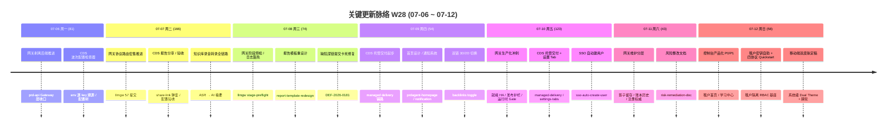

# 2026-W28 (2026-07-06 ~ 2026-07-12) · 周报

> **版本**：v1.0 | **日期**：2026-07-17 | **状态**：已落地

> **主干落地 599 次提交 | 981 个文件变更 | +111,376 行 / -11,085 行 | 61 个 PR 收口项（详见附录）**
> **统计基线**：`origin/main @ 0ea6c93`（采集时间 2026-07-12，技能纪律 #3.5）；本周内最后一个 commit 为 `d9d7564`（#1093，2026-07-12），采集 HEAD `0ea6c93`（#1095）提交日期为 07-13 属 W29，已按提交日期文本排除。冷启动为浅克隆，已 `--deepen=800` 拉全 W28 全部 merge/squash 父级后再统计。
> **贡献者（主干可达）**：InerNoro/inernoro (479)、Claude (120)
> **统计口径**：头部数字仅统计 `origin/main` 主干分支（weekly 技能纪律 #2：禁用 `--all`），按提交日期文本（`%cd --date=short`）过滤 `2026-07-06 ~ 2026-07-12`；PR 边界以本周实际落地主干的 merge commit（53 个）+ squash commit（8 个，#1086~#1093）为准，共 61 个全部在 `origin/main` 可达，不信 GitHub `mergedAt`；文件 / 行变更口径为 `git diff --shortstat BEFORE..WEEKEND`（跨 PR 累积，本周大头来自网关产品化新增 `llmgw/` 控制台 + serving 工程 + CDS 托管交付 + 移动端双皮肤重构资产，以及 145 个 `ops` 类构建/部署重触发提交）。

**本周趋势**：W28 是"网关从剥离走向产品化 + 移动端系统级双皮肤定稿"的一周。相比 W27（356 提交 / 44 PR）提交量涨到 599、PR 涨到 61，是近月最高强度的一周——节奏依旧"多线并进、密集收口"，但主线明显收敛为**两条大河**。

第一条也是最重的一条：**LLM 网关从"物理剥离"跃迁到"独立产品"**。W25~W27 把大模型调用剥成可独立部署的 `serving` 服务、把双出口拓扑在 CDS 面板补齐；W28 则围绕 `llmgw/` 做了近 30 个 PR 的产品化收口——协议路由拆分（doc/api-core/console-authority/release-gates 四刀，#1039~#1042）、生产深度就绪与 serving 主备 + 发布护栏 + 运行时 Gate 顺序（#1045/#1047/#1061/#1063/#1076），appCaller 入口协议覆盖门禁与策略模式（#1053/#1055/#1070），影子比对留存与账本历史（#1067/#1068/#1079），直到周末冲刺完成**控制台产品化 P0/P1**（#1090/#1091）、**租户隔离与 RBAC 基座 + 租户密钥自助接入 + 四协议 Quickstart**（#1086）、**版本化提示词策略治理**（#1087）、**模型池业务心智与维护分层重构**（#1092），并以"原子收拢网关产品根目录"（#1093）收尾。这条线把网关从"MAP 的一个内部模块"做成了"有租户、有 RBAC、有自助接入、有控制台、可被外部平台对接（#1084）的独立中台产品"。

第二条大河：**移动端系统级双皮肤（Dual Theme）落地 + 视觉归一收尾**。周末一口气把移动端体验补齐——移动端全局明暗偏好 + 底部栏双主题 + 首页去滚动条、移动首页定稿（浅色工作台 + 琥珀头带 + 暗色夜光形态）、知识库移动端重设计、视觉创作移动端可用性改造（线性生成流 + 触屏手势地基）、重做手机端快速创建抽屉（#1030/#1071/#1072/#1073），最终以**系统级双皮肤机制（硬编码棘轮 + 规则固化）**（#1094，见 `admin-dual-theme.md`）从根上把"白底浮暗卡"这类反复返工的问题用 CI 棘轮焊死。

其余支流：**CDS 托管交付体系**继续深挖——不可变部署版本存储 + 托管构建与能力绑定 + 结构化部署诊断 + 托管/compose 双车道 + 版本复用与回滚 + 流式部署解释（#1064 codex/cds-managed-delivery 及一系列 feat(cds)）、设置页 Tab 化（#1065）、文件夹组织 UI（#1062）、全局 Agent Key 统一授权作用域（勾选 scope + 默认 create-only）。**知识库**新增录音转录全链路（上传录音 → ASR → AI 摘要 → 转录笔记）、公开分享图谱视图、双链 3D/2D 切换（#1021）、恢复 Obsidian wikilink 菜单（#1005）。**缺陷 / 热修复 / 通知**：手机截图分享直达提交缺陷 + VLM 识别自动填充（#1075）、缺陷深链提交卡死修复（DEF-2026-0181，#1014）、视觉抖动 / CSS 预加载报错修复（#1032/#1033）、更新中心热修复子 tab（#1036）、通知系统更新（#1035）、SSO 自动建用户（#1037）。**报告 / 验收**：CDS 报告分享链弹窗（#1000）、报告树抽屉 UI（#1006）、报告模板重设计（#1009）、每日视觉自动化（#1010）。

类型分布 `ops(145)/fix(137)/feat(62)/docs(42)/test(23)/security(14)`，**ops 首次登顶（24%）**——本周大量 CDS webhook 重触发 + 部署对账 + 生产发布类提交；**fix 仍占 23%**，延续"大功能落地 + 密集收口"的周型。security 类 14 个提交对应网关租户隔离 / RBAC / 密钥治理的安全基座补强。

## 关键更新脉络

---

## 本周完成

### 一、LLM 网关产品化（主线，约 30 个 PR）

| 方向 | 落地 | PR |
|------|------|----|
| 协议路由拆分 | doc-split / api-core / console-authority / release-gates 四刀切开协议路由与配置权威 | #1039 #1040 #1041 #1042 |
| 生产就绪与主备 | 生产深度就绪 + serving 主备、发布护栏、运行时 Gate 顺序、发布可靠性 | #1045 #1047 #1061 #1063 #1076 |
| 入口协议治理 | appCaller 入口协议覆盖门禁 + 策略模式 + 注册权威 | #1053 #1055 #1070 |
| 影子比对留存 | 维护期影子留存 + 保留账本历史 + 基线审计 + Gate 交接 | #1067 #1068 #1079 #1080 |
| 控制台产品化 | 控制台产品化 P0/P1（租户首页 + 学习中心）+ 体验与费用可信度重构 | #1088 #1090 #1091 |
| 租户与自助接入 | 租户隔离与 RBAC 基座 + 租户密钥自助接入 + 四协议 Quickstart | #1086 |
| 策略与模型池 | 版本化提示词策略治理 + 模型池业务心智与维护分层重构 | #1087 #1092 |
| 外部对接与收尾 | 独立健康路由 + 外部平台对接交接 + 生命周期最终验收 + 原子收拢产品根目录 | #1081 #1084 #1078 #1093 |

### 二、移动端系统级双皮肤 + 视觉归一

| 方向 | 落地 | PR |
|------|------|----|
| 移动端首页定稿 | 全局明暗偏好 + 底部栏双主题 + 首页去滚动条；浅色工作台 + 琥珀头带 + 暗色夜光形态 | #1030 |
| 系统级双皮肤机制 | 硬编码棘轮（白透明/深色 hex 只减不增，CI fail）+ 规则固化 + 海鲜市场浅色修复 | #1094 |
| 知识库移动端重设计 | KB mobile redesign（含 3D/2D 图谱切换承接） | #1071 #1021 |
| 视觉创作移动端 | 线性生成流 + 触屏手势地基；重做手机端快速创建抽屉，底部 Tab 资产让位知识库 | #1072 #1073 |

### 三、CDS 托管交付体系

| 方向 | 落地 | PR |
|------|------|----|
| 托管交付 | 不可变部署版本存储 + 托管构建与能力绑定 + 结构化诊断 + 托管/compose 双车道 + 版本复用回滚 + 流式部署解释 | #1064 |
| 面板与设置 | 设置页 Tab 化 + 文件夹组织 UI + 全局 Agent Key 统一授权作用域（默认 create-only） | #1065 #1062 |
| 配置检查器（波次） | env 逐 key 溯源 + 分支生效配置全景 + 配置树补全 + repo compose 降为结构种子 + 漂移巡检 | #1003 #1008 |
| 稳定性与验收 | 报告分享链弹窗 + 报告树抽屉 + 验收报告搜索/分组/30天前视图 + 资源回收对账 | #1000 #1006 #1046 |

### 四、知识库 / 缺陷 / 通知 / 报告

| 方向 | 落地 | PR |
|------|------|----|
| 知识库 | 录音转录全链路（上传录音 → ASR → AI 摘要 → 转录笔记）+ 公开分享图谱视图 + 恢复 Obsidian wikilink 菜单 | #1005 #1021 |
| 缺陷 / 热修复 | 手机截图直达提交缺陷 + VLM 自动填充；深链提交卡死修复（DEF-0181）；视觉抖动 / CSS 预加载报错（DEF-0185/0186）；更新中心热修复子 tab | #1075 #1014 #1032 #1033 #1036 |
| 通知 / 登录 | 通知系统更新 + SSO 自动建用户 + MAP AI Access Key 生产化 | #1035 #1037 #1082 |
| 报告 / 验收 | 报告模板重设计 + 报告评论修复 + 每日视觉自动化 + 命令面板日常修复 | #1009 #1007 #1010 #1051 |

---

## 提交类型分布

| 类型 | 数量 | 占比 |
|------|------|------|
| ops | 145 | 24.2% |
| fix | 137 | 22.9% |
| feat | 62 | 10.4% |
| docs | 42 | 7.0% |
| test | 23 | 3.8% |
| security | 14 | 2.3% |
| refactor | 10 | 1.7% |
| merge | 9 | 1.5% |
| polish | 8 | 1.3% |
| style | 7 | 1.2% |
| ci | 5 | 0.8% |
| perf | 3 | 0.5% |
| chore | 3 | 0.5% |
| rule | 2 | 0.3% |
| 其他（PR/分支合并等无前缀） | 129 | 21.5% |

> ops 首次登顶：本周含大量 CDS webhook 重触发 + 生产不可变发布 + 部署对账类提交，属网关产品化 / CDS 托管交付上线期的正常运维密度。

---

## 每日提交分布

| 日期 | 提交数 | 重点方向 |
|------|--------|----------|
| 07-06 周一 | 81 | 网关剥离后端推进（prd-api Gateway）+ CDS 配置检查器波次 |
| 07-07 周二 | 166 | 网关协议路由密集推进（llmgw 57）+ CDS 报告分享/验收 + 知识库录音转录 |
| 07-08 周三 | 74 | 网关阶段预检/日志豁免 + 报告模板重设计 + 缺陷深链卡死修复 |
| 07-09 周四 | 54 | CDS 托管交付起步 + 首页设计/通知系统 + 双链 3D/2D 切换 |
| 07-10 周五 | 123 | 网关生产化冲刺（就绪 HA/发布护栏）+ CDS 托管交付/设置 Tab + SSO 自动建用户 |
| 07-11 周六 | 43 | 网关维护分层（影子留存/账本历史/注册权威）+ 风险整改文档 |
| 07-12 周日 | 58 | 控制台产品化 P0/P1 + 租户密钥自助/四协议 Quickstart + 移动端双皮肤定稿 |

---

## 上周（W27）方向落地情况

| W27 建议方向 | 本周落地 | 结论 |
|------|----------|------|
| 网关生产翻 http 的发布 Gate（剥离干净度记分卡） | 生产深度就绪 + serving 主备 + 发布护栏 + 运行时 Gate 顺序 + 就绪 HA + 基线审计 + Gate 交接（#1045/#1047/#1061/#1063/#1079/#1080）；最终生命周期验收（#1078） | 已落地，网关生产化护栏体系成型 |
| 网关双出口真机验收闭环 | 控制台产品化 P0/P1（租户首页 + 学习中心）+ 独立健康路由 + 外部平台对接（#1090/#1091/#1081/#1084） | 已落地，控制台从"能登录"升级为"可运营产品" |
| 首页/登录/CDS 视觉归一收尾 | 移动端系统级双皮肤（棘轮 + 规则固化）+ 移动首页定稿 + 知识库/视觉创作移动端重设计（#1030/#1071/#1072/#1073/#1094） | 已落地，从"视觉归一"深化到"系统级双皮肤根治" |
| SSO 登录边界回归 | SSO 自动建用户（#1037）+ MAP AI Access Key 生产化（#1082） | 已落地，SSO 冷启动/生产密钥路径打通 |

---

## 下周（W29）优先级建议

| 方向 | 建议动作 | 依据 |
|------|----------|------|
| 网关产品化真视觉验收闭环 | 对 llmgw 控制台 P0/P1（租户首页 / 学习中心 / RBAC / 密钥自助 / 四协议 Quickstart）走真人路径 + 双主题 + 最新 sha 取证，挂回 `plan.llm-gateway.full-cutover.md` 验收门 | `real-visual-acceptance.md`：控制台已产品化，需闭环取证证明"可运营" |
| 移动端双皮肤存量清扫 | 按 `admin-dual-theme.md` 棘轮台账（`debt.frontend.mobile-light-theme.md`）"用户走到哪修到哪"，优先移动端 Tab 直达页 > 高频 Agent 页，逐文件把硬编码降到基线以下 | 双皮肤机制已落地但存量债务仍在，棘轮只防新增不清存量 |
| CDS 托管交付端到端验收 | 对不可变版本存储 + 托管构建 + 版本复用回滚 + 流式部署解释走一次真实项目端到端（clone → 托管构建 → 部署 → 回滚），确认双车道（托管/compose）不打架 | 托管交付是本周新体系，需真实项目跑通而非单元测试绿即宣布完成（CLAUDE.md §8） |
| 网关租户隔离涟漪确认 | 租户隔离 + RBAC + 密钥自助接入后，全栈回归所有依赖 appCaller / 密钥的旧入口（MAP 内部调用 / 外部平台 / 影子比对），确认无被新租户边界锁死的路径 | `cross-project-isolation.md`：租户隔离是高影响边界，需全栈涟漪审计避免静默 401 |

---

## 附录：本周实际落地主干的 61 个 PR

> 归属口径：本地 `origin/main` 上 merge / squash commit 的提交日期（`%cd --date=short`），非 GitHub `mergedAt`。53 个走 merge commit，8 个（#1086~#1093）走 squash commit，全部在 `origin/main` 可达。

| PR | 落地日期 | 分类 | 标题 / 主题 |
|----|----------|------|------|
| #1000 | 2026-07-07 | 验收 | fix(cds): 报告分享链弹窗修复 |
| #1003 | 2026-07-07 | CDS | CDS 配置检查器波 4-5 |
| #1005 | 2026-07-07 | 知识库 | 恢复 Obsidian wikilink 菜单 |
| #1006 | 2026-07-07 | 验收 | 报告树抽屉 UI |
| #1007 | 2026-07-07 | 验收 | 修复报告评论 |
| #1008 | 2026-07-07 | CDS | CDS 配置验收 |
| #1009 | 2026-07-08 | 报告 | 报告模板重设计 |
| #1010 | 2026-07-08 | 验收 | 每日视觉自动化 |
| #1014 | 2026-07-08 | 缺陷 | 修复缺陷深链提交卡死（DEF-2026-0181） |
| #1015 | 2026-07-08 | 网关 | llmgw 阶段预检 + MAP 日志旁路 |
| #1021 | 2026-07-09 | 知识库 | 双链 3D/2D 切换 |
| #1030 | 2026-07-09 | 移动端 | PRD Agent 首页设计 |
| #1032 | 2026-07-09 | 缺陷 | 修复视觉抖动（DEF-2026-0185） |
| #1033 | 2026-07-09 | 缺陷 | 修复 CSS 预加载报错（DEF-2026-0186） |
| #1035 | 2026-07-09 | 通知 | 通知系统更新 |
| #1036 | 2026-07-09 | 热修复 | 更新中心热修复子 tab |
| #1037 | 2026-07-10 | 登录 | SSO 自动建用户 |
| #1038 | 2026-07-10 | CDS | CDS 项目 key 循环修复 |
| #1039 | 2026-07-10 | 网关 | llmgw 协议路由文档拆分 |
| #1040 | 2026-07-10 | 网关 | llmgw 协议路由 API 核心 |
| #1041 | 2026-07-10 | 网关 | llmgw 协议路由控制台权威 |
| #1042 | 2026-07-10 | 网关 | llmgw 协议路由发布 Gate |
| #1044 | 2026-07-10 | CDS | 修复 CDS 鉴权错误归因 |
| #1045 | 2026-07-10 | 网关 | llmgw 生产发布树就绪 |
| #1046 | 2026-07-10 | CDS | CDS 代码评审 |
| #1047 | 2026-07-10 | 网关 | llmgw 生产运行时 Gate 顺序 |
| #1051 | 2026-07-10 | 修复 | 命令面板日常修复 |
| #1053 | 2026-07-10 | 网关 | llmgw appCaller 协议覆盖 |
| #1055 | 2026-07-10 | 网关 | llmgw appCaller 策略模式 |
| #1057 | 2026-07-10 | 网关 | llmgw http 全量 MAP 日志豁免 |
| #1058 | 2026-07-10 | 网关 | llmgw exchange 额外字段 |
| #1059 | 2026-07-10 | 网关 | llmgw 低成本 smoke |
| #1061 | 2026-07-10 | 网关 | llmgw 生产加固 |
| #1062 | 2026-07-10 | CDS | CDS 文件夹组织 UI |
| #1063 | 2026-07-10 | 网关 | llmgw 发布就绪 HA |
| #1064 | 2026-07-11 | CDS | CDS 托管交付 |
| #1065 | 2026-07-10 | CDS | CDS 设置页 Tab 化 |
| #1066 | 2026-07-11 | 网关 | llmgw 风险整改文档 |
| #1067 | 2026-07-11 | 网关 | llmgw 维护期影子留存 |
| #1068 | 2026-07-11 | 网关 | llmgw 保留影子账本历史 |
| #1070 | 2026-07-11 | 网关 | llmgw 网关注册权威 |
| #1071 | 2026-07-12 | 移动端 | 知识库移动端重设计 |
| #1072 | 2026-07-12 | 移动端 | 视觉创作移动端可用性改造 |
| #1073 | 2026-07-12 | 移动端 | 重做手机端快速创建抽屉 |
| #1075 | 2026-07-12 | 缺陷 | 手机截图直达提交缺陷 + VLM 自动填充 |
| #1076 | 2026-07-12 | 网关 | llmgw 发布可靠性 |
| #1077 | 2026-07-12 | 网关 | llmgw 网关自有运行时配置 |
| #1078 | 2026-07-12 | 网关 | llmgw 生命周期最终验收 |
| #1079 | 2026-07-12 | 网关 | llmgw 维护基线审计 |
| #1080 | 2026-07-12 | 网关 | llmgw 维护 Gate 交接 |
| #1081 | 2026-07-12 | 网关 | llmgw 独立健康路由 |
| #1082 | 2026-07-12 | 登录 | MAP AI Access Key 生产化 |
| #1084 | 2026-07-12 | 网关 | llmgw 外部平台对接交接 |
| #1086 | 2026-07-12 | 网关 | llmgw 租户密钥自助接入与四协议 Quickstart |
| #1087 | 2026-07-12 | 网关 | llmgw 版本化提示词策略治理 |
| #1088 | 2026-07-12 | 网关 | llmgw 重构控制台体验与费用可信度 |
| #1089 | 2026-07-12 | 网关 | llmgw 收口外部平台最终验收 |
| #1090 | 2026-07-12 | 网关 | llmgw 完成控制台产品化 P0 |
| #1091 | 2026-07-12 | 网关 | llmgw 完成租户首页与学习中心 P1 |
| #1092 | 2026-07-12 | 网关 | llmgw 重构模型池业务心智与维护分层 |
| #1093 | 2026-07-12 | 网关 | llmgw 原子收拢网关产品根目录 |
