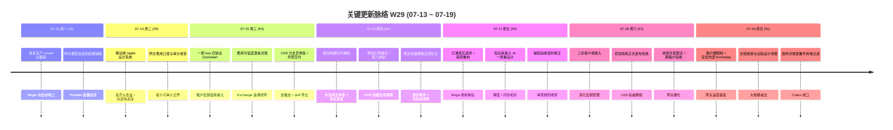

# 周报 2026-W29 (2026-07-13 ~ 2026-07-19)

> **总计 277 次提交 | 1200 个文件变更 | +71,506 行 / -66,460 行（净 +5,046）| 49 个 PR 合并（详见附录）**
>
> **统计基线**：`origin/main @ d2fada2`（采集时间 2026-07-19 20:03 UTC，技能纪律 #3.5）。本周内最新 commit 为 `2dea8dc`（2026-07-19）。无同周历史版本（纪律 #7 扫描：任何分支均无 `doc/report.2026-W29.md`）。
>
> **贡献者（主干可达）**：InerNoro/inernoro (196)、Claude (80)、Yu Ruipeng (1)
>
> **统计口径**：头部数字仅统计 `origin/main` 主干分支（weekly 技能纪律 #2：禁用 `--all`），按提交日期文本（`%cd --date=short`）过滤 `2026-07-13 ~ 2026-07-19`；PR 边界以本周实际落地主干的 merge commit（33 个）+ squash commit（16 个）为准，共 49 个全部在 `origin/main` 可达，不信 GitHub `mergedAt`；文件 / 行变更口径为 `git diff --shortstat BEFORE..WEEKEND`（跨 PR 累积）。**本周删除量首次逼近新增量**（-66,460 vs +71,506），源于文档收敛与旧版设计清理（#1185）、网关配置口径重构、旧皮肤资产替换，是一个"减法与收口"占主导的周。

**本周趋势**：W29 是"网关从产品化转入可运营 + 平台可靠性根治 + 大规模减法收口"的一周。相比 W28（599 提交 / 61 PR）提交量回落到 277、PR 回落到 49，节奏从"高强度扩张"切到"收紧、验收、清理"——净增行数从 W28 的 +10 万骤降到 +5 千，删除量几乎与新增持平，这是本季度第一个以**收敛**为主色调的周。

第一条主线依旧是**最重的一条：LLM 网关从"独立产品"走向"可自助、可运营、可被外部对接"**。W28 把网关做成了有租户、有 RBAC、有控制台的独立中台；W29 围绕 `llmgw/` 做了近 18 个 PR 的运营化收口——**打通 Provider 与模型自助配置**（#1131）、**一把 key 四协议 Quickstart**（#1132）、**补齐费用可信度与逐条对账追溯**（#1147）、**Exchange 租户自助接入闭环**（#1148）、**打通真实请求并重构调用观测体验**（#1178）、**三步客户端接入与简化密钥管理**（#1179）、**收紧并发限流并补跨租户验收**（#1183），直到周末**增加租户硬限制与安全外部 Exchange**（#1191）。同时把一整套**权威教程**做实——逐步教学 + 实测标注图 + 冷启动深链 + 关联配置就地预览（#1149/#1153/#1157/#1158/#1168），并沉淀**多上游模型池设计与验收状态**（#1184）。这条线把网关从"能跑"推到了"外部租户能自己接进来、能看清费用、能被硬限制保护"。

第二条主线：**CDS 平台可靠性根治**。周中一个生产事故被彻底修掉——**根治全局构建队列堵死 + 常态化回归拦截 + 热重启等待页真实进度**（#1160，对应 `concurrency-gate-discipline.md` 沉淀的五件套纪律：可取消 / 有身份 / 只锁真实资源 / 周期收敛 / 健康不变量）。配套**预览实例模式与孤儿容器收割器**（#1140）、**加固网关独立服务启动顺序并固化交付证据**（#1169）、**修复自更新工作树分支冲突**（#1170），以及**建立项目隔离的正式发布系统与权威教程**（#1180）、**托管交付接入与技能导出流**（#1136）。CDS 从"能部署"补齐到"堵不死、起得稳、发得出正式版"。

第三条主线：**知识库交互与同步治理**。本周把知识库的一屏体验和跨节点稳定性一起打磨——**「接入 AI」弹窗一屏重设计**（#1166）、**同步重设计（合并同步 / 发送到 + 一屏拓扑图 + 取消能力 + 批量两视图）**（#1144）、**修复跨节点同步丢文档 + 同步弹窗换行错乱**（#1181）、**分享页导航与返回优化**（#1162）、**限制私有分享返回深链**（#1164）、**书籍顺序与章节跳转修复**（#1159）、**交互打磨 + 系统级界面材质**（#1175）。

其余支流：**缺陷验收**修正误判规则与审查问题（#1161/#1163）；**移动端 Apple 设计系统**首页仪表盘 + 双皮肤底座 + 智能体卡片视觉归一（#1133/#1137/#1141），CDS 分支页加载骨架与详情重排（#1130）；**视频工作室**工作流与部署阶段打磨 + 封面标题修复（#1150/#1171）；**产品打磨**覆盖 MD 转 PPT 控制台（#1165）、网页托管预览自愈（#1155）、周报表格章节类型（#1182）、转录音频格式统一（#1152）、AI 大事资讯源重定向修复（#1172）、验收报告时间与失败标注修正（#1135）；**文档 / 熵减治理**推进技术债命名规则 v3.2（#1151）、文档收敛与旧版设计清理（#1185）、每日熵减计划归档（#1167/#1186）。

类型分布 `fix(109)/中文·无前缀(97)/feat(25)/docs(13)/merge(12)/polish(10)/test(5)/chore(4)/style(2)`——**fix 首次单类破 100（39%）**，叠加中文收口类提交（35%），本周超七成提交是"修 + 收"，与"高强度落地后进入收敛周"的判断吻合；feat 回落到 9%，是近月最低，印证本周主色调是减法而非扩张。

---

## 关键更新脉络

> 每个 section 为活跃日（提交数 ≥ 3），事件按重要度降序，优先从本周 PR 标题提炼。

---

## 一、本周完成

### 1. LLM 网关运营化 — 从"独立产品"到"外部租户可自助接入、可运营" —— 本周最重主线（约 18 个 PR）

> **价值**：W28 把网关做成了有租户、有 RBAC 的独立中台；W29 补齐"外部租户能自己接进来、能看清花了多少钱、能被硬限制保护"这最后一段，网关具备真正对外运营的条件。

- **自助接入与密钥**
  - 打通 Provider 与模型自助配置（#1131）：租户可在控制台自助配置上游 Provider 与模型，不再依赖后台手工建池
  - 一把 key 四协议 Quickstart（#1132）：一把非通配、仅 `invoke` 的租户密钥精确覆盖 GW Native / OpenAI / Claude / Gemini 四协议，签发后身份锁定，切协议直接 dry-run 测试不触发上游
  - 三步客户端接入与简化密钥管理（#1179）：把接入路径压到三步，降低外部对接门槛
  - 补齐 Exchange 租户自助接入闭环（#1148）+ 增加租户硬限制与安全外部 Exchange（#1191）：Exchange 租户自助接入形成闭环，并加上硬限制保护运营安全
- **费用与观测可信**
  - 补齐费用可信度与逐条对账追溯（#1147）：费用从"unknown/0 混淆"变为逐条可追溯对账
  - 收紧提示词审计并澄清费用口径（#1134）：审计只保留策略 id/version/hash，费用口径改为用户能直接理解的中文说明
  - 打通真实请求并重构调用观测体验（#1178）：从 dry-run 走到真实请求打通，并重构调用观测台
- **稳定性与安全**
  - 收紧并发限流并补跨租户验收（#1183）：并发闸收紧，补跨租户隔离验收
  - 修复只读发布门鉴权（#1173）：发布 Gate 鉴权收口
- **权威教程与设计沉淀**
  - 权威教程逐步教学 + 实测标注图 + 冷启动深链 + 关联配置就地预览（#1149/#1153/#1157/#1158/#1168）
  - 补全登录首页与独立域名部署说明（#1177）
  - 沉淀多上游模型池设计与验收状态（#1184）

### 2. CDS 平台可靠性根治 — 堵不死、起得稳、发得出正式版（6 个 PR）

> **价值**：CDS 是所有分支预览与部署的地基。本周把一个"构建队列堵死导致 agent 部署排队 50 分钟以上"的生产事故从根上修掉，并补齐正式发布能力，让平台从"能部署"变"可信赖"。

- 根治全局构建队列堵死 + 常态化回归拦截 + 热重启等待页真实进度（#1160）：落地 `concurrency-gate-discipline.md` 五件套（等待可取消 / 持有者身份 / 只锁真实资源 / 周期收敛 / 健康不变量 + 三层回归），并把热重启等待页改为该操作自己历史耗时驱动的真实进度
- 预览实例模式与孤儿容器收割器（#1140）：补齐容器生命周期治理，回收无主容器
- 加固网关独立服务启动顺序并固化交付证据（#1169）：多容器部署下网关服务启动顺序加固，固化交付证据链
- 修复自更新工作树分支冲突（#1170）：self-update 工作树冲突修复
- 建立项目隔离的正式发布系统与权威教程（#1180）：从分支预览走到项目隔离的正式发布路径
- 托管交付接入与技能导出流（#1136）：托管交付 onboarding + skill 导出

### 3. 知识库交互与同步治理 — 一屏体验 + 跨节点稳定（7 个 PR）

> **价值**：知识库是内容沉淀与对外分享的核心载体。本周把"接入 AI"一屏化、把跨节点同步的丢文档/错乱问题修掉，让高频操作更顺、数据更稳。

- 知识库「接入 AI」弹窗一屏重设计（#1166）：三 Tab 接入弹窗收敛为一屏
- 同步重设计（合并同步 / 发送到 + 一屏拓扑图 + 取消能力 + 批量两视图）（#1144）
- 修复跨节点同步丢文档 + 同步弹窗换行错乱（#1181）
- 优化分享页导航与返回（#1162）+ 限制私有分享返回深链（#1164）
- 修复书籍顺序与章节跳转（#1159）
- 交互打磨 + 系统级界面材质（素色 / 液态玻璃）（#1175）

### 4. 移动端 Apple 设计系统与视觉归一 — 首页仪表盘 + 双皮肤底座（4 个 PR）

> **价值**：把移动端从"各写各的自研皮肤"迁到 Apple 设计系统，首页从商店范式定稿为"摘要"仪表盘，硬编码色由棘轮守卫只减不增，从根上减少"白底浮暗卡"类返工。

- 移动端 Apple 设计系统迁移——摘要仪表盘首页 + 双皮肤底座 + 七日序列 / 缺陷进度（#1133）
- 统一智能体卡片视觉与首页密度（#1137）+ 优化卡片层级并修复悬浮漏光（#1141）
- CDS 分支列表加载骨架改卡片网格 + 分支详情右侧重排去重（#1130）

### 5. 缺陷验收 — 修正误判规则（2 个 PR）

> **价值**：验收误判会让"没修好"被判通过或反之，直接影响缺陷闭环可信度。

- 修正缺陷验收误判规则（#1161）+ 修复缺陷验收审查问题（#1163）

### 6. 产品打磨与自动化日修 — 视频 / PPT / 网页托管 / 周报 / 资讯（8 个 PR）

> **价值**：多条产品线的体验缺口与自动化日修，保证既有功能不退化。

- 视频工作室工作流与部署阶段打磨（#1150）+ 修复作品封面与旧标题展示（#1171）
- 优化 MD 转 PPT 控制台生成体验（#1165）
- 网页托管预览自愈 + 快速分享链接可见性修复（#1155）
- 新增周报表格章节类型，支持行列编辑与快照保存（#1182）
- 统一转录音频格式（#1152）
- 修复 AI 大事资讯源重定向（#1172）
- 修正验收报告时间与失败标注（#1135）

### 7. 文档与熵减治理 — 减法收口（4 个 PR）

> **价值**：控制文档熵增、清理旧版设计，让知识库归属清晰、命名一致。本周删除量逼近新增量的主要来源之一。

- 更新技术债务文件命名规则至 v3.2（#1151）
- 合并文档收敛与旧版设计清理（#1185）
- 每日熵减计划 2026-W29：补 cds-release 技能表 + peer-sync trigger 设计说明 + 归档（#1167/#1186）

---

## 二、本周数据

### 每日提交分布

| 日期 | 提交数 | 重点方向 |
|------|--------|----------|
| 07-13 (周一) | 11 | 网关生产 runner 证据链恢复、模型池自助配置铺路 |
| 07-14 (周二) | 29 | 移动端 Apple 设计系统、网关费用/审计口径收紧 |
| 07-15 (周三) | 54 | 四协议 Quickstart、费用逐条对账、CDS 骨架/托管交付 |
| 07-16 (周四) | 61 | 根治构建队列堵死、预览实例/孤儿收割、网关权威教程 |
| 07-17 (周五) | 50 | 打通真实请求+观测重构、知识库接入 AI 一屏、缺陷验收 |
| 07-18 (周六) | 21 | 三步接入、项目隔离正式发布、并发限流+跨租户验收 |
| 07-19 (周日) | 51 | 租户硬限制+安全 Exchange、文档收敛清理、画布对账收口 |

### 提交类型分布

| 类型 | 数量 | 占比 |
|------|------|------|
| fix (Bug 修复 / 收口) | 109 | 39.4% |
| 中文 commit / 无前缀（多为收口、熵减、Codex 迭代） | 97 | 35.0% |
| feat (新功能) | 25 | 9.0% |
| docs (文档) | 13 | 4.7% |
| merge (合并) | 12 | 4.3% |
| polish (润色) | 10 | 3.6% |
| test (测试) | 5 | 1.8% |
| chore (杂项) | 4 | 1.4% |
| style (样式) | 2 | 0.7% |

> **口径**：fix 首次单类破 100，叠加中文收口类共占 74.4%，本周超七成提交是"修 + 收"；feat 回落至 9%（近月最低），主色调是减法与收敛而非扩张。

---

## 三、与上周 (W28) 对比

| 指标 | W28 | W29 | 变化 |
|------|---------|---------|------|
| 提交数 | 599 | 277 | -53.8% |
| 合并 PR 数 | 61 | 49 | -12 |
| 文件变更 | 981 | 1200 | +22.3% |
| 净增行数 | +100,291 | +5,046 | -95.0% |

> **解读**：提交与 PR 回落、文件变更却上升、净增行数骤降——三者合起来指向同一个结论：**W29 是"广而浅的收敛周"**。改动铺得更广（1200 文件），但以修改 / 删除 / 重构为主（+71,506 / -66,460 近乎持平），而非 W28 那种"大工程整体新增"。这是高强度扩张后正常且健康的收口节奏。

### 上周方向落地情况

| W28 建议方向 | W29 实际进展 |
|------------------|------------------|
| 网关产品化真视觉验收闭环 | ✅ 大部分落地：打通真实请求 + 重构调用观测（#1178）、三步接入（#1179）、权威教程逐步教学 + 实测标注图 + 冷启动深链（#1149/#1153/#1157/#1158/#1168）、登录首页 + 独立域名部署说明（#1177）。全量双主题真视觉验收归档仍需持续挂回验收门 |
| 移动端双皮肤存量清扫 | ⚠️ 部分推进：移动端 Apple 设计系统迁移（首页 + 双皮肤底座 + 硬编码棘轮清零，#1133）、智能体卡片视觉归一（#1137/#1141）。棘轮已守新增，存量按"走到哪修到哪"持续清 |
| CDS 托管交付端到端验收 | ✅ 落地并超预期：托管交付接入 + skill 导出（#1136）、预览实例模式 + 孤儿收割（#1140）、项目隔离正式发布系统（#1180）；额外根治了计划外的构建队列堵死生产事故（#1160） |
| 网关租户隔离涟漪确认 | ✅ 落地：Exchange 租户自助接入闭环（#1148）、收紧并发限流 + 补跨租户验收（#1183）、租户硬限制 + 安全外部 Exchange（#1191） |

---

## 四、下周 (W30) 优先级建议

| 优先级 | 方向 | 建议动作 | 依据 |
|--------|------|----------|------|
| P0 | 网关运营化真视觉验收闭环 | 对租户自助接入（Provider/模型自助配置、四协议 Quickstart、三步接入）+ 费用对账 + 调用观测台走真人路径 + 双主题 + 最新 sha 取证，挂回 `plan.llm-gateway.full-cutover.md` 与运营化验收门 | `real-visual-acceptance.md` / `extraction-readiness-gate.md`：网关已"可运营"，需闭环证明外部租户真能自助接入且费用可信 |
| P0 | 构建队列根治的常态回归看护 | 对 #1160 的并发闸五件套（可取消 / 有身份 / 只锁真实资源 / 周期收敛 / 健康不变量）补足事故值必红的 CI 断言 + 看门狗 + 探针定时探测，确认三层拦截长期有效，防止堵死复发 | `concurrency-gate-discipline.md`：队列堵死是已发生的生产事故，根治后必须有常态回归防退化 |
| P1 | CDS 项目隔离正式发布端到端 | 对 #1180 的项目隔离正式发布系统走一次真实项目端到端（clone → 托管构建 → 正式发布 → 回滚），确认项目级 Key、身份锁定、最终入口验证、回滚证据齐全 | `production-release-safety.md` / CLAUDE.md §8：正式发布是新体系，需真实项目跑通而非单测绿即宣布完成 |
| P1 | 知识库跨节点同步涟漪确认 | #1181 修复丢文档 + 换行错乱后，全栈回归所有同步入口（合并同步 / 发送到 / 批量），确认多节点场景下无静默丢失，并补集成测试守卫 | `cross-project-isolation.md`：跨节点同步是共享数据高风险面，需涟漪审计 + 回归兜底 |
| P2 | 移动端双皮肤存量持续清扫 | 按 `admin-dual-theme.md` 棘轮台账（`debt.frontend.mobile-light-theme.md`）优先移动端 Tab 直达页 > 高频 Agent 页，逐文件把硬编码降到基线以下 | 棘轮只防新增不清存量，存量债务需按用户动线持续偿还 |

---

## 附录：本周实际落地主干的 49 个 PR

> 归属口径：本地 `origin/main` 上 merge / squash commit 的提交日期（`%cd --date=short`），非 GitHub `mergedAt`。33 个走 merge commit，16 个走 squash commit，全部在 `origin/main` 可达。

| PR | 落地日期 | 分类 | 标题 / 主题 |
|----|----------|------|------|
| #1130 | 2026-07-15 | 移动端/CDS | 分支列表加载骨架改卡片网格 + 分支详情右侧重排去重 |
| #1131 | 2026-07-15 | 网关 | 打通 Provider 与模型自助配置 |
| #1132 | 2026-07-15 | 网关 | 打通一把 key 四协议 Quickstart |
| #1133 | 2026-07-15 | 移动端 | 移动端 Apple 设计系统迁移——摘要仪表盘首页 + 双皮肤底座 + 七日序列/缺陷进度 |
| #1134 | 2026-07-15 | 网关 | 收紧提示词审计并澄清费用口径 |
| #1135 | 2026-07-16 | 验收 | 修正验收报告时间与失败标注 |
| #1136 | 2026-07-15 | CDS | 托管交付接入 onboarding 与技能导出流 |
| #1137 | 2026-07-15 | 移动端 | 统一智能体卡片视觉与首页密度 |
| #1140 | 2026-07-16 | CDS | 预览实例模式与孤儿容器收割器 |
| #1141 | 2026-07-16 | 移动端 | 优化智能体卡片层级并修复悬浮漏光 |
| #1144 | 2026-07-16 | 知识库 | 知识库同步重设计（合并同步/发送到 + 一屏拓扑图 + 取消能力 + 批量两视图） |
| #1147 | 2026-07-15 | 网关 | 补齐费用可信度与逐条对账追溯 |
| #1148 | 2026-07-16 | 网关 | 补齐 Exchange 租户自助接入闭环 |
| #1149 | 2026-07-16 | 网关 | 新增模型网关权威教程与幂等发布 |
| #1150 | 2026-07-16 | 视频 | 视频工作室工作流与部署阶段打磨 |
| #1151 | 2026-07-16 | 文档 | 更新技术债务文件命名规则至 v3.2 |
| #1152 | 2026-07-16 | 知识库 | 统一转录音频格式 |
| #1153 | 2026-07-16 | 网关 | 补全权威教程实测标注图 |
| #1154 | 2026-07-16 | 教程 | 修复公开教程章节双链跳转 |
| #1155 | 2026-07-17 | 网页托管 | 网页托管预览自愈 + 快速分享链接可见性修复 |
| #1157 | 2026-07-16 | 网关 | 修复公开教程深链冷启动覆盖 |
| #1158 | 2026-07-16 | 网关 | 完善权威教程逐步教学与验收资产 |
| #1159 | 2026-07-17 | 知识库 | 修复知识库书籍顺序与章节跳转 |
| #1160 | 2026-07-17 | CDS | 根治全局构建队列堵死 + 常态化回归拦截 + 热重启等待页真实进度 |
| #1161 | 2026-07-17 | 缺陷 | 修正缺陷验收误判规则 |
| #1162 | 2026-07-17 | 知识库 | 优化知识库分享页导航与返回 |
| #1163 | 2026-07-17 | 缺陷 | 修复缺陷验收审查问题 |
| #1164 | 2026-07-17 | 知识库 | 限制私有分享返回深链 |
| #1165 | 2026-07-17 | PPT | 优化 MD 转 PPT 控制台生成体验 |
| #1166 | 2026-07-17 | 知识库 | 知识库「接入 AI」弹窗一屏重设计 |
| #1167 | 2026-07-19 | 文档 | 每日熵减计划 W29 — 补 peer-sync trigger 模式设计说明 |
| #1168 | 2026-07-17 | 网关 | 增加关联配置就地预览并收口权威教程 |
| #1169 | 2026-07-17 | CDS | 加固网关独立服务启动顺序并固化交付证据 |
| #1170 | 2026-07-17 | CDS | 修复自更新工作树分支冲突 |
| #1171 | 2026-07-18 | 视频 | 修复视频作品封面与旧标题展示 |
| #1172 | 2026-07-18 | 资讯 | 修复 AI 大事资讯源重定向 |
| #1173 | 2026-07-17 | 网关 | 修复只读发布门鉴权 |
| #1175 | 2026-07-17 | 知识库 | 知识库交互打磨 + 系统级界面材质（素色/液态玻璃） |
| #1177 | 2026-07-17 | 网关 | 补全登录首页与独立域名部署说明 |
| #1178 | 2026-07-17 | 网关 | 打通真实请求并重构调用观测体验 |
| #1179 | 2026-07-18 | 网关 | 三步客户端接入与简化密钥管理 |
| #1180 | 2026-07-18 | CDS | 建立项目隔离的正式发布系统与权威教程 |
| #1181 | 2026-07-18 | 知识库 | 修复知识库跨节点同步丢文档 + 同步弹窗换行错乱 |
| #1182 | 2026-07-18 | 周报 | 新增周报表格章节类型，支持行列编辑与快照保存 |
| #1183 | 2026-07-18 | 网关 | 收紧并发限流并补跨租户验收 |
| #1184 | 2026-07-18 | 网关 | 沉淀多上游模型池设计与验收状态 |
| #1185 | 2026-07-19 | 文档 | 合并文档收敛与旧版设计清理 |
| #1186 | 2026-07-19 | 文档 | 每日熵减计划 W29 — 补 cds-release 技能表 + 归档 5 条 |
| #1191 | 2026-07-19 | 网关 | 增加租户硬限制与安全外部 Exchange |
