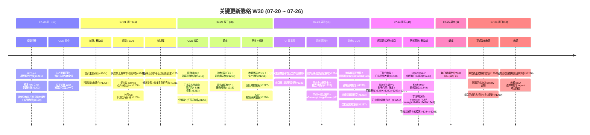

# 周报 2026-W30 (2026-07-20 ~ 2026-07-26)

> **总计 196 次提交 | 911 个文件变更 | +35,825 行 / -14,333 行（净 +21,492）| 47 个 PR 合并（详见附录）**
>
> **统计基线**：`origin/main @ 6aec8ef`（采集时间 2026-07-26 20:05 UTC，技能纪律 #3.5）。本周内最新 commit 为 `82a225c`（#1250，2026-07-26）。基线 HEAD `6aec8ef`（#1225）提交日期为 `2026-07-27`，属 W31，已排除出本周统计。无同周历史版本（纪律 #7 扫描：任何分支均无 `doc/report.2026-W30.md`）。
>
> **贡献者（主干可达）**：inernoro/InerNoro (172)、Claude (24)
>
> **统计口径**：头部数字仅统计 `origin/main` 主干分支（weekly 技能纪律 #2：禁用 `--all`），按提交日期文本（`%cd --date=short`）过滤 `2026-07-20 ~ 2026-07-26`；PR 边界以本周实际落地主干的 merge commit + squash commit 为准，共 47 个全部在 `origin/main` 可达，不信 GitHub `mergedAt`；文件 / 行变更口径为 `git diff --shortstat BEFORE..WEEKEND`（跨 PR 累积）。**本周净增行数回弹到 +21,492**（W29 为 +5,046），删除量从 W29 的 -6.6 万骤降到 -1.4 万——上周"减法收敛周"结束，本周切回"网关正式发布收口 + 观测台重构"的稳态落地。

**本周趋势**：W30 是"LLM 网关从可运营走完最后一公里、迈向正式发布"的一周。相比 W29（277 提交 / 49 PR）提交量回落到 196、PR 47，节奏保持在收口档位，但重心高度集中——近一半 PR 落在 `llmgw/` 一条线上。三条主线依次是：网关正式发布收口与日志观测台重构、CDS 正式发布系统加固与可靠性修复、验收系统与双主题 UI 收口。

第一条也是最重的主线：**LLM 网关正式发布收口 + 请求日志观测台重构**。W29 把网关做成"外部租户可自助接入、费用可信、有硬限制保护"，W30 则围绕"能不能正式对外发布、日志能不能看清"两件事收口。发布侧：**收紧外部 WSS 地址并完成生产闭环**（#1218）、**维护发布链路的影子门禁范围 / 账本校验 / 阶段报告校验三连修复**（#1252/#1253/#1254）、**修复维护发布重复 Provider 审计并同步断言**（#1239/#1241）、**统一正式烟测调用方配置**（#1255）、**增加非付费正式发布冒烟**（#1256）、**隔离正式协议 canary 密钥**、**修复正式字体资源子路径**（#1242）、**排除 multipart 边界日志的 Provider 误判**（#1249）、**补齐 ASR canary multipart 清单**（#1248），周末以**收口正式日志视觉与实体跳转**（#1260）收尾。观测侧：**重构请求记录信息密度与右侧详情**（#1224）、**补齐日志实体悬浮卡与独立详情页**（#1229）、**完成日志与三分钟接入闭环并抽出 RawGatewayUsageParser**（#1234）、**补全 OpenRouter 级图片日志观测**（#1245）、**收紧日志密度并统一实体图标 + 三能力验收**（#1238）、**修复 Exchange 日志详情跳转**（#1240）、并把**手机端请求详情视口留白 / 日志设置触控区**一并打磨（#1244/#1251）。这条线把网关从"能自助接入"推到了"能正式发布、能逐条看清每一次调用"。

第二条主线：**CDS 平台——正式发布系统加固 + 可靠性根治**。**重构正式发布页并识别通用 deploy phase、补轮询 in-flight 守卫、看门狗 git diff 幂等前置、增量快照消除 O(state) 持久化成本、forwarder 剥 hop-by-hop 头修 SSE 断流**（#1213，一个跨可靠性/性能/正确性的重体量收口）；**统一无协议 GitHub 仓库身份 + 兼容 Git 代理仓库身份**（#1208/#1209）；安全侧**隔离项目级 Key 的项目列表**（#1212）、**仅暴露公开预览域名**（#1221），周初**增加生产更新防护与渐进式操作者身份 + 原子切换 Web 资源并保留上一代**，周末**收紧 SSO 边界并修复 Agent 项目路由**；可靠性上**修复部署超时（ensureOpen 返回本轮 check-run id，不再重读可变 state 指针）**（#1235）、**修复热重载滚动跳变**（#1223）。CDS 从"发得出正式版"补齐到"发得稳、身份不串、边界不漏"。

第三条主线：**验收系统治理 + 双主题 / 首页 UI 收口**。验收侧：**移动端验收硬门**（#1205）、**统一报告缺口统计并显示报告时间**（#1216）、**优化手机端报告导航交互**（#1231）、**补充九类验收报告说明**（#1232）、**修复 LLMGW 守卫漏检与契约漂移**（#1230）、**增强验收报告归档与知识库同步**（#1215）、**同步官方验收技能规则目录**（#1250）。UI 侧：**完成双主题覆盖与首页工作台重构**（#1219，80 文件、tokens.css +186 行）、**收口双主题风险治理**（#1233）、**收拢周报浅色表面层级**（#1204）。

其余支流：**模型迁移**——**迁移至 GPT-5.6 模型系列**（#1201）、**修复 GPT-5.6 默认 raw Chat 参数转换**（#1202）、**视觉创作展开网关图片模型并补充实战教程**（#1199）、**扩展网关多上游故障切换状态**（#1207）；**知识库 / 录音**——**增强录音保护与会议纪要整理**（#1206）、**修复录音上传重复条目竞态**（#1211）；**产品修复**——**评审限流与断流恢复**（#1228，review-agent）、**修复副负责人无法搜索团队成员**（#1217，def-2026-0188）、**修复 Key 撤销确认阻断**（#1220）、**围栏过期的修复器写入**（#1237）；**文档 / 熵减**——每日熵减计划 W30 D6 连续核对归档。

类型分布 `fix(74)/merge(68)/polish(17)/feat(15)/security(5)/test(2)/rule(2)/refactor(2)/perf(2)/docs(2)/style(1)`——**fix 再次单类领跑（38%）**，叠加 polish（9%），修 + 收口类占比近半，与"网关走完最后一公里"的收口基调吻合；security 提到 5 条，全部落在 CDS/网关的发布边界与身份隔离上，是本周的安全强化信号。

---

## 关键更新脉络

---

## 一、本周完成

### 网关正式发布收口

| PR | 主题 | 价值 |
|----|------|------|
| #1218 | 收紧外部 WSS 地址并修复教程主题 | 完成网关生产发布闭环，堵住外部 WSS 地址暴露面 |
| #1252/#1253/#1254 | 维护发布影子门禁范围 / 账本校验 / 阶段报告校验 | 维护发布链路三处校验修复，确保灰度影子比对与账本口径正确 |
| #1239/#1241 | 修复维护发布重复 Provider 审计 + 同步断言 | 消除 Provider 重复审计，测试断言随修复对齐 |
| #1255/#1256 | 统一正式烟测调用方配置 + 非付费正式发布冒烟 | 正式发布前的冒烟覆盖到位，非付费路径也纳入冒烟 |
| #1242/#1248/#1249 | 正式字体资源子路径 / ASR canary multipart 清单 / multipart 边界 Provider 误判 | 正式部署下的静态资源、multipart 日志与 canary 清单逐一收口 |
| #1260 | 收口正式日志视觉与实体跳转 | 正式日志台视觉与实体跳转最后收尾 |
| （非 PR） | 隔离正式协议 canary 密钥 | canary 密钥从共享面隔离，防止跨环境串用 |

### 网关请求日志观测台重构

| PR | 主题 | 价值 |
|----|------|------|
| #1224 | 重构请求记录信息密度与右侧详情 | 日志表信息密度与右侧详情抽屉重排，一屏看清更多调用 |
| #1229 | 补齐日志实体悬浮卡与独立详情页 | 日志实体可悬浮预览、可跳独立详情页 |
| #1234 | 完成日志与三分钟接入闭环 | 抽出 RawGatewayUsageParser 统一用量解析，接入三分钟闭环打通 |
| #1245 | 补全 OpenRouter 级图片日志观测 | 图片调用的 OpenRouter 级观测数据补齐 |
| #1238 | 收紧日志密度并统一实体图标 + 三能力验收 | 日志密度与实体图标统一，三能力（chat/图片/ASR）验收挂门 |
| #1240 | 修复 Exchange 日志详情跳转 | Exchange 日志详情跳转链路修复 |
| #1244/#1251 | 手机端请求详情视口留白 / 日志设置触控区 | 网关观测台移动端可用性打磨 |
| #1237 | 围栏过期的修复器写入 | 修复器在围栏过期后的写入行为收敛 |

### CDS 平台加固

| PR | 主题 | 价值 |
|----|------|------|
| #1213 | 正式发布页重构 + 通用 deploy phase 识别 + 看门狗幂等 + 增量快照 + SSE 断流修复 | 一个跨可靠性/性能/正确性的重体量收口，消除排队攀升与全量持久化成本 |
| #1208/#1209 | 统一无协议 GitHub 仓库身份 + 兼容 Git 代理仓库身份 | 仓库身份归一，代理仓库场景不再身份错乱 |
| #1212 | 隔离项目级 Key 的项目列表 | 项目级 Key 只能看到自己的项目，堵住跨项目列表泄露 |
| #1221 | 仅暴露公开预览域名 | 预览域名对外只暴露公开入口，隐藏内部/备用域名 |
| #1235 | 修复部署超时（ensureOpen 返回本轮 check-run id） | 不再重读可变 state 指针，消除部署超时误判 |
| #1223 | 修复热重载滚动跳变（宝石六芒动效统一） | 热重载时滚动位置不再跳变 |
| （非 PR） | 生产更新防护 + 渐进式操作者身份 / 原子切换 Web 资源 / 收紧 SSO 边界 + 修复 Agent 项目路由 | 生产发布安全与 Agent 路由边界周初周末两头收紧 |

### 验收系统与 UI 收口

| PR | 主题 | 价值 |
|----|------|------|
| #1219 | 完成双主题覆盖与首页工作台重构 | 80 文件、tokens.css +186 行，首页工作台与双主题覆盖成体系 |
| #1233 | 收口双主题风险治理 | 双主题硬编码风险按棘轮收口 |
| #1204 | 收拢周报浅色表面层级 | 周报浅色主题表面层级收敛 |
| #1205 | 移动端验收硬门 | 移动端验收强制门，未过不放行 |
| #1216/#1231/#1232 | 报告缺口统计 + 报告时间 / 手机端报告导航 / 九类验收报告说明 | 验收报告口径、移动端交互与文档说明补齐 |
| #1230 | 修复 LLMGW 守卫漏检与契约漂移 | CI 守卫补漏，防止网关契约静默漂移 |
| #1215/#1250 | 验收报告归档 + 知识库同步 / 官方验收技能规则目录同步 | 验收归档与技能规则目录对齐 |

### 模型迁移与支流

| PR | 主题 | 价值 |
|----|------|------|
| #1201/#1202 | 迁移至 GPT-5.6 模型系列 + 修复默认 raw Chat 参数转换 | 全站模型基线迁到 GPT-5.6，raw Chat 参数转换修正 |
| #1199 | 视觉创作展开网关图片模型 + 补充实战教程 | 视觉创作接入网关图片模型，配套实战教程 |
| #1207 | 扩展多上游故障切换状态 | 网关多上游故障切换状态更完整 |
| #1206/#1211 | 增强录音保护与会议纪要整理 / 修复录音上传重复条目竞态 | 知识库录音保护与去重竞态修复 |
| #1228 | 修复评审限流与断流恢复 | review-agent 限流与 SSE 断流恢复 |
| #1217/#1220 | 修复副负责人无法搜索团队成员 / Key 撤销确认阻断 | 缺陷 def-2026-0188 与 Key 撤销确认两处交互修复 |

---

## 二、数据概览

### 提交类型分布

| 类型 | 数量 | 占比 |
|------|------|------|
| fix | 74 | 38% |
| merge | 68 | 35% |
| polish | 17 | 9% |
| feat | 15 | 8% |
| security | 5 | 3% |
| test / rule / refactor / perf / docs | 各 2 | 各 1% |
| style | 1 | <1% |

> merge 含 PR 合并与分支同步；口径以标准前缀首词归类。fix 单类领跑印证本周收口基调。

### 每日提交分布

| 日期 | 提交数 | 重点方向 |
|------|--------|----------|
| 2026-07-20 周一 | 17 | GPT-5.6 模型迁移 + CDS 生产更新防护 |
| 2026-07-21 周二 | 41 | 首页主题刷新 + 移动端验收硬门 + CDS 仓库身份归一 + 录音保护 |
| 2026-07-22 周三 | 30 | CDS 正式发布页重构 + 项目 Key 隔离 + 网关生产闭环 + 验收归档 |
| 2026-07-23 周四 | 51 | 双主题覆盖 + 网关日志台重构 + 三分钟接入闭环 + 验收证据完整性 |
| 2026-07-24 周五 | 44 | 网关正式发布收口大爆发 + OpenRouter 图片观测 + 移动端打磨 |
| 2026-07-25 周六 | 1 | 每日熵减计划 W30 D6 核对 |
| 2026-07-26 周日 | 12 | 非付费正式发布冒烟 + canary 密钥隔离 + SSO 边界收紧 |

---

### 上周方向落地情况

| W29 建议方向 (W30) | W30 实际进展 |
|------------------|------------------|
| P0 网关运营化真视觉验收闭环 | 部分落地并推进到"正式发布"档：日志观测台重构（#1224/#1229/#1234/#1245）+ 三能力验收挂门（#1238）+ 正式发布冒烟（#1255/#1256）+ 收口正式日志视觉（#1260）。全量双主题真视觉验收归档仍需持续挂回运营化验收门 |
| P0 构建队列根治的常态回归看护 | 部分落地：CDS 正式发布页重构里补了看门狗 git diff 幂等前置/记忆化 + 轮询 in-flight 守卫（#1213），排队攀升与 SSE 断流一并修复；#1160 五件套的事故值必红 CI 断言仍需持续看护 |
| P1 CDS 项目隔离正式发布端到端 | 推进中：正式发布页重构（#1213）+ 仓库身份归一（#1208/#1209）+ 项目级 Key 隔离（#1212）；真实项目 clone → 构建 → 正式发布 → 回滚的端到端取证仍待补 |
| P1 知识库跨节点同步涟漪确认 | 未专项推进：本周知识库主要落在录音保护/去重竞态（#1206/#1211）与验收归档同步（#1215），跨节点同步全栈回归 + 集成测试守卫顺延 |
| P2 移动端双皮肤存量持续清扫 | 部分落地：双主题覆盖与首页工作台重构（#1219）+ 双主题风险治理收口（#1233）+ 网关观测台移动端打磨（#1244/#1251），存量按动线继续清 |

---

## 三、下周 (W31) 优先级建议

| 优先级 | 方向 | 建议动作 | 依据 |
|--------|------|----------|------|
| P0 | 网关正式发布 Gate 全绿验证 | 对照 `extraction-readiness-gate.md` 的可发布 Gate 七判据逐条核对（默认 Mode、棘轮 A 类问题=0、配置面迁移、影子样本量/diff 率、容器解密/401 健康、全量回归、真视觉验收），把本周收口的正式发布链路（#1255/#1256/#1260）拉到"全绿才放行"，并把结论挂回 `plan.platform.llm-gateway.full-cutover.md` 看板 | `extraction-readiness-gate.md` / `living-status-board.md`：正式发布是硬闸门，收口后必须有可机器核对的 Gate 结论而非"差不多能发" |
| P0 | 网关观测台真视觉验收闭环 | 对重构后的请求日志台（信息密度/实体悬浮卡/独立详情页/OpenRouter 图片观测/Exchange 跳转）走真人路径 + 双主题 + 最新 sha 取证，闭环到"每一次调用都能看清"，避免断头验收 | `real-visual-acceptance.md` / `closed-loop-acceptance.md`：观测台是用户直接操作面，重构后需真人验收留证 |
| P1 | CDS 正式发布端到端取证 | 对 #1213 重构后的正式发布页走一次真实项目端到端（clone → 托管构建 → 正式发布 → 回滚），确认 deploy phase 识别、in-flight 守卫、增量快照、SSE 不断流在真实链路成立，补最终入口公网证据 | `production-release-safety.md` / CLAUDE.md §8：正式发布重构后需真实项目跑通而非单测绿即宣布完成 |
| P1 | 安全边界回归确认 | 本周 5 条 security（项目级 Key 隔离 #1212、公开预览域名 #1221、外部 WSS #1218、canary 密钥隔离、SSO 边界收紧）逐条补涟漪审计与回归守卫，确认身份/域名/密钥隔离在多项目多分支下无穿透 | `cross-project-isolation.md`：安全边界收紧后必须验证每个消费方仍成立，防隔离穿透 |
| P2 | 知识库跨节点同步涟漪确认（顺延自 W29 P1） | #1181/#1206/#1211 之后全栈回归所有同步入口（合并同步 / 发送到 / 批量），补多节点丢失守卫的集成测试 | `cross-project-isolation.md`：跨节点同步是共享数据高风险面，连续两周顺延需优先补回 |

---

## 附录：本周实际落地主干的 47 个 PR

> 归属口径：本地 `origin/main` 上 merge / squash commit 的提交日期（`%cd --date=short`），非 GitHub `mergedAt`，全部在 `origin/main` 可达。

| PR | 落地日期 | 分类 | 标题 / 主题 |
|----|----------|------|------|
| #1199 | 2026-07-20 | 视觉创作 | 展开网关图片模型并补充实战教程 |
| #1201 | 2026-07-20 | 模型 | 迁移至 GPT-5.6 模型系列 |
| #1202 | 2026-07-20 | 模型 | 修复 GPT-5.6 默认 raw Chat 参数转换 |
| #1204 | 2026-07-21 | UI | 收拢周报浅色表面层级 |
| #1205 | 2026-07-21 | 验收 | 移动端验收硬门 |
| #1206 | 2026-07-21 | 知识库 | 增强录音保护与会议纪要整理 |
| #1207 | 2026-07-21 | 网关 | 扩展多上游故障切换状态 |
| #1208 | 2026-07-21 | CDS | 统一无协议 GitHub 仓库身份 |
| #1209 | 2026-07-21 | CDS | 兼容 Git 代理仓库身份 |
| #1211 | 2026-07-21 | 知识库 | 修复录音上传重复条目竞态 |
| #1212 | 2026-07-22 | CDS/安全 | 隔离项目级 Key 的项目列表 |
| #1213 | 2026-07-22 | CDS | 正式发布页重构 + deploy phase 识别 + 看门狗 / SSE 修复 |
| #1215 | 2026-07-22 | 验收 | 增强验收报告归档与知识库同步 |
| #1216 | 2026-07-22 | 验收 | 统一报告缺口统计并显示报告时间 |
| #1217 | 2026-07-22 | 缺陷 | 修复副负责人无法搜索团队成员 (def-2026-0188) |
| #1218 | 2026-07-22 | 网关/安全 | 收紧外部 WSS 地址并修复教程主题（生产闭环） |
| #1219 | 2026-07-23 | UI | 完成双主题覆盖与首页工作台重构 |
| #1220 | 2026-07-22 | 缺陷 | 修复 Key 撤销确认阻断 |
| #1221 | 2026-07-22 | CDS/安全 | 仅暴露公开预览域名 |
| #1223 | 2026-07-23 | CDS | 修复热重载滚动跳变（宝石六芒动效统一） |
| #1224 | 2026-07-23 | 网关 | 重构请求记录信息密度与右侧详情 |
| #1228 | 2026-07-23 | 评审 | 修复评审限流与断流恢复 |
| #1229 | 2026-07-23 | 网关 | 补齐日志实体悬浮卡与独立详情页 |
| #1230 | 2026-07-23 | 验收/CI | 修复 LLMGW 守卫漏检与契约漂移 |
| #1231 | 2026-07-23 | 验收 | 优化手机端报告导航交互 |
| #1232 | 2026-07-23 | 验收 | 补充九类验收报告说明 |
| #1233 | 2026-07-23 | UI | 收口双主题风险治理 |
| #1234 | 2026-07-23 | 网关 | 完成日志与三分钟接入闭环 (RawGatewayUsageParser) |
| #1235 | 2026-07-23 | CDS | 修复部署超时（ensureOpen 返回本轮 check-run id） |
| #1237 | 2026-07-23 | 网关 | 围栏过期的修复器写入 |
| #1238 | 2026-07-24 | 网关 | 收紧日志密度并统一实体图标 + 三能力验收 |
| #1239 | 2026-07-24 | 网关 | 修复维护发布重复 Provider 审计 |
| #1240 | 2026-07-24 | 网关 | 修复 Exchange 日志详情跳转 |
| #1241 | 2026-07-24 | 网关 | 同步维护发布审计断言 |
| #1242 | 2026-07-24 | 网关 | 修复正式字体资源子路径 |
| #1244 | 2026-07-24 | 网关 | 修复手机端请求详情视口留白 |
| #1245 | 2026-07-24 | 网关 | 补全 OpenRouter 级图片日志观测 |
| #1248 | 2026-07-24 | 网关 | 修复 ASR canary multipart 清单缺失 |
| #1249 | 2026-07-24 | 网关 | 排除 multipart 边界日志的 Provider 误判 |
| #1250 | 2026-07-26 | 验收 | 同步官方验收技能规则目录 |
| #1251 | 2026-07-24 | 网关 | 扩大手机日志设置触控区域 |
| #1252 | 2026-07-24 | 网关 | 修复维护发布影子门禁范围 |
| #1253 | 2026-07-24 | 网关 | 修复维护发布账本校验 |
| #1254 | 2026-07-24 | 网关 | 修复维护发布阶段报告校验 |
| #1255 | 2026-07-24 | 网关 | 统一正式烟测调用方配置 |
| #1256 | 2026-07-26 | 网关 | 增加非付费正式发布冒烟 |
| #1260 | 2026-07-26 | 网关 | 收口正式日志视觉与实体跳转 |
