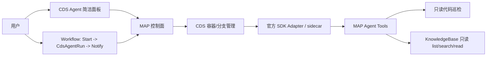

# CDS Agent Phase 1 验收报告

日期：2026-05-19  
分支：`codex/cds-agent-workbench-ui`  
基线提交：`c15e4da11`  
范围：Phase 1 商业级最小可用闭环，本地验收通过；未执行远端发布。

## 验收结论

Phase 1 本地验收通过。当前闭环包含：

- P1-1：简洁模式 Agent 面板，用户可在 3 步内发起只读代码巡检。
- P1-2：可观测 timeline，显示 `traceId`、耗时、`timeoutAt`、`lastEventSeq`、状态、结果和产物入口。
- P1-3：stop/timeout 状态统一，沿用现有 MAP/CDS/runtime cancel 链路。
- P1-4：工作流最小 `CdsAgentRun` 节点，支持 Start -> CdsAgentRun -> Notify。
- P1-5：KnowledgeBase 只读工具，只接 `kb_list` / `kb_search` / `kb_read`，不接写入。
- P1-6：本地 smoke、单测、构建和视觉证据完成归档。

## 能力边界

Phase 1 明确不做：

- 不做知识库写入、重写、diff apply、commit。
- 不做 PR 写入。
- 不绕过 MAP 的 session 用户上下文访问知识库。
- 不把 agent host 设计成新的产品控制面；CDS 仍是容器/分支管理主路径。

## P1-5 KnowledgeBase 只读工具

新增工具：

| 工具 | 能力 | 权限 |
| --- | --- | --- |
| `kb_list` | 列出可访问知识库空间，或列出指定空间条目 | 仅 `OwnerId == session.UserId` 或公开空间 |
| `kb_search` | 搜索标题、摘要、`ContentIndex`，返回引用来源 | 同上 |
| `kb_read` | 读取条目正文，返回截断信息和 `kb://...` 来源 | 同上 |

只读防线：

- 工具从 `InfraAgentSessionId` 反查 session 用户，缺少上下文直接失败。
- 工具文件不包含 Mongo 写调用。
- 未注册 `kb_write`、`kb_create`、`kb_diff`、`kb_apply`、`kb_commit`。

## 本地验收

| 类型 | 命令/证据 | 结果 |
| --- | --- | --- |
| smoke | `bash scripts/smoke-cds-agent-simple-panel.sh` | pass |
| smoke | `bash scripts/smoke-cds-agent-workflow-node.sh` | pass |
| smoke | `bash scripts/smoke-cds-agent-kb-readonly-tools.sh` | pass |
| 后端单测 | `dotnet test prd-api/tests/PrdAgent.Api.Tests/PrdAgent.Api.Tests.csproj --filter "FullyQualifiedName~AgentToolsTests\|FullyQualifiedName~WorkflowAgentTests\|FullyQualifiedName~CapsuleExecutorCdsAgentEventCursorTests\|FullyQualifiedName~CdsAgentAdapterTests"` | 72/72 pass |
| 前端类型 | `pnpm --prefix prd-admin tsc` | pass |
| 前端单测 | `pnpm --prefix prd-admin test -- src/pages/cds-agent/__tests__/cdsAgentReadiness.test.ts` | 281/281 pass |
| 前端构建 | `pnpm --prefix prd-admin build` | pass；仅既有 Rollup chunk/circular warnings |
| 视觉证据 | `/tmp/cds-agent-simple-panel-desktop.png` | 已存在 |
| 视觉证据 | `/tmp/cds-agent-simple-panel-mobile-quickrun.png` | 已存在 |
| 视觉证据 | `/tmp/cds-agent-workflow-p1-4-template-modal.png` | 已存在 |

## 使用路径

1. 打开 `/cds-agent`。
2. 使用简洁模式填写目标和任务。
3. 点击运行只读巡检，并在面板查看 `traceId`、耗时、timeout、状态、结果和产物入口。
4. 如需工作流调度，使用 `CDS Agent 只读代码巡检` 模板，拓扑为 Start -> CdsAgentRun -> Notify。
5. 如需知识库上下文，在 Agent 任务中要求搜索/读取知识库；运行时只暴露 `kb_list/search/read` 三个只读工具。

## 后续阶段

Phase 2 才允许进入可写协作，包括知识库 draft/diff、人工审批、apply、commit、PR 写入。Phase 2 的第一条原则是写操作不直落库，必须先生成可审查差异。
