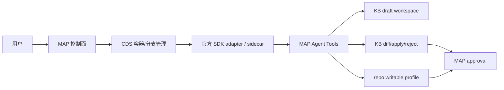

# CDS Agent Phase 2 验收报告

日期：2026-05-19  
分支：`codex/cds-agent-workbench-ui`  
验收基线提交：`ea07d09cd`  
范围：Phase 2 可写协作闭环，本地验收通过；未执行远端发布。

## 验收结论

Phase 2 本地验收通过。当前闭环包含：

- P2-1：可写协作安全边界设计，明确 `diff-first`、工具矩阵、审批点和验收红线。
- P2-2：KnowledgeBase draft workspace，Agent 改写只落草稿，不覆盖正式知识库。
- P2-3：KnowledgeBase diff/apply/reject，差异可审查；`kb_apply` 必须经过 MAP approval。
- P2-4：工作流审批暂停/恢复，支持 `waiting_approval`、人工通过/拒绝、超时保护。
- P2-5：代码 writable profile，代码写工具只在显式 `code-writable-confirm` 下暴露，并由 MAP 审批兜底。
- P2-6：验收包，smoke、单测、构建、视觉证据和报告已归档。

## 能力边界

Phase 2 明确不做：

- 不允许写操作直落正式知识库或仓库主分支。
- 不做自动 apply/commit/PR；写入必须先成为 draft/diff，再由 MAP 审批。
- 不把 `confirm-dangerous` 继续当成代码可写入口；代码写入必须选择 `code-writable-confirm`。
- 不绕过 `InfraAgentSessionId`、用户权限或 MAP approval。
- 不改变 CDS 的定位；CDS 仍负责容器、分支、runtime，MAP 负责权限、审批、事件、产物和审计。

## Phase 2 完成项

| 小节点 | 状态 | 验收点 |
| --- | --- | --- |
| P2-1 安全边界设计 | pass | 文档包含可写工具矩阵、审批策略、失败回滚、smoke 清单 |
| P2-2 KB draft workspace | pass | `kb_draft_create/read/list/discard` 可用；正式 entry 不变 |
| P2-3 KB diff/apply/reject | pass | `kb_diff` 只读可见；`kb_apply` 必须有 MAP approval；reject 不改原文 |
| P2-4 工作流审批暂停 | pass | 工作流可进入 `waiting_approval`，人工通过继续、拒绝失败、超时 `timed_out` |
| P2-5 代码 writable profile | pass | 默认只读和通用危险策略不暴露代码写工具；显式 writable profile 才暴露写工具 |
| P2-6 验收包 | pass | Markdown/PDF 报告、视觉截图、smoke、单测和构建证据齐全 |

## 安全红线验收

| 红线 | 验收结果 | 证据 |
| --- | --- | --- |
| 不允许默认只读 profile 暴露写工具 | pass | `scripts/smoke-cds-agent-writable-profile.sh`、`scripts/smoke-cds-agent-kb-draft-workspace.sh` |
| 不允许 `kb_apply` 无审批写正式知识库 | pass | `AgentToolsController` 将 `kb_apply` 分类为 `write`；`KbApplyTool` 要求 `ApprovalId` |
| 不允许知识库 apply 覆盖冲突版本 | pass | `kb_apply` 校验 `baseContentHash/baseUpdatedAt` |
| 不允许工作流 HTTP 长时间阻塞等人工审批 | pass | `waiting_approval` 事件化暂停，超时进入 `timed_out` |
| 不允许代码写入通过泛危险策略开启 | pass | `repo_write_file/repo_run_command/repo_create_pull_request` 仅 `code-writable-confirm` 暴露 |

## 本地验收

| 类型 | 命令/证据 | 结果 |
| --- | --- | --- |
| smoke | `bash scripts/smoke-cds-agent-writable-profile.sh` | pass |
| smoke | `bash scripts/smoke-cds-agent-kb-draft-workspace.sh` | pass |
| smoke | `bash scripts/smoke-cds-agent-kb-diff-apply.sh` | pass |
| smoke | `bash scripts/smoke-cds-agent-simple-panel.sh` | pass |
| smoke | `bash scripts/smoke-cds-agent-workflow-approval.sh` | pass |
| 后端单测 | `dotnet test prd-api/tests/PrdAgent.Api.Tests/PrdAgent.Api.Tests.csproj --filter "FullyQualifiedName~AgentToolsTests\|FullyQualifiedName~WorkflowAgentTests\|FullyQualifiedName~InfraAgentSessionServiceRuntimeAdapterTests"` | 83/83 pass |
| 前端类型 | `pnpm --prefix prd-admin tsc` | pass |
| 前端单测 | `pnpm --prefix prd-admin test -- src/pages/cds-agent/__tests__/cdsAgentReadiness.test.ts` | 281/281 pass |
| 前端构建 | `pnpm --prefix prd-admin build` | pass；仅既有 Rollup chunk/circular warnings |
| 代码格式 | `git diff --check` | pass |
| 视觉证据 | `/tmp/cds-agent-p2-5-writable-profile.png` | 已生成 |

## 使用路径

### 知识库 draft/diff/apply

1. Agent 通过 `kb_draft_create` 生成草稿。
2. 用户通过 `kb_diff` 查看正式内容与草稿差异。
3. 用户在 MAP 审批后才允许 `kb_apply`。
4. 如不接受，执行 `kb_reject` 或丢弃草稿，不修改正式知识库。

### 工作流审批暂停

1. 使用 `CDS Agent 审批暂停` 模板。
2. `CdsAgentRun` 生成 `cds-agent-approval` 产物。
3. 工作流进入 `waiting_approval`。
4. 用户在执行详情中选择通过或拒绝；超时后进入 `timed_out`。

### 代码 writable profile

1. 新建 CDS Agent session。
2. 工具策略选择 `代码可写需 MAP 审批`，即 `code-writable-confirm`。
3. 只有该 profile 暴露 `repo_write_file`、`repo_run_command`、`repo_create_pull_request`。
4. 未启用 writable profile 时，代码写入调用会被 MAP 拒绝为 `tool_denied_by_writable_profile`。

## 后续阶段

Phase 3 进入规模化商业能力：团队级巡检、知识治理、多运行时成本治理、trace bundle 回放、定时巡检和更完整的 artifact bundle 导出。
