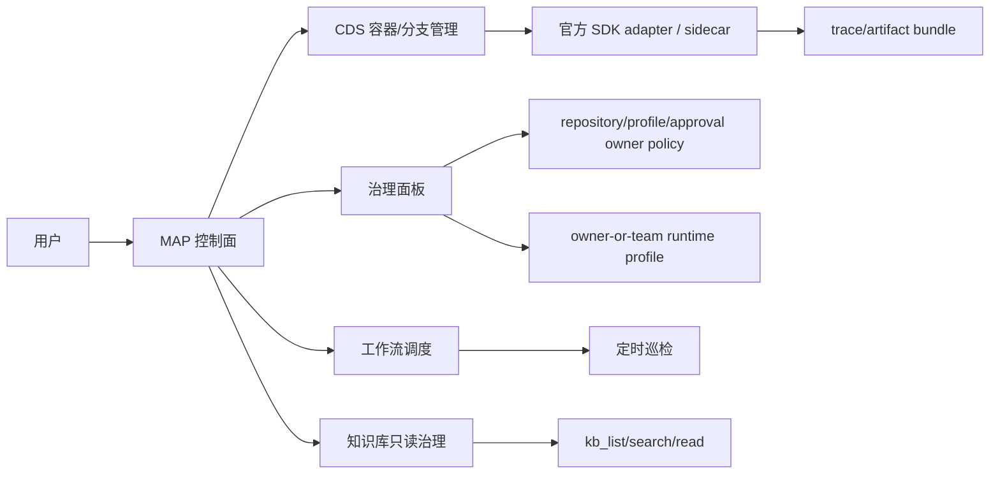

# CDS Agent Phase 3 验收报告

日期：2026-05-19  
分支：`codex/cds-agent-workbench-ui`  
验收基线提交：`e9e710e94`  
范围：Phase 3 规模化商业能力，本地验收通过；未执行远端发布。

## 验收结论

Phase 3 本地验收通过。当前闭环在 Phase 1/2 的“上手即用、可写协作安全边界”基础上，补齐了规模化商业能力的可观察、可治理、可复盘入口：

- P3-1：trace/artifact bundle，单次 Agent 运行可导出、复盘并沉淀为验收证据。
- P3-2：多运行时 adapter matrix，明确官方 SDK adapter、planned adapter、缺失 contract 和 profile/template 候选。
- P3-3：成本、token、SLA 面板，运行量、失败率、超时率和 token usage 可归因，不伪造成本。
- P3-4：定时巡检和批量知识治理最小入口，Cron 工作流可进入只读巡检，KB 治理保持只读边界。
- P3-5a：权限和组织治理只读视图，仓库、知识库、runtime profile、审批策略的隔离状态可见。
- P3-5b：runtime profile scoped resolve，移除 global default/resolve 对其他主体的侵入路径。
- P3-5c：team-shared runtime profile policy，允许团队共享使用，但 update/delete 保持 owner-only。
- P3-5d：repository/profile/approval owner UI，治理缺口从一行 nextAction 变成可读、可点、可复盘的只读入口。
- P3-6：验收包，smoke、单测、构建、视觉证据和报告已归档。

## 能力边界

Phase 3 明确不做：

- 不新增自研 agent loop；官方 SDK adapter 和必要胶水层仍是边界。
- 不启用跨团队自动写入、自动 apply、自动 commit。
- 不把 team-shared runtime profile 解释为所有权；共享只扩大 list/resolve/use，可修改和删除仍为 owner-only。
- 不把成本面板伪装成真实计费；当前只展示已可归因的运行、耗时、失败、超时和 token 指标。
- 不把治理面板的 nextAction 当作功能已实现；owner UI 只做只读入口和风险呈现。

## Phase 3 完成项

| 小节点 | 状态 | 验收点 |
| --- | --- | --- |
| P3-1 trace/artifact bundle | pass | session、metrics、eventTypeCounts、messages、events、artifacts、logs、replay cursor 可导出 |
| P3-2 adapter matrix | pass | Claude SDK 可路由；OpenAI Agents / Google ADK / Codex planned adapter 显示 blocked 和缺失 contract |
| P3-3 SLA/成本面板 | pass | 聚合运行量、失败率、超时率、耗时、token usage；不伪造成本 |
| P3-4 定时巡检/知识治理 | pass | 复用 workflow schedule 和 `CdsAgentRun`；KB 只读治理只暴露 `kb_list/search/read` |
| P3-5a 权限/组织治理 | pass | `GOV-KB-READONLY`、`GOV-PROFILE-SCOPE`、审批风险 gate 可见 |
| P3-5b scoped resolve | pass | runtime profile list/resolve/update/delete/test/adapterMatrix 全部按主体收敛 |
| P3-5c team-shared policy | pass | owner-or-team 可见，update/delete owner-only；workflow/toolbox fallback 同步策略 |
| P3-5d owner UI | pass | Repository/Profile/Approval owner 卡片可读、可点、可复盘 |
| P3-6 验收包 | pass | Markdown/PDF 报告、视觉截图、smoke、单测和构建证据齐全 |

## 治理红线验收

| 红线 | 验收结果 | 证据 |
| --- | --- | --- |
| runtime profile 不得回到 global default/resolve | pass | `scripts/smoke-cds-agent-profile-scope.sh`；`GOV-PROFILE-SCOPE` pass |
| team-shared profile 不得越权修改或删除 | pass | `scripts/smoke-cds-agent-team-shared-profile-policy.sh`；`Update/Delete` 使用 owner-only guard |
| 工作流和 toolbox fallback 不得扫描全局 profile | pass | `scripts/smoke-cds-agent-profile-scope.sh`、`scripts/smoke-cds-agent-team-shared-profile-policy.sh` |
| KB 批量治理不得写入或 apply | pass | `scripts/smoke-cds-agent-schedule-dashboard.sh`；只读工具为 `kb_list/kb_search/kb_read` |
| Owner UI 不得触发写入或改变 agent loop | pass | `scripts/smoke-cds-agent-owner-policy-ui.sh`；UI 只渲染 `ownerPolicies` |
| 成本/SLA 不得伪造上游计费 | pass | `scripts/smoke-cds-agent-sla-dashboard.sh`；只聚合已有 session/event 指标 |

## 本地验收

| 类型 | 命令/证据 | 结果 |
| --- | --- | --- |
| smoke | `bash scripts/smoke-cds-agent-trace-bundle.sh` | pass |
| smoke | `bash scripts/smoke-cds-agent-adapter-matrix.sh` | pass |
| smoke | `bash scripts/smoke-cds-agent-sla-dashboard.sh` | pass |
| smoke | `bash scripts/smoke-cds-agent-schedule-dashboard.sh` | pass |
| smoke | `bash scripts/smoke-cds-agent-governance-dashboard.sh` | pass |
| smoke | `bash scripts/smoke-cds-agent-profile-scope.sh` | pass |
| smoke | `bash scripts/smoke-cds-agent-team-shared-profile-policy.sh` | pass |
| smoke | `bash scripts/smoke-cds-agent-owner-policy-ui.sh` | pass |
| 后端单测 | `dotnet test prd-api/tests/PrdAgent.Api.Tests/PrdAgent.Api.Tests.csproj --filter "FullyQualifiedName~InfraAgentRuntimeProfilesControllerTests\|FullyQualifiedName~InfraAgentSessionsControllerTests\|FullyQualifiedName~InfraAgentSessionServiceGovernanceDashboardTests\|FullyQualifiedName~InfraAgentSessionServiceRuntimeAdapterTests" --no-restore` | 56/56 pass |
| 前端类型 | `pnpm --prefix prd-admin tsc` | pass |
| 前端单测 | `pnpm --prefix prd-admin test -- src/pages/cds-agent/__tests__/cdsAgentReadiness.test.ts` | 281/281 pass |
| 前端构建 | `pnpm --prefix prd-admin build` | pass；仅既有 Rollup chunk/circular warnings |
| 代码格式 | `git diff --check` | pass |

## 视觉和 PDF 证据

| 节点 | 证据 |
| --- | --- |
| P3-1 trace/artifact bundle | `/tmp/cds-agent-p3-1-remote-workbench.png`；`/tmp/cds-agent-p3-1-remote-workbench.coverage.json` |
| P3-2 adapter matrix | `/tmp/cds-agent-p3-2-adapter-matrix.png`；`/tmp/cds-agent-p3-2-adapter-matrix.txt` |
| P3-3 SLA/成本面板 | `/tmp/cds-agent-p3-3-sla-dashboard.png`；`/tmp/cds-agent-p3-3-sla-dashboard.targeted.json` |
| P3-4 定时巡检/知识治理 | `/tmp/cds-agent-p3-4-schedule-dashboard.png`；`/tmp/cds-agent-p3-4-schedule-dashboard.targeted.json` |
| P3-5a 权限/组织治理 | `/tmp/cds-agent-p3-5-governance-dashboard.png`；`/tmp/cds-agent-p3-5-governance-dashboard.targeted.json` |
| P3-5b scoped resolve | `/tmp/cds-agent-p3-5b-profile-scope-report.png`；`/tmp/cds-agent-p3-5b-profile-scope-report.pdf` |
| P3-5c team-shared policy | `/tmp/cds-agent-p3-5c-team-shared-profile-policy-report.png`；`/tmp/cds-agent-p3-5c-team-shared-profile-policy-report.pdf` |
| P3-5d owner UI | `/tmp/cds-agent-p3-5d-owner-policy-ui-report.png`；`/tmp/cds-agent-p3-5d-owner-policy-ui-report.pdf` |
| P3-6 验收包 | `doc/report.cds-agent-phase3-acceptance-2026-05-19.md`；`doc/report.cds-agent-phase3-acceptance-2026-05-19.pdf` |

## 使用路径

### 单次运行复盘

1. 在 CDS Agent 面板完成一次只读巡检。
2. 使用 trace bundle 导出 session、messages、events、artifacts、logs。
3. 用 `traceId`、`lastEventSeq`、artifact 数量和 logs 复盘运行过程。

### 多运行时治理

1. 打开 Adapter matrix。
2. 查看当前默认 `claude-agent-sdk` 是否可路由。
3. 对 planned adapter 只查看 blocked 原因和缺失 contract，不直接路由。

### 团队治理

1. 打开 `权限 / 组织治理` 面板。
2. 查看 repository、knowledge-base、runtime-profile、approval-policy 四个 scope。
3. 查看 Repository/Profile/Approval owner 卡片，按 `path` 跳转到相应入口处理。

### 定时巡检和知识治理

1. 使用已有 workflow schedule 触发 `CdsAgentRun`。
2. 在 schedule dashboard 查看最近执行和 workbench path。
3. 知识库治理只读使用 `kb_list/kb_search/kb_read`，不做写入、apply、commit。

## 后续阶段

Phase 3 完成后，下一阶段应围绕商业部署验收和真实团队使用反馈推进：

- 远端部署验收和线上截图。
- 团队级 repository allow-list、approval owner、profile sharing 的可编辑 UI。
- 更完整的成本计费接入，而不是仅做运行指标归因。
- 批量治理的 draft/diff/apply/commit 商业路径，但必须继续保留 MAP approval 和审计。
