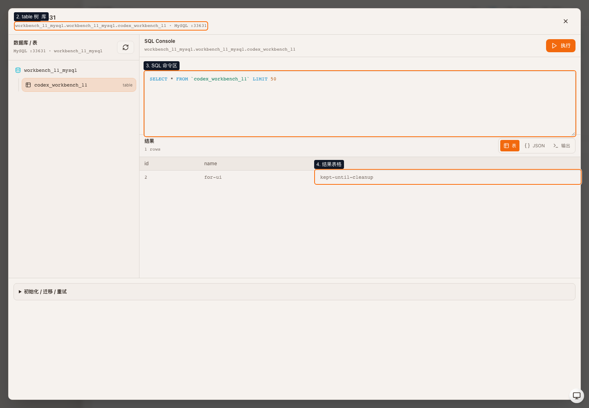
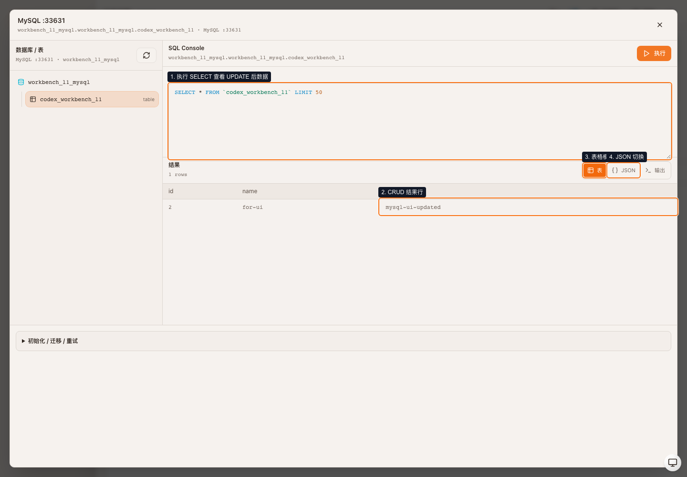
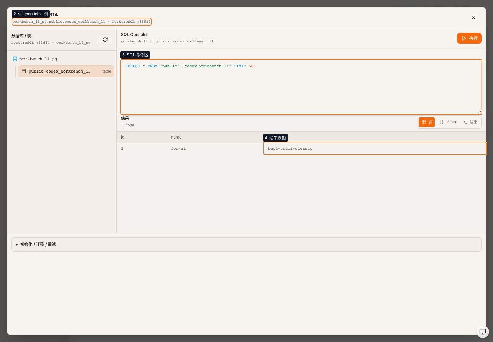
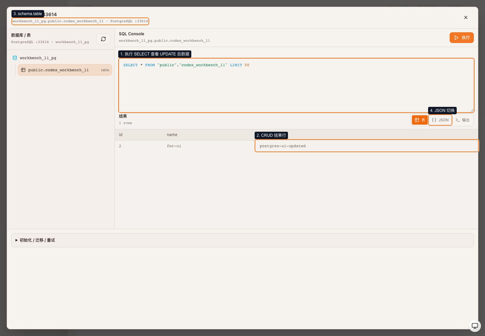
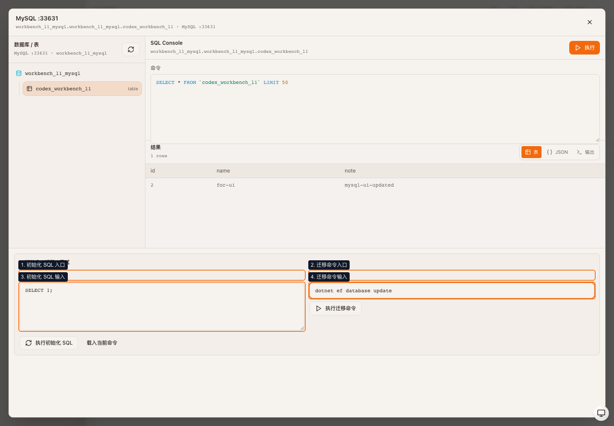
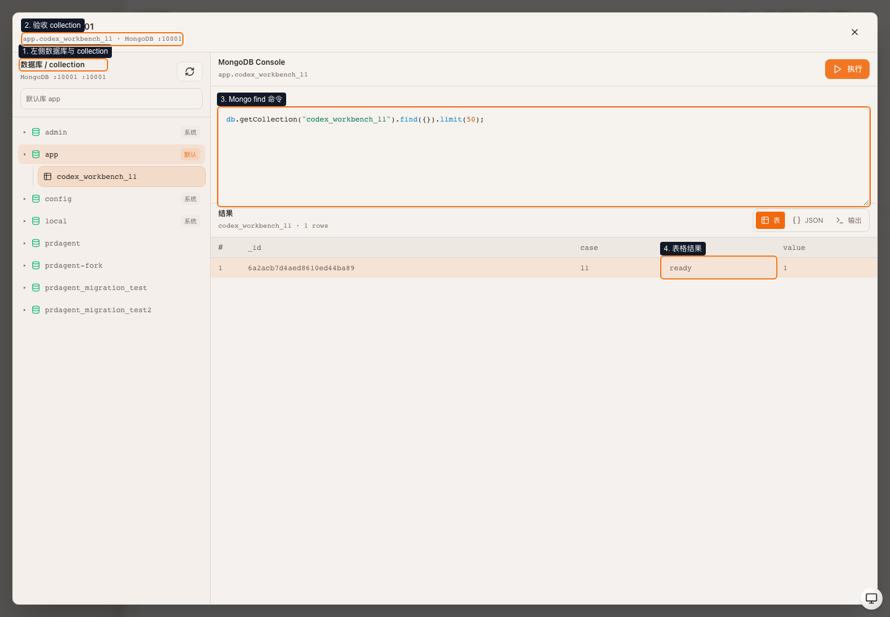
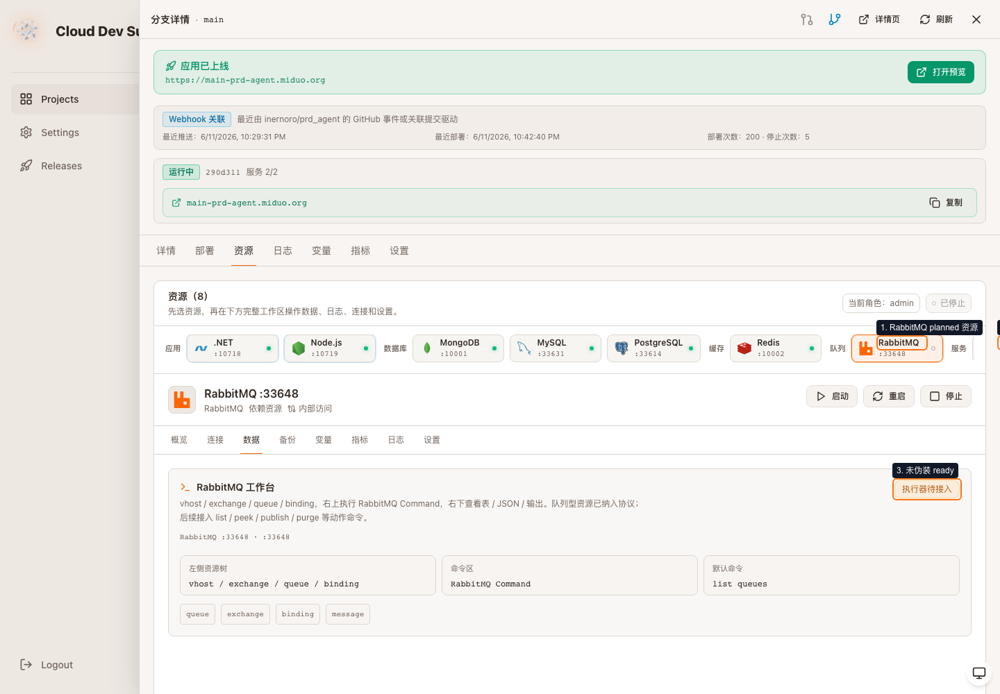
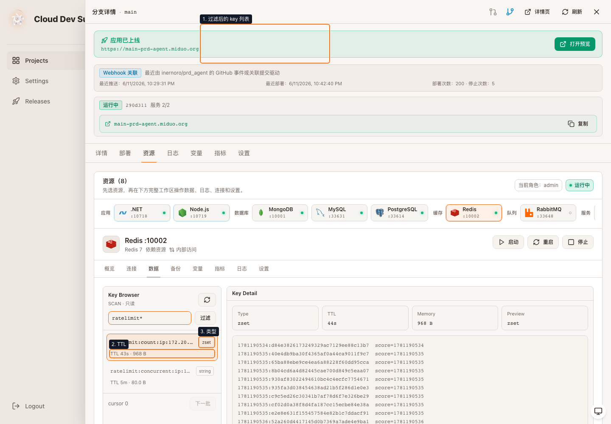
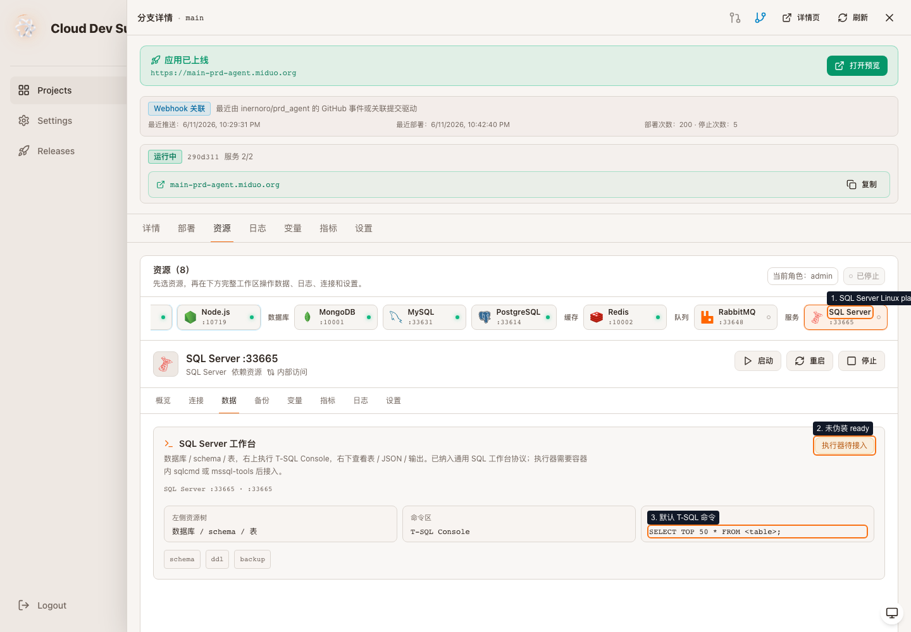

# CDS 数据库资源工作台 L1 验收 · 报告

> **版本**：v1.0 | **日期**：2026-06-11 | **状态**：已落地

## 结论

Verdict: PASS。

本次验收覆盖远端 CDS 控制面 `https://miduo.org/branches/prd-agent` 的 `main` 分支资源工作台。验收范围从能力矩阵扩展到真实数据操作：MySQL / PostgreSQL 走 DDL + CRUD 闭环，MongoDB 走 collection + find 命令闭环，Redis 走只读 key 浏览，RabbitMQ / SQL Server 明确保持 planned 状态。

## 远端环境

| 项 | 值 |
|----|----|
| 分支 | `prd-agent-main` |
| 提交 | `290d31197` |
| CDS self-update | `headSha=290d31197`，进程启动于 `2026-06-11T14:56:17.954Z` |
| Dashboard 验收地址 | `https://miduo.org/branches/prd-agent` |
| 预览根域 | `https://main-prd-agent.miduo.org/` |

## 能力矩阵

| 资源 | runner | ready | writeSupported | 结论 |
|------|--------|-------|----------------|------|
| MySQL | `sql` | true | true | ready |
| PostgreSQL | `sql` | true | true | ready |
| MongoDB | `mongo` | true | true | ready |
| Redis | `redis-readonly` | true | false | readonly ready |
| RabbitMQ | `planned` | false | false | planned |
| SQL Server for Linux | `planned` | false | false | planned |

## API 行为断言

| 用例 | 断言 |
|------|------|
| MySQL DDL/CRUD | `CREATE TABLE`、`INSERT`、`SELECT`、`UPDATE`、`DELETE`、`DROP TABLE` 均返回 200；更新后查询到 `mysql-ui-updated` |
| PostgreSQL DDL/CRUD | `CREATE TABLE`、`INSERT`、`SELECT`、`UPDATE`、`DELETE`、`DROP TABLE` 均返回 200；更新后查询到 `postgres-ui-updated` |
| MongoDB find | `POST /data/mongo/command` 返回 200，`kind=documents`，collection 为 `codex_workbench_l1` |
| MongoDB 写类命令拦截 | `insertOne` 形式命令返回 400，提示只允许只读 find 查询 |
| Redis readonly | `ratelimit*` 过滤返回 key 列表，详情包含 `type`、`TTL`、preview |
| 写 SQL 未确认 | 返回 409，要求输入资源名确认 |
| 单次多 SQL | 返回 400，一次只允许一条语句 |
| 高危文件 SQL | 返回 400，被写 SQL 白名单拦截 |
| 未登录写入 | 返回 403，`resource_permission_denied` |

验收完成后已清理临时对象：MySQL / PostgreSQL 的 `codex_workbench_l1` 表、MongoDB 的 `codex_workbench_l1` collection 均已删除，远端返回 200。

## 视觉证据

### 1. MySQL 工作台：当前数据库 + table 树

### 2. MySQL SQL 执行：CRUD 结果

### 3. PostgreSQL 工作台：当前 database/schema + table 树

### 4. PostgreSQL SQL 执行：CRUD 结果

### 5. 初始化入口：SQL / 迁移命令 / 重试入口

### 6. MongoDB 对照图：collection / 命令 / 表格结果

### 7. RabbitMQ planned：协议已声明，执行器待接入

### 8. Redis readonly：key / TTL / type / 只读预览

### 9. SQL Server planned：Linux 镜像，T-SQL 协议待接入

## 边界

- RabbitMQ 和 SQL Server 仅证明协议与 planned 展示，未作为 ready 执行器验收。
- Redis 本轮只验 readonly 浏览，不验复杂编辑。
- DDL/CRUD 真实闭环以远端 API 断言为准，UI 截图用于证明用户入口、布局、命令区和结果区可见。
