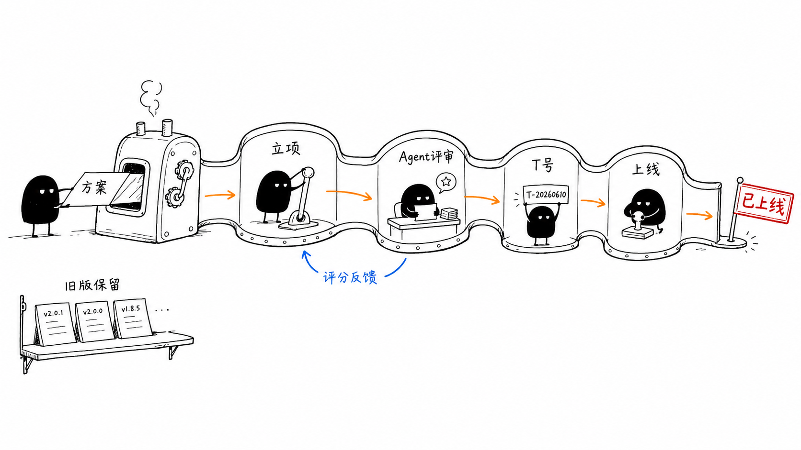
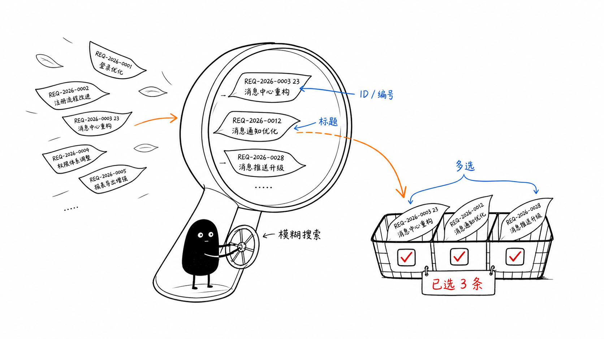

# version-20260610-1 分支改动说明

## 一句话说明

今天把产品版本从一组独立记录，升级成了可执行的“立项到上线”完整工作流，并补齐了关联需求的搜索与多选体验。

## 1. 版本流程形成闭环

新增产品版本工作流，覆盖：

- 发起立项并填写项目、方案、版本级别和关联需求。
- 上传方案文件，进入 Agent 评审并同步评分结果。
- 评审通过后选择评审会或负责人审批，生成 T 立项号。
- 基于已批准立项申领上线号，维护项目成员、上线时间和上线范围。
- 填写上线公告并完成正式上线。
- 支持临时优化需求，以及历史立项、上线数据导入。
- 旧版版本数据继续保留，避免历史信息丢失。

前后端同时新增了工作流模型、MongoDB 集合、接口、类型定义、服务调用和页面入口。

## 2. 字段与列表对齐业务口径

立项和上线列表经过多轮调整，与当前业务字段保持一致，重点补齐或统一了：

- T 立项号、方案名称、项目类别、版本级别。
- 系统、应用、所属部门、客户来源、方案地址。
- Agent 评分、评审方式、负责人和流程状态。
- 正式版本号、计划上线时间、实际上线时间、开放范围和上线公告。

## 3. 关联需求支持搜索多选

发起立项表单中的“关联需求”完成体验升级：

- 每条需求同时展示需求编号和标题。
- 支持按内部 ID、需求编号或标题进行模糊匹配。
- 每条记录提供复选框，可同时选择多条需求。
- 搜索切换后保留已勾选状态。
- 显示已选数量和需求总数。
- 提交仍沿用 `requirementIds: string[]`，无需改变后端多选协议。

## 4. 今日提交

- `5ff44078b` 新增产品版本立项与上线工作流。
- `4259f3240` 对齐版本列表与业务字段。
- `e978d167a` 调整立项列表字段。
- `45e33cdd0` 更新立项表格列。
- `2df8d3997` 新增关联需求搜索与多选。

关联需求改动已通过 TypeScript、ESLint 和生产构建检查。
