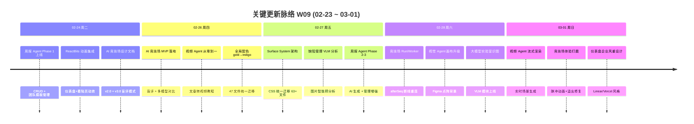

# 周报 2026-W09 (02-23 ~ 03-01)

> **总计 229 次提交 | 304 个文件变更 | +37,775 行 / -1,999 行 | 35 个 PR 合并 (#128 ~ #162)**
>
> **贡献者**：Claude (189 commits), InerNoro (38 commits), Cursor Agent (2 commits)

**本周趋势**：本周是 W08 间歇后的高密度交付周，聚焦于三大新 Agent 的完整落地（AI 竞技场、视频 Agent、周报 Agent），同时对前端架构进行了深度治理——Surface System CSS 统一迁移 63+ 文件、全局 gold→indigo 配色迁移 47 个文件。工作流引擎在独立分支上持续演进，新增 AI 对话式创建和 TAPD 执行监控能力。

---

## 关键更新脉络

---

## 一、已合并 Pull Requests (#128 ~ #162)

| PR | 标题 | 分类 |
|----|------|------|
| #162 | 视频 Agent — 文章转视频教程生成全栈实现 | ✨ 新功能 |
| #161 | 竞技场面板溢出修复与非阻塞任务提交 | 🐛 Bug 修复 |
| #160 | 仪表盘企业风重设计 (Linear/Vercel 风格) | 🎨 UI/UX |
| #159 | 视觉 Agent 画布 Figma 风格点阵背景 | 🎨 UI/UX |
| #158 | 周报 Agent — Phase 1-3 + 文档同步 | ✨ 新功能 |
| #157 | 视觉 Agent 工作区风格统一按钮 | ✨ 新功能 |
| #156 | 视觉 Agent 多选右键菜单修复 | 🐛 Bug 修复 |
| #155 | AI 百宝箱卡片全铺满封面布局 | 🎨 UI/UX |
| #154 | Agent 调用分布统计修复 | 🐛 Bug 修复 |
| #153 | 缺陷管理 UI 增强 (VLM + 列表视图 + 示范内容) | 🔄 更新 |
| #152 | AI 百宝箱 TabBar 统一 + 全局查询设计 | 🏗️ 架构 |
| #151 | 竞技场思维链显示 + 历史加载修复 | 🔄 更新 |
| #150 | 粒子动画配色与动效调优 | 🎨 UI/UX |
| #149 | 尺寸偏好持久化迁移到 localStorage | 🐛 Bug 修复 |
| #148 | 大模型实验室新增识图模块 | ✨ 新功能 |
| #147 | Surface System + 仪表盘信息面板合并 | 🏗️ 架构 |
| #146 | 暗色模式 PRD 预览文字修复 | 🐛 Bug 修复 |
| #145 | 头像上传权限 + CDN 缓存破除 | 🐛 Bug 修复 |
| #144 | 缺陷详情弹窗定位修复 (Radix Dialog) | 🐛 Bug 修复 |
| #143 | .mdc/.txt 文本格式上传支持 | ✨ 新功能 |
| #142 | 缺陷管理列表视图 + 已读状态 | ✨ 新功能 |
| #141 | 缺陷模板示范内容 | 🔄 更新 |
| #140 | 任务交接清单 Skill | ✨ 新功能 |
| #139 | AI 百宝箱快速创建向导 | ✨ 新功能 |
| #138 | 文学 Agent 返回按钮 | 🔄 更新 |
| #137 | 暗色模式文字对比度全面修复 | 🐛 Bug 修复 |
| #136 | 仪表盘面板信息图标 + Agent 统计修复 | 🔄 更新 |
| #135 | Nginx 部署脚本加固 + test.sh 99 项测试 | 🔧 DevOps |
| #134 | Claude Code 云端开发教程 | 📝 文档 |
| #133 | 文学创作图片默认 50% 显示 | 🐛 Bug 修复 |
| #132 | 文学 Agent 图片中文描述修复 | 🐛 Bug 修复 |
| #131 | 周报 Skill 关键更新脉络图 | 🔄 更新 |
| #130 | 文学 Agent 系统提示词持久化修复 | 🐛 Bug 修复 |
| #129 | 排行榜奖牌行背景裁剪修复 | 🐛 Bug 修复 |
| #128 | API 请求日志 Watchdog | 🔧 DevOps |

---

## 二、本周完成

### 1. AI 竞技场 (AI Arena) — 多模型盲评对比系统

> **价值**：团队可以在"蒙眼"状态下公平对比不同 AI 模型的输出质量，基于真实结果而非品牌偏见做出模型选型决策，直接降低"选错模型"的试错成本。

本周最大的新功能模块，从设计文档到完整上线。

- **盲评核心机制**：用户输入同一提问，多个模型同时作答，揭晓前隐藏模型身份
- **Run/Worker 架构**：与对话系统一致的 afterSeq 断线重连机制，保证长时间生成不丢数据
- **思维链展示**：支持显示模型推理过程 (thinking/reasoning)，帮助深度对比
- **视觉交互**：
  - Conic-gradient 进度环 + 旋转弧形动画替代静态进度条
  - 完成时脉冲光效动画，揭晓后显示模型头像
  - 水平卡片布局 + 1/3 宽度 + 完成排序
- **功能完善**：重试/复制/Markdown 下载、分组内联管理、ModelPoolPickerDialog 选槽
- **Bug 修复**：SSE 路由/流式传输修复、面板溢出、双闪问题、空状态 UX

### 2. 视频 Agent (Video Agent) — 文章转视频教程生成

> **价值**：产品经理写完 PRD 后一键生成配套视频教程，将"写文档→做视频"的周期从数天压缩到分钟级，大幅提升知识传播效率。

从零搭建的全新 Agent，完整的文章→脚本→分镜→视频生成链路。

- **后端架构**：VideoAgentController + VideoGenRunWorker，遵循 Run/Worker 模式
- **交互式分镜编辑器**：参考文学 Agent 布局模式重新设计，支持逐场景编辑
- **流式生成**：脚本生成和 LLM 输出均为实时流式渲染，用户可边生成边查看
- **场景图片生成**：AI 为每个场景自动生成背景图，类似文学 Agent 的逐场景预览
- **Remotion 渲染**：集成 Remotion 视频合成框架，支持场景可视化预览
- **COS 上传**：渲染后的 MP4 自动上传到 COS，替代本地文件服务
- **系统集成**：注册到 Agent Switcher、AI 百宝箱、权限菜单

### 3. 周报管理 Agent (Report Agent) — Phase 1-3 完整上线

> **价值**：团队成员不再需要每周手动汇总工作内容，系统自动从 Git/TAPD 采集数据，AI 一键生成结构化周报，管理者也能集中审阅和批注。

三个阶段密集交付，实现从创建到审阅的闭环。

- **Phase 1 — 基础 CRUD**：周报创建/编辑/提交 + 团队管理 + 模板配置
- **Phase 2 — 自动采集 + AI 生成**：Git commit 自动采集 + LLM 智能分析生成周报内容
- **Phase 3 — 管理增强**：逾期报告可编辑/重新提交、重新生成通知修复
- **文档同步**：Phase 5 文档同步 + AppOwnership 属性注册
- **导航调整**：从侧边栏移入 AI 百宝箱，统一入口

### 4. Surface System CSS 架构 — 前端样式大一统

> **价值**：消除各页面"各自为政"的样式碎片化问题，统一的 CSS 变量体系让主题切换、暗色模式和未来的品牌换肤变得一步到位。

本周最大的前端基础设施变更，影响 63+ 文件。

- **架构引入**：定义 Surface System CSS 变量体系，替代散落各处的 `--list-item-bg` 等遗留变量
- **分批迁移**：19 文件 → 11 文件 → 13 文件 → 20 文件，四轮渐进式迁移
- **暗色模式修复**：PRD 预览内联样式剥离、prose 文字对比度、桌面端文字对比度
- **macOS 兼容**：backdrop-filter 相邻元素缝隙伪元素修复
- **fix-surface-styles Skill**：一键扫描并修复样式偏差的自动化技能

### 5. AI-Native UI 全局重设计 — 从 Gold 到 Indigo

> **价值**：统一的 Indigo 科技色调替代分散的金色元素，产品视觉从"各页面拼凑感"升级为一致的 AI 原生风格，用户感知更专业。

- **全局配色迁移**：gold/amber → indigo，涉及 47 个文件的系统性替换
- **ExecutiveDashboard**：AI-Native UI 视觉语言重设计
- **AiChatPage**：AI-Native UI 风格原型
- **Landing Page**：ReactBits 动画集成 + 粒子漩涡组件 + Aurora Prism 动画
- **仪表盘企业风**：Linear/Vercel 风格 flat design 重构
- **GlassCard 增强**：动画入场效果 + 视觉深度 + ToolCard AI-Native 重设计
- **卡片布局**：Agent 卡片图片铺满 + 百宝箱毛玻璃层 + Lucide icon 替代 emoji

### 6. 工作流引擎增强 — AI 对话式创建 + TAPD 监控 `[分支: claude/simplify-workflow-creation-nSbRm]`

> **价值**：用户无需理解 DAG 编排概念，通过自然语言对话即可创建工作流；TAPD 数据采集支持 Cookie 认证和执行监控，让项目管理数据自动化流转真正可用。

独立分支上 15 个提交 (+5,130 / -220 行)，尚未合并到主线。

- **AI 对话面板**：在工作流编辑器中新增 AI Chat Panel，自然语言描述自动生成工作流配置
- **一键模板导入**：预设工作流模板库，一键导入常用流程
- **TAPD Cookie 认证**：新增 Cookie 认证模式，支持直接输入 TAPD 用户名密码自动 Base64 编码
- **执行监控面板**：WorkflowEditorPage 新增执行日志面板，实时查看工作流运行状态
- **COS 存储 + 月份选择器**：执行产出物上传 COS 持久化 + 按月筛选
- **Data Aggregator 舱**：新增数据聚合胶囊，在 LLM 分析前先做统计预处理
- **Token 感知截断**：LLM 输入超长时智能截断，JSON 表格检测优化
- **Bug 修复**：非 JSON TAPD 响应处理、多输出节点支持、SSE 序列化、数据持久化等 6 项修复

### 7. 缺陷管理增强 — VLM 图片分析 + 列表视图

> **价值**：提交缺陷时上传截图，AI 自动识别图中的问题并预填描述；列表视图和已读状态让缺陷跟踪效率提升一个量级。

- **VLM 图片分析**：缺陷提交时自动调用视觉大模型分析截图，预检模型池可用性
- **列表视图 + 已读状态**：新增列表模式切换 + 未读标记
- **示范内容**：缺陷模板支持示范内容 (exampleContent)，降低用户填写门槛
- **弹窗修复**：DefectDetailPanel 改用 Radix Dialog，修复被遮挡问题
- **文本区域优化**：基础 380px，附带图片时自动扩展到 500px

### 8. 大模型实验室 — VLM 识图模块

> **价值**：研发和产品团队可以直接在实验室中测试各视觉大模型的图片理解能力，对比识别准确率，为业务选型提供第一手数据。

- **识图模块**：新增 VLM 图片识别 Tab，左右并排布局（左侧上传图片，右侧提示词）
- **Tab 顺序调整**：优化实验室各模块排列

### 9. 视觉 Agent 画布升级

> **价值**：Figma 风格的点阵背景让画布体验更专业，风格统一按钮一键对齐所有图片的视觉风格，提升创作效率。

- **Figma 点阵背景**：画布新增动态 dot grid 背景，间距 48px 适中密度
- **风格统一按钮**：一键统一工作区所有图片的视觉风格
- **尺寸持久化**：尺寸/分辨率配置持久化 + 列表页 SizePickerPanel
- **面板色调统一**：工具栏、浮动面板、输入区域色调与画布背景和谐统一
- **字体优化**：输入区域统一 16px，快速输入 20px，全局输入字体缩小 ~10%

### 10. AI 百宝箱增强 — 快速创建 + 收藏 + 卡片重设计

> **价值**：新建 Agent 从"手动填表"简化为"向导式创建"，收藏和 emoji 标识让高频 Agent 触手可及。

- **快速创建向导**：AI 润色、可展开编辑器、测试对话、模型选择的分步向导
- **收藏 (Star) + Emoji**：Agent 星标收藏 + 自定义 emoji 标识
- **竞技场入口**：AI 竞技场卡片集成到百宝箱
- **TabBar 统一**：所有 Tab 使用统一的 TabBar 组件

### 11. DevOps 与部署工具

> **价值**：一键部署脚本和 99 项自动测试让新环境搭建从"半天手工"变为"一个命令"。

- **exec_bt.sh**：一键分支测试器全量部署，支持 MECE 冲突分析、PID 竞态保护
- **exec_nginx_setup.sh**：一键公网 Nginx 反向代理配置
- **test.sh**：99 项测试用例覆盖 10 个阶段
- **ApiRequestLogWatchdog**：自动清理卡在 running 状态的 API 请求日志

### 12. 其他改进

- **任务交接清单 Skill**：AI 完成任务后自动生成结构化交接报告
- **fix-surface-styles Skill**：一键修复 CSS 样式偏差
- **周报 Skill 脉络图**：新增 Mermaid timeline 关键更新可视化
- **.mdc/.txt 上传**：文档上传支持 .mdc 和 .txt 格式
- **头像权限修复**：普通用户修改头像不再提示权限不足 + CDN 缓存破除
- **文学 Agent**：中文图片描述 + 提示词持久化 + 默认 50% 显示 + 返回按钮
- **仪表盘信息图标**：所有面板增加 (?) 帮助提示 + Agent 统计修复
- **桌面端暗色模式**：文字对比度全面提升

---

## 三、本周数据

### 每日提交分布

| 日期 | 提交数 | 重点方向 |
|------|--------|----------|
| 02-24 (周二) | 24 | 周报 Agent Phase 1、ReactBits 动画集成、竞技场设计文档、部署脚本 |
| 02-25 (周三) | 12 | AI-Native UI 重设计、云端开发教程、文学 Agent 修复 |
| 02-26 (周四) | 20 | AI 竞技场 MVP、视频 Agent、全局配色迁移、周报 Phase 2 |
| 02-27 (周五) | 66 | Surface System CSS 迁移、缺陷管理增强、暗色模式修复、快速创建向导 |
| 02-28 (周六) | 74 | 竞技场 Run/Worker、视觉 Agent 画布、识图模块、粒子动画 |
| 03-01 (周日) | 32 | 视频 Agent 流式渲染、竞技场体验打磨、仪表盘重设计 |

### 提交类型分布

| 类型 | 数量 | 占比 |
|------|------|------|
| fix (Bug 修复) | 85 | 37% |
| feat (新功能) | 49 | 21% |
| style (样式) | 17 | 7% |
| refactor (重构) | 12 | 5% |
| docs (文档) | 13 | 6% |
| chore (杂项) | 8 | 4% |
| merge (合并) | 42 | 18% |
| 其他 | 3 | 1% |

---

## 四、与上周对比

> **注**：W08 (02-16 ~ 02-22) 为间歇周（0 次提交），因此与 W07 进行对比。

| 指标 | W07 | W09 | 变化 |
|------|-----|-----|------|
| 提交数 | 239 | 229 | -4% |
| 合并 PR 数 | 33 | 35 | +2 |
| 文件变更 | 349 | 304 | -13% |
| 净增行数 | +36,831 | +35,776 | -3% |

### W07 方向落地情况

| W07 建议方向 | W09 实际进展 |
|-------------|-------------|
| P0 工作流引擎稳定化 | ✅ 独立分支新增 AI 对话创建 + TAPD Cookie 认证 + 执行监控 + 数据聚合舱 (15 commits) |
| P0 思维链体验打磨 | ✅ 竞技场完整 thinking/reasoning 展示 + 视频 Agent 实时流式思维过程 |
| P1 移动端 QA | ❌ 本周未涉及移动端工作 |
| P1 知识库 MVP | ❌ 本周未启动 |
| P2 分支测试器稳定化 | ✅ exec_bt.sh 全面加固 + test.sh 99 项测试 + Nginx 部署脚本 |
| P2 桌面端功能对齐 | ⚠️ 暗色模式对比度修复，但功能对齐未实质推进 |

---

## 五、下周优先级建议

| 优先级 | 方向 | 建议动作 |
|--------|------|----------|
| P0 | 工作流分支合并 + 稳定化 | 将 `claude/simplify-workflow-creation-nSbRm` 合并到主线，端到端回归测试 |
| P0 | 竞技场 + 视频 Agent QA | 真实多模型对比测试竞技场；视频 Agent 完整链路验证（脚本→分镜→渲染→COS） |
| P1 | 周报 Agent Phase 4 | 评论/批注功能 + 团队汇总报告 + 数据源多样化 |
| P1 | 知识库 MVP | 文档上传 + 向量索引 + 对话引用（连续两周未启动，建议提上日程） |
| P2 | 移动端 QA | 多设备兼容性测试，连续两周未涉及 |
| P2 | Surface System 收尾 | 验证全部页面暗色模式一致性，清理残留遗留变量 |
