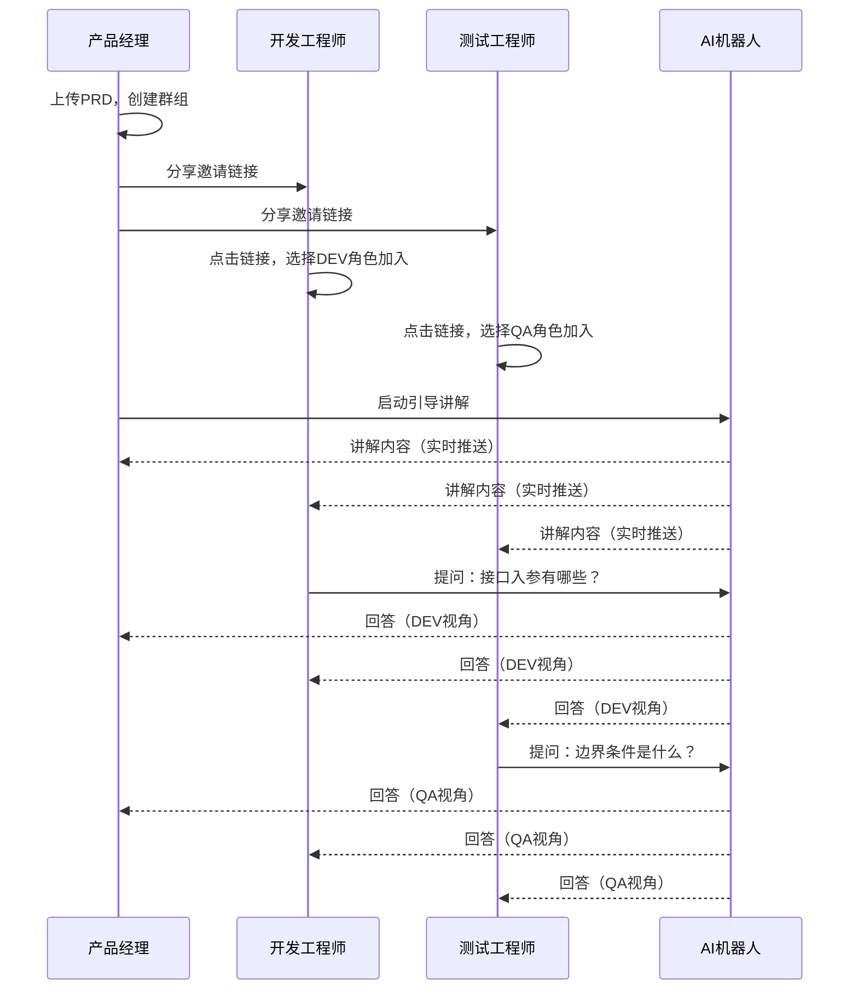

# PRD Agent 产品需求文档

**产品名称**：PRD Agent（PRD智能解读助手）  
**文档版本**：v1.0  
**产品负责人**：-  
**创建日期**：2024年12月10日  
**最后更新**：2024年12月10日

---

## 1. 产品概述

### 1.1 产品愿景

> **"文档即共识"** —— 任何角色在首次阅读时即可完整理解方案背景、核心流程与边界条件，无需依赖额外的口头讲解。

PRD Agent 是一款专精于PRD理解的智能Agent，用AI作为产品经理的"嘴替"，让"讲解"从依赖个人精力转变为**可扩展、可复用、可追溯**的系统能力。

### 1.2 问题背景

随着MD文档在产品设计中的普及，产品方案文档呈现出以下结构性问题：

| 问题 | 描述 |
|------|------|
| 📄 **文档膨胀** | 越写越长、越写越散，从"可执行方案"退化为"长篇说明文" |
| 🤔 **理解偏差** | 研发与测试频繁反馈"看不懂""抓不住主流程" |
| 💬 **沟通依赖** | 关键决策仅存在于口头沟通中，无法沉淀复用 |
| 🔄 **恶性循环** | 文档不可执行 → 反复沟通补偿 → 信息再次丢失 → 文档继续膨胀 |

### 1.3 解决方案

构建一个智能PRD讲解助手：
- 🎯 **聚焦单一文档**：仅针对当前加载的PRD文档，不做泛化回答
- 👥 **角色适配讲解**：根据产品/开发/测试三种角色，提供差异化视角的讲解
- 🤝 **团队协作共享**：群组成员共享同一AI讲解会话，提问即时可见
- 🔍 **缺失检测提醒**：自动识别PRD未覆盖的问题，提醒产品经理补全

---

## 2. 目标用户

### 2.1 用户画像

| 角色 | 技术背景 | 核心诉求 | 使用场景 | 使用频率 |
|------|----------|----------|----------|----------|
| **产品经理（PM）** | 中等，熟悉Markdown | 减少重复讲解的时间成本 | 上传PRD，让系统代为讲解 | 每个迭代周期多次 |
| **开发工程师（DEV）** | 高，关注技术实现 | 精准定位技术点，减少阅读时间 | 快速理解技术要求、状态流转、接口设计 | 需求评审、开发过程中 |
| **测试工程师（QA）** | 中高，关注边界条件 | 不遗漏测试场景，明确验收标准 | 快速识别测试点、边界、验收标准 | 测试设计、测试执行阶段 |
| **超级管理员（Admin）** | 高，系统运维 | 保障系统稳定，监控资源消耗 | 用户管理、大模型配置、日志监控 | 日常运维 |

### 2.2 用户旅程

```
产品经理                     开发/测试工程师
    │                              │
    ▼                              │
上传PRD文档                        │
    │                              │
    ▼                              │
创建讨论群组                       │
    │                              │
    ▼                              │
生成邀请链接 ──────────────────▶ 通过链接加入群组
    │                              │
    ▼                              ▼
启动引导讲解 ◀────────────────── 选择自己的角色
    │                              │
    ▼                              ▼
AI按步骤讲解 ◀────────────────── 随时提问
    │                              │
    ▼                              ▼
收到缺失提醒                   获得角色适配的解答
    │                              │
    ▼                              │
补充完善PRD                        │
```

---

## 3. 核心功能

### 3.1 功能架构

```
┌─────────────────────────────────────────────────────────────┐
│                      PRD Agent                               │
├─────────────────────────────────────────────────────────────┤
│  ┌──────────────┐  ┌──────────────┐  ┌──────────────┐       │
│  │  文档理解层   │  │  角色适配层   │  │  协作共享层   │       │
│  ├──────────────┤  ├──────────────┤  ├──────────────┤       │
│  │ • 文档上传    │  │ • PM视角     │  │ • 群组创建    │       │
│  │ • 结构解析    │  │ • DEV视角    │  │ • 邀请加入    │       │
│  │ • 内容理解    │  │ • QA视角     │  │ • 共享会话    │       │
│  │ • 多媒体支持  │  │ • 风格适配    │  │ • 消息同步    │       │
│  └──────────────┘  └──────────────┘  └──────────────┘       │
│                                                              │
│  ┌──────────────┐  ┌──────────────┐  ┌──────────────┐       │
│  │  交互模式层   │  │  质量保障层   │  │  系统管理层   │       │
│  ├──────────────┤  ├──────────────┤  ├──────────────┤       │
│  │ • 问答模式    │  │ • 缺失检测    │  │ • 用户管理    │       │
│  │ • 引导讲解    │  │ • 边界识别    │  │ • 模型配置    │       │
│  │ • 流式输出    │  │ • 补全建议    │  │ • 日志监控    │       │
│  │ • 上下文维护  │  │ • 状态追踪    │  │ • Token统计   │       │
│  └──────────────┘  └──────────────┘  └──────────────┘       │
└─────────────────────────────────────────────────────────────┘
```

### 3.2 功能清单

| 优先级 | 功能模块 | 功能点 | 描述 |
|:------:|----------|--------|------|
| P0 | 文档上传 | PRD文档上传 | 支持拖拽、选择、粘贴Markdown文档 |
| P0 | 文档上传 | 文档解析 | 解析标题层级、列表、表格，估算Token |
| P0 | 角色适配 | 角色选择 | PM/DEV/QA三种角色切换 |
| P0 | 角色适配 | 视角差异化 | 根据角色调整回答风格和关注点 |
| P0 | 智能问答 | 问答交互 | 自然语言提问，流式输出回答 |
| P0 | 智能问答 | 边界识别 | 识别无关问题，友好拒答 |
| P0 | 引导讲解 | 分步讲解 | 按预设大纲，分6步讲解PRD |
| P0 | 引导讲解 | 进度控制 | 支持上一步/下一步/跳转/中止 |
| P0 | 群组协作 | 群组创建 | PM创建群组并绑定PRD |
| P0 | 群组协作 | 邀请加入 | 生成邀请链接，成员通过链接加入 |
| P0 | 群组协作 | 共享会话 | 群组成员共享同一AI讲解会话 |
| P0 | 缺失检测 | 缺失识别 | AI识别PRD未覆盖的问题 |
| P0 | 缺失检测 | PM提醒 | 实时通知PM内容缺失点 |
| P0 | 用户管理 | 注册登录 | 用户名/密码+邀请码注册 |
| P0 | 用户管理 | 权限控制 | 四种角色的权限隔离 |
| P1 | 多媒体 | 截图上传 | 剪贴板粘贴/拖拽上传图片 |
| P1 | 多媒体 | 文档附件 | 上传PDF/TXT/DOCX作为补充 |
| P1 | 成员管理 | 群组管理 | 查看成员、移除、重新生成链接 |
| P1 | 缺失检测 | 补全建议 | AI建议补充方向 |
| P1 | 管理后台 | 用户管理 | 查看/创建/禁用用户 |
| P1 | 管理后台 | 模型配置 | 切换Claude/OpenAI，配置参数 |
| P1 | 管理后台 | Token统计 | 按用户/群组/时间维度统计用量 |
| P2 | 管理后台 | 日志监控 | LLM请求日志查看与导出 |
| P2 | 管理后台 | 系统告警 | 错误率/响应时间告警 |
| P2 | 客户端 | 版本更新 | 检测新版本并提示更新 |

---

## 4. 详细功能说明

### 4.1 文档上传与解析

**功能描述**：用户上传Markdown格式的PRD文档，系统解析并加载到AI上下文中。

**用户故事**：
> 作为产品经理，我希望能快速上传我的PRD文档，让AI能够理解并代我讲解。

**交互流程**：
1. 用户通过拖拽、文件选择或粘贴方式提交PRD
2. 系统校验文件格式（仅支持.md）和大小（≤10MB）
3. 系统解析文档结构，提取标题层级、估算Token
4. 系统创建会话并返回解析结果
5. 用户进入对话界面

**验收标准**：
- [ ] 支持拖拽.md文件上传
- [ ] 支持点击选择文件上传
- [ ] 支持Ctrl+V粘贴Markdown文本
- [ ] 超过10MB提示"文档过大"
- [ ] 非.md文件提示"格式不支持"
- [ ] 上传过程显示进度条
- [ ] 解析时间<1秒（10万字以内）

### 4.2 角色视角适配

**功能描述**：用户选择角色后，AI根据角色特点调整回答的关注点和风格。

**用户故事**：
> 作为开发工程师，我希望AI能从技术实现角度解读PRD，告诉我接口设计、状态流转等技术细节。

**角色差异对比**：

| 维度 | 产品经理（PM） | 开发（DEV） | 测试（QA） |
|------|---------------|-------------|------------|
| 关注重点 | 业务目标、用户价值、优先级 | 技术实现、接口设计、数据流转 | 边界条件、异常场景、验收标准 |
| 回答风格 | 业务语言，关注"为什么" | 技术语言，关注"怎么做" | 验证语言，关注"怎么验" |
| 典型问题 | "这个功能的核心价值是什么？" | "这个状态流转的边界条件是什么？" | "这个流程有哪些异常分支需要覆盖？" |

**验收标准**：
- [ ] 界面提供清晰的角色切换入口
- [ ] 切换角色后回答风格有明显差异
- [ ] 角色状态在整个会话中保持一致
- [ ] 默认角色为"产品经理"

### 4.3 智能问答

**功能描述**：用户以自然语言提问，AI基于已加载的PRD内容进行回答。

**用户故事**：
> 作为测试工程师，我希望能随时提问关于PRD的疑问，快速得到准确的回答。

**核心规则**：
1. **严格基于文档**：回答必须基于已加载的PRD内容
2. **明确告知缺失**：PRD中未提及的内容，明确告知"文档中未找到相关信息"
3. **不编造内容**：绝不编造文档中不存在的信息
4. **边界拒答**：对与PRD无关的问题（闲聊、通用知识）友好拒答

**验收标准**：
- [ ] 问答响应首字延迟<2秒
- [ ] 回答内容与PRD文档相关且准确
- [ ] PRD中不存在的信息不会被编造
- [ ] 多轮对话上下文连贯
- [ ] 流式输出平滑无卡顿
- [ ] 无关问题给出友好拒答并引导

### 4.4 引导讲解模式

**功能描述**：AI按预设的讲解大纲，分步骤主动讲解PRD内容。

**用户故事**：
> 作为新加入项目的开发工程师，我希望AI能主动带我系统性地了解这份PRD，而不是我漫无目的地提问。

**讲解大纲**：

| 步骤 | 产品视角 | 开发视角 | 测试视角 |
|:----:|----------|----------|----------|
| 1 | 项目背景与问题定义 | 技术方案概述 | 功能模块清单 |
| 2 | 核心用户与使用场景 | 核心数据模型 | 核心业务流程 |
| 3 | 解决方案概述 | 主流程与状态流转 | 边界条件与约束 |
| 4 | 核心功能清单 | 接口清单与规格 | 异常场景汇总 |
| 5 | 优先级与迭代规划 | 技术约束与依赖 | 验收标准明细 |
| 6 | 成功指标与验收标准 | 开发工作量要点 | 测试重点与风险 |

**操作控制**：
- ▶️ **下一步**：继续讲解下一个步骤
- ◀️ **上一步**：返回上一个步骤
- 🔢 **跳转**：跳转到指定步骤
- ⏹️ **停止**：退出引导讲解模式

**验收标准**：
- [ ] 三种角色均有完整的讲解大纲
- [ ] 每步讲解内容与PRD实际内容对应
- [ ] 讲解中可随时提问，不打断流程
- [ ] 可随时退出或切换角色
- [ ] 首字延迟<3秒

### 4.5 群组协作

**功能描述**：产品经理创建讨论组，团队成员通过邀请链接加入，共享AI讲解过程。

**用户故事**：
> 作为产品经理，我希望创建一个讨论组，让开发和测试都能加入，大家的问题和AI的回答互相可见，避免重复沟通。

**协作流程**：



**验收标准**：
- [ ] PM可成功创建群组并绑定PRD
- [ ] 创建后生成可分享的邀请链接
- [ ] DEV/QA可通过链接加入群组
- [ ] 加入时需选择自己的角色
- [ ] 所有成员实时看到彼此的提问与回答
- [ ] AI根据提问者角色调整回答风格
- [ ] 新加入成员可查看历史消息
- [ ] 非PM角色无法创建群组

### 4.6 内容缺失检测

**功能描述**：当用户提问涉及PRD未覆盖的内容时，AI自动识别并提醒产品经理补全。

**用户故事**：
> 作为产品经理，我希望知道开发和测试在哪些问题上觉得PRD不够清晰，这样我可以针对性地补充完善。

**缺失类型**：
| 类型 | 说明 | 示例 |
|------|------|------|
| 流程缺失 | 业务流程未完整描述 | "用户取消订单后的退款流程没有说明" |
| 边界未定义 | 边界条件未明确 | "输入超过100字时如何处理没有定义" |
| 异常未说明 | 异常场景未覆盖 | "接口超时的降级策略没有说明" |
| 数据格式不明确 | 数据格式未定义 | "日期字段的格式要求没有说明" |

**验收标准**：
- [ ] AI对PRD未覆盖的问题明确告知"文档中未找到相关信息"
- [ ] 缺失点被记录（问题、类型、提问者、时间）
- [ ] PM收到缺失内容的实时提醒
- [ ] PM可标记缺失为"已处理"或"暂不处理"
- [ ] 群组内可查看缺失问题汇总列表

### 4.7 多媒体消息

**功能描述**：支持在对话中上传截图、图片和文档附件。

**用户故事**：
> 作为开发工程师，我希望能截图上传原型图或流程图，让AI结合图片内容回答我的问题。

**支持格式**：
| 类型 | 格式 | 大小限制 |
|------|------|----------|
| 图片 | PNG, JPG, JPEG, GIF, WebP | 5MB |
| 文档 | PDF, TXT, MD, DOCX | 10MB |

**操作方式**：
- 📎 点击附件按钮选择文件
- 🖼️ Ctrl+V 粘贴剪贴板截图
- 📁 拖拽文件到输入区域

**验收标准**：
- [ ] 可通过Ctrl+V粘贴剪贴板截图
- [ ] 可拖拽图片/文档到输入区域
- [ ] 上传后显示缩略图预览
- [ ] 超过大小限制给出明确提示
- [ ] AI可识别并引用图片内容
- [ ] 附件在历史消息中可查看/下载

---

## 5. 用户界面设计

### 5.1 桌面客户端主界面

```
┌─────────────────────────────────────────────────────────────────┐
│  ┌──────┐  PRD Agent           [PM ▼]  [问答/引导]  [─][□][×]   │
│  │ Logo │                                                       │
├──┴──────┴───────────────────────────────────────────────────────┤
│ ┌────────┐ ┌──────────────────────────────────────────────────┐ │
│ │ 群组1  │ │                                                  │ │
│ │ 群组2  │ │   [DEV-张三] 这个接口的入参有哪些？              │ │
│ │ ●群组3 │ │   🤖 根据PRD文档，该接口入参包括...              │ │
│ │        │ │                                                  │ │
│ │ +加入  │ │   [QA-李四] 边界条件是什么？                     │ │
│ │        │ │   🤖 边界条件包括...                              │ │
│ └────────┘ └──────────────────────────────────────────────────┘ │
├──────────────────────────────────────────────────────────────────┤
│  ┌──────────────────────────────────────────┐ [📎] [发送]       │
│  │ 请输入您的问题...                         │                   │
│  └──────────────────────────────────────────┘                   │
└──────────────────────────────────────────────────────────────────┘
```

### 5.2 Web管理后台

```
┌─────────────────────────────────────────────────────────────────┐
│  PRD Agent 管理后台                          [Admin ▼] [退出]   │
├─────────┬───────────────────────────────────────────────────────┤
│ 📊 仪表盘│  仪表盘                                               │
│ 👥 用户  │  ┌─────────┐ ┌─────────┐ ┌─────────┐ ┌─────────┐     │
│ 🤖 大模型│  │ 在线用户 │ │ 活跃群组 │ │ 今日请求 │ │ Token消耗│     │
│ 📝 日志  │  │   128   │ │   45    │ │  3,456  │ │  1.2M   │     │
│ 📈 统计  │  └─────────┘ └─────────┘ └─────────┘ └─────────┘     │
│ ⚙️ 设置  │                                                      │
│         │  [请求趋势图表]                                        │
│         │                                                        │
└─────────┴────────────────────────────────────────────────────────┘
```

---

## 6. 非功能性需求

### 6.1 性能要求

| 指标 | 要求 |
|------|------|
| 客户端启动时间 | < 3秒 |
| 文档上传响应 | < 3秒（10万字以内） |
| 问答首字延迟 | < 2秒 |
| 引导讲解首字延迟 | < 3秒 |
| 流式输出间隔 | < 100ms |
| 并发会话数 | ≥ 100 |
| API可用性 | ≥ 99.5% |
| 客户端内存占用 | < 500MB |

### 6.2 安全要求

| 要求 | 说明 |
|------|------|
| 数据不持久化 | PRD内容仅存于会话缓存，会话结束后清除 |
| 传输加密 | 所有通信使用HTTPS（TLS 1.2+） |
| 会话隔离 | 不同用户/群组的数据完全隔离 |
| 敏感信息保护 | API Key等敏感配置使用环境变量，日志脱敏 |

### 6.3 可用性要求

| 要求 | 说明 |
|------|------|
| 错误提示 | 所有错误给出用户可理解的中文提示 |
| 加载状态 | 长时间操作显示加载指示器 |
| 离线提示 | 网络断开时给出明确提示 |
| 快捷键支持 | Ctrl+V粘贴、Enter发送等 |

---

## 7. 技术约束

### 7.1 平台支持

| 平台 | 版本要求 |
|------|----------|
| Windows | 10 (1803+) / 11 |
| macOS | 11 (Big Sur)+ |
| Linux | Ubuntu 20.04+ / Fedora 35+ / Debian 11+ |

### 7.2 文档限制

| 限制 | 说明 |
|------|------|
| 格式 | 仅支持Markdown（.md） |
| 语言 | 首期仅支持中文PRD |
| 大小 | 单文档最大10MB |
| 长度 | 受LLM上下文限制（最大100万Token） |

### 7.3 LLM支持

| 服务商 | 模型 |
|--------|------|
| Anthropic | Claude 3.5 Sonnet, Claude 3 Opus |
| OpenAI | GPT-4 Turbo, GPT-4o |

---

## 8. 权限矩阵

| 功能 | PM | DEV | QA | Admin |
|------|:--:|:---:|:--:|:-----:|
| 上传PRD | ✅ | ❌ | ❌ | ✅ |
| 创建群组 | ✅ | ❌ | ❌ | ✅ |
| 加入群组 | ✅ | ✅ | ✅ | ✅ |
| 对话提问 | ✅ | ✅ | ✅ | ✅ |
| 查看缺失提醒 | ✅ | ❌ | ❌ | ✅ |
| 管理群组成员 | ✅(群主) | ❌ | ❌ | ✅ |
| 访问Web后台 | ❌ | ❌ | ❌ | ✅ |
| 用户管理 | ❌ | ❌ | ❌ | ✅ |
| 系统配置 | ❌ | ❌ | ❌ | ✅ |

---

## 9. 迭代规划

### 9.1 MVP阶段（v1.0）

**目标**：验证核心价值，实现单人场景的PRD智能讲解

| 功能 | 优先级 |
|------|:------:|
| PRD文档上传与解析 | P0 |
| 角色视角选择（PM/DEV/QA） | P0 |
| 智能问答交互 | P0 |
| 引导讲解模式 | P0 |
| 用户注册登录 | P0 |

### 9.2 协作增强阶段（v1.5）

**目标**：支持团队协作，实现群组共享讲解

| 功能 | 优先级 |
|------|:------:|
| 群组创建与管理 | P0 |
| 邀请链接加入 | P0 |
| 共享会话同步 | P0 |
| 内容缺失检测 | P0 |
| 多媒体消息支持 | P1 |

### 9.3 运营管理阶段（v2.0）

**目标**：完善管理能力，支持规模化运营

| 功能 | 优先级 |
|------|:------:|
| Web管理后台 | P1 |
| 用户权限管理 | P1 |
| 大模型配置 | P1 |
| Token用量统计 | P1 |
| 日志监控告警 | P2 |

---

## 10. 成功指标

### 10.1 核心指标

| 指标 | 目标 | 说明 |
|------|------|------|
| 讲解准确率 | ≥ 90% | AI回答与PRD内容一致的比例 |
| 用户满意度 | ≥ 4.0/5.0 | 用户对回答质量的评分 |
| 首字响应时间 | < 2秒 | 用户发问到首字显示的时间 |
| 日活跃用户数 | 持续增长 | 每日使用系统的用户数 |

### 10.2 业务指标

| 指标 | 目标 | 说明 |
|------|------|------|
| 沟通时间减少 | ≥ 50% | 产品经理重复讲解时间的减少比例 |
| PRD理解效率 | 提升2倍 | 开发/测试理解PRD所需时间减少 |
| 缺失检出率 | ≥ 80% | 系统识别出的PRD缺失点比例 |

---

## 11. 风险与缓解

| 风险 | 影响 | 缓解措施 |
|------|------|----------|
| LLM API不可用 | 核心功能无法使用 | 多服务商切换、重试机制、降级提示 |
| 文档过大超限 | 无法完整加载 | 明确告知限制、分段讲解策略（后续迭代） |
| 回答不准确 | 用户信任度下降 | 严格基于文档回答、明确告知边界、用户反馈机制 |
| 数据泄露风险 | 合规问题 | 内容不落盘、传输加密、日志脱敏 |

---

## 附录A：名词解释

| 术语 | 解释 |
|------|------|
| PRD | Product Requirements Document，产品需求文档 |
| Agent | 智能体，具备特定能力的AI系统 |
| Token | 模型处理文本的最小单位，约0.7个汉字 |
| 流式输出 | 打字机效果，AI回答边生成边显示 |
| 群组 | 由PM创建的协作空间，绑定一份PRD |
| 内容缺失 | 用户提问涉及PRD未覆盖的内容 |

---

**文档结束**

> 本文档作为PRD Agent产品的需求基线，指导产品设计与开发实现。


